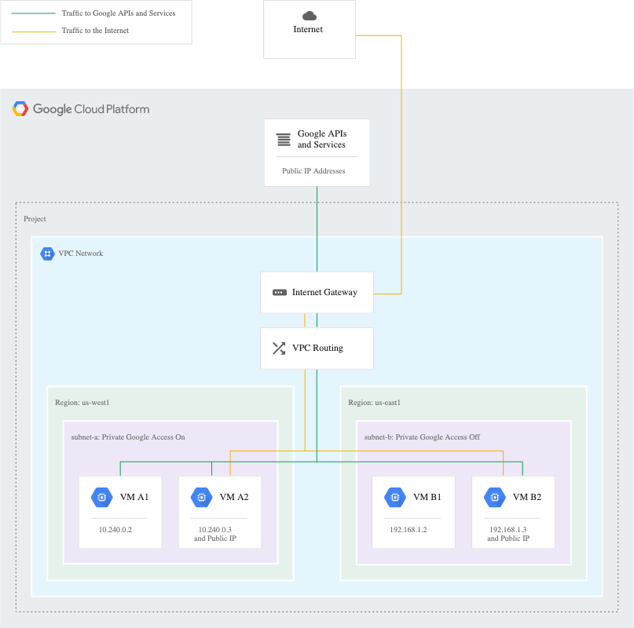

***REMOVED*** Private Google Access (PGA) for Databricks on GCP 🌐🔒

Private Google Access (PGA) allows VM instances that do **not** have external IP addresses to reach Google APIs and services using Google's internal network instead of the public internet. For Databricks, enabling PGA ensures cluster nodes can access Cloud Storage, Artifact Registry (pkg.dev), and other Google services privately.



**Why enable PGA for Databricks?**
- Keeps dataplane traffic on Google’s internal network (reduces public egress and attack surface).
- Works together with Private DNS and VPC Service Controls (`restricted.googleapis.com`) when tighter egress controls are required.
- Allows controlled access for runtime image downloads and storage access without public IPs on cluster nodes.

---

***REMOVED******REMOVED*** Quick steps to enable PGA ✅
1. Enable Private Google Access on the subnet(s) used by Databricks clusters:
```bash
***REMOVED*** replace SUBNET_NAME and REGION
gcloud compute networks subnets update SUBNET_NAME --region=REGION --enable-private-ip-google-access
```
2. Configure DNS and private zones for required domains (e.g., `*.pkg.dev`, `restricted.googleapis.com`).
3. Add required firewall rules and routes for restricted.googleapis.com (if using VPC SC) and other permitted destinations.
4. Test DNS resolution and HTTP access from a node without an external IP (see Validation below).

***REMOVED******REMOVED*** `How to do it?`
***REMOVED******REMOVED******REMOVED*** `High Level Steps`
1. VPC and subnets used by Databricks have private Google access(PGA) enabled
2. Configure DNS, VPC firewall rule and VPC routes as explained over [here](https://cloud.google.com/vpc/docs/configure-private-google-access)
  - It is extremely important that you configure PGA as explained on the GCP public doc site.
  - If you are using VPC SC then both, the private.googleapis.com as well as restricted.googleapis.com DNS records along with routes and firewall rules are required.
3. Configure DNS private zone for *.pkg.dev (repo from where databricks runtime is downloaded) as explained over [here](https://cloud.google.com/vpc/docs/configure-private-google-access). 

***REMOVED******REMOVED*** Differences between `private.googleapis.com` and `restricted.googleapis.com`

***REMOVED******REMOVED******REMOVED*** Overview
The primary difference between `private.googleapis.com` and `restricted.googleapis.com` lies in their use cases and the network configurations they require. Here is an overview of each:

***REMOVED******REMOVED******REMOVED*** `private.googleapis.com`
1. **Use Case**: `private.googleapis.com` is designed for users who want to access Google APIs and services from within a private network, such as a Virtual Private Cloud (VPC) in Google Cloud. It provides a secure way to access these services without traversing the public internet.
2. **Configuration**: This endpoint requires setting up Private Google Access within a VPC. This allows resources within the VPC to access Google APIs and services using internal IP addresses, enhancing security by avoiding exposure to the public internet.
3. **Access**: It restricts access to Google APIs to only those resources that are within the VPC, ensuring a more secure connection.
4. **DNS Resolution**: When using `private.googleapis.com`, DNS resolution for Google API domains resolves to private IP addresses that are accessible only within the VPC.

***REMOVED******REMOVED******REMOVED*** `restricted.googleapis.com`
1. **Use Case**: `restricted.googleapis.com` is intended for environments that need to adhere to stricter egress control and security policies, often required for regulated industries. It provides an additional layer of security by limiting access to a restricted set of Google services and APIs.
2. **Configuration**: This endpoint requires setting up VPC Service Controls, which provide security perimeters around Google Cloud resources to prevent data exfiltration. This is suitable for organizations needing to meet regulatory and compliance requirements.
3. **Access**: It restricts access to a more limited set of Google APIs and services compared to `private.googleapis.com`. This endpoint helps to enforce security policies and compliance requirements by allowing only specific Google services.
4. **DNS Resolution**: Similar to `private.googleapis.com`, DNS resolution for `restricted.googleapis.com` resolves to private IP addresses within the VPC. However, the scope of accessible services is more limited.

***REMOVED******REMOVED******REMOVED*** Key Differences
1. **Scope of Access**:
   - `private.googleapis.com` provides broader access to Google APIs and services within a VPC.
   - `restricted.googleapis.com` limits access to a narrower set of Google services, aligning with stricter security and compliance requirements.
2. **Security and Compliance**:
   - `private.googleapis.com` focuses on providing secure access within a VPC.
   - `restricted.googleapis.com` enhances security by enforcing more stringent access controls and is often used in regulated environments.
3. **Configuration Requirements**:
   - Both require Private Google Access and appropriate DNS setup within a VPC.
   - `restricted.googleapis.com` additionally requires VPC Service Controls for creating security perimeters.

In summary, `private.googleapis.com` is suitable for general secure access to Google services within a private network, while `restricted.googleapis.com` is designed for environments needing enhanced security and compliance controls.
```
***REMOVED******REMOVED*** Validate

- Create a Databricks cluster to validate n/w setup
- Databricks Cluster comes up fine