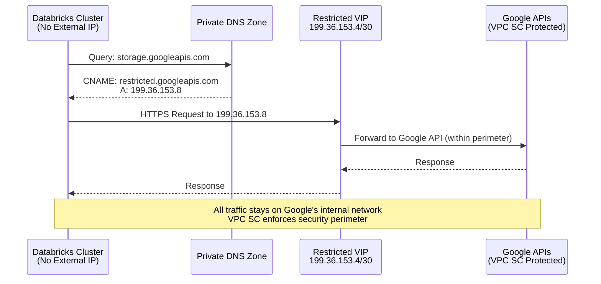
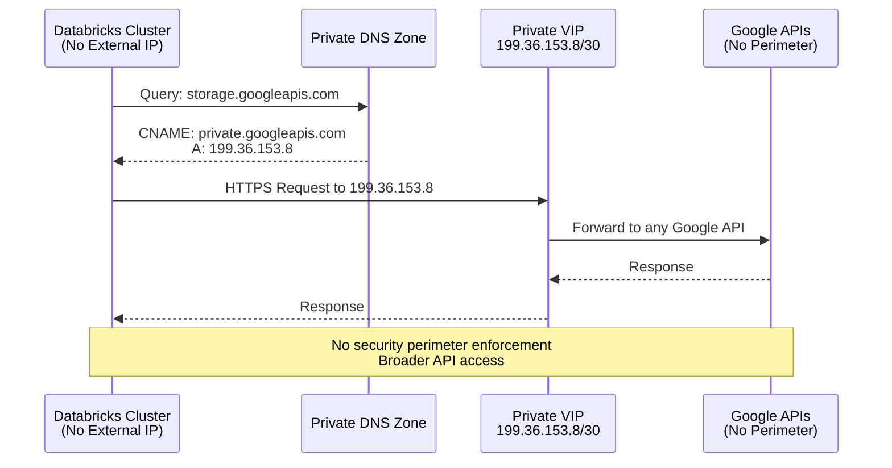

# Private Google Access (PGA) for Databricks on GCP 🌐🔒

Private Google Access (PGA) allows VM instances that do **not** have external IP addresses to reach Google APIs and services using Google's internal network instead of the public internet. For Databricks, enabling PGA ensures cluster nodes can access Cloud Storage, Artifact Registry (pkg.dev), and other Google services privately.


## Why Enable PGA for Databricks?

| Benefit | Description |
|---------|-------------|
| **Private Network Traffic** | Keeps dataplane traffic on Google's internal network, reducing public egress costs and attack surface |
| **Security Integration** | Works seamlessly with Private DNS and VPC Service Controls (`restricted.googleapis.com`) for tighter egress controls |
| **No Public IPs Required** | Allows controlled access for runtime image downloads and storage access without external IPs on cluster nodes |
| **Compliance Ready** | Helps meet regulatory requirements by keeping all Google API traffic within private networks |

---

## 🎯 Recommended Approach: Use `restricted.googleapis.com`

**For Databricks on GCP with Private Google Access, the recommended best practice is to use `restricted.googleapis.com` instead of `private.googleapis.com`.**

### Why `restricted.googleapis.com` is Recommended

| Aspect | Benefit |
|--------|---------|
| **Enhanced Security** | Provides an additional layer of security by limiting access to VPC Service Controls supported APIs only |
| **Data Exfiltration Prevention** | Reduces risk of data exfiltration by enforcing security perimeters around resources |
| **Compliance** | Aligns with stricter security and compliance requirements for regulated industries |
| **Explicit Allow-listing** | Forces explicit configuration of allowed services, following principle of least privilege |
| **VPC SC Integration** | Required when using VPC Service Controls for Databricks workspaces |

---

## Quick Setup Steps ✅

### Step 1: Enable Private Google Access on Subnets

```bash
# Enable PGA on the subnet used by Databricks clusters
gcloud compute networks subnets update SUBNET_NAME \
  --region=REGION \
  --enable-private-ip-google-access
```

### Step 2: Configure DNS for `restricted.googleapis.com`

**Required DNS Configuration:**

| Domain | Purpose | Record Type | Target IP Range |
|--------|---------|-------------|-----------------|
| `restricted.googleapis.com` | Main endpoint for VPC SC supported services | A | 199.36.153.4/30 |
| `*.googleapis.com` | CNAME alias to restricted endpoint | CNAME | restricted.googleapis.com |
| `*.pkg.dev` | Databricks runtime image repository | A | 199.36.153.4/30 |

### Step 3: Configure VPC Firewall Rules

Allow egress to `restricted.googleapis.com` IP range:
```bash
gcloud compute firewall-rules create allow-restricted-googleapis \
  --direction=EGRESS \
  --network=VPC_NAME \
  --action=ALLOW \
  --rules=tcp:443 \
  --destination-ranges=199.36.153.4/30 \
  --priority=1000
```

### Step 4: Configure VPC Routes

Add route for `restricted.googleapis.com`:
```bash
gcloud compute routes create restricted-googleapis-route \
  --network=VPC_NAME \
  --destination-range=199.36.153.4/30 \
  --next-hop-gateway=default-internet-gateway
```

---

## Detailed Configuration Guide

### Prerequisites

- [ ] VPC network configured for Databricks
- [ ] Subnets created without external IP addresses
- [ ] Appropriate IAM permissions to configure DNS, firewall rules, and routes
- [ ] VPC Service Controls perimeter created (if using VPC SC)

### Configuration Steps

#### 1. Enable Private Google Access

Enable PGA on all subnets that will host Databricks clusters:

```bash
# For each subnet
for SUBNET in subnet-1 subnet-2 subnet-3; do
  gcloud compute networks subnets update $SUBNET \
    --region=us-central1 \
    --enable-private-ip-google-access
done
```

#### 2. Create Private DNS Zones

**For `restricted.googleapis.com`:**

```bash
# Create private DNS zone
gcloud dns managed-zones create restricted-googleapis \
  --dns-name=googleapis.com. \
  --description="Private DNS zone for restricted Google APIs" \
  --visibility=private \
  --networks=VPC_NAME

# Add A record for restricted.googleapis.com
gcloud dns record-sets create restricted.googleapis.com. \
  --zone=restricted-googleapis \
  --type=A \
  --ttl=300 \
  --rrdatas=199.36.153.8,199.36.153.9,199.36.153.10,199.36.153.11

# Add CNAME record for *.googleapis.com
gcloud dns record-sets create '*.googleapis.com.' \
  --zone=restricted-googleapis \
  --type=CNAME \
  --ttl=300 \
  --rrdatas=restricted.googleapis.com.
```

**For Databricks Artifact Registry (`*.pkg.dev`):**

```bash
# Create private DNS zone for pkg.dev
gcloud dns managed-zones create pkg-dev \
  --dns-name=pkg.dev. \
  --description="Private DNS zone for Databricks runtime images" \
  --visibility=private \
  --networks=VPC_NAME

# Add A record for *.pkg.dev
gcloud dns record-sets create '*.pkg.dev.' \
  --zone=pkg-dev \
  --type=A \
  --ttl=300 \
  --rrdatas=199.36.153.8,199.36.153.9,199.36.153.10,199.36.153.11
```

#### 3. Configure Firewall Rules

**Required Egress Rules:**

| Rule Name | Direction | Priority | Action | Protocol/Port | Destination | Purpose |
|-----------|-----------|----------|--------|---------------|-------------|---------|
| `allow-restricted-googleapis` | EGRESS | 1000 | ALLOW | tcp:443 | 199.36.153.4/30 | Access to restricted Google APIs |
| `allow-dns` | EGRESS | 1000 | ALLOW | udp:53, tcp:53 | 0.0.0.0/0 | DNS resolution |
| `allow-ntp` | EGRESS | 1000 | ALLOW | udp:123 | 0.0.0.0/0 | Time synchronization |

```bash
# Allow restricted.googleapis.com
gcloud compute firewall-rules create allow-restricted-googleapis \
  --direction=EGRESS \
  --network=VPC_NAME \
  --action=ALLOW \
  --rules=tcp:443 \
  --destination-ranges=199.36.153.4/30 \
  --priority=1000

# Allow DNS
gcloud compute firewall-rules create allow-dns \
  --direction=EGRESS \
  --network=VPC_NAME \
  --action=ALLOW \
  --rules=udp:53,tcp:53 \
  --destination-ranges=0.0.0.0/0 \
  --priority=1000

# Allow NTP
gcloud compute firewall-rules create allow-ntp \
  --direction=EGRESS \
  --network=VPC_NAME \
  --action=ALLOW \
  --rules=udp:123 \
  --destination-ranges=0.0.0.0/0 \
  --priority=1000
```

#### 4. Configure VPC Routes

```bash
# Route for restricted.googleapis.com IP range
gcloud compute routes create restricted-googleapis-route \
  --network=VPC_NAME \
  --destination-range=199.36.153.4/30 \
  --next-hop-gateway=default-internet-gateway \
  --priority=1000
```

---

## Understanding: `private.googleapis.com` vs `restricted.googleapis.com`

### Comparison Table

| Feature | `private.googleapis.com` | `restricted.googleapis.com` ⭐ |
|---------|-------------------------|-------------------------------|
| **Primary Use Case** | General secure access to Google APIs within VPC | Strict security and compliance requirements |
| **Scope of Access** | Broader access to all Google APIs and services | Limited to VPC Service Controls supported APIs only |
| **Configuration** | Requires Private Google Access + DNS setup | Requires PGA + DNS + VPC Service Controls perimeter |
| **Security Level** | Good - traffic stays within private network | Excellent - enforces security perimeters and explicit allow-lists |
| **Compliance** | Suitable for general security requirements | Designed for regulated industries (HIPAA, PCI-DSS, etc.) |
| **IP Range** | 199.36.153.8/30 | 199.36.153.4/30 |
| **Data Exfiltration Risk** | Lower (private network) | Lowest (security perimeters + limited API access) |
| **Recommended for Databricks** | ❌ Not recommended | ✅ **Recommended** |

### When to Use Each

#### Use `restricted.googleapis.com` (Recommended) When:
- ✅ Deploying Databricks in production environments
- ✅ Subject to compliance regulations (HIPAA, PCI-DSS, SOC 2)
- ✅ Implementing VPC Service Controls
- ✅ Requiring explicit service allow-listing
- ✅ Need to prevent data exfiltration
- ✅ Want defense-in-depth security architecture

#### Use `private.googleapis.com` Only When:
- ⚠️ Running development/testing environments
- ⚠️ No compliance requirements
- ⚠️ VPC SC not available in your organization
- ⚠️ Need broader API access without perimeter controls

---

## DNS Resolution Flow

### With `restricted.googleapis.com` (Recommended)



### Legacy: With `private.googleapis.com` (Not Recommended)



---

## Validation and Testing

### Pre-Flight Checklist

Before launching Databricks clusters:

- [ ] Private Google Access enabled on all Databricks subnets
- [ ] DNS zones created for `restricted.googleapis.com` and `*.pkg.dev`
- [ ] DNS records resolving correctly from test VMs
- [ ] Firewall rules allowing egress to 199.36.153.4/30
- [ ] VPC routes configured for restricted Google APIs
- [ ] VPC Service Controls perimeter configured (if applicable)

### Validation Steps

#### 1. Test DNS Resolution

From a VM without external IP in the same VPC:

```bash
# Test restricted.googleapis.com resolution
dig restricted.googleapis.com

# Expected output: Should resolve to 199.36.153.8-11
# restricted.googleapis.com. 300 IN A 199.36.153.8
# restricted.googleapis.com. 300 IN A 199.36.153.9
# restricted.googleapis.com. 300 IN A 199.36.153.10
# restricted.googleapis.com. 300 IN A 199.36.153.11

# Test *.googleapis.com CNAME
dig storage.googleapis.com

# Expected output: Should CNAME to restricted.googleapis.com
# storage.googleapis.com. 300 IN CNAME restricted.googleapis.com.
# restricted.googleapis.com. 300 IN A 199.36.153.8

# Test pkg.dev resolution
dig us-central1-docker.pkg.dev

# Expected output: Should resolve to restricted VIP
# us-central1-docker.pkg.dev. 300 IN A 199.36.153.8
```

#### 2. Test HTTP Access

```bash
# Test Cloud Storage access via restricted endpoint
curl -I https://storage.googleapis.com

# Expected output:
# HTTP/2 200
# content-type: text/html; charset=UTF-8
# (Connection successful via restricted endpoint)

# Test Artifact Registry access
curl -I https://us-central1-docker.pkg.dev

# Expected output: HTTP/2 200 or appropriate auth response
```

#### 3. Verify Private Access (No External IP)

```bash
# This should fail if PGA is working correctly
curl -I https://www.google.com

# Expected output: Connection timeout or failure
# (Confirms no public internet access)
```

#### 4. Launch Test Databricks Cluster

1. Create a small cluster in a non-production workspace
2. Monitor cluster launch logs for any connectivity issues
3. Run a simple notebook cell:
   ```python
   # Test Cloud Storage access
   dbutils.fs.ls("gs://your-bucket/")

   # Test package installation (uses pkg.dev)
   %pip install pandas
   ```
4. Verify cluster comes up successfully and can access required services

---

## Troubleshooting

### Common Issues and Solutions

| Issue | Symptom | Solution |
|-------|---------|----------|
| **DNS not resolving** | `nslookup` fails for googleapis.com | Verify private DNS zones are associated with correct VPC network |
| **Connection timeouts** | Cluster launch fails with timeout errors | Check firewall rules allow egress to 199.36.153.4/30 on tcp:443 |
| **Route not found** | DNS resolves but connection fails | Verify VPC route exists for 199.36.153.4/30 destination |
| **VPC SC violations** | Cluster fails with VPC SC error | Ensure perimeter includes all required projects and service accounts |
| **pkg.dev access fails** | Runtime image download fails | Verify DNS zone for *.pkg.dev resolves to restricted VIP |
| **Permission denied** | 403 errors when accessing storage | Check IAM permissions and VPC SC ingress/egress rules |

### Debug Commands

```bash
# Check if PGA is enabled on subnet
gcloud compute networks subnets describe SUBNET_NAME \
  --region=REGION \
  --format="value(privateIpGoogleAccess)"

# List DNS zones
gcloud dns managed-zones list

# Check DNS records
gcloud dns record-sets list --zone=restricted-googleapis

# Verify firewall rules
gcloud compute firewall-rules list --filter="network:VPC_NAME AND direction:EGRESS"

# Check VPC routes
gcloud compute routes list --filter="network:VPC_NAME AND destRange:199.36.153.4/30"

# Test from compute instance
gcloud compute ssh INSTANCE_NAME --command="dig restricted.googleapis.com"
```

---

## Configuration Checklist

### For New Databricks Deployments

| Step | Task | Status |
|------|------|--------|
| 1 | Enable Private Google Access on all Databricks subnets | ☐ |
| 2 | Create private DNS zone for `googleapis.com` | ☐ |
| 3 | Add A records for `restricted.googleapis.com` → 199.36.153.8-11 | ☐ |
| 4 | Add CNAME for `*.googleapis.com` → `restricted.googleapis.com` | ☐ |
| 5 | Create private DNS zone for `pkg.dev` | ☐ |
| 6 | Add A records for `*.pkg.dev` → 199.36.153.8-11 | ☐ |
| 7 | Create firewall rule allowing egress to 199.36.153.4/30:443 | ☐ |
| 8 | Create firewall rules for DNS (53) and NTP (123) | ☐ |
| 9 | Create VPC route for 199.36.153.4/30 | ☐ |
| 10 | Configure VPC Service Controls perimeter | ☐ |
| 11 | Test DNS resolution from test VM | ☐ |
| 12 | Test HTTPS connectivity to googleapis.com | ☐ |
| 13 | Launch test Databricks cluster | ☐ |
| 14 | Verify cluster can access Cloud Storage | ☐ |
| 15 | Verify cluster can download runtime images | ☐ |

---

## Best Practices

### Security Best Practices

1. **Always use `restricted.googleapis.com`** for Databricks production workspaces
2. **Implement VPC Service Controls** to create security perimeters
3. **Use Private DNS zones** for all Google API domains
4. **Disable external IPs** on all cluster nodes
5. **Apply least privilege** firewall rules (only allow required destinations)
6. **Monitor VPC Flow Logs** for unusual traffic patterns
7. **Regular audits** of DNS, firewall, and route configurations

### Operational Best Practices

1. **Document all configurations** in version control
2. **Test in non-production** before applying to production
3. **Use Infrastructure as Code** (Terraform) for reproducible deployments
4. **Set up alerting** for VPC SC violations and connectivity failures
5. **Maintain runbook** for troubleshooting common issues
6. **Regular reviews** of allowed API services in VPC SC perimeter

---

## References

- [GCP Private Google Access Documentation](https://cloud.google.com/vpc/docs/configure-private-google-access)
- [VPC Service Controls Overview](https://cloud.google.com/vpc-service-controls/docs/overview)
- [Databricks GCP Network Architecture](https://docs.gcp.databricks.com/security/network/classic/index.html)
- [Restricted VIP Services](https://cloud.google.com/vpc-service-controls/docs/supported-products)
- [Private Google Access Setup](https://cloud.google.com/vpc-service-controls/docs/set-up-private-connectivity)

---

## Summary

✅ **Recommended Configuration for Databricks on GCP:**
- Use `restricted.googleapis.com` instead of `private.googleapis.com`
- Configure Private DNS zones for googleapis.com and pkg.dev domains
- Set up VPC Service Controls security perimeters
- Apply explicit firewall rules allowing only required egress
- Test thoroughly in non-production before deploying to production

This configuration provides the highest level of security while maintaining full Databricks functionality.
