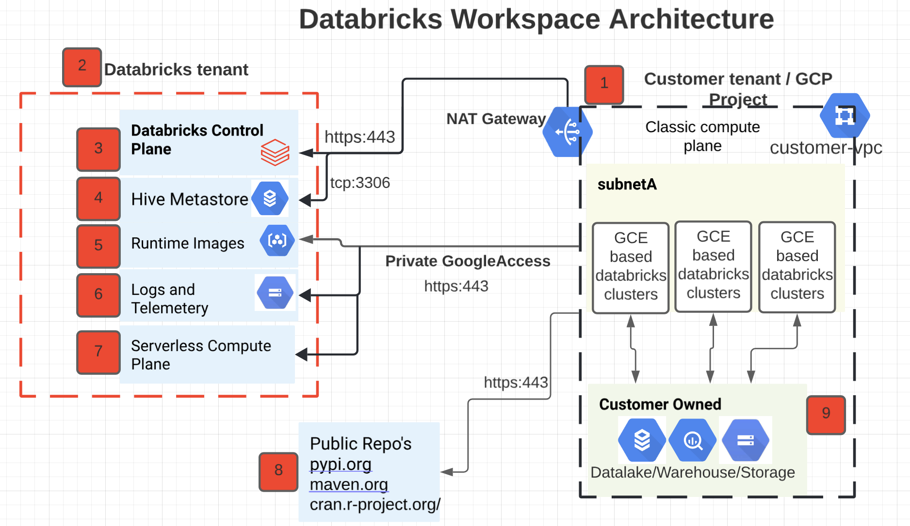

# What is it?

Private Google Access can be enabled on a subnet by subnet basis and all it really means is that VM instances will communicate with Google APIs via their internal IP addresses rather than using external IPs to communicate via the internet. The diagram below shows how this works:


By default, when a Compute Engine VM, in our case Databricks cluster nodes lacks an external IP (public ip) address assigned to its network interface, it can only send packets to other internal IP address destinations. You can allow these VMs to connect to the set of external IP addresses used by Google APIs and services by enabling Private Google Access (PGA) on the subnet used by the VM's network interface.



In above diagram, GKE utilizes:

[4] GCR for Databricks runtime images and GCS for workspace health check logs and usage logs 

Communication to both of these services, outbound only from Databricks data plane, with Private Google Access [PGA] we can ensure that communication between data plane and these services stays over Google’s internal network.

# How to do it?
## High Level Steps

- Make sure VPC and subnets used by Databricks have private Google access enabled

- Make the following Cloud DNS changes and attach the zones to the VPC:

- Create:

  - private DNS zone googleapis.com

  - with a CNAME record to restricted.googleapis.com for *.googleapis.com and 

  - A record to 199.36.153.4/30 for restricted.googleapis.com

- Create:

  - private DNS zone gcr.io 

  - with a CNAME record to gcr.io  for *.gcr.io and

  - A record to 199.36.153.4/30 for a blank gcr.io DNS name

## Enable Private Google Access


## Create a route to send traffic to the restricted Google APIs subnet

- Create a route in the VPC to send traffic to the restricted Google APIs subnet. We have to set the next hop as default-internet-gateway, as per the requirement for [accessing private Google APIs](https://cloud.google.com/vpc/docs/configure-private-google-access).

- Google doesn’t actually send the traffic to the internet, even though it says “internet-gateway”. The traffic is routed to take a private internal path to the Google APIs thanks to the private Google access feature that we enabled on the subnet.


```
gcloud beta compute routes create route-to-google-apis \
--project=bk-demo-prj --description="Route to Google restricted APIs" \
--network=databricks-vpc \
--priority=1000 \
--destination-range=199.36.153.4/30 \
--next-hop-gateway=default-internet-gateway
```

## Create DNS zone for Google APIs and GCR.io

- Next step is to customize the DNS in our VPC for googleapis.com. Since googleapis.com resolves to public IP’s, we have to use restricted.googleapis.com. This url resolves to a specific range, 199.36.153.4/30, that is accessible within the GCP network (this is the same range we created a route to in the previous step). Our GKE worker nodes will need to use restricted.googleapis.com instead of googleapis.com to successfully launch.

- This can be enforced using the private Cloud DNS feature within GCP. First we create a private zone for googleapis.com in Cloud DNS. After the zone is created, add a CNAME record for *.googleapis.com that points to restricted.googleapis.com. We will need one more record to make this work, an A record for restricted.googleapis.com pointing to the restricted VIP IP’s.

- Example Command:

    ```
    gcloud compute firewall-rules create to-google-apis \
    --action ALLOW \
    --rules all \
    --destination-ranges 199.36.153.4/30 \
    --direction EGRESS \
    --network databricks-vpc
    gcloud compute firewall-rules create to-gke-master \
    --action ALLOW \
    --rules tcp:443,tcp:10250 \
    --destination-ranges 10.3.0.0/28 \
    --direction EGRESS \
    --network databricks-vpc
    gcloud compute routes create route-to-google-apis \
    --destination-range 199.36.153.4/30 \
    --description "Send traffic to the restricted Google APIs subnet" \
    --next-hop-gateway default-internet-gateway \
    --network databricks-vpc
    gcloud dns managed-zones create google-apis \
    --description "private zone for Google APIs" \
    --dns-name googleapis.com \
    --visibility private \
    --networks databricks-vpc

    gcloud dns record-sets transaction start --zone google-apis

    gcloud dns record-sets transaction add restricted.googleapis.com. \
    --name *.googleapis.com \
    --ttl 300 \
    --type CNAME \
    --zone google-apis

    gcloud dns record-sets transaction add "199.36.153.4" \
    "199.36.153.5" "199.36.153.6" "199.36.153.7" \
    --name restricted.googleapis.com \
    --ttl 300 \
    --type A \
    --zone google-apis

    gcloud dns record-sets transaction execute --zone google-apis

    ```


- We will need to make similar settings for the GCR.io domain, to send traffic to restricted Google APIs subnet for reaching the container registry. Without these changes, the GKE cluster won’t stand up successfully since it won’t be able to pull down all the necessary Databricks runtime containers.

    ```
    gcloud dns managed-zones create gcr-io \
    --description "private zone for GCR.io" \
    --dns-name gcr.io \
    --visibility private \
    --networks databricks-vpc
    gcloud dns record-sets transaction start --zone gcr-io
    gcloud dns record-sets transaction add gcr.io. \
    --name *.gcr.io \
    --ttl 300 \
    --type CNAME \
    --zone gcr-io
    gcloud dns record-sets transaction add "199.36.153.4" "199.36.153.5" "199.36.153.6" "199.36.153.7" \
    --name gcr.io \
    --ttl 300 \
    --type A \
    --zone gcr-io
    gcloud dns record-sets transaction execute --zone gcr-io
    ```


Thats it!

## Validate

- Create a Databricks cluster to validate n/w setup
- Databricks Cluster comes up fine


