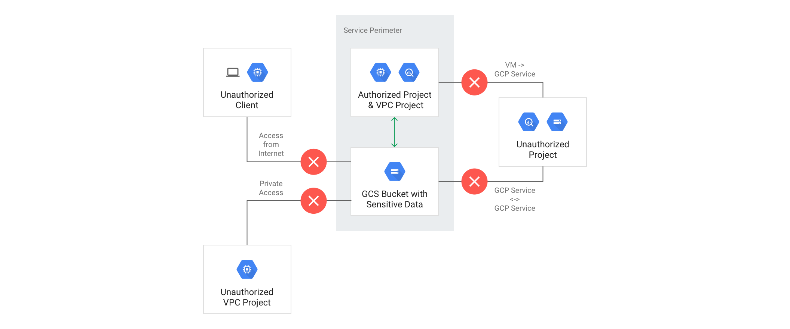

# VPC Service Controls for a Databricks Workspace

[VPC Service Controls](https://cloud.google.com/vpc-service-controls) enables you to isolate your production GCP resources from the internet, unauthorized VPC networks and unauthorized GCP resources.

VPC SC is fully supported by databricks. It works with Shared VPC as well a stand alone VPC.

It improves your ability to mitigate the risk of data exfiltration from Google Cloud services such as Cloud Storage and BigQuery. It also allows you to restrict access to production GCP resources from only clients on authorized networks or devices.

With VPC Service Controls, you create perimeters that protect the resources and data of services that you explicitly specify.

* For all Google Cloud services secured with VPC Service Controls, you can ensure that:

* Resources within a perimeter accessed only from clients within authorized VPC networks using Private Google Access with either Google Cloud or on-premises.

* Clients within a perimeter that have private access to resources do not have access to unauthorized (potentially public) resources outside the perimeter.

* Data cannot be copied to unauthorized resources outside the perimeter using service operations such as gsutil cp or bq mk.

* When enabled, internet access to resources within a perimeter is restricted using whitelisted IPv4 and IPv6 ranges.

VPC Service Controls provides an additional layer of security defense for Google Cloud services that is independent of Identity and Access Management (IAM). While IAM enables granular identity-based access control, VPC Service Controls enables broader context-based perimeter security, including controlling data egress across the perimeter. We recommend using both VPC Service Controls and IAM for defense in depth.

See the image below for an example of what this might look like:

## Supported Services
For a list of services supported by VPC SC, please see [Services](https://cloud.google.com/vpc-service-controls/docs/restricted-vip-services) supported by the restricted VIP

## Setting up private connectivity to Google APIs and services
To restrict Private Google Access within a service perimeter to only VPC Service Controls supported Google APIs and services, hosts must send their requests to the `restricted.googleapis.com` domain name instead of `*.googleapis.com`.  The `restricted.googleapis.com` domain resolves to a VIP (virtual IP address) range `199.36.153.4/30`. This IP address range is not announced to the Internet.

See the [link](https://cloud.google.com/vpc-service-controls/docs/set-up-private-connectivity#overview_of_procedure) for an overview of the procedure to set it up

# How to?
Following steps are applicable to:

* Customer Managed VPC: Shared VPC/Stand-alone VPC
* Databricks Managed VPC

## Before you begin
We will be using the following terms, let’s understand them a bit better before we proceed.

* `Consumer Project` = Customer owned GCP Project where Databricks workspace is deployed. In case of a shared vpc we’ll have two projects, host project providing the vpc and service project where workspace i.e. GKE cluster and DBFS related GCS storage accounts  are created.

* `Consumer VPC` = Customer owned GCP VPC used by Databricks workspace (shared or stand alone vpc)

* `Databricks Workspace Creator` = A customer owned and managed GCP identity (User or Service Account Principal) used to create a Databricks workspace, this identity is also known as the `login user`. A login user has `Project Owner or Project Editor` and the `IAM Admin` permission on the Consumer Project (GCP project) where Databricks workspace/GKE is deployed. Please follow [this](https://docs.gcp.databricks.com/administration-guide/cloud-configurations/gcp/customer-managed-vpc.html#requirements-1) doc for more details on roles/permissions required.

* `Consumer SA` = A GCP Service Account for the new workspace is created in the Databricks regional control plane project. We use the login user’s (workspace creator) OAuth token to grant the Consumer SA with sufficient permissions to setup and operate Databricks workspaces in the customer’s consumer (GCP) project. Consumer SA follow’s `db-WORKSPACEID@databricks-project.iam.gserviceaccount.com` naming convention. Workspace ID is generated as part of the workspace creation process.
  `example: db-1030565636556919@prod-gcp-us-central1.iam.gserviceaccount.com`

* `Databricks Owned GCP Projects` = There are several GCP projects involved, one each for `Databricks Regional Control Plane`, `Databricks Central Service` (required during workspace creation only), `Databricks audit log delivery` and `Databricks Artifacts` (runtime image) Repository.

* `Databricks Owned GCP Projects Identities` = There are three GCP Service Accounts in use, for ex: US East4 we have: 
  * `shard-sa@prod-gcp-us-east4.iam.gserviceaccount.com`
  * `shard-sa@prod-gcp-us-central1.iam.gserviceaccount.com` (only required during workspace creation)
  * `us-gcr-access-sa@databricks-prod-artifacts.iam.gserviceaccount.com`
  * `log-delivery@databricks-prod-master.iam.gserviceaccount.com`

## List of Databricks Regional Projects and Identities

**Table1**

|     |     |     |
| --- | --- | --- |
| **GCP Region** | **Project Number** | **Identities** |
| asia-southeast1 | Shard: 163855694937 & 68422481410  Artifact: 643670579914  AuditLogDelivery: 85638097580 | <ul><li> shard-sa@prod-gcp-**asia-southeast1**.iam.gserviceaccount.com (Shard SA)  </li><li>shard-sa@prod-gcp-**us-central1**.iam.gserviceaccount.com (Backend Service SA) </li> <li> **log-delivery**@databricks-prod-master.iam.gserviceaccount.com (Audit Log Delivery Service Account)</li>  <li>**as-gcr-access-sa**@databricks-prod-artifacts.iam.gserviceaccount.com (GCR Service Account)</li>  <li>db-**WORKSPACEID**@prod-gcp-**asia-southeast1**.iam.gserviceaccount.com (Consumer SA)</li> </ul> |
| australia-southeast1 | Shard: 890675851652 & 68422481410  Artifact: 643670579914  AuditLogDelivery: 85638097580 | <ul><li> shard-sa@prod-gcp-**australia-southeast1**.iam.gserviceaccount.com (Shard SA) </li><li> shard-sa@prod-gcp-**us-central1**.iam.gserviceaccount.com (Backend Service SA) </li><li> **log-delivery**@databricks-prod-master.iam.gserviceaccount.com (Audit Log Delivery Service Account) </li><li> **au-gcr-access-sa**@databricks-prod-artifacts.iam.gserviceaccount.com (GCR Service Account) </li><li> db-**WORKSPACEID**@prod-gcp-**australia-southeast1**.iam.gserviceaccount.com (Consumer SA)</li></ul> |
| europe-west1 | Shard: 623104702041 & 68422481410  Artifact: 643670579914  AuditLogDelivery: 85638097580 | <ul><li>shard-sa@prod-gcp-**europe-west1**.iam.gserviceaccount.com (Shard SA) </li><li> shard-sa@prod-gcp-**us-central1**.iam.gserviceaccount.com (Backend Service SA) </li><li> **log-delivery**@databricks-prod-master.iam.gserviceaccount.com (Audit Log Delivery Service Account)</li><li>  **eu-gcr-access-sa**@databricks-prod-artifacts.iam.gserviceaccount.com (GCR Service Account) </li><li> db-**WORKSPACEID**@prod-gcp-**europe-west1**.iam.gserviceaccount.com (Consumer SA)</li></ul> |
| europe-west2 | Shard: 204760216014 & 68422481410  Artifact: 643670579914  AuditLogDelivery: 85638097580 | <ul><li>shard-sa@prod-gcp-**europe-west2**.iam.gserviceaccount.com (Shard SA) </li><li> shard-sa@prod-gcp-**us-central1**.iam.gserviceaccount.com (Backend Service SA) </li><li> **log-delivery**@databricks-prod-master.iam.gserviceaccount.com (Audit Log Delivery Service Account) </li><li> **eu-gcr-access-sa**@databricks-prod-artifacts.iam.gserviceaccount.com (GCR Service Account) </li><li> db-**WORKSPACEID**@prod-gcp-**europe-west2**.iam.gserviceaccount.com (Consumer SA)</li></ul> |
| europe-west3 | Shard: 622303457766 & 68422481410  Artifact: 643670579914  AuditLogDelivery: 85638097580 | <ul><li>shard-sa@**prod-gcp-europe-west3**.iam.gserviceaccount.com (Shard SA) </li><li> shard-sa@prod-gcp-**us-central1**.iam.gserviceaccount.com (Backend Service SA) </li><li> **log-delivery**@databricks-prod-master.iam.gserviceaccount.com (Audit Log Delivery Service Account) </li><li> **eu-gcr-access-sa@**@databricks-prod-artifacts.iam.gserviceaccount.com (GCR Service Account) </li><li> db-**WORKSPACEID**@prod-gcp-**europe-west3**.iam.gserviceaccount.com (Consumer SA)</li></ul> |
| us-central1 | Shard: 68422481410 & 68422481410  Artifact: 643670579914  AuditLogDelivery: 85638097580 | <ul><li>shard-sa@prod-gcp-**us-central1**.iam.gserviceaccount.com (Shard & Backend Service SA) </li><li> **log-delivery**@databricks-prod-master.iam.gserviceaccount.com (Audit Log Delivery Service Account) </li><li> **us-gcr-access-sa**@databricks-prod-artifacts.iam.gserviceaccount.com (GCR Service Account) </li><li>  db-**WORKSPACEID**@prod-gcp-**us-central1**.iam.gserviceaccount.com (Consumer SA) </li></ul> |
| us-east1 | Shard: 51066298900 & 68422481410  Artifact: 643670579914  AuditLogDelivery: 85638097580 | <ul><li>shard-sa@prod-gcp-**us-east1**.iam.gserviceaccount.com (Shard SA) </li><li> shard-sa@prod-gcp-**us-central1**.iam.gserviceaccount.com (Backend Service SA) </li><li> **log-delivery**@databricks-prod-master.iam.gserviceaccount.com (Audit Log Delivery Service Account) </li><li> **us-gcr-access-sa**@databricks-prod-artifacts.iam.gserviceaccount.com (GCR Service Account) </li><li> db-**WORKSPACEID**@prod-gcp-**us-east1**.iam.gserviceaccount.com (Consumer SA) </li></ul> |
| us-east4 | Shard: 121886670913 & 68422481410  Artifact: 643670579914  AuditLogDelivery: 85638097580 | <ul><li>shard-sa@prod-gcp-**us-east4**.iam.gserviceaccount.com (Shard SA) </li><li> shard-sa@prod-gcp-**us-central1**.iam.gserviceaccount.com (Backend Service SA) </li><li> **log-delivery**@databricks-prod-master.iam.gserviceaccount.com (Audit Log Delivery Service Account) </li><li> **us-gcr-access-sa**@databricks-prod-artifacts.iam.gserviceaccount.com (GCR Service Account)</li><li>  db-**WORKSPACEID**@prod-gcp-**us-east4**.iam.gserviceaccount.com (Consumer SA) </li></ul> |
| us-west1 | Shard: 646990673688 & 68422481410  Artifact: 643670579914  AuditLogDelivery: 85638097580 | <ul><li>shard-sa@prod-gcp-**us-west1**.iam.gserviceaccount.com (Shard SA) </li><li> shard-sa@prod-gcp-**us-central1**.iam.gserviceaccount.com (Backend Service SA) </li><li> **log-delivery**@databricks-prod-master.iam.gserviceaccount.com (Audit Log Delivery Service Account) </li><li> **us-gcr-access-sa**@databricks-prod-artifacts.iam.gserviceaccount.com (GCR Service Account)</li><li> db-**WORKSPACEID**@prod-gcp-**us-west1**.iam.gserviceaccount.com (Consumer SA) </li></ul> |
| us-west4 | Shard: 321004414578 & 68422481410  Artifact: 643670579914 | <ul><li> shard-sa@prod-gcp-**us-west4**.iam.gserviceaccount.com (Shard SA) </li><li> shard-sa@prod-gcp-**us-central1**.iam.gserviceaccount.com (Backend Service SA) </li><li> **log-delivery**@databricks-prod-master.iam.gserviceaccount.com (Audit Log Delivery Service Account) </li><li> **us-gcr-access-sa**@databricks-prod-artifacts.iam.gserviceaccount.com (GCR Service Account)</li><li>  db-**WORKSPACEID**@prod-gcp-**us-west4**.iam.gserviceaccount.com (Consumer SA) </li></ul> |

We also need to know:

* Ingress & Egress (calls made into customers GCP project from databricks GCP projects)

* Databricks managed GCP identities (see Table 1 above , Service Accounts)

* Google API’s and Methods invoked

|     |     |     |     |     |
| --- | --- | --- | --- | --- |
| **Created and Managed By** | **Identity Type**  **Service Account (SA) or User Principal (UP)** | **Example** | **Used For** | **Ingress into / Egress from Customers Project** |
| Databricks | SA  | shard-sa@\[databricks-supported-gcp-region\].iam.gserviceaccount.com | Accessing Databricks Control Plane | Egress |
| Databricks | SA  | \[region\]-gcr-access-sa@databricks-prod-artifacts.iam.gserviceaccount.com | Accessing Databricks runtime images from GCR | Egress |
| Databricks | SA  | [db-WORKSPACEID@databricks-project.iam.gserviceaccount.com](mailto:db-WORKSPACEID@databricks-project.iam.gserviceaccount.com) | Databricks created per workspace consumer SA added to customers project | Ingress |
| Databricks | SA  | [log-delivery@databricks-prod-master.iam.gserviceaccount.com](mailto:log-delivery@databricks-prod-master.iam.gserviceaccount.com) | SA used to delivery audit logs to your storage accout | Ingress |
| Customer | UP or SA | [abc@company.com](mailto:abc@company.com) or [mysa@cust-project.iam.gserviceaccount.com](mailto:mysa@cust-project.iam.gserviceaccount.com) | Workspace Creation | Ingress |

## Two Step Process

Configuring VPC SC involves two step process
*   Ingress and Egress policy at workspace creation
*   Ingress and Egress policy after the workspace is created

### Ingress Policy At  Workspace Creation:

* Login User Id (Customer Owned, User Principal or SA creating Databricks workspace
* Consumer Project ID (Customer Owned, GCP Project where Databricks workspace is created)
* Databricks Project Numbers & Identities - see Table 1 above for your chosen GCP region

Note: when deploying a workspace, irrespective of the GCP region (e.g. europe-west1 or us-east4), the ingress policy at workspace creation needs to contain ingress allowance from both the regional control plane or shard (e.g. europe-west1), as well as Databricks Central Service, this includes both the project number, as well as the service accounts.

### Ingress Policy After Workspace Creation:

* Consumer SA e.g. db-WORKSPACEID@databricks-project.iam.gserviceaccount.com
* Workspace ID is available only after the workspace is created, for databricks-project please see `Table 1` Identities column > `db-WORKSPACEID@*` above for your chosen GCP region, make sure to substitute WORKSPACEID with your Databricks Workspace ID

Note: As opposed to workspace provisioning (creation step discussed earlier), the rest of the operations i.e after the workspace is created, workspace only require access via the regional control plane, and access from the central service (us-central1) is no longer required.

### Egress Policy
It remains same during and after the workspace is created except for one difference i.e after the workspace is created we do not need `databricks central service` project and identity in our policy definition.

Note: when deploying a workspace outside of us-central1 (e.g. europe-west1), the egress policy at workspace creation needs to contain egress allowance from both the regional control plane (e.g. europe-west1), as well as Databricks US-Central control plane (always us-central1), this includes the project numbers for both of the regional control plane.

**Sample YAML files**

* Used during workspace creation: [ingress.yaml](./../templates/vpcsc-ingress-policy.yaml) & [egress.yaml](./../templates/vpcsc-egress-policy.yaml)
* Used after workspace is created: [ingress-updated.yaml](./../templates/vpcsc-ingress-updated-policy.yaml) & [egress-updated.yaml](./../templates/vpcsc-egress-updated-policy.yaml)

Before you proceed `please make sure to update` policy yaml files with your relevant project numbers and identities

And also update the policy after the workspace is created such that:

* Update identities section to use workspace specific Service Account instead of ANY_SERVICE_ACCOUN
* Remove calls to google.storage.buckets.create ,  we do not need this after workspace is created.

## GCLOUD commands

When using gcloud commands we need to use access-context-policy-id, for more details please see GCP help [docs](https://cloud.google.com/vpc-service-controls/docs/service-perimeters#create-access-policy).

|     |     |
| --- | --- |
| **Action** | **Gcloud command** |
| Create Dry Run | gcloud access-context-manager perimeters **dry-run** **create** **\[POLICY_NAME\]** \  --perimeter-title="svpc\_dbx\_dryrun" --perimeter-resources=projects/**\[shared-vpc-project\]**,projects/**\[workspace-project\]** \  --perimeter-restricted-services=[storage.googleapis.com](http://storage.googleapis.com),[container.googleapis.com](http://container.googleapis.com),[compute.googleapis.com](http://compute.googleapis.com),[containerregistry.googleapis.com](http://containerregistry.googleapis.com),[logging.googleapis.com](http://logging.googleapis.com),[iam.googleapis.com](http://iam.googleapis.com),[cloudresourcemanager.googleapis.com](http://cloudresourcemanager.googleapis.com) \  --perimeter-ingress-policies=ingress.yaml \  --perimeter-egress-policies=egress.yaml \  --policy=**\[**[**access-context-policy-id**](https://cloud.google.com/vpc-service-controls/docs/service-perimeters#create-access-policy)**\]** --perimeter-type=regular |
| Enforce Policy | gcloud access-context-manager perimeters **dry-run** **enforce** **\[POLICY_NAME\]** --policy=**\[**[**access-context-policy-id**](https://cloud.google.com/vpc-service-controls/docs/service-perimeters#create-access-policy)**\]** |
| List Policies | gcloud access-context-manager perimeters list --format=yaml --policy=**\[**[**access-context-policy-id**](https://cloud.google.com/vpc-service-controls/docs/service-perimeters#create-access-policy)**\]** |
| Delete Policy | gcloud access-context-manager perimeters delete **\[POLICY_NAME\]** --policy=**\[**[**access-context-policy-id**](https://cloud.google.com/vpc-service-controls/docs/service-perimeters#create-access-policy)**\]** |
| Update Policy | Delete Policy and then Run Create Policycall  using Ingress-Updated-Policy.yaml, Egress policy remains the same. |

# Troubleshooting

## During workspace creation, Why do we need to use ANY_SERVICE_ACCOUNT in order to create databricks workspace specific buckets?

At ws creation we create two storage buckets:

`projects/[cust-project-id]/buckets/databricks-[workspace-id]`

`projects/[cust-project-id]/buckets/databricks-[workspace-id]-system`

Using

`db-[workspace-id]@[databricks-project].iam.gserviceaccount.com`

This is an automatically generated Google service account created at WS creation and hence we cannot add this workspace specific service account to our ingress policy. If you notice it carefully, although we are using ANY_SERVICE_ACCOUNT, this identity still needs to originate from the databricks control plane project rather than any arbitrary source.