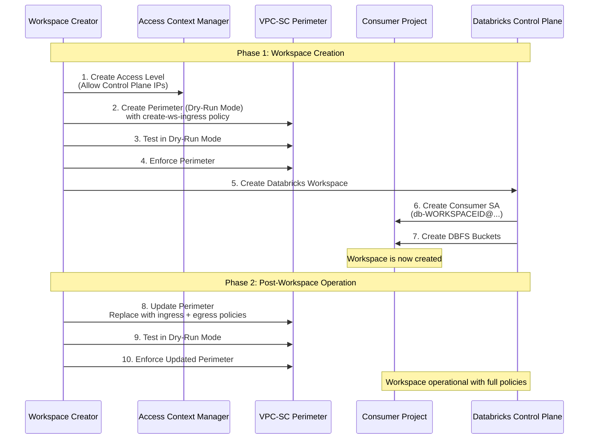

***REMOVED*** VPC Service Controls (VPC-SC) for Databricks on GCP 🔒

VPC Service Controls (VPC-SC) lets you create security perimeters around Google Cloud resources to reduce the risk of data exfiltration and to restrict access to only authorized networks and identities. Databricks supports VPC-SC for both Customer-Managed VPCs (Shared VPC or standalone) and Databricks-managed VPCs.

This guide provides comprehensive configuration instructions for setting up VPC-SC with Databricks on GCP, including identity management, ingress/egress policies, and troubleshooting.

---

***REMOVED******REMOVED*** Why Use VPC-SC for Databricks

VPC Service Controls provides defense-in-depth security for Databricks deployments on GCP:

| Benefit | Description |
|---------|-------------|
| **Perimeter Security** | Adds an extra layer of security independent of IAM policies (defense-in-depth) |
| **Data Exfiltration Prevention** | Helps mitigate data exfiltration from services such as Cloud Storage and BigQuery |
| **Restricted Access** | Ensures resources can be accessed only from authorized networks, devices, or identities |
| **Compliance** | Helps meet regulatory requirements (HIPAA, PCI-DSS, SOC 2) for data protection |
| **Context-Aware Access** | Enforces access based on source IP, identity, and device attributes |

> **Important**: Use VPC-SC together with IAM, Private Google Access (PGA), and firewall rules for a robust security posture.


---

***REMOVED******REMOVED*** Architecture Overview

VPC Service Controls creates security perimeters that protect Google Cloud services and resources:

```mermaid
graph TB
    subgraph "Databricks Control Plane<br/>(Databricks GCP Projects)"
        CP[Control Plane Services]
        ConsumerSA[Consumer SA<br/>db-WORKSPACEID@...]
        DelegateSA[Delegate SA<br/>delegate-sa@...]
        LogSA[Log Delivery SA<br/>log-delivery@...]
    end

    subgraph "VPC Service Controls Perimeter"
        subgraph "Customer GCP Project<br/>(Consumer Project)"
            WS[Databricks Workspace]
            GCS[DBFS Storage<br/>Cloud Storage]
            GCE[Compute Clusters<br/>GCE Instances]
        end
    end

    subgraph "External Services"
        GAR[Artifact Registry<br/>pkg.dev]
        APIs[Google APIs<br/>storage.googleapis.com]
    end

    CP -->|Ingress: Source IPs<br/>Access Level| WS
    ConsumerSA -->|Ingress: Create/Manage| GCS
    DelegateSA -->|Egress: Launch Clusters| GCE
    LogSA -->|Ingress: Deliver Logs| GCS
    GCE -->|Egress: Pull Images| GAR
    GCE -->|Egress: Access Storage| APIs

    style CP fill:***REMOVED***FFE6E6
    style ConsumerSA fill:***REMOVED***E6F3FF
    style DelegateSA fill:***REMOVED***E6F3FF
    style LogSA fill:***REMOVED***E6F3FF
    style WS fill:***REMOVED***E6FFE6
    style GCS fill:***REMOVED***E6FFE6
    style GCE fill:***REMOVED***E6FFE6
```

---

***REMOVED******REMOVED*** Supported Services

For a comprehensive list of services supported by VPC-SC, see:
- [Services Supported by VPC Service Controls](https://cloud.google.com/vpc-service-controls/docs/supported-products)
- [Restricted VIP Services](https://cloud.google.com/vpc-service-controls/docs/restricted-vip-services)

**Key Services for Databricks**:
- Cloud Storage (DBFS, storage buckets)
- Compute Engine (cluster nodes)
- Artifact Registry (runtime images)
- BigQuery (data sources)
- IAM (identity and access management)

---

***REMOVED******REMOVED*** Setting Up Private Connectivity to Google APIs

To restrict Private Google Access within a VPC-SC perimeter to only supported Google APIs and services, hosts must send their requests to the **`restricted.googleapis.com`** domain instead of `*.googleapis.com`.

***REMOVED******REMOVED******REMOVED*** Restricted Google APIs Configuration

| Parameter | Value |
|-----------|-------|
| **Domain Name** | `restricted.googleapis.com` |
| **IP Range** | `199.36.153.4/30` |
| **Purpose** | VIP (virtual IP address) range for VPC-SC protected APIs |
| **Announcement** | Not announced to the Internet (private only) |

See [Configure Private Google Access](./Configure-PrivateGoogleAccess.md) for detailed setup instructions.

**Quick Overview**:
1. Enable Private Google Access on workspace subnets
2. Create private DNS zones for `googleapis.com` pointing to `restricted.googleapis.com`
3. Configure VPC routes for `199.36.153.4/30` destination
4. Set up firewall rules allowing egress to restricted APIs

---

***REMOVED******REMOVED*** Understanding Databricks Identities and Projects

Before configuring VPC-SC, it's essential to understand the various identities and projects involved in Databricks operations.

***REMOVED******REMOVED******REMOVED*** Key Terms and Definitions

***REMOVED******REMOVED******REMOVED******REMOVED*** Projects

| Term | Description | Example |
|------|-------------|---------|
| **Consumer Project** | Customer-owned GCP project where Databricks workspace is deployed | `my-company-databricks-prod` |
| **Host Project** | (Shared VPC only) Customer project providing the VPC network | `my-company-network-host` |
| **Service Project** | (Shared VPC only) Customer project where workspace resources are created | Same as Consumer Project |
| **Databricks Regional Control Plane Project** | Databricks-owned project hosting regional control plane services | `prod-gcp-us-central1` |
| **Databricks Central Service Project** | Databricks-owned project for central services (workspace creation only) | `databricks-prod-master` |
| **Databricks Artifacts Project** | Databricks-owned project hosting runtime images | `databricks-prod-artifacts` |
| **Databricks Unity Catalog Project** | Databricks-owned project for Unity Catalog services | `uc-useast4` |

***REMOVED******REMOVED******REMOVED******REMOVED*** VPC Network

| Term | Description |
|------|-------------|
| **Consumer VPC** | Customer-owned GCP VPC used by Databricks workspace (shared or standalone) |

***REMOVED******REMOVED******REMOVED******REMOVED*** Identities

| Term | Description | Example | When Created |
|------|-------------|---------|--------------|
| **Workspace Creator** | Customer-owned identity (User or Service Account) used to create workspace | `admin@company.com` or `ws-creator@project.iam.gserviceaccount.com` | Before workspace creation |
| **Consumer SA** | Databricks-created per-workspace service account in control plane project | `db-1030565636556919@prod-gcp-us-central1.iam.gserviceaccount.com` | During workspace creation |
| **Delegate SA** | Databricks regional service account for launching GCE clusters | `delegate-sa@prod-gcp-us-central1.iam.gserviceaccount.com` | Pre-existing (regional) |
| **Log Delivery SA** | Databricks service account for delivering audit logs | `log-delivery@databricks-prod-master.iam.gserviceaccount.com` | Pre-existing |
| **Unity Catalog SA** | Databricks-created service account for Unity Catalog storage access | `db-uc-storage-UUID@uc-useast4.iam.gserviceaccount.com` | During Unity Catalog initialization |

***REMOVED******REMOVED******REMOVED******REMOVED*** Control Plane Connectivity

| Term | Description | Reference |
|------|-------------|-----------|
| **Databricks Control Plane IPs** | Source IP addresses from where requests into your GCP projects originate | [Databricks IP Addresses by Region](https://docs.gcp.databricks.com/resources/supported-regions.html***REMOVED***ip-addresses-and-domains) |

---

***REMOVED******REMOVED*** Databricks Service Accounts Reference

***REMOVED******REMOVED******REMOVED*** Service Account Naming Patterns

Databricks uses several service accounts to manage resources in customer projects:

| Service Account | Purpose | Workspace Type | When Used |
|-----------------|---------|----------------|-----------|
| `cluster-manager-k8s-sa@<regional-project>.iam.gserviceaccount.com` | Legacy GKE cluster management | Classic (GKE-based) | **Legacy only** - GKE-based clusters |
| `us-central1-gar-access@databricks-prod-artifacts.iam.gserviceaccount.com` | Access to Databricks runtime images | Classic (GKE-based) | **Legacy only** - GKE-based clusters |
| `delegate-sa@prod-gcp-[GEO]-[REGION].iam.gserviceaccount.com` | Launch and manage GCE-based clusters | Classic (GCE-based) | **Current** - GCE-based clusters |
| `db-[WORKSPACEID]@[databricks-project].iam.gserviceaccount.com` | Per-workspace resource management | All workspace types | **Always** - Created at workspace creation |
| `log-delivery@databricks-prod-master.iam.gserviceaccount.com` | Deliver audit logs to customer storage | All (if audit logs enabled) | When audit logging configured |
| `db-uc-storage-UUID@<uc-regional-project>.iam.gserviceaccount.com` | Unity Catalog storage access | Unity Catalog workspaces | When Unity Catalog initialized |

***REMOVED******REMOVED******REMOVED*** Databricks Project Numbers

A list of Databricks-owned GCP project numbers is available at: [Databricks Supported Regions](https://docs.gcp.databricks.com/resources/supported-regions.html***REMOVED***private-service-connect-psc-attachment-uris-and-project-numbers)

**Required for VPC-SC Configuration**: You'll need these project numbers when defining ingress sources and egress destinations in perimeter policies.

---

***REMOVED******REMOVED*** Identity Usage Matrix

Understanding which identities are used for ingress (calls into customer projects) and egress (calls out to Databricks projects):

| Identity | Type | Example | Used For | Traffic Direction | VPC-SC Policy Impact |
|----------|------|---------|----------|-------------------|---------------------|
| **Workspace Creator** | User or SA | `admin@company.com` | Workspace creation | **Ingress** into customer project | Must be allowed in Access Level |
| **Consumer SA** | SA | `db-WORKSPACEID@prod-gcp-us-central1.iam.gserviceaccount.com` | Workspace operation, DBFS management | **Ingress** into customer project | Created at WS creation - use ANY_IDENTITY |
| **Delegate SA** | SA | `delegate-sa@prod-gcp-us-central1.iam.gserviceaccount.com` | Launch GCE clusters | **Egress** from customer project | Must be in egress policy |
| **Log Delivery SA** | SA | `log-delivery@databricks-prod-master.iam.gserviceaccount.com` | Deliver audit logs | **Ingress** into customer project | Must be in ingress policy |
| **GKE Manager SA (Legacy)** | SA | `cluster-manager-k8s-sa@prod-gcp-us-central1.iam.gserviceaccount.com` | Legacy GKE cluster access to control plane | **Egress** from customer project | Legacy only - GKE workspaces |
| **GAR Access SA (Legacy)** | SA | `us-central1-gar-access@databricks-prod-artifacts.iam.gserviceaccount.com` | Legacy GKE cluster access to runtime images | **Egress** from customer project | Legacy only - GKE workspaces |

---

***REMOVED******REMOVED*** VPC-SC Configuration Workflow

The VPC-SC configuration follows different patterns depending on the workspace lifecycle stage:



***REMOVED******REMOVED******REMOVED*** Configuration Phases

| Phase | Policy Files | Purpose | When to Use |
|-------|--------------|---------|-------------|
| **Workspace Creation** | [create-ws-ingress.yaml](../templates/vpcsc-policy/create-ws-ingress.yaml) | Allow workspace creation and initial resource setup | Before creating workspace |
| **Post-Creation Operation** | [ingress.yaml](../templates/vpcsc-policy/ingress.yaml) + [egress.yaml](../templates/vpcsc-policy/egress.yaml) | Full operational policies for running workspaces | After workspace is created |
| **Least Privilege Workspaces (LPW)** | Special policies (see separate folder) | Highly restricted environments requiring allowlisting | Special use case - not common |

---

***REMOVED******REMOVED*** VPC-SC Policy Files

Before proceeding, **update all policy YAML files** with your relevant project numbers, identities, and IP ranges.

***REMOVED******REMOVED******REMOVED*** Available Policy Templates

| Policy File | Purpose | Usage Stage | Key Features |
|-------------|---------|-------------|--------------|
| [create-ws-ingress.yaml](../templates/vpcsc-policy/create-ws-ingress.yaml) | Workspace creation ingress policy | **During** workspace creation | Allows Control Plane to create Consumer SA and DBFS buckets |
| [ingress.yaml](../templates/vpcsc-policy/ingress.yaml) | Operational ingress policy | **After** workspace creation | Allows ongoing workspace management and log delivery |
| [egress.yaml](../templates/vpcsc-policy/egress.yaml) | Operational egress policy | **After** workspace creation | Allows cluster nodes to access Control Plane and Artifact Registry |
| LPW policies | Least privilege workspace policies | Special use case | Highly restricted - separate folder (not common) |

***REMOVED******REMOVED******REMOVED*** Why Use ANY_IDENTITY for Consumer SA?

At workspace creation, Databricks automatically creates a per-workspace service account:

**DBFS Buckets Created**:
- `projects/[customer-project-id]/buckets/databricks-[workspace-id]`
- `projects/[customer-project-id]/buckets/databricks-[workspace-id]-system`

**Consumer SA Format**:
- `db-[workspace-id]@[databricks-project].iam.gserviceaccount.com`

**Why ANY_IDENTITY is Required**:
Since the Consumer SA is automatically generated during workspace creation (with workspace ID unknown beforehand), we cannot pre-configure the specific service account in the ingress policy. Therefore, we use `ANY_IDENTITY` with source project restrictions:

```yaml
sources:
  - accessLevel: accessPolicies/[POLICY_ID]/accessLevels/databricks_control_plane_ips
identityType: ANY_IDENTITY  ***REMOVED*** Required because Consumer SA doesn't exist yet
```

This still requires requests to originate from:
1. ✅ Databricks Control Plane projects (project number restrictions)
2. ✅ IPs matching Access Level (Control Plane NAT IPs)
3. ❌ NOT arbitrary sources

---

***REMOVED******REMOVED*** Configuration Steps

***REMOVED******REMOVED******REMOVED*** Prerequisites

Before configuring VPC-SC, ensure you have:

- [ ] Customer-managed or Databricks-managed VPC network configured
- [ ] Workspace subnet(s) created
- [ ] Private Google Access enabled on subnets
- [ ] DNS configuration for `restricted.googleapis.com` completed
- [ ] Databricks Control Plane IP addresses for your region
- [ ] Databricks project numbers for your region
- [ ] Appropriate IAM permissions:
  - `accesscontextmanager.policyAdmin` or `accesscontextmanager.policyEditor`
  - `compute.networkAdmin` (for DNS, routes, firewall rules)
  - `iam.serviceAccountAdmin` (for service account management)

***REMOVED******REMOVED******REMOVED*** Step 1: Create Access Context Manager Access Level

Create an Access Level that allows traffic from Databricks Control Plane IP addresses:

```bash
***REMOVED*** Get your Access Context Manager policy ID
ACCESS_POLICY_ID=$(gcloud access-context-manager policies list --format="value(name)")

***REMOVED*** Create Access Level allowing Databricks Control Plane IPs
gcloud access-context-manager levels create databricks_control_plane_ips \
  --title="Databricks Control Plane IPs" \
  --basic-level-spec=access-level-spec.yaml \
  --policy=$ACCESS_POLICY_ID
```

**access-level-spec.yaml**:
```yaml
- ipSubnetworks:
  ***REMOVED*** Replace with your region's Control Plane NAT IPs
  - "34.138.66.176/32"    ***REMOVED*** Example: us-east1 control plane IP 1
  - "34.73.198.113/32"    ***REMOVED*** Example: us-east1 control plane IP 2
  ***REMOVED*** Add all control plane IPs for your region
  ***REMOVED*** See: https://docs.gcp.databricks.com/resources/supported-regions.html***REMOVED***ip-addresses-and-domains
```

***REMOVED******REMOVED******REMOVED*** Step 2: Create Service Perimeter (Dry-Run Mode)

**For Workspace Creation**, start with `create-ws-ingress.yaml`:

```bash
***REMOVED*** Create perimeter in DRY-RUN mode first
gcloud access-context-manager perimeters dry-run create databricks-perimeter \
  --title="Databricks VPC-SC Perimeter" \
  --resources=projects/[CONSUMER_PROJECT_NUMBER] \
  --restricted-services=storage.googleapis.com,compute.googleapis.com \
  --ingress-policies=create-ws-ingress.yaml \
  --policy=$ACCESS_POLICY_ID
```

***REMOVED******REMOVED******REMOVED*** Step 3: Test in Dry-Run Mode

Monitor VPC-SC logs to verify the perimeter allows required traffic:

```bash
***REMOVED*** Check VPC-SC audit logs for violations
gcloud logging read "protoPayload.metadata.dryRun=true AND protoPayload.metadata.vpcServiceControlsUniqueId:*" \
  --limit=50 \
  --format=json
```

**Expected**: No violations for legitimate Databricks traffic. If violations occur, adjust the policy.

***REMOVED******REMOVED******REMOVED*** Step 4: Enforce Perimeter

After validating in dry-run mode:

```bash
***REMOVED*** Enforce the perimeter
gcloud access-context-manager perimeters dry-run enforce databricks-perimeter \
  --policy=$ACCESS_POLICY_ID
```

***REMOVED******REMOVED******REMOVED*** Step 5: Create Databricks Workspace

Now create your Databricks workspace using the UI, CLI, or Terraform. The VPC-SC perimeter will allow the Control Plane to:
- Create Consumer SA (`db-WORKSPACEID@...`)
- Create DBFS storage buckets
- Configure workspace resources

***REMOVED******REMOVED******REMOVED*** Step 6: Update Perimeter for Post-Creation Operation

After workspace creation succeeds, update the perimeter with full operational policies:

```bash
***REMOVED*** Update perimeter with ingress + egress policies
gcloud access-context-manager perimeters update databricks-perimeter \
  --set-ingress-policies=ingress.yaml \
  --set-egress-policies=egress.yaml \
  --policy=$ACCESS_POLICY_ID \
  --dry-run
```

***REMOVED******REMOVED******REMOVED*** Step 7: Test Updated Policies in Dry-Run

Again, monitor logs for violations:

```bash
gcloud logging read "protoPayload.metadata.dryRun=true" --limit=50
```

***REMOVED******REMOVED******REMOVED*** Step 8: Enforce Updated Perimeter

```bash
***REMOVED*** Enforce updated policies
gcloud access-context-manager perimeters dry-run enforce databricks-perimeter \
  --policy=$ACCESS_POLICY_ID
```

---

***REMOVED******REMOVED*** Policy Structure Explained

***REMOVED******REMOVED******REMOVED*** Ingress Policy Structure

Ingress policies control traffic **into** your consumer project from Databricks services:

```yaml
- ingressFrom:
    sources:
      ***REMOVED*** Access Level: Only allow from Control Plane IPs
      - accessLevel: accessPolicies/[POLICY_ID]/accessLevels/databricks_control_plane_ips
    ***REMOVED*** Identity: Use ANY_IDENTITY because Consumer SA doesn't exist at creation
    identityType: ANY_IDENTITY
  ingressTo:
    ***REMOVED*** Target: Your consumer project resources
    resources:
      - projects/[CONSUMER_PROJECT_NUMBER]
    ***REMOVED*** Operations: What APIs and methods are allowed
    operations:
      - serviceName: storage.googleapis.com
        methodSelectors:
          - method: "*"  ***REMOVED*** Allow all storage operations
      - serviceName: compute.googleapis.com
        methodSelectors:
          - method: "*"  ***REMOVED*** Allow all compute operations
```

**Key Components**:
- **`ingressFrom.sources`**: Where traffic can originate (Access Levels, project numbers)
- **`identityType`**: `ANY_IDENTITY` or `ANY_SERVICE_ACCOUNT` (required for auto-created Consumer SA)
- **`ingressTo.resources`**: Your consumer project (destination)
- **`ingressTo.operations`**: Which Google APIs and methods are allowed

***REMOVED******REMOVED******REMOVED*** Egress Policy Structure

Egress policies control traffic **from** your consumer project to Databricks services:

```yaml
- egressFrom:
    ***REMOVED*** Identity: Service accounts in your project making outbound calls
    identities:
      - serviceAccount:db-[WORKSPACEID]@prod-gcp-us-central1.iam.gserviceaccount.com
  egressTo:
    ***REMOVED*** Target: Databricks projects
    resources:
      - projects/[DATABRICKS_CONTROL_PLANE_PROJECT_NUMBER]
      - projects/[DATABRICKS_ARTIFACTS_PROJECT_NUMBER]
    ***REMOVED*** Operations: What APIs the cluster can access
    operations:
      - serviceName: storage.googleapis.com
        methodSelectors:
          - method: "*"
      - serviceName: artifactregistry.googleapis.com
        methodSelectors:
          - method: "*"
```

**Key Components**:
- **`egressFrom.identities`**: Service accounts in your project making outbound requests
- **`egressTo.resources`**: Databricks project numbers (destinations)
- **`egressTo.operations`**: Which APIs your resources can call in Databricks projects

---

***REMOVED******REMOVED*** gcloud Command Reference

| Action | Command |
|--------|---------|
| **List Access Policies** | `gcloud access-context-manager policies list --format=yaml` |
| **Create Access Level** | `gcloud access-context-manager levels create [LEVEL_NAME] --basic-level-spec=[FILE] --policy=[POLICY_ID]` |
| **Create Perimeter (Dry-Run)** | `gcloud access-context-manager perimeters dry-run create [PERIMETER_NAME] --title="[TITLE]" --resources=projects/[PROJECT_NUM] --ingress-policies=[FILE] --policy=[POLICY_ID]` |
| **Enforce Perimeter** | `gcloud access-context-manager perimeters dry-run enforce [PERIMETER_NAME] --policy=[POLICY_ID]` |
| **Update Perimeter** | `gcloud access-context-manager perimeters update [PERIMETER_NAME] --set-ingress-policies=[FILE] --set-egress-policies=[FILE] --policy=[POLICY_ID]` |
| **List Perimeters** | `gcloud access-context-manager perimeters list --format=yaml --policy=[POLICY_ID]` |
| **Describe Perimeter** | `gcloud access-context-manager perimeters describe [PERIMETER_NAME] --policy=[POLICY_ID]` |
| **Delete Perimeter** | `gcloud access-context-manager perimeters delete [PERIMETER_NAME] --policy=[POLICY_ID]` |

**Sample Commands**: See [gcloud-run-book.txt](../templates/gcloud-cmds/gcloud-run-book.txt) for complete examples.

---

***REMOVED******REMOVED*** Validation and Testing

***REMOVED******REMOVED******REMOVED*** Validation Checklist

- [ ] Access Level created with Control Plane IPs
- [ ] Service Perimeter created in dry-run mode
- [ ] Dry-run logs show no violations for legitimate traffic
- [ ] Perimeter enforced successfully
- [ ] Databricks workspace created without errors
- [ ] Perimeter updated with post-creation policies
- [ ] Test cluster launches successfully
- [ ] Cluster can access Cloud Storage (DBFS)
- [ ] Cluster can pull runtime images from Artifact Registry
- [ ] No unexpected VPC-SC violations in logs

***REMOVED******REMOVED******REMOVED*** Test Workspace Creation

1. Create Access Level and Perimeter with `create-ws-ingress.yaml`
2. Enforce perimeter in dry-run first, then production
3. Attempt to create Databricks workspace via UI or API
4. Verify workspace creation succeeds
5. Check that DBFS buckets are created
6. Confirm Consumer SA exists in IAM

***REMOVED******REMOVED******REMOVED*** Test Operational Access

After updating to ingress + egress policies:

1. Launch a test cluster
2. Run notebook accessing Cloud Storage:
   ```python
   ***REMOVED*** Test DBFS access
   dbutils.fs.ls("dbfs:/")

   ***REMOVED*** Test external bucket access
   dbutils.fs.ls("gs://your-bucket/")
   ```
3. Test package installation (pulls from Artifact Registry):
   ```python
   %pip install pandas
   ```
4. Monitor VPC-SC logs for violations

***REMOVED******REMOVED******REMOVED*** Check VPC-SC Logs

```bash
***REMOVED*** Check for VPC-SC violations
gcloud logging read "protoPayload.metadata.@type=type.googleapis.com/google.cloud.audit.VpcServiceControlAuditMetadata" \
  --limit=50 \
  --format=json

***REMOVED*** Check for denied requests
gcloud logging read "protoPayload.metadata.securityPolicyInfo.vpcServiceControlsUniqueId:* AND protoPayload.authorizationInfo.granted=false" \
  --limit=50
```

---

***REMOVED******REMOVED*** Troubleshooting

***REMOVED******REMOVED******REMOVED*** Common Issues

| Issue | Symptom | Root Cause | Solution |
|-------|---------|------------|----------|
| **Workspace creation fails** | "VPC Service Controls violation" error | Ingress policy not allowing Control Plane access | Verify Access Level includes all Control Plane IPs for your region |
| **Consumer SA creation blocked** | Workspace creation fails at resource setup | `identityType` not set to `ANY_IDENTITY` | Update ingress policy to use `identityType: ANY_IDENTITY` |
| **DBFS bucket access denied** | "Access Denied" when accessing dbfs:/ | Consumer SA not in ingress policy or missing storage API permissions | Verify `storage.googleapis.com` in ingress policy operations |
| **Cluster launch fails** | Cluster stuck in PENDING state | Egress policy not allowing access to Control Plane | Add egress policy with delegate-sa identity and Control Plane project |
| **Runtime image pull fails** | Cluster fails with image download error | Egress policy not allowing Artifact Registry access | Add `artifactregistry.googleapis.com` to egress operations |
| **Log delivery fails** | Audit logs not appearing in bucket | Log Delivery SA not in ingress policy | Add `log-delivery@databricks-prod-master.iam.gserviceaccount.com` to ingress identities |
| **Policy update fails** | "Cannot update enforced perimeter" | Trying to update enforced policy directly | Use dry-run mode first: `--dry-run`, test, then enforce |

***REMOVED******REMOVED******REMOVED*** Debug Commands

```bash
***REMOVED*** Get Access Context Manager policy ID
gcloud access-context-manager policies list --format="value(name)"

***REMOVED*** List all access levels
gcloud access-context-manager levels list --policy=[POLICY_ID]

***REMOVED*** Describe specific access level
gcloud access-context-manager levels describe databricks_control_plane_ips --policy=[POLICY_ID]

***REMOVED*** List all perimeters
gcloud access-context-manager perimeters list --policy=[POLICY_ID]

***REMOVED*** Describe specific perimeter
gcloud access-context-manager perimeters describe databricks-perimeter --policy=[POLICY_ID]

***REMOVED*** Check VPC-SC audit logs
gcloud logging read "protoPayload.metadata.@type=type.googleapis.com/google.cloud.audit.VpcServiceControlAuditMetadata" \
  --limit=50 \
  --format=json

***REMOVED*** Check for specific project violations
gcloud logging read "resource.labels.project_id=[PROJECT_ID] AND protoPayload.metadata.vpcServiceControlsUniqueId:*" \
  --limit=50
```

***REMOVED******REMOVED******REMOVED*** VPC-SC Violation Log Analysis

When investigating VPC-SC violations, look for these fields in audit logs:

```json
{
  "protoPayload": {
    "metadata": {
      "@type": "type.googleapis.com/google.cloud.audit.VpcServiceControlAuditMetadata",
      "vpcServiceControlsUniqueId": "...",
      "securityPolicyInfo": {
        "servicePerimeterName": "...",
        "violationReason": "NO_MATCHING_ACCESS_LEVEL"
      }
    }
  }
}
```

**Common Violation Reasons**:
- `NO_MATCHING_ACCESS_LEVEL`: Source IP not in Access Level
- `NO_MATCHING_INGRESS_RULE`: Ingress policy doesn't allow the operation
- `NO_MATCHING_EGRESS_RULE`: Egress policy doesn't allow the operation
- `RESOURCE_NOT_IN_PERIMETER`: Target resource not in service perimeter

---

***REMOVED******REMOVED*** Best Practices

***REMOVED******REMOVED******REMOVED*** Security Best Practices

| Practice | Description | Benefit |
|----------|-------------|---------|
| **Always use dry-run mode first** | Test policies before enforcement | Prevents breaking production workspaces |
| **Use Access Levels for IP restrictions** | Define allowed source IPs in Access Levels | Restricts access to known Control Plane IPs |
| **Principle of least privilege** | Only allow minimum required APIs and methods | Reduces attack surface |
| **Regular policy reviews** | Audit VPC-SC policies quarterly | Ensures policies remain aligned with security requirements |
| **Monitor VPC-SC logs** | Set up alerts for VPC-SC violations | Detects unauthorized access attempts |
| **Use restricted Google APIs** | Configure `restricted.googleapis.com` | Limits to VPC-SC compliant services only |
| **Document all exceptions** | Maintain documentation for policy decisions | Simplifies audits and policy updates |

***REMOVED******REMOVED******REMOVED*** Operational Best Practices

| Practice | Description |
|----------|-------------|
| **Separate policies for creation and operation** | Use `create-ws-ingress.yaml` during creation, then switch to full policies | Simplifies workspace creation process |
| **Test in non-production first** | Validate policies in dev/test environments | Catches issues before production impact |
| **Use Infrastructure as Code** | Manage VPC-SC with Terraform | Ensures reproducibility and version control |
| **Staged rollout** | Deploy to one workspace, validate, then expand | Reduces risk of widespread issues |
| **Maintain runbook** | Document troubleshooting steps | Speeds up incident resolution |
| **Subscribe to Databricks updates** | Monitor for changes in IP addresses or service accounts | Keeps policies current |

***REMOVED******REMOVED******REMOVED*** Configuration Best Practices

| Practice | Recommendation |
|----------|----------------|
| **Project organization** | Use separate projects for dev/test/prod with separate perimeters |
| **Access Level naming** | Use descriptive names like `databricks_[region]_control_plane_ips` |
| **Policy versioning** | Store policy YAML files in Git with clear versioning |
| **Perimeter scope** | Include all related projects in perimeter (host + service projects for Shared VPC) |
| **Update process** | Establish change management process for policy updates |

---

***REMOVED******REMOVED*** Integration with Other Security Controls

***REMOVED******REMOVED******REMOVED*** Combined with Private Google Access

VPC-SC works seamlessly with Private Google Access:

```mermaid
graph LR
    Cluster[Databricks Cluster] -->|1. DNS Query| DNS[Private DNS<br/>googleapis.com]
    DNS -->|2. Resolve to| VIP[Restricted VIP<br/>199.36.153.4/30]
    VIP -->|3. Firewall Check| FW[Firewall Rules<br/>Allow 199.36.153.4/30]
    FW -->|4. VPC-SC Check| SC[VPC Service Controls<br/>Perimeter]
    SC -->|5. Access Allowed| API[Google APIs<br/>VPC-SC Protected]

    style Cluster fill:***REMOVED***E6F3FF
    style DNS fill:***REMOVED***FFE6E6
    style VIP fill:***REMOVED***FFE6E6
    style FW fill:***REMOVED***FFE6E6
    style SC fill:***REMOVED***E6FFE6
    style API fill:***REMOVED***E6FFE6
```

**Benefits of Combined Approach**:
1. **DNS Layer**: Private DNS ensures resolution to restricted endpoints
2. **Network Layer**: Firewall rules limit egress destinations
3. **API Layer**: VPC-SC enforces security perimeters
4. **Identity Layer**: IAM controls who can perform operations

See [Configure Private Google Access](./Configure-PrivateGoogleAccess.md) for PGA setup.

***REMOVED******REMOVED******REMOVED*** Combined with VPC Firewall Rules

VPC-SC complements firewall rules for defense-in-depth:

| Layer | Control | Enforcement Point | What It Protects |
|-------|---------|-------------------|------------------|
| **Network** | VPC Firewall Rules | IP/Port level | Controls network connectivity by IP and port |
| **API** | VPC Service Controls | API level | Controls access to Google Cloud APIs and services |
| **Identity** | IAM Policies | Resource level | Controls who can perform actions on resources |

See [Lock Down VPC Firewall Rules](./LockDown-VPC-Firewall-Rules.md) for firewall configuration.

---

***REMOVED******REMOVED*** Configuration Checklist

***REMOVED******REMOVED******REMOVED*** Pre-Configuration

| Step | Task | Status |
|------|------|--------|
| 1 | Identify Databricks Control Plane IPs for your region | ☐ |
| 2 | Identify Databricks project numbers for your region | ☐ |
| 3 | Identify your Consumer Project number(s) | ☐ |
| 4 | Verify IAM permissions for VPC-SC configuration | ☐ |
| 5 | Configure Private Google Access and DNS | ☐ |

***REMOVED******REMOVED******REMOVED*** Workspace Creation Phase

| Step | Task | Status |
|------|------|--------|
| 6 | Get Access Context Manager policy ID | ☐ |
| 7 | Create Access Level with Control Plane IPs | ☐ |
| 8 | Update `create-ws-ingress.yaml` with your values | ☐ |
| 9 | Create Service Perimeter in dry-run mode | ☐ |
| 10 | Test dry-run and review logs | ☐ |
| 11 | Enforce Service Perimeter | ☐ |
| 12 | Create Databricks workspace | ☐ |
| 13 | Verify workspace creation succeeds | ☐ |
| 14 | Verify Consumer SA and DBFS buckets created | ☐ |

***REMOVED******REMOVED******REMOVED*** Post-Creation Phase

| Step | Task | Status |
|------|------|--------|
| 15 | Update `ingress.yaml` with your values | ☐ |
| 16 | Update `egress.yaml` with your values and workspace-specific SA | ☐ |
| 17 | Update perimeter with ingress + egress policies (dry-run) | ☐ |
| 18 | Test dry-run and review logs | ☐ |
| 19 | Enforce updated perimeter | ☐ |
| 20 | Launch test cluster | ☐ |
| 21 | Verify cluster can access DBFS | ☐ |
| 22 | Verify cluster can pull runtime images | ☐ |
| 23 | Monitor VPC-SC logs for violations | ☐ |
| 24 | Document any policy adjustments made | ☐ |

---

***REMOVED******REMOVED*** References

- [GCP VPC Service Controls Documentation](https://cloud.google.com/vpc-service-controls/docs/overview)
- [VPC-SC Supported Services](https://cloud.google.com/vpc-service-controls/docs/supported-products)
- [Databricks GCP Network Architecture](https://docs.gcp.databricks.com/security/network/classic/index.html)
- [Restricted VIP Services](https://cloud.google.com/vpc-service-controls/docs/restricted-vip-services)
- [Private Google Access Setup](https://cloud.google.com/vpc-service-controls/docs/set-up-private-connectivity)
- [Access Context Manager](https://cloud.google.com/access-context-manager/docs/overview)
- [Databricks IP Addresses by Region](https://docs.gcp.databricks.com/resources/supported-regions.html***REMOVED***ip-addresses-and-domains)
- [Databricks Project Numbers](https://docs.gcp.databricks.com/resources/supported-regions.html***REMOVED***private-service-connect-psc-attachment-uris-and-project-numbers)
- [Configure Private Google Access](./Configure-PrivateGoogleAccess.md)
- [Lock Down VPC Firewall Rules](./LockDown-VPC-Firewall-Rules.md)

---

***REMOVED******REMOVED*** Summary

✅ **Recommended VPC Service Controls Configuration for Databricks on GCP**:

1. **Use two-phase approach**: Create workspace with `create-ws-ingress.yaml`, then update to full `ingress.yaml` + `egress.yaml`
2. **Always start with dry-run mode**: Test policies before enforcement to avoid breaking workspaces
3. **Use Access Levels**: Restrict access to Databricks Control Plane IPs only
4. **Use ANY_IDENTITY for Consumer SA**: Required because Consumer SA is created during workspace creation
5. **Configure restricted Google APIs**: Use `restricted.googleapis.com` (199.36.153.4/30) with VPC-SC
6. **Monitor VPC-SC logs**: Set up alerts for violations and review regularly
7. **Document all policies**: Maintain clear documentation for policy decisions and updates
8. **Test thoroughly**: Validate in non-production before applying to production workspaces

VPC Service Controls provides an essential security layer for Databricks on GCP, working together with IAM, Private Google Access, and VPC firewall rules to create a comprehensive defense-in-depth security architecture.
