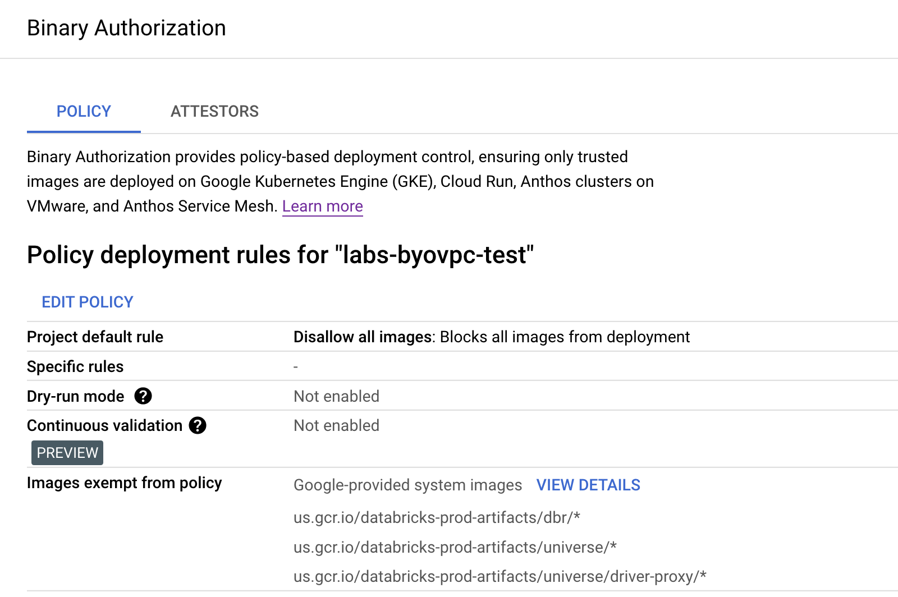
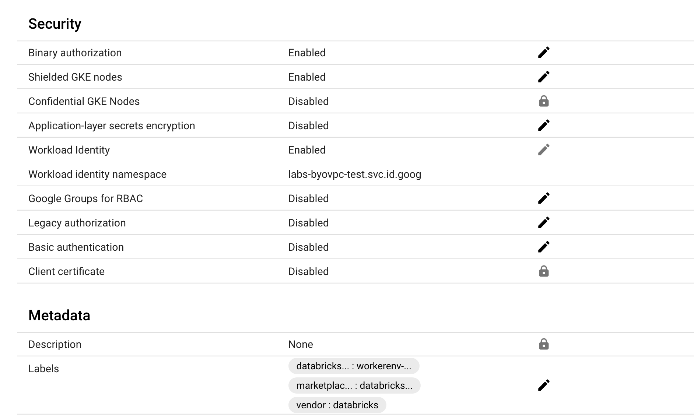
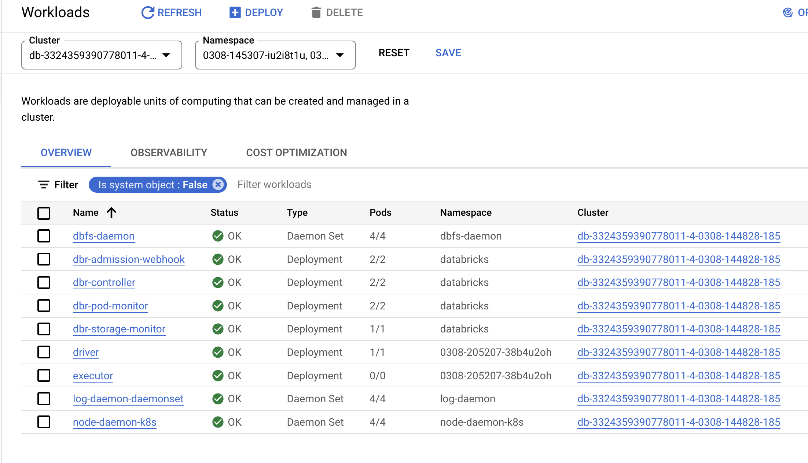

## GCP Binary Auth for GKE clusters images

[Binary Authorization documentation](https://cloud.google.com/binary-authorization/docs)

GCP Binary Authorization has three options Allow all, Disallow all, Allow if all Attestors pass. Images exempt from policy are not affected by the three policies.

### Disallow all images but exempt Databricks gcr repo
Binary Authorization can be configured after the workspace is created and users can allow only images from Databricks gcr repo.

### Edit policy for Binary Auth to disallow all images on Console
Console → Security → Binary Authorization → Edit Policy

### Add Databricks gcr repo to Binay Auth exempt images on Console

#### USA

- `us.gcr.io/databricks-prod-artifacts/dbr/*`
- `us.gcr.io/databricks-prod-artifacts/universe/driver-proxy/*`
- `us.gcr.io/databricks-prod-artifacts/universe/*`

#### EU

- `eu.gcr.io/databricks-prod-artifacts/universe/*`
- `eu.gcr.io/databricks-prod-artifacts/dbr/*`
- `eu.gcr.io/databricks-prod-artifacts/universe/driver-proxy/*`

### Edit Policy

### Databricks GKE cluster can only launch pods with images from authorized repo’s. 

### Verify cluster starts

