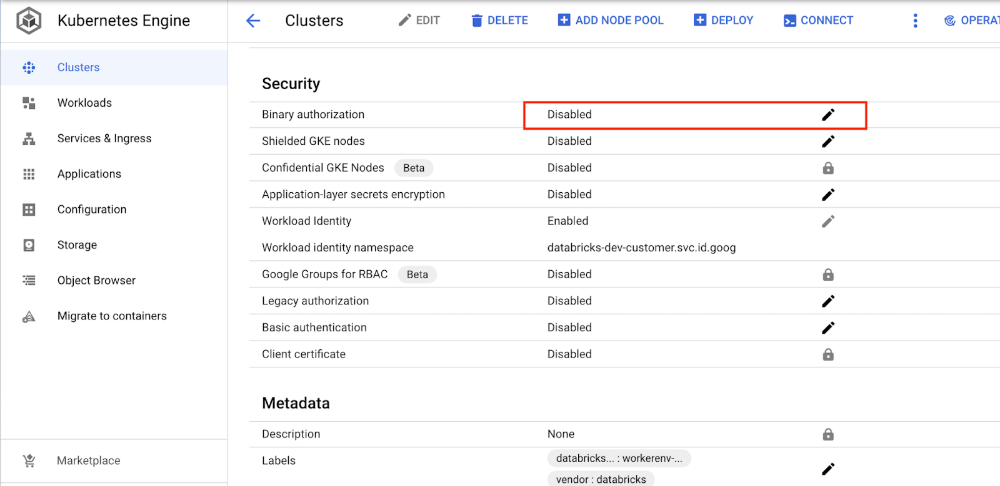
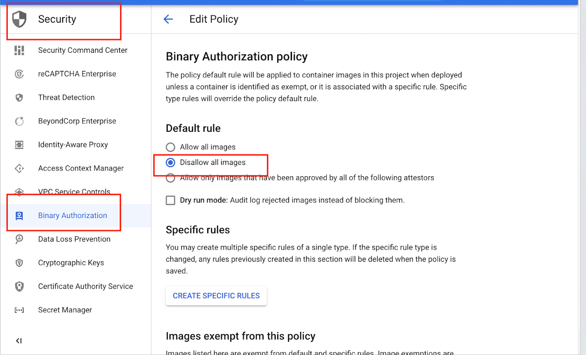
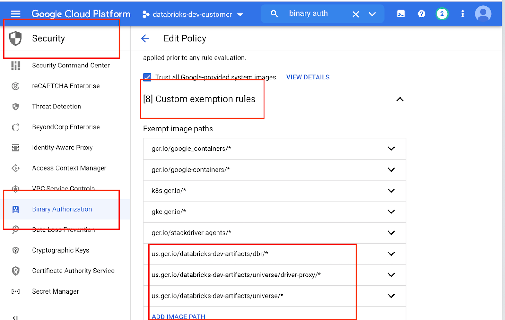

# Enable Binary Authorization for GKE Cluster
GCP Binary Authorization for GKE clusters images

[Binary Authorization documentation  |  Google Cloud](https://cloud.google.com/binary-authorization/docs)

GCP Binary Auth has three options Allow all, Disallow all, Allow if all Attestors pass. Images exempt from policy are not affected by the three policies.

Short Term: Disallow all images but exempt Databricks gcr repo
Customers can configure Binary Auth on their own and allow only images from Databricks gcr repo.

 

## Enable Binary Auth on the GKE cluster


## Edit policy for Binary Auth to disallow all images on Console
Console → Security → Binary Authorization → Edit Policy


Add Databricks gcr repo to Binay Auth exempt images on Console

```
us.gcr.io/databricks-dev-artifacts/dbr/* 
us.gcr.io/databricks-dev-artifacts/universe/driver-proxy/*
us.gcr.io/databricks-dev-artifacts/universe/* 
eu.gcr.io/databricks-dev-artifacts/universe/*
eu.gcr.io/databricks-dev-artifacts/dbr/*
eu.gcr.io/databricks-dev-artifacts/universe/driver-proxy*  
```



After these three steps, Databricks GKE cluster can only launch pods with images from databricks managed GCR. 