# Lock Down VPC Egress for Databricks on GCP 🔐

By default, GCP allows egress from VPCs to any destination. To meet security and compliance requirements, you can restrict egress traffic from Databricks clusters using a **deny-by-default approach** that explicitly allows only essential services and destinations.

This guide outlines the recommended egress controls, firewall rule priorities, DNS configuration, and validation steps based on [Databricks official firewall documentation](https://docs.databricks.com/gcp/en/security/network/classic/firewall).

---

## Overview: Deny-by-Default Approach

The recommended security model for Databricks on GCP follows a **deny-by-default** pattern:

1. **Allow specific required destinations** with high priority (1000-1099)
2. **Deny all other egress** with lower priority (1100)
3. **Use Private Google Access** with `restricted.googleapis.com` for Google APIs
4. **Configure DNS and routes** to support private connectivity

```mermaid
graph TD
    Start[Databricks Cluster VM] --> Check{Egress Traffic}
    Check -->|Match Allow Rule<br/>Priority 1000-1099| Allow[✅ Allow Traffic]
    Check -->|No Match| Deny[❌ Deny Traffic<br/>Priority 1100]

    Allow --> Dest1[199.36.153.4/30<br/>Restricted Google APIs]
    Allow --> Dest2[34.126.0.0/18<br/>VPC-SC Entry Point]
    Allow --> Dest3[Workspace Subnet<br/>Intra-cluster Comms]
    Allow --> Dest4[Control Plane IPs<br/>Databricks Services]

    style Allow fill:"#90EE90"
    style Deny fill:"#FFB6C6"
    style Dest1 fill:"#E6F3FF"
    style Dest2 fill:"#E6F3FF"
    style Dest3 fill:"#E6F3FF"
    style Dest4 fill:"#E6F3FF"
```

---

## 🎯 Why Use Restricted Google APIs?

**For Databricks on GCP, the recommended best practice is to use `restricted.googleapis.com` (199.36.153.4/30) instead of `private.googleapis.com`.**

| Benefit | Description |
|---------|-------------|
| **Security Perimeter** | Ensures VMs access only VPC Service Controls-compliant Google APIs |
| **Data Exfiltration Prevention** | Prevents data exfiltration to unsupported Google services (Gmail, Maps, etc.) |
| **Compliance Ready** | Aligns with regulatory requirements by enforcing strict API access controls |
| **Explicit Allow-listing** | Forces explicit configuration of allowed services following least privilege |

> ⚠️ **Trade-off**: Using restricted APIs blocks public package repositories (PyPI, Maven Central) and non-VPC-SC-compliant Google services. Plan accordingly for package management.

---

## Required Egress Firewall Rules

### Firewall Rules Table

All **allow rules** must use **priority 1000-1099**. The **deny-all rule** must use **priority 1100**. Lower priority numbers evaluate first.

| Rule Name | Direction | Priority | Action | Protocol | Ports | Destination | Purpose | Notes |
|-----------|-----------|----------|--------|----------|-------|-------------|---------|-------|
| `allow-restricted-googleapis` | EGRESS | 1000 | ALLOW | All | All | `199.36.153.4/30` | Access to restricted Google APIs (Cloud Storage, Artifact Registry) | **Required** for Private Google Access with VPC-SC |
| `allow-vpc-sc-entry` | EGRESS | 1000 | ALLOW | TCP | 443 | `34.126.0.0/18` | VPC Service Controls entry point | **Required** when using VPC-SC perimeters |
| `allow-intra-subnet` | EGRESS | 1000 | ALLOW | All | All | `<WORKSPACE_SUBNET_CIDR>` | Intra-cluster communication within workspace subnet | **Required** for cluster nodes to communicate |
| `allow-databricks-control-plane` | EGRESS | 1000 | ALLOW | TCP | 443, 8443-8451 | `<REGIONAL_CONTROL_PLANE_IPS>` | Databricks control plane services | **Required** for workspace/cluster management |
| `allow-metastore` | EGRESS | 1000 | ALLOW | TCP | 3306 | `<METASTORE_REGIONAL_IPS>` | Hive metastore (if using Databricks-managed metastore) | Optional - only if not using Unity Catalog |
| `allow-dns` | EGRESS | 1000 | ALLOW | UDP/TCP | 53 | `<DNS_SERVER_IPS>` | DNS resolution | **Required** for name resolution |
| `allow-ntp` | EGRESS | 1000 | ALLOW | UDP | 123 | `<NTP_SERVER_IPS>` | Time synchronization | **Required** for time services |
| `deny-all-egress` | EGRESS | 1100 | DENY | All | All | `0.0.0.0/0` | Deny all other egress traffic | **Critical** - must be lowest priority |

> 🔴 **CRITICAL**: The deny-all rule MUST have lower priority (higher number) than allow rules. Incorrect prioritization prevents Databricks from accessing essential services and breaks workspace/cluster creation.

### Regional Control Plane IP Addresses

Control plane IP addresses are region-specific and **can change**. Databricks recommends using **FQDN-based rules** when possible instead of static IPs.

To find your region's control plane IPs, see: [Databricks IP Addresses and Domains](https://docs.databricks.com/gcp/en/resources/ip-domain-region)

**Example Regional Control Plane IPs**:

| Region | Control Plane IPs | Ports |
|--------|------------------|-------|
| `us-central1` | Check official docs | 443, 8443-8451 |
| `us-east1` | Check official docs | 443, 8443-8451 |
| `europe-west2` | Check official docs | 443, 8443-8451 |

> ⚠️ **Important**: Update firewall rules when Databricks IP addresses change to avoid breaking workspace or cluster creation.

---

## Firewall Priority Architecture

Understanding firewall rule priority is critical for proper security configuration:

```mermaid
graph TD
    subgraph "Priority 1000-1099: ALLOW Rules"
        A1[Allow 199.36.153.4/30<br/>Priority 1000]
        A2[Allow 34.126.0.0/18<br/>Priority 1000]
        A3[Allow Workspace Subnet<br/>Priority 1000]
        A4[Allow Control Plane IPs<br/>Priority 1000]
        A5[Allow DNS/NTP<br/>Priority 1000]
    end

    subgraph "Priority 1100: DENY Rule"
        D1[Deny 0.0.0.0/0<br/>Priority 1100]
    end

    Traffic[Egress Traffic] --> Eval{Evaluate Rules<br/>Lowest Priority First}
    Eval -->|Match 1000-1099| A1
    Eval -->|Match 1000-1099| A2
    Eval -->|Match 1000-1099| A3
    Eval -->|Match 1000-1099| A4
    Eval -->|Match 1000-1099| A5
    Eval -->|No Match| D1

    A1 --> Allowed[✅ Traffic Allowed]
    A2 --> Allowed
    A3 --> Allowed
    A4 --> Allowed
    A5 --> Allowed
    D1 --> Denied[❌ Traffic Denied]

    style Allowed fill:"#90EE90"
    style Denied fill:"#FFB6C6"
```

**Priority Rules**:
- **Lower numbers = Higher priority** (evaluated first)
- **Allow rules: 1000-1099** (high priority)
- **Deny rule: 1100** (lower priority, evaluated last)
- GCP firewall rules are **stateful** (return traffic automatically allowed)

---

## Implementation Steps

### Prerequisites

Before implementing firewall rules, ensure:

- [ ] VPC network configured for Databricks workspaces
- [ ] Workspace subnet(s) created with sufficient IP space
- [ ] Control plane IP addresses identified for your region
- [ ] Private Google Access enabled on workspace subnets
- [ ] DNS and routing configuration planned (see below)

### Step 1: Enable Private Google Access on Subnets

```bash
# Enable PGA on the subnet used by Databricks clusters
gcloud compute networks subnets update <SUBNET_NAME> \
  --region=<REGION> \
  --enable-private-ip-google-access
```

### Step 2: Configure DNS for Restricted Google APIs

**Required DNS Configuration**:

| Domain | Purpose | Record Type | Target |
|--------|---------|-------------|--------|
| `restricted.googleapis.com` | Restricted Google API endpoint | A | 199.36.153.4, 199.36.153.5, 199.36.153.6, 199.36.153.7 |
| `*.googleapis.com` | Wildcard alias for all Google APIs | CNAME | `restricted.googleapis.com` |

**Create Private DNS Zone**:

```bash
# Create private DNS zone for googleapis.com
gcloud dns managed-zones create restricted-googleapis \
  --dns-name=googleapis.com. \
  --description="Private DNS zone for restricted Google APIs" \
  --visibility=private \
  --networks=<VPC_NAME>

# Add A records for restricted.googleapis.com
gcloud dns record-sets create restricted.googleapis.com. \
  --zone=restricted-googleapis \
  --type=A \
  --ttl=300 \
  --rrdatas=199.36.153.4,199.36.153.5,199.36.153.6,199.36.153.7

# Add wildcard CNAME for *.googleapis.com
gcloud dns record-sets create '*.googleapis.com.' \
  --zone=restricted-googleapis \
  --type=CNAME \
  --ttl=300 \
  --rrdatas=restricted.googleapis.com.
```

### Step 3: Configure VPC Routes

Create static routes for restricted API ranges:

```bash
# Route for restricted.googleapis.com (199.36.153.4/30)
gcloud compute routes create restricted-googleapis-route \
  --network=<VPC_NAME> \
  --destination-range=199.36.153.4/30 \
  --next-hop-gateway=default-internet-gateway \
  --priority=1000

# Route for VPC-SC entry point (34.126.0.0/18)
gcloud compute routes create vpc-sc-entry-route \
  --network=<VPC_NAME> \
  --destination-range=34.126.0.0/18 \
  --next-hop-gateway=default-internet-gateway \
  --priority=1000
```

### Step 4: Create Allow Firewall Rules

**Create allow rules with priority 1000-1099**:

```bash
# 1. Allow restricted Google APIs (199.36.153.4/30)
gcloud compute firewall-rules create allow-restricted-googleapis \
  --direction=EGRESS \
  --network=<VPC_NAME> \
  --action=ALLOW \
  --rules=all \
  --destination-ranges=199.36.153.4/30 \
  --priority=1000

# 2. Allow VPC-SC entry point (34.126.0.0/18)
gcloud compute firewall-rules create allow-vpc-sc-entry \
  --direction=EGRESS \
  --network=<VPC_NAME> \
  --action=ALLOW \
  --rules=tcp:443 \
  --destination-ranges=34.126.0.0/18 \
  --priority=1000

# 3. Allow intra-subnet communication
gcloud compute firewall-rules create allow-intra-subnet \
  --direction=EGRESS \
  --network=<VPC_NAME> \
  --action=ALLOW \
  --rules=all \
  --destination-ranges=<WORKSPACE_SUBNET_CIDR> \
  --priority=1000

# 4. Allow Databricks control plane (replace IPs with your region's IPs)
gcloud compute firewall-rules create allow-databricks-control-plane \
  --direction=EGRESS \
  --network=<VPC_NAME> \
  --action=ALLOW \
  --rules=tcp:443,tcp:8443-8451 \
  --destination-ranges=<CONTROL_PLANE_IP_1>,<CONTROL_PLANE_IP_2> \
  --priority=1000

# 5. Allow DNS
gcloud compute firewall-rules create allow-dns \
  --direction=EGRESS \
  --network=<VPC_NAME> \
  --action=ALLOW \
  --rules=udp:53,tcp:53 \
  --destination-ranges=0.0.0.0/0 \
  --priority=1000

# 6. Allow NTP
gcloud compute firewall-rules create allow-ntp \
  --direction=EGRESS \
  --network=<VPC_NAME> \
  --action=ALLOW \
  --rules=udp:123 \
  --destination-ranges=0.0.0.0/0 \
  --priority=1000
```

### Step 5: Create Deny-All Rule (LAST)

**⚠️ Create this rule LAST after verifying all allow rules are working**:

```bash
# DENY all other egress with priority 1100 (lower priority than allows)
gcloud compute firewall-rules create deny-all-egress \
  --direction=EGRESS \
  --network=<VPC_NAME> \
  --action=DENY \
  --rules=all \
  --destination-ranges=0.0.0.0/0 \
  --priority=1100
```

> 🔴 **WARNING**: Creating the deny-all rule before allow rules will break all connectivity. Always create allow rules first and verify they work before adding the deny-all rule.

---

## DNS Resolution Flow

Understanding how DNS resolution works with restricted Google APIs:

```mermaid
sequenceDiagram
    participant Cluster as Databricks Cluster<br/>(No External IP)
    participant DNS as Private DNS Zone<br/>googleapis.com
    participant VIP as Restricted VIP<br/>199.36.153.4/30
    participant API as Google APIs<br/>(VPC-SC Protected)

    Note over Cluster,API: Cluster needs to access storage.googleapis.com

    Cluster->>DNS: Query: storage.googleapis.com
    DNS-->>Cluster: CNAME: restricted.googleapis.com<br/>A: 199.36.153.4, .5, .6, .7

    Note over Cluster: Route table lookup:<br/>199.36.153.4/30 → default-internet-gateway

    Cluster->>VIP: HTTPS Request to 199.36.153.4:443

    Note over VIP: Firewall rule evaluation:<br/>✅ Priority 1000: allow-restricted-googleapis

    VIP->>API: Forward to Google API (within VPC-SC perimeter)
    API-->>VIP: Response (storage data)
    VIP-->>Cluster: Response

    Note over Cluster,API: All traffic stays on Google's internal network<br/>VPC-SC enforces security perimeter
```



---

## Validation and Testing

### Pre-Flight Checklist

Before launching Databricks clusters, verify:

- [ ] Private Google Access enabled on all Databricks subnets
- [ ] Private DNS zone created for `googleapis.com` with restricted VIPs
- [ ] DNS records: A records for `restricted.googleapis.com`, CNAME for `*.googleapis.com`
- [ ] VPC routes configured for `199.36.153.4/30` and `34.126.0.0/18`
- [ ] All allow firewall rules created with priority 1000-1099
- [ ] Deny-all firewall rule created with priority 1100
- [ ] Control plane IP addresses current and correct for your region

### Validation Steps

#### 1. Verify Firewall Rules Priority Order

```bash
# List all egress firewall rules sorted by priority
gcloud compute firewall-rules list \
  --filter="network:<VPC_NAME> AND direction:EGRESS" \
  --sort-by=priority \
  --format="table(name,priority,direction,action,destinationRanges)"
```

**Expected Output**:
```
NAME                            PRIORITY  DIRECTION  ACTION  DESTINATION_RANGES
allow-restricted-googleapis     1000      EGRESS     ALLOW   199.36.153.4/30
allow-vpc-sc-entry             1000      EGRESS     ALLOW   34.126.0.0/18
allow-intra-subnet             1000      EGRESS     ALLOW   10.0.0.0/16
allow-databricks-control-plane 1000      EGRESS     ALLOW   <control-plane-ips>
allow-dns                      1000      EGRESS     ALLOW   0.0.0.0/0
allow-ntp                      1000      EGRESS     ALLOW   0.0.0.0/0
deny-all-egress                1100      EGRESS     DENY    0.0.0.0/0
```

> ✅ Verify: All allow rules have priority 1000-1099, deny rule has priority 1100

#### 2. Test DNS Resolution

From a VM without external IP in the same VPC:

```bash
# Test restricted.googleapis.com resolution
dig restricted.googleapis.com

# Expected output: Should resolve to 199.36.153.4-7
# restricted.googleapis.com. 300 IN A 199.36.153.4
# restricted.googleapis.com. 300 IN A 199.36.153.5
# restricted.googleapis.com. 300 IN A 199.36.153.6
# restricted.googleapis.com. 300 IN A 199.36.153.7

# Test wildcard CNAME resolution
dig storage.googleapis.com

# Expected output: Should CNAME to restricted.googleapis.com
# storage.googleapis.com. 300 IN CNAME restricted.googleapis.com.
# restricted.googleapis.com. 300 IN A 199.36.153.4
```

#### 3. Test HTTPS Connectivity

```bash
# Test Cloud Storage access via restricted endpoint
curl -I https://storage.googleapis.com

# Expected output:
# HTTP/2 200
# content-type: text/html; charset=UTF-8
# (Connection successful via restricted endpoint)

# Test that public internet is blocked
curl -I https://www.example.com

# Expected output: Connection timeout or failure
# (Confirms deny-all rule is working)
```

#### 4. Verify VPC Routes

```bash
# List routes for restricted API ranges
gcloud compute routes list \
  --filter="network:<VPC_NAME> AND (destRange:199.36.153.4/30 OR destRange:34.126.0.0/18)" \
  --format="table(name,destRange,nextHopGateway,priority)"
```

**Expected Output**:
```
NAME                        DEST_RANGE        NEXT_HOP_GATEWAY           PRIORITY
restricted-googleapis-route 199.36.153.4/30   default-internet-gateway   1000
vpc-sc-entry-route         34.126.0.0/18     default-internet-gateway   1000
```

#### 5. Launch Test Databricks Cluster

1. Create a small test cluster in a non-production workspace
2. Monitor cluster launch logs for connectivity issues
3. Run test notebook:

```python
# Test Cloud Storage access
dbutils.fs.ls("gs://your-test-bucket/")

# Test package installation (note: may fail if PyPI access not configured)
%pip install pandas

# Test compute connectivity
import requests
# This should fail (blocked by firewall)
# requests.get("https://www.example.com")
```

4. Verify cluster launches successfully and can access required Google services

---

## Troubleshooting

### Common Issues and Solutions

| Issue | Symptom | Root Cause | Solution |
|-------|---------|------------|----------|
| **Cluster launch fails immediately** | Cluster terminates in PENDING state | Deny-all rule blocking control plane access | Verify control plane IPs in allow rules match your region's current IPs |
| **DNS resolution fails** | `nslookup` returns NXDOMAIN | Private DNS zone not associated with VPC | Verify DNS zone `private_visibility_config` includes correct VPC network |
| **Connection timeouts to Google APIs** | Cluster can't access Cloud Storage | Firewall blocking `199.36.153.4/30` | Verify allow-restricted-googleapis rule exists with priority 1000-1099 |
| **VPC-SC violations** | "Request violates VPC Service Controls" errors | Missing VPC-SC entry point rule | Add allow rule for `34.126.0.0/18` with tcp:443 |
| **Intra-cluster communication fails** | Multi-node clusters can't communicate | Workspace subnet not in allow rules | Add allow rule for workspace subnet CIDR with all protocols |
| **Priority conflict** | Allow rules not working despite being created | Deny-all rule has higher priority | Ensure allow rules use 1000-1099, deny uses 1100 |
| **Time sync failures** | Clock skew errors | NTP (UDP/123) blocked | Add allow rule for NTP to appropriate time servers |
| **Package installation fails** | `pip install` times out | PyPI blocked by restricted APIs | Configure Cloud NAT or private PyPI mirror |

### Debug Commands

```bash
# Check if PGA is enabled on subnet
gcloud compute networks subnets describe <SUBNET_NAME> \
  --region=<REGION> \
  --format="value(privateIpGoogleAccess)"

# List all DNS zones
gcloud dns managed-zones list

# Check DNS records in zone
gcloud dns record-sets list --zone=restricted-googleapis

# Verify firewall rules for specific destination
gcloud compute firewall-rules list \
  --filter="network:<VPC_NAME> AND direction:EGRESS AND destinationRanges:199.36.153.4/30"

# Check VPC routes
gcloud compute routes list \
  --filter="network:<VPC_NAME> AND destRange:199.36.153.4/30"

# Test from compute instance
gcloud compute ssh <INSTANCE_NAME> \
  --command="dig restricted.googleapis.com && curl -I https://storage.googleapis.com"

# Check VPC Flow Logs for dropped traffic
gcloud logging read "resource.type=gce_subnetwork AND jsonPayload.reporter=DEST AND jsonPayload.disposition=DROP" \
  --limit=50 \
  --format=json
```

---

## Best Practices

### Security Best Practices

| Practice | Description | Benefit |
|----------|-------------|---------|
| **Use deny-by-default** | Implement explicit allow rules + deny-all | Minimizes attack surface and data exfiltration risk |
| **Use restricted Google APIs** | Configure `restricted.googleapis.com` (199.36.153.4/30) | Limits access to VPC-SC compliant services only |
| **Implement VPC Service Controls** | Create security perimeters around resources | Prevents data exfiltration, enforces context-aware access |
| **Monitor VPC Flow Logs** | Enable and review flow logs regularly | Detects unusual traffic patterns and denied connections |
| **Use FQDN-based rules** | Prefer domain-based rules over static IPs when possible | Automatically adapts to IP changes |
| **Regular firewall audits** | Review and update firewall rules quarterly | Ensures rules remain current and remove unused rules |
| **Least privilege** | Only allow minimum required destinations | Reduces exposure to potential threats |
| **Document all rules** | Maintain documentation for each firewall rule | Simplifies troubleshooting and audits |

### Operational Best Practices

| Practice | Description |
|----------|-------------|
| **Test in non-production first** | Always validate firewall changes in dev/test before production |
| **Use Infrastructure as Code** | Manage firewall rules via Terraform for reproducibility and version control |
| **Set up alerting** | Configure alerts for VPC-SC violations and unexpected denied traffic |
| **Maintain runbook** | Document troubleshooting steps and escalation procedures |
| **Version control changes** | Track all firewall rule modifications in Git with clear commit messages |
| **Staged rollout** | Deploy restrictive rules gradually, monitor for issues before full enforcement |
| **Emergency access plan** | Have documented procedure to temporarily bypass rules if needed |
| **Regular updates** | Subscribe to Databricks IP change notifications and update rules promptly |

### Network Planning

| Consideration | Recommendation |
|---------------|----------------|
| **Subnet sizing** | Plan subnet CIDR blocks based on expected cluster sizes; insufficient IP space causes job failures |
| **IP address management** | Track control plane IPs and update rules when Databricks announces changes |
| **Package repositories** | For restricted APIs, configure Cloud NAT or private PyPI/Maven mirrors for package installation |
| **Multi-region** | Apply consistent firewall policies across all regions with region-specific control plane IPs |
| **Workspace lifecycle** | Note that changing subnet after workspace creation requires workspace network configuration update |

---

## Configuration Checklist

### Pre-Implementation

| Step | Task | Status |
|------|------|--------|
| 1 | Identify workspace subnet CIDR(s) | ☐ |
| 2 | Obtain current control plane IPs for your region(s) | ☐ |
| 3 | Verify VPC network configuration | ☐ |
| 4 | Plan firewall rule priorities (1000-1099 allow, 1100 deny) | ☐ |
| 5 | Document required egress destinations | ☐ |

### DNS and Routing Configuration

| Step | Task | Status |
|------|------|--------|
| 6 | Enable Private Google Access on workspace subnets | ☐ |
| 7 | Create private DNS zone for `googleapis.com` | ☐ |
| 8 | Add A records for `restricted.googleapis.com` → 199.36.153.4-7 | ☐ |
| 9 | Add CNAME for `*.googleapis.com` → `restricted.googleapis.com` | ☐ |
| 10 | Create route for `199.36.153.4/30` → default-internet-gateway | ☐ |
| 11 | Create route for `34.126.0.0/18` → default-internet-gateway | ☐ |

### Firewall Rules Implementation

| Step | Task | Status |
|------|------|--------|
| 12 | Create allow rule for `199.36.153.4/30` (restricted APIs) - priority 1000 | ☐ |
| 13 | Create allow rule for `34.126.0.0/18` (VPC-SC entry) - priority 1000 | ☐ |
| 14 | Create allow rule for workspace subnet CIDR (intra-cluster) - priority 1000 | ☐ |
| 15 | Create allow rule for control plane IPs - priority 1000 | ☐ |
| 16 | Create allow rule for DNS (UDP/TCP 53) - priority 1000 | ☐ |
| 17 | Create allow rule for NTP (UDP 123) - priority 1000 | ☐ |
| 18 | Verify all allow rules exist with correct priorities | ☐ |
| 19 | Create DENY rule for `0.0.0.0/0` - priority 1100 | ☐ |

### Validation

| Step | Task | Status |
|------|------|--------|
| 20 | Test DNS resolution for `restricted.googleapis.com` | ☐ |
| 21 | Test HTTPS connectivity to `storage.googleapis.com` | ☐ |
| 22 | Verify public internet is blocked (curl www.example.com fails) | ☐ |
| 23 | Launch test Databricks cluster | ☐ |
| 24 | Verify cluster can access Cloud Storage | ☐ |
| 25 | Monitor VPC Flow Logs for denied traffic | ☐ |
| 26 | Document any additional required destinations | ☐ |

---

## Infrastructure as Code (Terraform)

For production deployments, use Terraform to manage firewall rules. Example snippet:

```hcl
# Allow restricted Google APIs
resource "google_compute_firewall" "allow_restricted_googleapis" {
  name      = "allow-restricted-googleapis"
  network   = var.vpc_network
  direction = "EGRESS"
  priority  = 1000

  allow {
    protocol = "all"
  }

  destination_ranges = ["199.36.153.4/30"]
}

# Allow VPC-SC entry point
resource "google_compute_firewall" "allow_vpc_sc_entry" {
  name      = "allow-vpc-sc-entry"
  network   = var.vpc_network
  direction = "EGRESS"
  priority  = 1000

  allow {
    protocol = "tcp"
    ports    = ["443"]
  }

  destination_ranges = ["34.126.0.0/18"]
}

# Allow intra-subnet communication
resource "google_compute_firewall" "allow_intra_subnet" {
  name      = "allow-intra-subnet"
  network   = var.vpc_network
  direction = "EGRESS"
  priority  = 1000

  allow {
    protocol = "all"
  }

  destination_ranges = [var.workspace_subnet_cidr]
}

# Allow Databricks control plane
resource "google_compute_firewall" "allow_databricks_control_plane" {
  name      = "allow-databricks-control-plane"
  network   = var.vpc_network
  direction = "EGRESS"
  priority  = 1000

  allow {
    protocol = "tcp"
    ports    = ["443", "8443-8451"]
  }

  destination_ranges = var.control_plane_ips
}

# Deny all other egress (LAST)
resource "google_compute_firewall" "deny_all_egress" {
  name      = "deny-all-egress"
  network   = var.vpc_network
  direction = "EGRESS"
  priority  = 1100

  deny {
    protocol = "all"
  }

  destination_ranges = ["0.0.0.0/0"]
}
```

---

## Additional Considerations

### Package Management with Restricted APIs

When using `restricted.googleapis.com`, public package repositories (PyPI, Maven Central, npm) are blocked. Options:

1. **Cloud NAT**: Configure Cloud NAT for controlled internet access to specific domains
2. **Private Mirrors**: Set up private PyPI/Maven mirrors within your VPC
3. **Init Scripts**: Pre-install packages in custom Docker images or Databricks init scripts
4. **Databricks Asset Bundles**: Package dependencies as part of workspace assets

### VPC Service Controls Integration

Restricted Google APIs work seamlessly with VPC Service Controls:

- **Security Perimeters**: Define which projects/services can communicate
- **Ingress/Egress Rules**: Control data flow across perimeter boundaries
- **Access Levels**: Define context-aware access conditions (IP ranges, device policy)

See [Configure-VPC-SC.md](./Configure-VPC-SC.md) for detailed VPC Service Controls setup.

### Multi-Region Deployments

For multi-region Databricks deployments:

1. **Regional Control Plane IPs**: Each region has different control plane IPs
2. **Firewall Rules**: Create region-specific rules or use consolidated IP lists
3. **DNS Configuration**: Private DNS zones are typically global (apply to entire VPC)
4. **Routes**: VPC routes are global by default

---

## References

- [Databricks GCP Firewall Configuration (Official)](https://docs.databricks.com/gcp/en/security/network/classic/firewall)
- [Databricks IP Addresses and Domains by Region](https://docs.databricks.com/gcp/en/resources/ip-domain-region)
- [GCP Private Google Access Documentation](https://cloud.google.com/vpc/docs/configure-private-google-access)
- [GCP VPC Firewall Rules](https://cloud.google.com/vpc/docs/firewalls)
- [VPC Service Controls Overview](https://cloud.google.com/vpc-service-controls/docs/overview)
- [Restricted VIP Services](https://cloud.google.com/vpc-service-controls/docs/supported-products)
- [Configure Private Google Access](./Configure-PrivateGoogleAccess.md)
- [Configure VPC Service Controls](./Configure-VPC-SC.md)

---

## Summary

✅ **Recommended Firewall Configuration for Databricks on GCP**:

1. **Deny-by-default approach**: Allow specific destinations (priority 1000-1099), deny all else (priority 1100)
2. **Use `restricted.googleapis.com`**: Configure 199.36.153.4/30 for Google API access
3. **Configure Private DNS**: Create private DNS zones with A and CNAME records for restricted APIs
4. **Set up VPC routes**: Direct traffic for 199.36.153.4/30 and 34.126.0.0/18 to default-internet-gateway
5. **Allow essential services**: Control plane IPs, workspace subnet, DNS, NTP
6. **Test thoroughly**: Validate in non-production before deploying to production
7. **Monitor continuously**: Use VPC Flow Logs to detect and respond to issues

This configuration provides robust security while maintaining full Databricks functionality.
