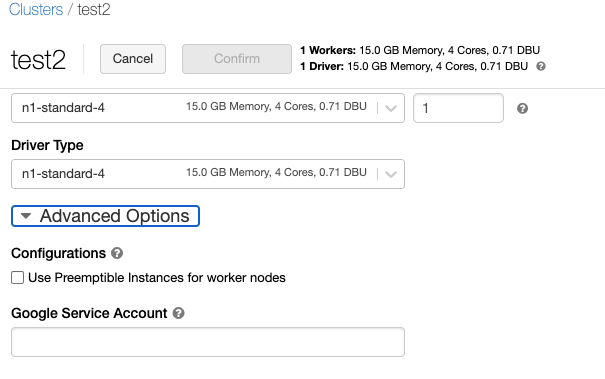

***REMOVED*** Overview
`Workload Identity` is the recommended way to access Google Cloud services from applications running within GKE due to its improved security properties and manageability. This feature is enabled by default on Databricks and requires no customization. For information about alternative ways to access Google Cloud APIs from GKE, refer to the [alternatives](https://cloud.google.com/kubernetes-engine/docs/how-to/workload-identity***REMOVED***alternatives) section.

***REMOVED*** Terminology
This document distinguishes between [Kubernetes service accounts](https://kubernetes.io/docs/tasks/configure-pod-container/configure-service-account/) and [Google service accounts](https://cloud.google.com/iam/docs/service-accounts). Kubernetes service accounts are Kubernetes resources, while Google service accounts are specific to Google Cloud. Other Google Cloud documentation refers to Google service accounts as "service accounts".

***REMOVED*** Concepts
Applications running on GKE must authenticate to use [Google Cloud APIs](https://cloud.google.com/apis) such as the Compute APIs, Storage and Database APIs, or Machine Learning APIs.

With Workload Identity, you can configure a Kubernetes service account to act as a Google service account. Pods running as the Kubernetes service account will automatically authenticate as the Google service account when accessing Google Cloud APIs. This enables you to assign distinct, fine-grained identities and authorization for each application in your cluster.

***REMOVED*** How it applies to Databricks?
By default Databricks cluster use workload identity, which is enabled on the GKE cluster by default and could be verified using the following command


```
gcloud container clusters describe GKE_CLUSTER_NAME \
--region REGION \
--format 'value(workloadIdentityConfig)'
```
And on [Databrick's cluster](https://docs.gcp.databricks.com/clusters/configure.html***REMOVED***google-service-account) you could pass Google Service Account which has the right set of permissions to access GCP API’s (GCS, BigQuery, CloudSQL and so on)



**!Important**

The service account that you use to access GCS and BigQuery data sources must be in the same project as the service account that was specified when setting up your Databricks workspace.