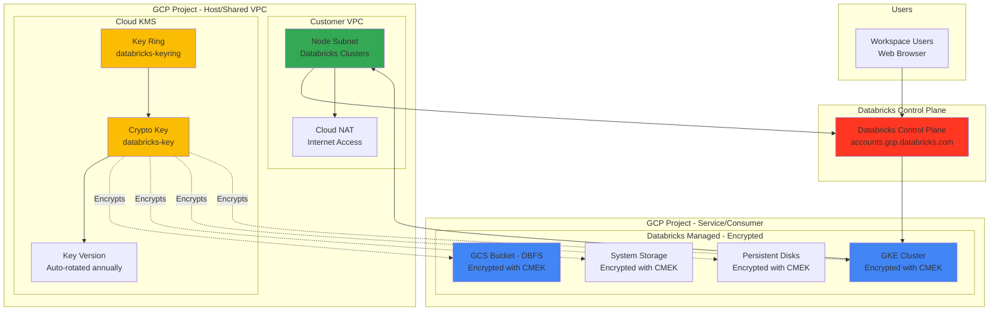
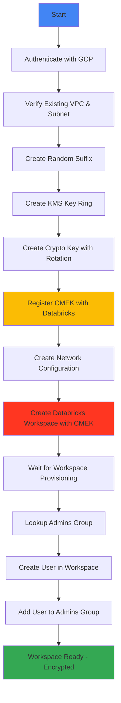
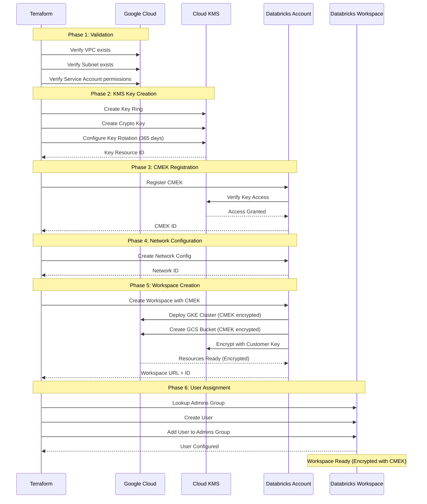

# Databricks Workspace with BYOVPC + Customer-Managed Encryption Keys (CMEK)

A Terraform configuration for deploying a secure Databricks workspace on Google Cloud Platform (GCP) using customer-managed VPC with Customer-Managed Encryption Keys (CMEK) for enhanced data security.

## Table of Contents

- [Architecture Overview](#architecture-overview)
- [Prerequisites](#prerequisites)
- [Customer-Managed Keys Explained](#customer-managed-keys-explained)
- [Provider Configuration](#provider-configuration)
- [GCP Infrastructure Requirements](#gcp-infrastructure-requirements)
- [Databricks Resources](#databricks-resources)
- [Deployment Flow](#deployment-flow)
- [Configuration](#configuration)
- [Deployment](#deployment)
- [Outputs](#outputs)
- [Troubleshooting](#troubleshooting)

---

## Architecture Overview

This deployment creates a **secure Databricks workspace with encryption** featuring:

- ✅ **Customer-Managed VPC (BYOVPC)** with custom subnets
- ✅ **Customer-Managed Encryption Keys (CMEK)** using Google Cloud KMS
- ✅ **Encrypted Storage** for both managed and unmanaged (DBFS) storage
- ✅ **GKE Node Encryption** for cluster compute nodes
- ✅ **Key Rotation** with configurable rotation period
- ✅ **Workspace Admin Assignment** for initial user
- ✅ **Public Internet Access** for workspace and clusters

### Architecture Diagram



### What This Configuration Does

1. **Creates KMS Key Ring**: Establishes a key ring for organizing encryption keys
2. **Generates Crypto Key**: Creates a CMEK with automatic annual rotation
3. **Registers Key with Databricks**: Links the KMS key to your Databricks account
4. **Creates Network Configuration**: Registers your VPC and subnet with Databricks
5. **Provisions Encrypted Workspace**: Deploys workspace with CMEK for storage and compute
6. **Assigns Admin User**: Adds specified user to workspace admin group

### What This Configuration Does NOT Do

This configuration does **NOT** include:

- ❌ Private Service Connect (PSC) for private connectivity
- ❌ Unity Catalog setup
- ❌ VPC creation (assumes VPC already exists)
- ❌ Subnet creation (assumes subnets already exist)
- ❌ Firewall rules configuration
- ❌ IP Access Lists

For these features, see:
- **BYOVPC + PSC + CMEK**: `../byovpc-psc-cmek-ws/`
- **End-to-End with Unity Catalog**: `../end2end/`
- **Infrastructure Creation**: `../infra4db/`
- **Basic BYOVPC (no encryption)**: `../byovpc-ws/`

---

## Prerequisites

### 1. Databricks Account Requirements

- **Databricks Account on GCP** (Enterprise Edition recommended)
- **Account Console Access** at `https://accounts.gcp.databricks.com`
- **Google Service Account** with admin privileges:
  - Must be added to Databricks Account Console with **Account Admin** role
  - Service account email (e.g., `automation-sa@project.iam.gserviceaccount.com`)

### 2. GCP Requirements

#### Existing VPC Infrastructure

This configuration requires a **pre-existing VPC** with appropriate subnets. To create the infrastructure, use `../infra4db/` first.

**Required:**
- VPC network in host/shared VPC project
- Subnet for Databricks nodes with sufficient IP space:
  - Minimum `/24` CIDR recommended (251 usable IPs)
  - Secondary IP ranges for GKE pods and services (auto-created by Databricks)
- Internet connectivity via Cloud Router + Cloud NAT OR Direct Internet Gateway

#### GCP Service Account Permissions

The service account needs these IAM roles on both projects:

**On Service/Consumer Project** (where workspace will be created):
- `roles/compute.networkAdmin`
- `roles/iam.serviceAccountAdmin`
- `roles/resourcemanager.projectIamAdmin`
- `roles/storage.admin`
- `roles/cloudkms.admin` (for KMS key management)
- `roles/cloudkms.cryptoKeyEncrypterDecrypter` (for encryption operations)

**On Host/Shared VPC Project** (if using Shared VPC):
- `roles/compute.networkUser`
- `roles/compute.securityAdmin`

For detailed role requirements, see [Databricks CMEK Documentation](https://docs.gcp.databricks.com/security/keys/customer-managed-keys.html).

#### GCP Projects

You need two project IDs:
1. **Service/Consumer Project** (`google_project_name`): Where Databricks resources will be created
2. **Host/Shared VPC Project** (`google_shared_vpc_project`): Where your VPC network exists

> **Note**: If not using Shared VPC, both values should be the same project ID.

### 3. Local Requirements

- **Terraform** >= 1.0
- **Google Cloud SDK** (`gcloud` CLI) configured
- **Service Account Authentication** configured (see [Authentication Setup](#authentication-setup))

### 4. Databricks User

- User email must already exist in your organization's identity provider
- User will be added to the workspace admin group automatically
- Email should be provided in `databricks_admin_user` variable

---

## Customer-Managed Keys Explained

### What is CMEK?

Customer-Managed Encryption Keys (CMEK) allow you to control the encryption keys used to protect your data in Databricks. With CMEK, you:

- **Own the encryption keys**: Keys reside in your Google Cloud KMS
- **Control access**: Manage who can use the keys via IAM policies
- **Enable key rotation**: Automatically rotate keys on a schedule
- **Audit key usage**: Monitor key access via Cloud Audit Logs
- **Revoke access**: Disable keys to prevent Databricks from accessing data

### Encryption Scope

The CMEK created in this configuration encrypts:

| Resource | Encrypted Data | Key Usage |
|----------|----------------|-----------|
| **DBFS Storage** | User data, notebooks, libraries in GCS | STORAGE |
| **System Storage** | Workspace configurations, logs | STORAGE |
| **GKE Cluster Disks** | Persistent disks for cluster nodes | STORAGE |
| **Notebook State** | Notebook execution state | MANAGED |

### Key Components

#### 1. Key Ring

```hcl
resource "google_kms_key_ring" "databricks_key_ring"
```

**Purpose**: Logical grouping of encryption keys  
**Name**: `databricks-keyring`  
**Location**: Same region as workspace  
**Note**: Cannot be deleted, only disabled

#### 2. Crypto Key

```hcl
resource "google_kms_crypto_key" "databricks_key"
```

**Purpose**: Actual encryption key used by Databricks  
**Name**: `databricks-key`  
**Key Purpose**: `ENCRYPT_DECRYPT`  
**Rotation Period**: 1 year (31536000 seconds)  
**Algorithm**: Google-managed symmetric encryption

**Use Cases:**
- `STORAGE`: Encrypts DBFS, logs, GKE disks
- `MANAGED`: Encrypts notebook state in control plane

#### 3. Key Registration with Databricks

```hcl
resource "databricks_mws_customer_managed_keys" "this"
```

**Links the KMS key to your Databricks account**

**Attributes:**
- `kms_key_id`: Full resource ID of the crypto key
- `use_cases`: List of ["STORAGE", "MANAGED"]
- `account_id`: Your Databricks account ID

### Key Rotation

Keys automatically rotate annually (365 days):

```hcl
rotation_period = "31536000s"  # 1 year in seconds
```

**What happens during rotation:**
1. GCP creates a new key version
2. New encryptions use the new version
3. Old versions remain available for decryption
4. No downtime or manual intervention required

**Best Practices:**
- Rotation period must be >= 1 day
- Recommended: 90 days to 1 year
- Shorter periods = more security, more key versions to manage
- Longer periods = fewer key versions, simpler management

### KMS Key Access Control

Databricks needs these permissions on your KMS key:

```
cloudkms.cryptoKeyVersions.useToEncrypt
cloudkms.cryptoKeyVersions.useToDecrypt
cloudkms.cryptoKeys.get
```

**Granted automatically** when you register the key with Databricks.

### Bring Your Own Key (Pre-created)

If you already have a KMS key, you can use it instead of creating a new one:

1. Comment out the key creation blocks in `workspace.tf`:
   ```hcl
   # Comment lines 28-56 (key ring and crypto key creation)
   ```

2. Uncomment the variable declaration:
   ```hcl
   # Line 20: variable "cmek_resource_id" {}
   ```

3. Add the key resource ID to `workspace.auto.tfvars`:
   ```hcl
   cmek_resource_id = "projects/my-project/locations/us-central1/keyRings/my-keyring/cryptoKeys/my-key"
   ```

4. Update the local variable reference:
   ```hcl
   # Line 65: kms_key_id = var.cmek_resource_id
   ```

**Key Requirements:**
- Key must exist in the same region as the workspace
- Key purpose must be `ENCRYPT_DECRYPT`
- Your service account must have access to the key

---

## Authentication Setup

### Option 1: Service Account Impersonation (Recommended)

```bash
# Set the service account to impersonate
gcloud config set auth/impersonate_service_account automation-sa@project.iam.gserviceaccount.com

# Generate access token
export GOOGLE_OAUTH_ACCESS_TOKEN=$(gcloud auth print-access-token)
```

### Option 2: Service Account Key File

```bash
# Download service account key
gcloud iam service-accounts keys create ~/sa-key.json \
  --iam-account=automation-sa@project.iam.gserviceaccount.com

# Set environment variable
export GOOGLE_APPLICATION_CREDENTIALS=~/sa-key.json
```

> **Security Best Practice**: Use Option 1 (impersonation) to avoid managing key files.

For detailed authentication guide, see `../sa-impersonation.md`.

---

## Provider Configuration

This deployment uses three Terraform providers:

### 1. Google Provider (Default)

Manages resources in the **service/consumer project**.

```hcl
provider "google" {
  project = var.google_project_name
  region  = var.google_region
}
```

### 2. Google Provider (VPC Project Alias)

Manages resources in the **host/shared VPC project**.

```hcl
provider "google" {
  alias   = "vpc_project"
  project = var.google_shared_vpc_project
  region  = var.google_region
}
```

### 3. Databricks Account Provider

Creates workspace and account-level configurations.

```hcl
provider "databricks" {
  alias                  = "accounts"
  host                   = "https://accounts.gcp.databricks.com"
  google_service_account = var.google_service_account_email
}
```

**Used for:**
- Creating workspace with CMEK
- Registering network configuration
- Registering customer-managed keys
- Account-level permissions

### 4. Databricks Workspace Provider

Manages workspace-level configurations after workspace creation.

```hcl
provider "databricks" {
  alias                  = "workspace"
  host                   = databricks_mws_workspaces.databricks_workspace.workspace_url
  google_service_account = var.google_service_account_email
}
```

**Used for:**
- Adding users to workspace
- Workspace admin group management
- Workspace-level configurations

---

## GCP Infrastructure Requirements

### VPC and Subnet Requirements

Before deploying the workspace, ensure you have:

#### VPC Network
- Name: Referenced in `google_vpc_id` variable
- Project: Must exist in `google_shared_vpc_project`
- Type: Custom mode (not auto-mode)

#### Node Subnet
- Name: Referenced in `node_subnet` variable
- Purpose: Hosts Databricks cluster nodes (GKE)
- IP Range: 
  - Primary CIDR: Minimum `/24` (251 IPs)
  - Secondary ranges: Auto-created by Databricks for pods/services
- Region: Must match `google_region` variable

#### Network Connectivity Requirements

**Egress (Outbound) - Required:**
- Access to `*.gcp.databricks.com` (control plane)
- Access to `*.googleapis.com` (GCP APIs)
- Access to `*.docker.io`, `*.maven.org`, `*.pypi.org` (package downloads)
- Access to Cloud KMS endpoints for encryption/decryption

**Ingress (Inbound) - Optional:**
- Public internet access for workspace UI (default)
- Can be restricted with Private Service Connect (see `../byovpc-psc-cmek-ws/`)

### Firewall Rules

Minimum required firewall rules (managed separately):

1. **Allow Internal Communication** (within subnet):
   ```
   Source: Node subnet CIDR
   Target: Node subnet CIDR
   Protocols: TCP, UDP, ICMP (all ports)
   ```

2. **Allow Egress to Internet**:
   ```
   Source: Node subnet CIDR
   Target: 0.0.0.0/0
   Protocols: TCP 443, 3306 (HTTPS, external metastore)
   ```

3. **Allow KMS Access**:
   ```
   Source: Node subnet CIDR
   Target: cloudkms.googleapis.com
   Protocols: TCP 443
   ```

For infrastructure creation including firewall rules, use `../infra4db/`.

---

## Databricks Resources

### 1. KMS Key Ring

```hcl
resource "google_kms_key_ring" "databricks_key_ring"
```

**Creates:**
- Key ring for organizing encryption keys
- Located in the same region as workspace
- Name: `databricks-keyring`

**Important Notes:**
- Key rings cannot be deleted
- Can only be disabled
- Must be in same location as resources it encrypts

### 2. Crypto Key

```hcl
resource "google_kms_crypto_key" "databricks_key"
```

**Creates:**
- Encryption key with annual rotation
- Purpose: ENCRYPT_DECRYPT
- Rotation period: 365 days

**Key Attributes:**
- `name`: `databricks-key`
- `key_ring`: Reference to key ring created above
- `rotation_period`: `31536000s` (1 year)

### 3. Customer-Managed Key Registration

```hcl
resource "databricks_mws_customer_managed_keys" "this"
```

**Registers:**
- KMS key with Databricks account
- Use cases: STORAGE and MANAGED
- Links key to workspace encryption

**Lifecycle:**
- `ignore_changes = all`: Prevents Terraform from modifying key after creation
- Allows manual updates via Databricks console

### 4. Network Configuration

```hcl
resource "databricks_mws_networks" "databricks_network"
```

**Creates:**
- Network configuration object in Databricks account
- Associates your VPC and subnet with Databricks
- Enables Databricks to deploy GKE clusters in your subnet

**Key Attributes:**
- `network_name`: Generated with random suffix for uniqueness
- `network_project_id`: Host/shared VPC project
- `vpc_id`: Your VPC name
- `subnet_id`: Your node subnet name
- `subnet_region`: Must match workspace region

### 5. Workspace with CMEK

```hcl
resource "databricks_mws_workspaces" "databricks_workspace"
```

**Creates:**
- Databricks workspace with CMEK encryption
- GKE cluster with encrypted disks
- GCS bucket with CMEK encryption for DBFS
- Managed resources in Databricks-managed project

**Key Attributes:**
- `workspace_name`: Display name in Databricks console
- `location`: GCP region for workspace
- `cloud_resource_container.gcp.project_id`: Your service project
- `network_id`: Links to network configuration
- `GCE_config.connectivity_type`: `PRIVATE_NODE_PUBLIC_MASTER` (default)
- `GCE_config.master_ip_range`: IP range for GKE master (optional)
- `storage_customer_managed_key_id`: Links to CMEK registration

**Deployment Time:** ~10-15 minutes

### 6. User and Admin Assignment

```hcl
resource "databricks_user" "me"
resource "databricks_group_member" "allow_me_to_login"
```

**Creates:**
- User object in workspace (uses currently authenticated Google user)
- Membership in `admins` group
- Grants full administrative access

---

## Deployment Flow

### Module Dependency Graph



### Deployment Sequence



---

## Configuration

### 1. Update Provider Configuration

Edit `providers.auto.tfvars`:

```hcl
# Service Account for Terraform authentication
google_service_account_email = "automation-sa@my-service-project.iam.gserviceaccount.com"

# Service/Consumer Project (where workspace will be created)
google_project_name = "my-service-project"

# Host/Shared VPC Project (where VPC network exists)
# If not using Shared VPC, use the same value as google_project_name
google_shared_vpc_project = "my-host-project"

# GCP Region (must match KMS key location)
google_region = "us-central1"
```

### 2. Update Workspace Configuration

Edit `workspace.auto.tfvars`:

```hcl
# Databricks Account ID (found in Account Console)
databricks_account_id = "12345678-1234-1234-1234-123456789abc"

# Databricks Account Console URL
databricks_account_console_url = "https://accounts.gcp.databricks.com"

# Workspace Name
databricks_workspace_name = "my-encrypted-workspace"

# Admin User Email (must be valid user in your organization)
databricks_admin_user = "admin@mycompany.com"

# Existing VPC Name
google_vpc_id = "my-vpc-network"

# Existing Subnet Name
node_subnet = "databricks-node-subnet"

# Optional: GKE Master IP Range (for private GKE)
# Uncomment if you want to specify a custom range
# GCE_master_ip_range = "10.3.0.0/28"
```

### 3. Using Pre-Created KMS Key (Optional)

If you already have a KMS key:

**Step 1:** Uncomment the variable declaration in `workspace.tf`:
```hcl
# Line 20
variable "cmek_resource_id" {}
```

**Step 2:** Add key resource ID to `workspace.auto.tfvars`:
```hcl
cmek_resource_id = "projects/my-project/locations/us-central1/keyRings/my-keyring/cryptoKeys/my-key"
```

**Step 3:** Comment out key creation blocks in `workspace.tf`:
```hcl
# Lines 28-56 (key ring and crypto key resources)
```

**Step 4:** Update local variable reference in `workspace.tf`:
```hcl
# Line 53: Change from
locals {
  cmek_resource_id = google_kms_crypto_key.databricks_key.id
}

# To:
locals {
  cmek_resource_id = var.cmek_resource_id
}

# Line 65: Change from
kms_key_id = local.cmek_resource_id

# To:
kms_key_id = var.cmek_resource_id
```

### 4. Variable Validation Checklist

Before deployment, verify:

- [ ] Service account exists and has required IAM roles (including KMS admin)
- [ ] Service account is added to Databricks Account Console as Account Admin
- [ ] VPC network exists in the host/shared VPC project
- [ ] Node subnet exists with sufficient IP addresses (min /24)
- [ ] Firewall rules allow required egress traffic (including KMS)
- [ ] Admin user email is valid
- [ ] Databricks account ID is correct
- [ ] All project IDs are correct
- [ ] Region matches for workspace, subnet, and KMS key

---

## Deployment

### Step 1: Authenticate with GCP

```bash
# Option 1: Service Account Impersonation (Recommended)
gcloud config set auth/impersonate_service_account automation-sa@project.iam.gserviceaccount.com
export GOOGLE_OAUTH_ACCESS_TOKEN=$(gcloud auth print-access-token)

# Option 2: Service Account Key
export GOOGLE_APPLICATION_CREDENTIALS=~/sa-key.json
```

### Step 2: Navigate to Directory

```bash
cd gcp/gh-repo/gcp/terraform-scripts/byovpc-cmek-ws
```

### Step 3: Initialize Terraform

```bash
terraform init
```

**Expected Output:**
```
Initializing provider plugins...
- Installing databricks/databricks...
- Installing hashicorp/google...
- Installing hashicorp/random...
Terraform has been successfully initialized!
```

### Step 4: Validate Configuration

```bash
terraform validate
```

### Step 5: Review Plan

```bash
terraform plan
```

**Review the plan carefully:**
- Verify KMS key ring and crypto key creation
- Check CMEK registration with Databricks
- Verify network configuration references correct VPC and subnet
- Confirm workspace name and region
- Verify admin user email is correct

**Expected Resources:**
- `random_string.databricks_suffix`
- `google_kms_key_ring.databricks_key_ring`
- `google_kms_crypto_key.databricks_key`
- `databricks_mws_customer_managed_keys.this`
- `databricks_mws_networks.databricks_network`
- `databricks_mws_workspaces.databricks_workspace`
- `databricks_user.me`
- `databricks_group_member.allow_me_to_login`

### Step 6: Apply Configuration

```bash
terraform apply
```

Type `yes` when prompted.

**Deployment Time:** ~12-18 minutes

**Progress:**
1. Creates KMS key ring (~1 min)
2. Creates crypto key (~1 min)
3. Registers CMEK with Databricks (~1 min)
4. Creates network configuration (~1 min)
5. Creates workspace with encryption (~10-15 min)
6. Configures admin user (~1-2 min)

### Step 7: Verify Deployment

```bash
terraform output
```

**Expected Outputs:**
```
key_self_link = "projects/my-project/locations/us-central1/keyRings/databricks-keyring/cryptoKeys/databricks-key"
workspace_url = "https://12345678901234.1.gcp.databricks.com"
```

### Step 8: Verify Encryption

1. Navigate to the workspace URL from the output
2. Log in with the admin user email
3. Verify you can access the workspace UI
4. Create a test cluster to verify encrypted storage

**Verify KMS Key Usage:**
```bash
# Check key versions
gcloud kms keys versions list \
  --key=databricks-key \
  --keyring=databricks-keyring \
  --location=us-central1 \
  --project=my-project

# View key details
gcloud kms keys describe databricks-key \
  --keyring=databricks-keyring \
  --location=us-central1 \
  --project=my-project
```

---

## Outputs

After successful deployment, the following outputs are available:

| Output | Description | Example |
|--------|-------------|---------|
| `key_self_link` | Full resource ID of the KMS crypto key | `projects/my-project/locations/us-central1/keyRings/databricks-keyring/cryptoKeys/databricks-key` |
| `workspace_url` | URL to access the Databricks workspace | `https://1234567890123456.1.gcp.databricks.com` |

To view outputs:

```bash
terraform output
terraform output key_self_link
terraform output workspace_url
terraform output -json
```

---

## Troubleshooting

### Common Issues and Solutions

#### 1. Authentication Errors

**Error:**
```
Error: google: could not find default credentials
```

**Solution:**
```bash
# Verify authentication
gcloud auth list

# Re-authenticate
gcloud auth application-default login

# Or set service account impersonation
export GOOGLE_OAUTH_ACCESS_TOKEN=$(gcloud auth print-access-token)
```

---

#### 2. KMS Permission Denied

**Error:**
```
Error: googleapi: Error 403: Permission 'cloudkms.cryptoKeys.create' denied
```

**Solution:**

Verify service account has KMS admin role:

```bash
# Check KMS permissions
gcloud projects get-iam-policy my-service-project \
  --flatten="bindings[].members" \
  --filter="bindings.members:serviceAccount:automation-sa@my-service-project.iam.gserviceaccount.com"

# Grant KMS admin role
gcloud projects add-iam-policy-binding my-service-project \
  --member="serviceAccount:automation-sa@my-service-project.iam.gserviceaccount.com" \
  --role="roles/cloudkms.admin"
```

---

#### 3. CMEK Registration Fails

**Error:**
```
Error: cannot register customer-managed key: key not accessible
```

**Causes:**
- Key doesn't exist
- Key is in different region than workspace
- Databricks doesn't have access to key

**Solution:**

1. Verify key exists:
   ```bash
   gcloud kms keys describe databricks-key \
     --keyring=databricks-keyring \
     --location=us-central1 \
     --project=my-project
   ```

2. Ensure key is in same region as workspace:
   ```hcl
   # In workspace.auto.tfvars
   google_region = "us-central1"  # Must match key location
   ```

3. Wait a few minutes and retry - Databricks may need time to propagate IAM permissions

---

#### 4. Key Ring Already Exists

**Error:**
```
Error: Error creating KeyRing: googleapi: Error 409: KeyRing already exists
```

**Solution:**

Key rings cannot be deleted, only disabled. You have options:

**Option A: Use existing key ring**
```bash
# Import existing key ring into Terraform state
terraform import google_kms_key_ring.databricks_key_ring \
  projects/my-project/locations/us-central1/keyRings/databricks-keyring
```

**Option B: Use different key ring name**
```hcl
# In workspace.tf, change line 31:
resource "google_kms_key_ring" "databricks_key_ring" {
  name     = "databricks-keyring-v2"  # Different name
  location = var.google_region
}
```

---

#### 5. Workspace Creation Fails - CMEK Error

**Error:**
```
Error: workspace creation failed: unable to access customer-managed key
```

**Solution:**

This usually means Databricks cannot use the KMS key. Check:

1. Verify CMEK registration completed:
   ```bash
   terraform state show databricks_mws_customer_managed_keys.this
   ```

2. Check key policy allows Databricks:
   ```bash
   gcloud kms keys get-iam-policy databricks-key \
     --keyring=databricks-keyring \
     --location=us-central1 \
     --project=my-project
   ```

3. Verify key is enabled:
   ```bash
   gcloud kms keys describe databricks-key \
     --keyring=databricks-keyring \
     --location=us-central1 \
     --project=my-project \
     --format="value(state)"
   # Should output: ENABLED
   ```

4. Re-apply CMEK registration:
   ```bash
   terraform apply -target=databricks_mws_customer_managed_keys.this
   ```

---

#### 6. Key Rotation Not Working

**Error:**
Key hasn't rotated after expected period

**Solution:**

1. Check rotation configuration:
   ```bash
   gcloud kms keys describe databricks-key \
     --keyring=databricks-keyring \
     --location=us-central1 \
     --project=my-project \
     --format="value(rotationPeriod)"
   ```

2. Verify rotation is enabled:
   ```bash
   gcloud kms keys describe databricks-key \
     --keyring=databricks-keyring \
     --location=us-central1 \
     --project=my-project \
     --format="value(nextRotationTime)"
   ```

3. Manual rotation if needed:
   ```bash
   gcloud kms keys versions create \
     --key=databricks-key \
     --keyring=databricks-keyring \
     --location=us-central1 \
     --primary \
     --project=my-project
   ```

---

#### 7. Cannot Access Workspace After Key Disabled

**Error:**
Users cannot log in or clusters fail to start after disabling KMS key

**Solution:**

**Critical**: Disabling the KMS key will make your workspace inaccessible!

1. Re-enable the key immediately:
   ```bash
   gcloud kms keys versions enable <VERSION> \
     --key=databricks-key \
     --keyring=databricks-keyring \
     --location=us-central1 \
     --project=my-project
   ```

2. Verify key is enabled:
   ```bash
   gcloud kms keys versions describe <VERSION> \
     --key=databricks-key \
     --keyring=databricks-keyring \
     --location=us-central1 \
     --project=my-project
   ```

3. Wait 5-10 minutes for Databricks to detect key is re-enabled

**Prevention**: Never disable or delete KMS keys used by active workspaces!

---

### Cleanup

To destroy all resources created by this configuration:

```bash
terraform destroy
```

**Warning:** This will:
- Delete the Databricks workspace
- Remove all notebooks, clusters, and data in DBFS
- Delete the GCS bucket (if `force_destroy = true`)
- Remove network configuration
- **NOT delete the KMS key ring** (key rings cannot be deleted)
- Disable the KMS crypto key

**Before destroying:**
1. Export any important notebooks or data
2. Terminate all running clusters
3. Verify you have backups of critical data
4. Consider key retention policies

**Important**: The KMS key ring will remain (cannot be deleted). The crypto key will be scheduled for deletion after a retention period (default 30 days).

**Manual Cleanup Required:**
```bash
# List key versions
gcloud kms keys versions list \
  --key=databricks-key \
  --keyring=databricks-keyring \
  --location=us-central1 \
  --project=my-project

# Destroy key versions (scheduled destruction)
gcloud kms keys versions destroy <VERSION> \
  --key=databricks-key \
  --keyring=databricks-keyring \
  --location=us-central1 \
  --project=my-project
```

---

## Additional Resources

- [Databricks CMEK Documentation](https://docs.gcp.databricks.com/security/keys/customer-managed-keys.html)
- [Google Cloud KMS Documentation](https://cloud.google.com/kms/docs)
- [Key Rotation Best Practices](https://cloud.google.com/kms/docs/key-rotation)
- [Databricks Terraform Provider](https://registry.terraform.io/providers/databricks/databricks/latest/docs)
- [Cloud KMS IAM Permissions](https://cloud.google.com/kms/docs/reference/permissions-and-roles)

---

## Next Steps

After successfully deploying your CMEK-encrypted workspace, consider:

1. **Add Private Service Connect**: Enhance security with private connectivity
   - See `../byovpc-psc-cmek-ws/` for PSC + CMEK enabled workspace

2. **Deploy Unity Catalog**: Add data governance and catalog management
   - See `../end2end/` for complete workspace with Unity Catalog
   - See `../uc/` for standalone Unity Catalog setup

3. **Configure Key Monitoring**:
   - Enable Cloud Audit Logs for KMS
   - Set up alerts for key usage
   - Monitor key rotation

4. **Implement Key Management Policies**:
   - Define key retention periods
   - Establish key rotation schedules
   - Document key recovery procedures

5. **Configure Additional Security**:
   - Set up IP Access Lists
   - Enable audit logging
   - Configure cluster policies

---

## Security Considerations

### Key Management Best Practices

1. **Rotation**:
   - Enable automatic key rotation (already configured)
   - Recommended: 90-365 day rotation period
   - Never disable rotation in production

2. **Access Control**:
   - Limit KMS admin access to minimal personnel
   - Use separate service accounts for Terraform
   - Enable audit logging for all key operations

3. **Backup and Recovery**:
   - Keys cannot be exported or backed up
   - Ensure multiple key admins are configured
   - Document key recovery procedures

4. **Monitoring**:
   - Monitor key usage via Cloud Audit Logs
   - Set up alerts for key modifications
   - Review key access logs regularly

5. **Incident Response**:
   - Never disable keys without backup plan
   - Test key recovery procedures
   - Document emergency key restoration steps

---

## License

This configuration is provided as a reference implementation for deploying Databricks workspaces with CMEK on GCP.

