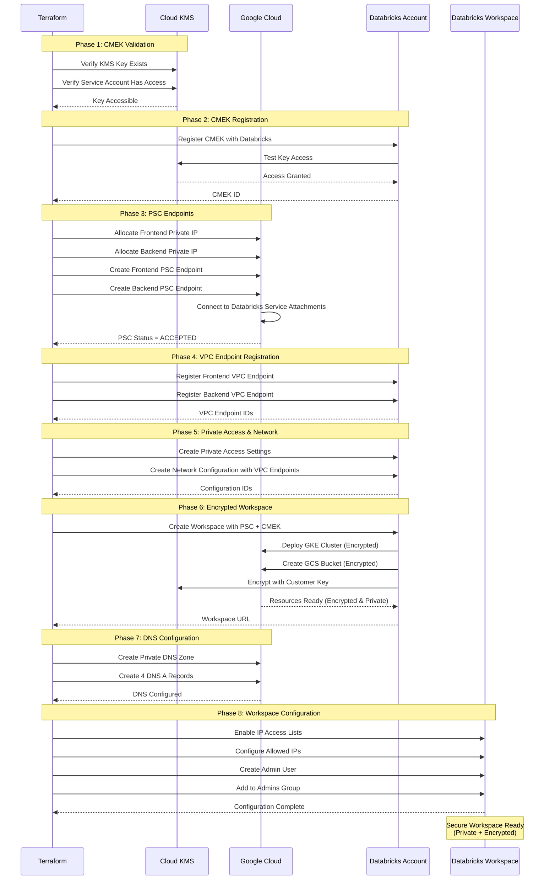

# Databricks Workspace with BYOVPC + Private Service Connect + CMEK

A Terraform configuration for deploying the **most secure** Databricks workspace on Google Cloud Platform (GCP) featuring customer-managed VPC, Private Service Connect for private connectivity, and Customer-Managed Encryption Keys for data encryption.

## Table of Contents

- [Architecture Overview](#architecture-overview)
- [Prerequisites](#prerequisites)
- [Security Features](#security-features)
- [Provider Configuration](#provider-configuration)
- [GCP Infrastructure Requirements](#gcp-infrastructure-requirements)
- [Databricks Resources](#databricks-resources)
- [DNS Configuration](#dns-configuration)
- [Deployment Flow](#deployment-flow)
- [Configuration](#configuration)
- [Deployment](#deployment)
- [Outputs](#outputs)
- [Troubleshooting](#troubleshooting)

---

## Architecture Overview

This deployment creates the **most secure Databricks workspace** configuration with:

- ✅ **Customer-Managed VPC (BYOVPC)** with custom subnets
- ✅ **Private Service Connect (PSC)** for fully private connectivity
- ✅ **Customer-Managed Encryption Keys (CMEK)** using Google Cloud KMS
- ✅ **Private DNS** for workspace domain resolution
- ✅ **No Public Internet Access** to control plane (optional)
- ✅ **Encrypted Storage** for DBFS and system storage
- ✅ **Encrypted Notebooks** in control plane
- ✅ **IP Access Lists** for additional security layer
- ✅ **Workspace Admin Assignment** for initial user

> **Important**: This configuration requires **both PSC and CMEK** to be enabled for your Databricks account. Contact Databricks support to enable these features.

### Architecture Diagram

```mermaid
graph TB
    subgraph "GCP Project - Host/Shared VPC"
        subgraph "Customer VPC"
            SUBNET[Node Subnet<br/>Databricks Clusters]
            PSC_SUBNET[PSC Subnet<br/>Private Endpoints]
            
            subgraph "Private Service Connect"
                FE_EP[Frontend PSC Endpoint<br/>Workspace UI & REST API]
                BE_EP[Backend PSC Endpoint<br/>Cluster Relay]
                FE_IP[Frontend Private IP]
                BE_IP[Backend Private IP]
            end
            
            subgraph "Cloud DNS"
                DNS_ZONE[Private DNS Zone<br/>gcp.databricks.com]
                A_REC[4 A Records<br/>Workspace URLs]
            end
        end
        
        subgraph "Cloud KMS"
            KEYRING[Key Ring<br/>Customer Key Ring]
            KEY[Crypto Key<br/>CMEK for Databricks]
        end
    end
    
    subgraph "GCP Project - Service/Consumer"
        subgraph "Databricks Managed - Encrypted & Private"
            GKE[GKE Cluster<br/>Encrypted with CMEK]
            GCS[GCS Buckets<br/>Encrypted with CMEK]
            DISK[Persistent Disks<br/>Encrypted with CMEK]
        end
    end
    
    subgraph "Databricks Control Plane - Private"
        FE_SA[Frontend Service Attachment]
        BE_SA[Backend Service Attachment]
    end
    
    subgraph "Users"
        USER[Users via VPN<br/>Private Access Only]
    end
    
    KEYRING --> KEY
    KEY -.Encrypts.-> GCS
    KEY -.Encrypts.-> DISK
    KEY -.Encrypts.-> GKE
    
    SUBNET --> FE_EP
    SUBNET --> BE_EP
    FE_EP --> FE_IP
    BE_EP --> BE_IP
    FE_IP -.PSC.-> FE_SA
    BE_IP -.PSC.-> BE_SA
    
    FE_SA --> GKE
    BE_SA --> GKE
    GKE --> SUBNET
    SUBNET --> GCS
    
    DNS_ZONE --> A_REC
    A_REC --> FE_IP
    A_REC --> BE_IP
    
    USER -.DNS.-> DNS_ZONE
    USER -.Private.-> FE_EP
    
    style FE_SA fill:"#FF3621",color:"#fff"
    style BE_SA fill:"#FF3621",color:"#fff"
    style KEY fill:"#FBBC04",color:"#000"
    style GCS fill:"#4285F4",color:"#fff"
    style GKE fill:"#4285F4",color:"#fff"
    style DNS_ZONE fill:"#34A853",color:"#fff"
```

### What This Configuration Does

1. **Registers Pre-Created CMEK**: Links your KMS key to Databricks account
2. **Creates PSC Endpoints**: Establishes private connections to Databricks
3. **Registers VPC Endpoints**: Configures PSC endpoints with Databricks
4. **Creates Private Access Settings**: Enables PSC-based connectivity
5. **Provisions Encrypted Workspace**: Deploys workspace with CMEK and PSC
6. **Configures Private DNS**: Sets up DNS for private workspace access
7. **Enables IP Access Lists**: Adds IP-based access control
8. **Assigns Admin User**: Grants initial workspace access

### What This Configuration Does NOT Do

This configuration does **NOT** include:

- ❌ KMS key creation (assumes key already exists - use `../byovpc-cmek-ws/` for reference)
- ❌ Unity Catalog setup
- ❌ VPC creation (assumes VPC already exists)
- ❌ Subnet creation (assumes subnets already exist)
- ❌ Firewall rules configuration

For these features, see:
- **KMS Key Creation**: `../byovpc-cmek-ws/`
- **End-to-End with Unity Catalog**: `../end2end/`
- **Infrastructure Creation**: `../infra4db/`
- **PSC Only (no CMEK)**: `../byovpc-psc-ws/`

---

## Prerequisites

### 1. Databricks Account Requirements

- **Databricks Account on GCP** (Enterprise Edition)
- **PSC Feature Enabled**: Contact Databricks to enable Private Service Connect
- **CMEK Feature Enabled**: Contact Databricks to enable Customer-Managed Keys
- **Account Console Access** at `https://accounts.gcp.databricks.com`
- **Google Service Account** with admin privileges:
  - Must be added to Databricks Account Console with **Account Admin** role
  - Service account email (e.g., `automation-sa@project.iam.gserviceaccount.com`)

> **Critical**: You must request **both PSC and CMEK** enablement for your account before proceeding.

### 2. GCP Requirements

#### Pre-Created KMS Key

This configuration **requires a pre-existing KMS key**. Create one first using `../byovpc-cmek-ws/` or manually:

```bash
# Create key ring
gcloud kms keyrings create databricks-keyring \
  --location=us-central1 \
  --project=my-project

# Create crypto key
gcloud kms keys create databricks-key \
  --keyring=databricks-keyring \
  --location=us-central1 \
  --purpose=encryption \
  --rotation-period=31536000s \
  --project=my-project
```

**Key Requirements:**
- Must be in same region as workspace
- Purpose: `ENCRYPT_DECRYPT`
- Rotation period: Recommended 90-365 days
- Service account must have `cloudkms.cryptoKeyEncrypterDecrypter` role

#### Existing VPC Infrastructure

This configuration requires a **pre-existing VPC** with appropriate subnets:

**Required Subnets:**
1. **Node Subnet**: For Databricks cluster nodes
   - Minimum `/24` CIDR (251 usable IPs)
   - Secondary IP ranges for GKE pods/services
   - Internet connectivity via Cloud NAT

2. **PSC Subnet**: For Private Service Connect endpoints
   - Minimum `/28` CIDR (11 usable IPs)
   - Used for frontend and backend PSC endpoint IPs
   - Must be in the same VPC as node subnet

To create this infrastructure, use `../infra4db/` first.

#### GCP Service Account Permissions

The service account needs these IAM roles:

**On Service/Consumer Project**:
- `roles/compute.networkAdmin`
- `roles/iam.serviceAccountAdmin`
- `roles/resourcemanager.projectIamAdmin`
- `roles/storage.admin`
- `roles/cloudkms.cryptoKeyEncrypterDecrypter`

**On Host/Shared VPC Project**:
- `roles/compute.networkUser`
- `roles/compute.securityAdmin`
- `roles/dns.admin`
- `roles/cloudkms.viewer`

#### PSC Service Attachments

You need the Databricks PSC service attachment URIs for your region:

**Format:**
```
Frontend: projects/prod-gcp-<region>/regions/<region>/serviceAttachments/plproxy-psc-endpoint-all-ports
Backend: projects/prod-gcp-<region>/regions/<region>/serviceAttachments/ngrok-psc-endpoint
```

**Find Service Attachments**: [Databricks Supported Regions - PSC](https://docs.gcp.databricks.com/resources/supported-regions.html#psc)

### 3. Local Requirements

- **Terraform** >= 1.0
- **Google Cloud SDK** (`gcloud` CLI) configured
- **Service Account Authentication** configured
- **VPN or Cloud Interconnect** for private network access

### 4. Network Requirements

Since the workspace uses private connectivity:

- **VPN or Cloud Interconnect** to access workspace UI
- **Corporate network** with routes to your VPC private subnets
- **DNS forwarding** from corporate DNS to Cloud DNS (optional but recommended)
- **Firewall rules** allowing traffic from your network to PSC endpoints

---

## Security Features

This configuration provides **defense-in-depth** security:

### Layer 1: Network Isolation (PSC)

**Private Service Connect** ensures all traffic remains private:

| Traffic Type | Path | Benefit |
|--------------|------|---------|
| User → Workspace UI | User → VPN → PSC Frontend → Databricks | No public exposure |
| Clusters → Control Plane | Clusters → PSC Backend → Databricks | Private relay |
| Clusters → DBFS | Clusters → VPC → GCS | Private storage access |

### Layer 2: Encryption at Rest (CMEK)

**Customer-Managed Keys** encrypt all data:

| Data Type | Encryption | Key Location |
|-----------|------------|--------------|
| DBFS Storage | CMEK | Your Cloud KMS |
| Notebook State | CMEK | Your Cloud KMS |
| Cluster Disks | CMEK | Your Cloud KMS |
| System Logs | CMEK | Your Cloud KMS |

**Benefits:**
- You control the encryption keys
- Audit key usage via Cloud Audit Logs
- Revoke access by disabling keys
- Compliance with regulatory requirements

### Layer 3: Access Control

**Multiple access control mechanisms:**

1. **Private Access Settings**:
   - `public_access_enabled = false`: No public internet access
   - `private_access_level = "ACCOUNT"`: Only registered VPC endpoints

2. **IP Access Lists**:
   - Configured IP ranges in `workspace.auto.tfvars`
   - Allow specific corporate IPs
   - Block unauthorized access

3. **IAM & RBAC**:
   - Workspace admin group
   - User authentication via identity provider
   - Service account for Terraform automation

### Layer 4: DNS Security

**Private DNS Zone** prevents DNS leakage:

- Workspace domains resolve to private IPs only
- No public DNS records
- Requires VPN for DNS resolution
- Prevents external reconnaissance

### Combined Security Benefits

```mermaid
graph LR
    A[User Access Attempt] --> B{On Corporate VPN?}
    B -->|No| C[Access Denied - No Route]
    B -->|Yes| D{IP in Allow List?}
    D -->|No| E[Access Denied - IP Block]
    D -->|Yes| F{DNS Resolves?}
    F -->|No| G[Access Denied - No DNS]
    F -->|Yes| H{PSC Connected?}
    H -->|No| I[Access Denied - Network]
    H -->|Yes| J{Databricks Auth?}
    J -->|No| K[Access Denied - Auth]
    J -->|Yes| L[Access Granted]
    
    L --> M[Data Encrypted with CMEK]
    
    style L fill:"#34A853",color:"#fff"
    style M fill:"#FBBC04",color:"#000"
    style C fill:"#EA4335",color:"#fff"
    style E fill:"#EA4335",color:"#fff"
    style G fill:"#EA4335",color:"#fff"
    style I fill:"#EA4335",color:"#fff"
    style K fill:"#EA4335",color:"#fff"
```

---

## Authentication Setup

### Option 1: Service Account Impersonation (Recommended)

```bash
# Set the service account to impersonate
gcloud config set auth/impersonate_service_account automation-sa@project.iam.gserviceaccount.com

# Generate access token
export GOOGLE_OAUTH_ACCESS_TOKEN=$(gcloud auth print-access-token)
```

### Option 2: Service Account Key File

```bash
# Download service account key
gcloud iam service-accounts keys create ~/sa-key.json \
  --iam-account=automation-sa@project.iam.gserviceaccount.com

# Set environment variable
export GOOGLE_APPLICATION_CREDENTIALS=~/sa-key.json
```

> **Security Best Practice**: Use Option 1 (impersonation) to avoid managing key files.

For detailed authentication guide, see `../sa-impersonation.md`.

---

## Provider Configuration

This deployment uses five Terraform providers:

### 1. Google Provider (Default)

```hcl
provider "google" {
  project = var.google_project_name
  region  = var.google_region
}
```

### 2. Google Provider (VPC Project)

```hcl
provider "google" {
  alias   = "vpc_project"
  project = var.google_shared_vpc_project
  region  = var.google_region
}
```

### 3. Google Beta Provider

Required for PSC endpoint creation:

```hcl
provider "google-beta" {
  project = var.google_shared_vpc_project
  region  = var.google_region
}
```

### 4. Databricks Account Provider

```hcl
provider "databricks" {
  alias                  = "accounts"
  host                   = "https://accounts.gcp.databricks.com"
  google_service_account = var.google_service_account_email
}
```

**Used for:**
- Registering CMEK
- Creating PSC VPC endpoints
- Private access settings
- Workspace creation

### 5. Databricks Workspace Provider

```hcl
provider "databricks" {
  alias                  = "workspace"
  host                   = databricks_mws_workspaces.databricks_workspace.workspace_url
  google_service_account = var.google_service_account_email
}
```

**Used for:**
- IP access lists
- User and group management
- Workspace configurations

---

## GCP Infrastructure Requirements

### 1. VPC Network

- Name: Referenced in `google_vpc_id`
- Project: `google_shared_vpc_project`
- Type: Custom mode

### 2. Node Subnet

- Name: Referenced in `node_subnet`
- Purpose: Databricks cluster nodes
- CIDR: Minimum `/24` (251 IPs)
- Region: Must match workspace region
- Internet access: Via Cloud NAT

### 3. PSC Subnet

- Name: Referenced in `google_pe_subnet`
- Purpose: PSC endpoint private IPs
- CIDR: Minimum `/28` (11 IPs)
- Region: Must match workspace region
- Note: Only 2 IPs needed for frontend/backend endpoints

### 4. KMS Key

- Resource ID format: `projects/{project}/locations/{region}/keyRings/{keyring}/cryptoKeys/{key}`
- Must exist before deployment
- Same region as workspace
- Service account has decrypt/encrypt permissions

### 5. Firewall Rules

Required egress rules from node subnet:

```
# Allow to PSC endpoints
Source: Node subnet
Destination: PSC subnet
Protocols: TCP 443, 6666, 8443-8451

# Allow to GCP APIs (including KMS)
Source: Node subnet
Destination: 0.0.0.0/0
Protocols: TCP 443

# Allow internal cluster communication
Source: Node subnet
Destination: Node subnet
Protocols: TCP/UDP (all ports)
```

---

## Databricks Resources

### 1. CMEK Registration

```hcl
resource "databricks_mws_customer_managed_keys" "this"
```

**Registers:**
- Pre-existing KMS key with Databricks
- Use cases: STORAGE and MANAGED
- Links key to workspace encryption

**Key Attributes:**
- `kms_key_id`: Full KMS key resource ID from variable
- `use_cases`: ["STORAGE", "MANAGED"]
- `lifecycle.ignore_changes = all`: Prevents updates after creation

### 2. PSC Endpoints

#### Frontend PSC Endpoint

```hcl
resource "google_compute_address" "frontend_pe_ip_address"
resource "google_compute_forwarding_rule" "frontend_psc_ep"
```

**Creates:**
- Private IP in PSC subnet
- Forwarding rule to Databricks frontend service attachment
- Connection for REST API and web UI traffic

**Configuration:**
- `target`: Frontend service attachment URI
- `load_balancing_scheme`: Empty (for service attachment)
- `network`: Your VPC
- `subnetwork`: PSC subnet

#### Backend PSC Endpoint

```hcl
resource "google_compute_address" "backend_pe_ip_address"
resource "google_compute_forwarding_rule" "backend_psc_ep"
```

**Creates:**
- Private IP in PSC subnet
- Forwarding rule to Databricks backend service attachment
- Connection for cluster relay traffic (port 6666)

### 3. VPC Endpoint Registration

```hcl
resource "databricks_mws_vpc_endpoint" "workspace_vpce"
resource "databricks_mws_vpc_endpoint" "relay_vpce"
```

**Registers:**
- Frontend PSC endpoint with Databricks (REST API)
- Backend PSC endpoint with Databricks (relay)

**Note:** Must wait for PSC connection status = "ACCEPTED"

### 4. Private Access Settings

```hcl
resource "databricks_mws_private_access_settings" "pas"
```

**Key Configuration:**

```hcl
public_access_enabled = false  # No public access
private_access_level  = "ACCOUNT"  # Any account VPC endpoints
```

**Important:**
- `public_access_enabled` **cannot be changed** after creation
- Set to `false` for fully private workspace
- Set to `true` if you want optional public access with IP lists

**Access Level Options:**

| Level | Meaning |
|-------|---------|
| `ACCOUNT` | Any VPC endpoints registered in your account can access |
| `ENDPOINT` | Only explicitly specified VPC endpoints can access |

### 5. Network Configuration

```hcl
resource "databricks_mws_networks" "databricks_network"
```

**Associates:**
- VPC and subnet
- Frontend VPC endpoint (REST API)
- Backend VPC endpoint (relay)

**Key Attributes:**
```hcl
vpc_endpoints {
  dataplane_relay = [databricks_mws_vpc_endpoint.relay_vpce.vpc_endpoint_id]
  rest_api        = [databricks_mws_vpc_endpoint.workspace_vpce.vpc_endpoint_id]
}
```

### 6. Workspace with PSC and CMEK

```hcl
resource "databricks_mws_workspaces" "databricks_workspace"
```

**Creates:**
- Fully encrypted and private Databricks workspace
- Links to private access settings
- Links to network configuration with PSC
- Links to CMEK for storage encryption
- Links to CMEK for managed services encryption

**Key Attributes:**
- `private_access_settings_id`: PSC configuration
- `network_id`: VPC endpoints
- `storage_customer_managed_key_id`: CMEK for DBFS
- `managed_services_customer_managed_key_id`: CMEK for notebooks

### 7. IP Access Lists

```hcl
resource "databricks_workspace_conf" "this"
resource "databricks_ip_access_list" "this"
```

**Configures:**
- Enables IP access list feature
- Defines allowed IP ranges
- Provides additional access control layer

**Note:** When `public_access_enabled = false`, IP lists don't affect access (already private).

---

## DNS Configuration

### Private DNS Zone

```hcl
resource "google_dns_managed_zone" "databricks-private-zone"
```

**Configuration:**
- Name: `gcp.databricks.com`
- Type: Private
- Visibility: Your VPC

### DNS A Records

Four A records are created automatically via `dns.tf`:

1. **Workspace URL**: `<workspace-id>.gcp.databricks.com` → Frontend IP
2. **Dataplane Prefix**: `dp-<workspace-id>.gcp.databricks.com` → Frontend IP
3. **PSC Auth**: `<region>.psc-auth.gcp.databricks.com` → Frontend IP
4. **Tunnel**: `tunnel.<region>.gcp.databricks.com` → Backend IP

---

## Deployment Flow

### Deployment Sequence



---

## Configuration

### 1. Update Provider Configuration

Edit `providers.auto.tfvars`:

```hcl
# Service Account for authentication
google_service_account_email = "automation-sa@my-service-project.iam.gserviceaccount.com"

# Service/Consumer Project
google_project_name = "my-service-project"

# Host/Shared VPC Project
google_shared_vpc_project = "my-host-project"

# Region (must match KMS key location)
google_region = "us-central1"
```

### 2. Update Workspace Configuration

Edit `workspace.auto.tfvars`:

```hcl
# Databricks Configuration
databricks_account_id = "12345678-1234-1234-1234-123456789abc"
databricks_account_console_url = "https://accounts.gcp.databricks.com"
databricks_workspace_name = "my-secure-workspace"
databricks_admin_user = "admin@mycompany.com"

# Network Configuration
google_vpc_id = "my-vpc-network"
node_subnet = "databricks-node-subnet"
google_pe_subnet = "databricks-psc-subnet"

# PSC Endpoint Names (must be unique)
workspace_pe = "us-c1-frontend-ep"
relay_pe = "us-c1-backend-ep"
workspace_pe_ip_name = "frontend-pe-ip"
relay_pe_ip_name = "backend-pe-ip"

# PSC Service Attachments (region-specific)
# Find yours at: https://docs.gcp.databricks.com/resources/supported-regions.html#psc
workspace_service_attachment = "projects/prod-gcp-us-central1/regions/us-central1/serviceAttachments/plproxy-psc-endpoint-all-ports"
relay_service_attachment = "projects/prod-gcp-us-central1/regions/us-central1/serviceAttachments/ngrok-psc-endpoint"

# CMEK Configuration (pre-created key)
cmek_resource_id = "projects/my-project/locations/us-central1/keyRings/databricks-keyring/cryptoKeys/databricks-key"
```

### 3. Variable Validation Checklist

Before deployment:

- [ ] PSC feature enabled for your Databricks account
- [ ] CMEK feature enabled for your Databricks account
- [ ] KMS key exists and is accessible
- [ ] KMS key is in same region as workspace
- [ ] Service account has KMS decrypt/encrypt permissions
- [ ] Service account has required IAM roles (including dns.admin)
- [ ] VPC and subnets exist
- [ ] PSC subnet has available IPs (minimum 2)
- [ ] Correct PSC service attachments for your region
- [ ] VPN or private network access configured
- [ ] DNS forwarding configured (if accessing from corporate network)

---

## Deployment

### Step 1: Authenticate with GCP

```bash
# Option 1: Service Account Impersonation (Recommended)
gcloud config set auth/impersonate_service_account automation-sa@project.iam.gserviceaccount.com
export GOOGLE_OAUTH_ACCESS_TOKEN=$(gcloud auth print-access-token)

# Option 2: Service Account Key
export GOOGLE_APPLICATION_CREDENTIALS=~/sa-key.json
```

### Step 2: Navigate to Directory

```bash
cd gcp/gh-repo/gcp/terraform-scripts/byovpc-psc-cmek-ws
```

### Step 3: Initialize Terraform

```bash
terraform init
```

### Step 4: Review Plan

```bash
terraform plan
```

**Expected Resources (~25-30 resources):**
- 1 CMEK registration
- 2 PSC private IP addresses
- 2 PSC forwarding rules (endpoints)
- 2 Databricks VPC endpoint registrations
- 1 Private access settings
- 1 Network configuration
- 1 Workspace (with CMEK and PSC)
- 1 Private DNS zone
- 4 DNS A records
- 1 Workspace configuration
- 1 IP access list
- 1 Admin user
- 1 Group membership

### Step 5: Apply Configuration

```bash
terraform apply
```

**Deployment Time:** ~18-25 minutes

**Progress:**
1. CMEK registration (~1-2 min)
2. PSC endpoints creation (~2-3 min)
3. VPC endpoint registration (~1 min)
4. Private access settings (~1 min)
5. Workspace creation (~12-15 min)
6. DNS configuration (~1-2 min)
7. User setup (~1 min)

### Step 6: Verify Deployment

```bash
terraform output
```

**Expected Outputs:**
```
front_end_psc_status = "Frontend psc status: ACCEPTED"
backend_end_psc_status = "Backend psc status: ACCEPTED"
workspace_url = "https://12345678901234.1.gcp.databricks.com"
```

> **Important**: Both PSC statuses must be "ACCEPTED"

### Step 7: Verify Encryption

Check KMS key is being used:

```bash
# View key usage logs (requires Cloud Audit Logs)
gcloud logging read "resource.type=cloudkms_cryptokey AND \
  resource.labels.key_ring_id=databricks-keyring AND \
  resource.labels.crypto_key_id=databricks-key" \
  --limit=10 \
  --project=my-project
```

### Step 8: Access Workspace

1. **Connect to VPN** (required for private access)
2. **Verify DNS resolution**:
   ```bash
   nslookup <workspace-id>.gcp.databricks.com
   # Should resolve to frontend private IP
   ```
3. **Navigate to workspace URL**
4. **Log in** with admin user credentials
5. **Create test cluster** to verify connectivity and encryption

---

## Outputs

| Output | Description |
|--------|-------------|
| `workspace_url` | Workspace URL (resolves to private IP) |
| `front_end_psc_status` | Frontend PSC connection status (should be ACCEPTED) |
| `backend_end_psc_status` | Backend PSC connection status (should be ACCEPTED) |
| `service_account` | GCE service account attached to cluster nodes |
| `ingress_firewall_enabled` | IP access list enabled status |
| `ingress_firewall_ip_allowed` | Allowed IP addresses |

---

## Troubleshooting

### Common Issues and Solutions

#### 1. CMEK Not Accessible

**Error:**
```
Error: cannot register customer-managed key: key not accessible
```

**Solution:**

1. Verify key exists and region matches:
   ```bash
   gcloud kms keys describe databricks-key \
     --keyring=databricks-keyring \
     --location=us-central1 \
     --project=my-project
   ```

2. Check service account has decrypt/encrypt permissions:
   ```bash
   gcloud kms keys get-iam-policy databricks-key \
     --keyring=databricks-keyring \
     --location=us-central1 \
     --project=my-project
   ```

3. Grant permissions if missing:
   ```bash
   gcloud kms keys add-iam-policy-binding databricks-key \
     --keyring=databricks-keyring \
     --location=us-central1 \
     --member="serviceAccount:automation-sa@my-project.iam.gserviceaccount.com" \
     --role="roles/cloudkms.cryptoKeyEncrypterDecrypter" \
     --project=my-project
   ```

---

#### 2. PSC Connection Not ACCEPTED

**Error:**
```
Frontend psc status: PENDING
Backend psc status: PENDING
```

**Solution:**

1. Verify service attachments are correct for your region:
   - Check [Databricks Supported Regions](https://docs.gcp.databricks.com/resources/supported-regions.html#psc)

2. Confirm PSC is enabled for your account:
   - Contact Databricks support to verify PSC feature flag

3. Check forwarding rule details:
   ```bash
   gcloud compute forwarding-rules describe frontend-ep \
     --region=us-central1 \
     --project=my-host-project
   ```

4. Wait a few minutes - PSC connections can take time to establish

---

#### 3. DNS Resolution Fails

**Error:**
Workspace URL doesn't resolve from corporate network

**Solution:**

1. Verify DNS zone and records exist:
   ```bash
   gcloud dns managed-zones list --project=my-host-project
   gcloud dns record-sets list --zone=databricks --project=my-host-project
   ```

2. Test resolution from within VPC:
   ```bash
   # From a VM in your VPC
   nslookup <workspace-id>.gcp.databricks.com
   ```

3. Configure DNS forwarding from corporate network:
   - Forward `*.gcp.databricks.com` to Cloud DNS
   - Or use Cloud DNS outbound server policy

4. Alternatively, add static DNS entries on your local machine:
   ```bash
   # /etc/hosts or C:\Windows\System32\drivers\etc\hosts
   10.1.0.5  1234567890123456.1.gcp.databricks.com
   ```

---

#### 4. Workspace Creation Fails - Encryption Error

**Error:**
```
Error: workspace creation failed: unable to encrypt with customer-managed key
```

**Solution:**

This means Databricks cannot use the KMS key for encryption:

1. Verify CMEK registration completed:
   ```bash
   terraform state show databricks_mws_customer_managed_keys.this
   ```

2. Test key encryption manually:
   ```bash
   echo "test data" | gcloud kms encrypt \
     --key=databricks-key \
     --keyring=databricks-keyring \
     --location=us-central1 \
     --plaintext-file=- \
     --ciphertext-file=- \
     --project=my-project | base64
   ```

3. Check Databricks service account has access:
   ```bash
   gcloud kms keys get-iam-policy databricks-key \
     --keyring=databricks-keyring \
     --location=us-central1 \
     --project=my-project
   ```

4. Re-register CMEK:
   ```bash
   terraform apply -target=databricks_mws_customer_managed_keys.this
   ```

---

#### 5. Cannot Access Workspace After Deployment

**Error:**
Connection timeout when accessing workspace URL

**Causes:**
- Not connected to VPN
- DNS not resolving
- IP not in allowlist
- PSC endpoint not working

**Solution:**

1. **Verify VPN connection**:
   ```bash
   # Test connectivity to PSC subnet
   ping <frontend-private-ip>
   ```

2. **Check DNS resolution**:
   ```bash
   nslookup <workspace-id>.gcp.databricks.com
   # Should return frontend private IP, not public IP
   ```

3. **Verify IP allowlist** (if `public_access_enabled = true`):
   ```bash
   curl ifconfig.me
   # Check this IP is in workspace.auto.tfvars ip_addresses list
   ```

4. **Test PSC connectivity**:
   ```bash
   telnet <frontend-private-ip> 443
   ```

5. **Check firewall rules**:
   ```bash
   # Verify your source IP can reach PSC subnet
   gcloud compute firewall-rules list --project=my-host-project
   ```

---

#### 6. Cluster Creation Fails

**Error:**
Clusters fail to start with "Unable to connect to control plane"

**Solution:**

1. Verify backend PSC status:
   ```bash
   terraform output backend_end_psc_status
   # Must be: "Backend psc status: ACCEPTED"
   ```

2. Check tunnel DNS record:
   ```bash
   nslookup tunnel.us-central1.gcp.databricks.com
   # Should resolve to backend private IP
   ```

3. Test backend connectivity:
   ```bash
   telnet <backend-private-ip> 6666
   ```

4. Verify firewall allows TCP 6666:
   ```bash
   gcloud compute firewall-rules list \
     --filter="allowed.ports:6666" \
     --project=my-host-project
   ```

5. Check KMS key is accessible from clusters:
   - Clusters need to encrypt/decrypt data
   - Verify GCE service account has KMS permissions

---

#### 7. Key Disabled - Workspace Inaccessible

**Critical Error:**
Workspace becomes completely inaccessible after disabling KMS key

**Solution:**

**IMMEDIATE ACTION REQUIRED**:

1. **Re-enable the key version** immediately:
   ```bash
   # List key versions
   gcloud kms keys versions list \
     --key=databricks-key \
     --keyring=databricks-keyring \
     --location=us-central1 \
     --project=my-project
   
   # Re-enable the primary version
   gcloud kms keys versions enable <VERSION> \
     --key=databricks-key \
     --keyring=databricks-keyring \
     --location=us-central1 \
     --project=my-project
   ```

2. **Wait 10-15 minutes** for Databricks to detect re-enabled key

3. **Test cluster creation** to verify recovery

**Prevention:**
- **NEVER disable or delete** KMS keys used by active workspaces
- Set up monitoring and alerts for key state changes
- Document key recovery procedures
- Maintain multiple key admins

---

### Debug Commands

```bash
# Check PSC endpoint status
gcloud compute forwarding-rules describe frontend-ep \
  --region=us-central1 --project=my-host-project

gcloud compute forwarding-rules describe backend-ep \
  --region=us-central1 --project=my-host-project

# Verify DNS records
gcloud dns record-sets list --zone=databricks --project=my-host-project

# Test DNS resolution
nslookup <workspace-id>.gcp.databricks.com
nslookup tunnel.us-central1.gcp.databricks.com

# Check KMS key
gcloud kms keys describe databricks-key \
  --keyring=databricks-keyring \
  --location=us-central1 \
  --project=my-project

# View KMS key IAM policy
gcloud kms keys get-iam-policy databricks-key \
  --keyring=databricks-keyring \
  --location=us-central1 \
  --project=my-project

# Check Terraform state
terraform state show databricks_mws_customer_managed_keys.this
terraform state show google_compute_forwarding_rule.frontend_psc_ep
terraform state show google_compute_forwarding_rule.backend_psc_ep

# View all outputs
terraform output -json | jq
```

---

## Cleanup

To destroy all resources:

```bash
terraform destroy
```

**Destruction Order:**
1. IP access lists and workspace config
2. User and group assignments
3. DNS records
4. DNS zone
5. Workspace
6. Network configuration
7. Private access settings
8. VPC endpoint registrations
9. PSC endpoints
10. Private IPs
11. CMEK registration

**Important Notes:**
- The KMS key and key ring will **NOT** be deleted (must be done manually)
- The VPC and subnets are **NOT** destroyed (not created by this config)
- Workspace data will be permanently deleted
- PSC endpoints will be deleted
- DNS records will be removed

**Time:** ~15-20 minutes

---

## Additional Resources

- [Databricks PSC Documentation](https://docs.gcp.databricks.com/administration-guide/cloud-configurations/gcp/private-service-connect.html)
- [Databricks CMEK Documentation](https://docs.gcp.databricks.com/security/keys/customer-managed-keys.html)
- [GCP Private Service Connect](https://cloud.google.com/vpc/docs/private-service-connect)
- [Google Cloud KMS](https://cloud.google.com/kms/docs)
- [Databricks Supported Regions - PSC](https://docs.gcp.databricks.com/resources/supported-regions.html#psc)
- [Cloud DNS Private Zones](https://cloud.google.com/dns/docs/zones#create-private-zone)

---

## Next Steps

After deploying your secure workspace:

1. **Deploy Unity Catalog**: Add data governance
   - See `../uc/` for Unity Catalog setup
   - See `../end2end/` for complete workspace with Unity Catalog

2. **Implement Security Monitoring**:
   - Enable Cloud Audit Logs for KMS
   - Set up alerts for key usage
   - Monitor PSC connection status
   - Track IP access list violations

3. **Configure Additional Security**:
   - Refine IP access lists for specific IPs
   - Set up cluster policies
   - Enable workspace audit logging
   - Configure data encryption policies

4. **Network Optimization**:
   - Set up DNS forwarding for corporate network
   - Optimize Cloud NAT configuration
   - Implement VPC Service Controls
   - Configure private Google Access

5. **Disaster Recovery**:
   - Document key recovery procedures
   - Test workspace restoration
   - Set up cross-region backups
   - Create runbooks for common issues

---

## Security Best Practices

### 1. Key Management

- ✅ Never disable keys without backup plan
- ✅ Enable automatic key rotation
- ✅ Monitor key usage via Cloud Audit Logs
- ✅ Limit KMS admin access
- ✅ Document key recovery procedures

### 2. Network Security

- ✅ Keep workspace fully private (`public_access_enabled = false`)
- ✅ Use least-privilege IP allowlists
- ✅ Implement VPN with strong authentication
- ✅ Enable VPC Flow Logs
- ✅ Monitor PSC connection health

### 3. Access Control

- ✅ Use service accounts for automation
- ✅ Implement RBAC in workspace
- ✅ Enable MFA for admin users
- ✅ Regular access reviews
- ✅ Audit log monitoring

### 4. Compliance

- ✅ Document security controls
- ✅ Regular security assessments
- ✅ Compliance scanning
- ✅ Incident response procedures
- ✅ Data classification and handling

---

## License

This configuration is provided as a reference implementation for deploying the most secure Databricks workspaces on GCP with Private Service Connect and Customer-Managed Encryption Keys.
