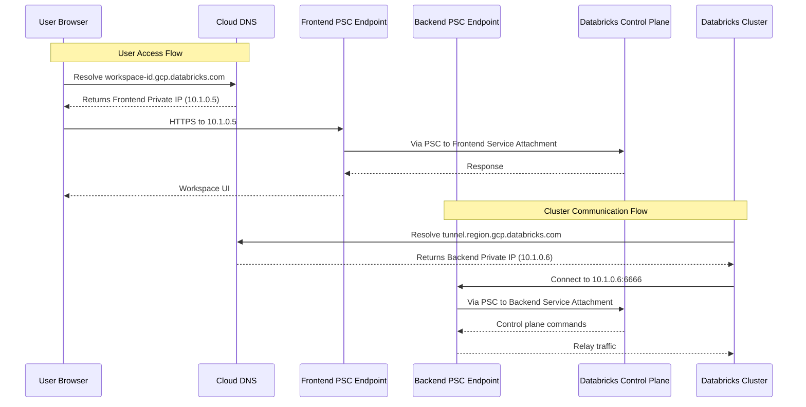
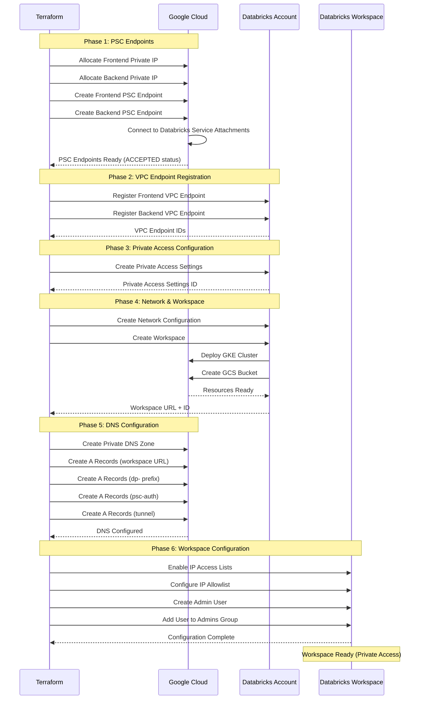

***REMOVED*** Databricks Workspace with BYOVPC + Private Service Connect (PSC)

A Terraform configuration for deploying a secure Databricks workspace on Google Cloud Platform (GCP) using customer-managed VPC with Private Service Connect for private connectivity.

***REMOVED******REMOVED*** Table of Contents

- [Architecture Overview](***REMOVED***architecture-overview)
- [Prerequisites](***REMOVED***prerequisites)
- [Private Service Connect Explained](***REMOVED***private-service-connect-explained)
- [Provider Configuration](***REMOVED***provider-configuration)
- [GCP Infrastructure Requirements](***REMOVED***gcp-infrastructure-requirements)
- [Databricks Resources](***REMOVED***databricks-resources)
- [DNS Configuration](***REMOVED***dns-configuration)
- [Deployment Flow](***REMOVED***deployment-flow)
- [Configuration](***REMOVED***configuration)
- [Deployment](***REMOVED***deployment)
- [Outputs](***REMOVED***outputs)
- [Troubleshooting](***REMOVED***troubleshooting)

---

***REMOVED******REMOVED*** Architecture Overview

This deployment creates a **secure, private Databricks workspace** with:

- ✅ **Customer-Managed VPC (BYOVPC)** with custom subnets
- ✅ **Private Service Connect (PSC)** for private connectivity to Databricks control plane
- ✅ **Private DNS** for workspace domain resolution
- ✅ **No Public Internet Access** required for workspace communication
- ✅ **VPC Endpoints** for both frontend (REST API/UI) and backend (cluster relay) traffic
- ✅ **IP Access Lists** for additional security
- ✅ **Workspace Admin Assignment** for initial user

> **Important**: Private Service Connect (PSC) is a **gated GA feature**. You must enable it for your Databricks account first. Follow [this guide](https://docs.gcp.databricks.com/administration-guide/cloud-configurations/gcp/private-service-connect.html***REMOVED***step-1-enable-your-account-for-private-service-connect).

***REMOVED******REMOVED******REMOVED*** Architecture Diagram

```mermaid
graph TB
    subgraph "GCP Project - Host/Shared VPC"
        subgraph "Customer VPC"
            SUBNET[Node Subnet<br/>Databricks Clusters]
            PSC_SUBNET[PSC Subnet<br/>Private Endpoints]
            
            subgraph "Private Service Connect"
                FE_EP[Frontend PSC Endpoint<br/>Workspace UI & REST API]
                BE_EP[Backend PSC Endpoint<br/>Cluster Relay]
                FE_IP[Frontend Private IP]
                BE_IP[Backend Private IP]
            end
            
            subgraph "Cloud DNS"
                DNS_ZONE[Private DNS Zone<br/>gcp.databricks.com]
                A_REC1[A Record: workspace-id.gcp.databricks.com]
                A_REC2[A Record: dp-workspace-id.gcp.databricks.com]
                A_REC3[A Record: region.psc-auth.gcp.databricks.com]
                A_REC4[A Record: tunnel.region.gcp.databricks.com]
            end
        end
    end
    
    subgraph "GCP Project - Service/Consumer"
        subgraph "Databricks Managed"
            GKE[GKE Cluster<br/>Control Plane Components]
            GCS[GCS Bucket<br/>DBFS Storage]
        end
    end
    
    subgraph "Databricks Control Plane - Private"
        FE_SA[Frontend Service Attachment<br/>plproxy-psc-endpoint]
        BE_SA[Backend Service Attachment<br/>ngrok-psc-endpoint]
    end
    
    subgraph "Users"
        USER[Workspace Users<br/>Via VPN/Private Network]
    end
    
    SUBNET --> FE_EP
    SUBNET --> BE_EP
    FE_EP --> FE_IP
    BE_EP --> BE_IP
    FE_IP -.PSC Connection.-> FE_SA
    BE_IP -.PSC Connection.-> BE_SA
    
    FE_SA --> GKE
    BE_SA --> GKE
    GKE --> SUBNET
    SUBNET --> GCS
    
    DNS_ZONE --> A_REC1
    DNS_ZONE --> A_REC2
    DNS_ZONE --> A_REC3
    DNS_ZONE --> A_REC4
    
    A_REC1 --> FE_IP
    A_REC2 --> FE_IP
    A_REC3 --> FE_IP
    A_REC4 --> BE_IP
    
    USER -.DNS Lookup.-> DNS_ZONE
    USER -.Private Access.-> FE_EP
    
    style FE_SA fill:***REMOVED***FF3621,color:***REMOVED***fff
    style BE_SA fill:***REMOVED***FF3621,color:***REMOVED***fff
    style GCS fill:***REMOVED***4285F4,color:***REMOVED***fff
    style GKE fill:***REMOVED***4285F4,color:***REMOVED***fff
    style DNS_ZONE fill:***REMOVED***FBBC04,color:***REMOVED***000
    style FE_EP fill:***REMOVED***34A853,color:***REMOVED***fff
    style BE_EP fill:***REMOVED***34A853,color:***REMOVED***fff
```

***REMOVED******REMOVED******REMOVED*** What This Configuration Does

1. **Creates PSC Endpoints**: Establishes private connections to Databricks service attachments
2. **Configures VPC Endpoints**: Registers PSC endpoints with Databricks
3. **Sets Up Private Access**: Configures workspace for PSC connectivity
4. **Provisions Workspace**: Deploys workspace with private network configuration
5. **Configures DNS**: Creates private DNS zone with required A records
6. **Assigns Admin User**: Adds specified user to workspace admin group
7. **Enables IP Access Lists**: Configures IP-based access control

***REMOVED******REMOVED******REMOVED*** What This Configuration Does NOT Do

This configuration does **NOT** include:

- ❌ Customer-Managed Encryption Keys (CMEK)
- ❌ Unity Catalog setup
- ❌ VPC creation (assumes VPC already exists)
- ❌ Subnet creation (assumes subnets already exist)
- ❌ Firewall rules configuration

For these features, see:
- **BYOVPC + PSC + CMEK**: `../byovpc-psc-cmek-ws/`
- **End-to-End with Unity Catalog**: `../end2end/`
- **Infrastructure Creation**: `../infra4db/`

---

***REMOVED******REMOVED*** Prerequisites

***REMOVED******REMOVED******REMOVED*** 1. Databricks Account Requirements

- **Databricks Account on GCP** (Enterprise Edition)
- **PSC Feature Enabled**: Contact Databricks to enable Private Service Connect
- **Account Console Access** at `https://accounts.gcp.databricks.com`
- **Google Service Account** with admin privileges:
  - Must be added to Databricks Account Console with **Account Admin** role
  - Service account email (e.g., `automation-sa@project.iam.gserviceaccount.com`)

> **Critical**: You must request PSC enablement for your account. Follow [Step 1 in the PSC documentation](https://docs.gcp.databricks.com/administration-guide/cloud-configurations/gcp/private-service-connect.html***REMOVED***step-1-enable-your-account-for-private-service-connect).

***REMOVED******REMOVED******REMOVED*** 2. GCP Requirements

***REMOVED******REMOVED******REMOVED******REMOVED*** Existing VPC Infrastructure

This configuration requires a **pre-existing VPC** with appropriate subnets:

**Required Subnets:**
1. **Node Subnet**: For Databricks cluster nodes
   - Minimum `/24` CIDR (251 usable IPs)
   - Secondary IP ranges for GKE pods/services
   - Internet connectivity via Cloud NAT

2. **PSC Subnet**: For Private Service Connect endpoints
   - Minimum `/28` CIDR (11 usable IPs)
   - Used for frontend and backend PSC endpoint IPs
   - Must be in the same VPC as node subnet

To create this infrastructure, use `../infra4db/` first.

***REMOVED******REMOVED******REMOVED******REMOVED*** GCP Service Account Permissions

The service account needs these IAM roles:

**On Service/Consumer Project**:
- `roles/compute.networkAdmin`
- `roles/iam.serviceAccountAdmin`
- `roles/resourcemanager.projectIamAdmin`
- `roles/storage.admin`

**On Host/Shared VPC Project**:
- `roles/compute.networkUser`
- `roles/compute.securityAdmin`
- `roles/dns.admin` (for private DNS zone creation)

***REMOVED******REMOVED******REMOVED******REMOVED*** PSC Service Attachments

You need to know the Databricks PSC service attachment URIs for your region. These are provided by Databricks.

**Format:**
```
Frontend: projects/prod-gcp-<region>/regions/<region>/serviceAttachments/plproxy-psc-endpoint-all-ports
Backend: projects/prod-gcp-<region>/regions/<region>/serviceAttachments/ngrok-psc-endpoint
```

**Find Service Attachments**: [Databricks Supported Regions - PSC](https://docs.gcp.databricks.com/resources/supported-regions.html***REMOVED***psc)

***REMOVED******REMOVED******REMOVED*** 3. Local Requirements

- **Terraform** >= 1.0
- **Google Cloud SDK** (`gcloud` CLI) configured
- **Service Account Authentication** configured
- **Network connectivity** to GCP private resources (VPN or Cloud Interconnect)

***REMOVED******REMOVED******REMOVED*** 4. Network Requirements

Since the workspace uses private connectivity, you need:

- **VPN or Cloud Interconnect** to access workspace UI
- **Corporate network** with routes to your VPC private subnets
- **DNS forwarding** from corporate DNS to Cloud DNS (optional but recommended)

---

***REMOVED******REMOVED*** Private Service Connect Explained

***REMOVED******REMOVED******REMOVED*** What is Private Service Connect?

Private Service Connect (PSC) enables private connectivity between your VPC and Databricks services without exposing traffic to the public internet.

***REMOVED******REMOVED******REMOVED*** PSC Components

***REMOVED******REMOVED******REMOVED******REMOVED*** 1. Service Attachments (Databricks Side)

Databricks publishes two service attachments per region:

| Service Attachment | Purpose | Traffic Type |
|-------------------|---------|--------------|
| **plproxy-psc-endpoint** | Frontend endpoint | REST API, Web UI, Notebook access |
| **ngrok-psc-endpoint** | Backend endpoint | Cluster-to-control-plane relay |

***REMOVED******REMOVED******REMOVED******REMOVED*** 2. PSC Endpoints (Your VPC)

You create two PSC endpoints in your VPC:

| Endpoint | Connects To | Private IP Source | DNS Records |
|----------|-------------|-------------------|-------------|
| **Frontend (workspace)** | plproxy service attachment | PSC subnet | 3 A records (workspace URL, dp- prefix, psc-auth) |
| **Backend (relay)** | ngrok service attachment | PSC subnet | 1 A record (tunnel) |

***REMOVED******REMOVED******REMOVED******REMOVED*** 3. Private IP Addresses

Each PSC endpoint gets a private IP from your PSC subnet:

```
Frontend PSC Endpoint IP: 10.1.0.5 (example)
Backend PSC Endpoint IP: 10.1.0.6 (example)
```

***REMOVED******REMOVED******REMOVED******REMOVED*** 4. DNS Resolution

Private DNS zone resolves workspace domains to private IPs:

```
8296020533331897.1.gcp.databricks.com      → 10.1.0.5 (Frontend IP)
dp-8296020533331897.1.gcp.databricks.com   → 10.1.0.5 (Frontend IP)
us-central1.psc-auth.gcp.databricks.com    → 10.1.0.5 (Frontend IP)
tunnel.us-central1.gcp.databricks.com      → 10.1.0.6 (Backend IP)
```

***REMOVED******REMOVED******REMOVED*** Traffic Flows with PSC



***REMOVED******REMOVED******REMOVED*** DNS Record Requirements

For each workspace, you need **4 A records**:

***REMOVED******REMOVED******REMOVED******REMOVED*** Per-Workspace Records (3 Frontend)

1. **Workspace URL**: `<workspace-id>.gcp.databricks.com` → Frontend IP
2. **Dataplane Prefix**: `dp-<workspace-id>.gcp.databricks.com` → Frontend IP
3. **PSC Auth**: `<region>.psc-auth.gcp.databricks.com` → Frontend IP

***REMOVED******REMOVED******REMOVED******REMOVED*** Per-Region Records (1 Backend)

4. **Tunnel**: `tunnel.<region>.gcp.databricks.com` → Backend IP

> **Note**: Per-region records can be shared across multiple workspaces in the same region.

---

***REMOVED******REMOVED*** Provider Configuration

This deployment uses four Terraform providers:

***REMOVED******REMOVED******REMOVED*** 1. Google Provider (Default)

```hcl
provider "google" {
  project = var.google_project_name
  region  = var.google_region
}
```

***REMOVED******REMOVED******REMOVED*** 2. Google Provider (VPC Project)

```hcl
provider "google" {
  alias   = "vpc_project"
  project = var.google_shared_vpc_project
  region  = var.google_region
}
```

***REMOVED******REMOVED******REMOVED*** 3. Google Beta Provider

Required for PSC endpoint creation:

```hcl
provider "google-beta" {
  project = var.google_shared_vpc_project
  region  = var.google_region
}
```

***REMOVED******REMOVED******REMOVED*** 4. Databricks Providers

**Account Provider:**
```hcl
provider "databricks" {
  alias                  = "accounts"
  host                   = "https://accounts.gcp.databricks.com"
  google_service_account = var.google_service_account_email
}
```

**Workspace Provider:**
```hcl
provider "databricks" {
  alias                  = "workspace"
  host                   = databricks_mws_workspaces.databricks_workspace.workspace_url
  google_service_account = var.google_service_account_email
}
```

---

***REMOVED******REMOVED*** GCP Infrastructure Requirements

***REMOVED******REMOVED******REMOVED*** 1. VPC Network

- Name: Referenced in `google_vpc_id`
- Project: `google_shared_vpc_project`
- Type: Custom mode

***REMOVED******REMOVED******REMOVED*** 2. Node Subnet

- Name: Referenced in `node_subnet`
- Purpose: Databricks cluster nodes
- CIDR: Minimum `/24` (251 IPs)
- Region: Must match workspace region
- Internet access: Via Cloud NAT

***REMOVED******REMOVED******REMOVED*** 3. PSC Subnet

- Name: Referenced in `google_pe_subnet`
- Purpose: PSC endpoint private IPs
- CIDR: Minimum `/28` (11 IPs)
- Region: Must match workspace region
- Note: Only 2 IPs needed for frontend/backend endpoints

***REMOVED******REMOVED******REMOVED*** 4. Firewall Rules

Required egress rules from node subnet:

```
***REMOVED*** Allow to PSC endpoints
Source: Node subnet
Destination: PSC subnet
Protocols: TCP 443, 6666, 8443-8451

***REMOVED*** Allow to GCP APIs
Source: Node subnet
Destination: 0.0.0.0/0
Protocols: TCP 443

***REMOVED*** Allow internal cluster communication
Source: Node subnet
Destination: Node subnet
Protocols: TCP/UDP (all ports)
```

---

***REMOVED******REMOVED*** Databricks Resources

***REMOVED******REMOVED******REMOVED*** 1. PSC Endpoints

***REMOVED******REMOVED******REMOVED******REMOVED*** Frontend PSC Endpoint

```hcl
resource "google_compute_forwarding_rule" "frontend_psc_ep"
resource "google_compute_address" "frontend_pe_ip_address"
```

**Purpose**: Private connection to Databricks REST API and web UI

**Configuration:**
- Target: Frontend service attachment
- IP: Allocated from PSC subnet
- Load balancing scheme: Empty (for service attachment)

***REMOVED******REMOVED******REMOVED******REMOVED*** Backend PSC Endpoint

```hcl
resource "google_compute_forwarding_rule" "backend_psc_ep"
resource "google_compute_address" "backend_pe_ip_address"
```

**Purpose**: Private connection for cluster relay traffic

**Configuration:**
- Target: Backend service attachment
- IP: Allocated from PSC subnet
- Port: 6666 (cluster relay)

***REMOVED******REMOVED******REMOVED*** 2. VPC Endpoint Registration

```hcl
resource "databricks_mws_vpc_endpoint" "relay_vpce"
resource "databricks_mws_vpc_endpoint" "workspace_vpce"
```

**Registers PSC endpoints with Databricks account**

***REMOVED******REMOVED******REMOVED*** 3. Private Access Settings

```hcl
resource "databricks_mws_private_access_settings" "pas"
```

**Key Configuration:**

```hcl
public_access_enabled = true  ***REMOVED*** or false for fully private
private_access_level  = "ACCOUNT"  ***REMOVED*** or "ENDPOINT"
```

**Options Explained:**

| Setting | Value | Meaning |
|---------|-------|---------|
| `public_access_enabled` | `true` | Users can access from internet (subject to IP access lists) |
| `public_access_enabled` | `false` | Only private network access allowed |
| `private_access_level` | `ACCOUNT` | Any VPC endpoints in account can access |
| `private_access_level` | `ENDPOINT` | Only specified VPC endpoints can access |

> **Warning**: `public_access_enabled` cannot be changed after creation.

***REMOVED******REMOVED******REMOVED*** 4. Network Configuration

```hcl
resource "databricks_mws_networks" "databricks_network"
```

**Associates:**
- VPC and subnet
- Frontend VPC endpoint (REST API)
- Backend VPC endpoint (dataplane relay)

***REMOVED******REMOVED******REMOVED*** 5. Workspace

```hcl
resource "databricks_mws_workspaces" "databricks_workspace"
```

**Creates:**
- Databricks workspace with PSC configuration
- Links private access settings
- Links network configuration

***REMOVED******REMOVED******REMOVED*** 6. Workspace Configuration

```hcl
resource "databricks_workspace_conf" "this"
resource "databricks_ip_access_list" "this"
```

**Enables:**
- IP access lists for additional security
- Allows specified IP ranges to access workspace

---

***REMOVED******REMOVED*** DNS Configuration

***REMOVED******REMOVED******REMOVED*** Private DNS Zone

```hcl
resource "google_dns_managed_zone" "databricks-private-zone"
```

**Configuration:**
- Name: `gcp.databricks.com`
- Type: Private
- Visibility: Your VPC

***REMOVED******REMOVED******REMOVED*** DNS A Records

Four A records are created automatically:

***REMOVED******REMOVED******REMOVED******REMOVED*** 1. Workspace URL Record

```hcl
resource "google_dns_record_set" "record_set_workspace_url"
```

**Format**: `<workspace-id>.gcp.databricks.com`  
**Points to**: Frontend PSC endpoint IP  
**Purpose**: Main workspace URL

***REMOVED******REMOVED******REMOVED******REMOVED*** 2. Dataplane Prefix Record

```hcl
resource "google_dns_record_set" "record_set_workspace_dp"
```

**Format**: `dp-<workspace-id>.gcp.databricks.com`  
**Points to**: Frontend PSC endpoint IP  
**Purpose**: Dataplane API access

***REMOVED******REMOVED******REMOVED******REMOVED*** 3. PSC Auth Record

```hcl
resource "google_dns_record_set" "record_set_workspace_psc_auth"
```

**Format**: `<region>.psc-auth.gcp.databricks.com`  
**Points to**: Frontend PSC endpoint IP  
**Purpose**: PSC authentication

***REMOVED******REMOVED******REMOVED******REMOVED*** 4. Tunnel Record

```hcl
resource "google_dns_record_set" "record_set_relay"
```

**Format**: `tunnel.<region>.gcp.databricks.com`  
**Points to**: Backend PSC endpoint IP  
**Purpose**: Cluster relay traffic

---

***REMOVED******REMOVED*** Deployment Flow

***REMOVED******REMOVED******REMOVED*** Deployment Sequence



***REMOVED******REMOVED******REMOVED*** Resource Dependencies

```mermaid
graph TD
    A[Start] --> B[Create PSC Private IPs]
    B --> C[Create PSC Endpoints]
    C --> D{PSC Status = ACCEPTED?}
    D -->|Yes| E[Register VPC Endpoints with Databricks]
    D -->|No| C
    E --> F[Create Private Access Settings]
    F --> G[Create Network Configuration]
    G --> H[Create Workspace]
    H --> I[Wait for Workspace Ready]
    I --> J[Create Private DNS Zone]
    J --> K[Create DNS A Records]
    K --> L[Enable IP Access Lists]
    L --> M[Create Admin User]
    M --> N[Workspace Ready]
    
    style A fill:***REMOVED***4285F4,color:***REMOVED***fff
    style N fill:***REMOVED***34A853,color:***REMOVED***fff
    style H fill:***REMOVED***FF3621,color:***REMOVED***fff
    style D fill:***REMOVED***FBBC04,color:***REMOVED***000
```

---

***REMOVED******REMOVED*** Configuration

***REMOVED******REMOVED******REMOVED*** 1. Update Provider Configuration

Edit `providers.auto.tfvars`:

```hcl
***REMOVED*** Service Account for authentication
google_service_account_email = "automation-sa@my-service-project.iam.gserviceaccount.com"

***REMOVED*** Service/Consumer Project
google_project_name = "my-service-project"

***REMOVED*** Host/Shared VPC Project
google_shared_vpc_project = "my-host-project"

***REMOVED*** Region
google_region = "us-central1"
```

***REMOVED******REMOVED******REMOVED*** 2. Update Workspace Configuration

Edit `workspace.auto.tfvars`:

```hcl
***REMOVED*** Databricks Configuration
databricks_account_id = "12345678-1234-1234-1234-123456789abc"
databricks_account_console_url = "https://accounts.gcp.databricks.com"
databricks_workspace_name = "my-psc-workspace"
databricks_admin_user = "admin@mycompany.com"

***REMOVED*** Network Configuration
google_vpc_id = "my-vpc-network"
node_subnet = "databricks-node-subnet"
google_pe_subnet = "databricks-psc-subnet"

***REMOVED*** PSC Endpoint Names (must be unique)
workspace_pe = "us-c1-frontend-ep"
relay_pe = "us-c1-backend-ep"

***REMOVED*** PSC Private IP Names
workspace_pe_ip_name = "frontend-pe-ip"
relay_pe_ip_name = "backend-pe-ip"

***REMOVED*** PSC Service Attachments (region-specific)
***REMOVED*** Find yours at: https://docs.gcp.databricks.com/resources/supported-regions.html***REMOVED***psc
workspace_service_attachment = "projects/prod-gcp-us-central1/regions/us-central1/serviceAttachments/plproxy-psc-endpoint-all-ports"
relay_service_attachment = "projects/prod-gcp-us-central1/regions/us-central1/serviceAttachments/ngrok-psc-endpoint"

***REMOVED*** DNS Configuration
private_zone_name = "databricks"
dns_name = "gcp.databricks.com."  ***REMOVED*** Trailing dot required
```

***REMOVED******REMOVED******REMOVED*** 3. Variable Validation Checklist

Before deployment:

- [ ] PSC feature enabled for your Databricks account
- [ ] Service account has required IAM roles (including `dns.admin`)
- [ ] VPC and subnets exist
- [ ] PSC subnet has available IPs (minimum 2)
- [ ] Correct PSC service attachments for your region
- [ ] VPN or private network access configured
- [ ] DNS forwarding configured (if accessing from corporate network)

---

***REMOVED******REMOVED*** Deployment

***REMOVED******REMOVED******REMOVED*** Step 1: Authenticate

```bash
gcloud config set auth/impersonate_service_account automation-sa@project.iam.gserviceaccount.com
export GOOGLE_OAUTH_ACCESS_TOKEN=$(gcloud auth print-access-token)
```

***REMOVED******REMOVED******REMOVED*** Step 2: Initialize Terraform

```bash
cd gcp/gh-repo/gcp/terraform-scripts/byovpc-psc-ws
terraform init
```

***REMOVED******REMOVED******REMOVED*** Step 3: Review Plan

```bash
terraform plan
```

**Expected Resources (~20-25 resources):**
- 2 PSC private IP addresses
- 2 PSC forwarding rules (endpoints)
- 2 Databricks VPC endpoint registrations
- 1 Private access settings
- 1 Network configuration
- 1 Workspace
- 1 Private DNS zone
- 4 DNS A records
- 1 Workspace configuration
- 1 IP access list
- 1 Admin user
- 1 Group membership

***REMOVED******REMOVED******REMOVED*** Step 4: Apply Configuration

```bash
terraform apply
```

**Deployment Time:** ~15-20 minutes

**Progress:**
1. PSC endpoints creation (~2-3 min)
2. VPC endpoint registration (~1 min)
3. Workspace creation (~10-12 min)
4. DNS configuration (~1-2 min)
5. User setup (~1 min)

***REMOVED******REMOVED******REMOVED*** Step 5: Verify PSC Connection

```bash
terraform output
```

**Check PSC status:**
```
Frontend psc status: ACCEPTED
Backend psc status: ACCEPTED
```

> **Important**: If status is not "ACCEPTED", PSC connection failed. Check service attachment URIs.

***REMOVED******REMOVED******REMOVED*** Step 6: Access Workspace

1. Ensure you're connected via VPN or private network
2. Navigate to workspace URL from output
3. Verify DNS resolves to private IP:
   ```bash
   nslookup <workspace-id>.gcp.databricks.com
   ```
4. Log in with admin user
5. Create test cluster to verify connectivity

---

***REMOVED******REMOVED*** Outputs

| Output | Description |
|--------|-------------|
| `workspace_url` | Workspace URL (resolves to private IP) |
| `front_end_psc_status` | Frontend PSC connection status (should be ACCEPTED) |
| `backend_end_psc_status` | Backend PSC connection status (should be ACCEPTED) |
| `extracted_value` | Workspace ID extracted from URL |
| `ingress_firewall_enabled` | IP access list enabled status |
| `ingress_firewall_ip_allowed` | Allowed IP addresses |

---

***REMOVED******REMOVED*** Troubleshooting

***REMOVED******REMOVED******REMOVED*** 1. PSC Connection Status Not ACCEPTED

**Error:**
```
Frontend psc status: PENDING
Backend psc status: PENDING
```

**Causes:**
- Incorrect service attachment URI
- PSC not enabled for account
- Wrong region in service attachment

**Solution:**

1. Verify service attachments:
   ```bash
   gcloud compute forwarding-rules describe frontend-ep \
     --region=us-central1 \
     --project=my-host-project
   ```

2. Check Databricks documentation for correct URIs:
   - [Supported Regions - PSC](https://docs.gcp.databricks.com/resources/supported-regions.html***REMOVED***psc)

3. Verify PSC is enabled for your account with Databricks support

---

***REMOVED******REMOVED******REMOVED*** 2. DNS Resolution Fails

**Error:**
Workspace URL doesn't resolve or resolves to public IP

**Solution:**

1. Verify DNS zone exists:
   ```bash
   gcloud dns managed-zones list --project=my-host-project
   ```

2. Check A records:
   ```bash
   gcloud dns record-sets list \
     --zone=databricks \
     --project=my-host-project
   ```

3. Test DNS resolution from within VPC:
   ```bash
   nslookup <workspace-id>.gcp.databricks.com
   ```

4. If accessing from corporate network, configure DNS forwarding:
   - Forward `*.gcp.databricks.com` to Cloud DNS IP
   - Or use Cloud DNS forwarding zones

---

***REMOVED******REMOVED******REMOVED*** 3. Cannot Access Workspace UI

**Error:**
Workspace URL times out or connection refused

**Causes:**
- No VPN/private connectivity
- DNS not resolving to private IP
- Firewall blocking traffic
- IP not in allowlist

**Solution:**

1. Verify you're on private network:
   ```bash
   ***REMOVED*** Should show private IP
   ping <workspace-id>.gcp.databricks.com
   ```

2. Check IP access list includes your IP:
   ```bash
   curl ifconfig.me
   ***REMOVED*** Verify this IP is in workspace.auto.tfvars ip_addresses list
   ```

3. Test PSC endpoint connectivity:
   ```bash
   telnet <frontend-private-ip> 443
   ```

4. Check firewall rules allow traffic from your source IP

---

***REMOVED******REMOVED******REMOVED*** 4. Cluster Creation Fails

**Error:**
Clusters fail to start with "Unable to connect to control plane"

**Causes:**
- Backend PSC endpoint not working
- Tunnel DNS record incorrect
- Firewall blocking port 6666

**Solution:**

1. Verify backend PSC status:
   ```bash
   terraform output backend_end_psc_status
   ```

2. Check tunnel DNS record:
   ```bash
   nslookup tunnel.us-central1.gcp.databricks.com
   ***REMOVED*** Should resolve to backend private IP
   ```

3. Test backend connectivity from node subnet:
   ```bash
   telnet <backend-private-ip> 6666
   ```

4. Verify firewall allows TCP 6666 from node subnet to PSC subnet

---

***REMOVED******REMOVED******REMOVED*** 5. Insufficient PSC Subnet IPs

**Error:**
```
Error: Not enough IP addresses available in subnet
```

**Solution:**

You only need 2 IPs for frontend and backend endpoints. If this fails:

1. Check PSC subnet has available IPs:
   ```bash
   gcloud compute networks subnets describe psc-subnet \
     --region=us-central1 \
     --project=my-host-project
   ```

2. Expand PSC subnet CIDR if needed:
   ```bash
   gcloud compute networks subnets expand-ip-range psc-subnet \
     --region=us-central1 \
     --prefix-length=28 \
     --project=my-host-project
   ```

---

***REMOVED******REMOVED******REMOVED*** 6. IP Access List Blocks Admin

**Error:**
Admin user cannot log in after workspace creation

**Solution:**

1. Check your current IP:
   ```bash
   curl ifconfig.me
   ```

2. Update `workspace.auto.tfvars`:
   ```hcl
   ip_addresses = [
     "YOUR.CURRENT.IP/32",
     "0.0.0.0/0"  ***REMOVED*** Temporary allow all
   ]
   ```

3. Re-apply:
   ```bash
   terraform apply -target=databricks_ip_access_list.this
   ```

4. After access restored, update with proper IP ranges

---

***REMOVED******REMOVED******REMOVED*** Debug Commands

```bash
***REMOVED*** Check PSC endpoint status
gcloud compute forwarding-rules describe frontend-ep \
  --region=us-central1 --project=my-host-project

***REMOVED*** Verify DNS records
gcloud dns record-sets list --zone=databricks --project=my-host-project

***REMOVED*** Test DNS resolution
nslookup <workspace-id>.gcp.databricks.com

***REMOVED*** Check PSC connection from Terraform
terraform state show google_compute_forwarding_rule.frontend_psc_ep
terraform state show google_compute_forwarding_rule.backend_psc_ep

***REMOVED*** View all outputs
terraform output -json | jq
```

---

***REMOVED******REMOVED*** Cleanup

To destroy all resources:

```bash
terraform destroy
```

**Destruction Order:**
1. DNS records
2. DNS zone
3. Workspace configuration
4. Workspace
5. Network configuration
6. Private access settings
7. VPC endpoints
8. PSC endpoints
9. Private IPs

**Time:** ~10-15 minutes

---

***REMOVED******REMOVED*** Additional Resources

- [Databricks PSC Documentation](https://docs.gcp.databricks.com/administration-guide/cloud-configurations/gcp/private-service-connect.html)
- [Databricks Supported Regions - PSC](https://docs.gcp.databricks.com/resources/supported-regions.html***REMOVED***psc)
- [GCP Private Service Connect](https://cloud.google.com/vpc/docs/private-service-connect)
- [Cloud DNS Private Zones](https://cloud.google.com/dns/docs/zones***REMOVED***create-private-zone)
- [Databricks Terraform Provider](https://registry.terraform.io/providers/databricks/databricks/latest/docs)

---

***REMOVED******REMOVED*** Next Steps

After deploying your PSC-enabled workspace:

1. **Add CMEK**: Enable customer-managed encryption keys
   - See `../byovpc-psc-cmek-ws/` for PSC + CMEK configuration

2. **Deploy Unity Catalog**: Add data governance
   - See `../uc/` for Unity Catalog setup
   - See `../end2end/` for complete workspace with Unity Catalog

3. **Configure Additional Security**:
   - Refine IP access lists
   - Set up cluster policies
   - Enable audit logging
   - Configure data encryption

4. **Network Optimization**:
   - Set up DNS forwarding for corporate network
   - Configure Cloud NAT for egress
   - Implement VPC Service Controls

---

***REMOVED******REMOVED*** License

This configuration is provided as a reference implementation for deploying Databricks workspaces with Private Service Connect on GCP.

