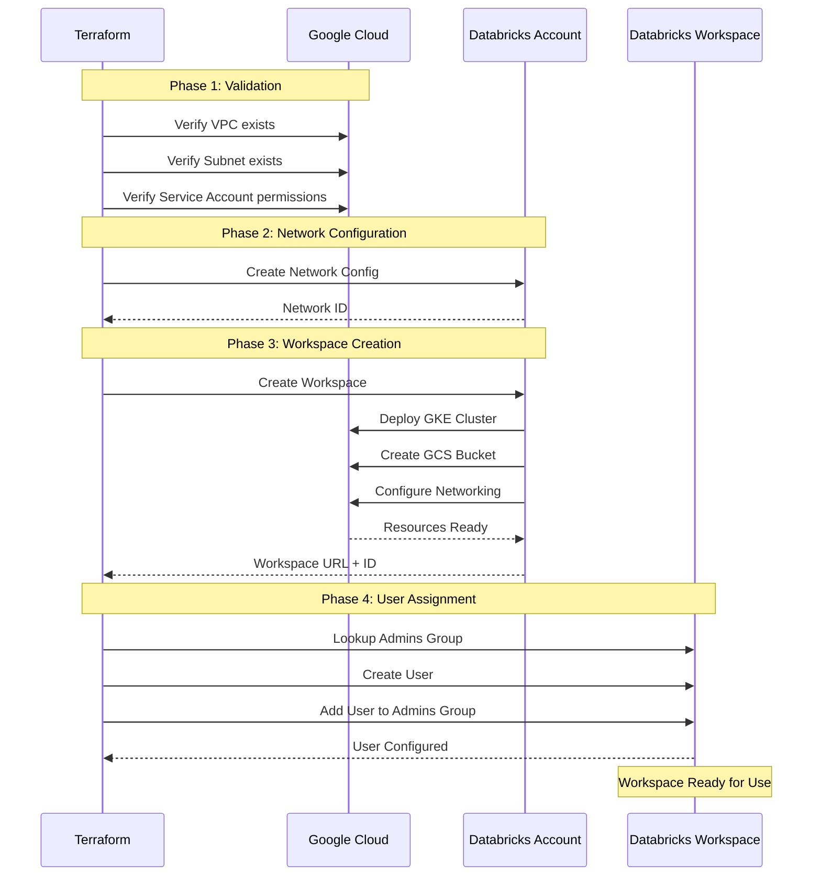

***REMOVED*** Databricks Workspace with BYOVPC (Bring Your Own VPC)

A Terraform configuration for deploying a basic Databricks workspace on Google Cloud Platform (GCP) using a customer-managed VPC.

***REMOVED******REMOVED*** Table of Contents

- [Architecture Overview](***REMOVED***architecture-overview)
- [Prerequisites](***REMOVED***prerequisites)
- [Provider Configuration](***REMOVED***provider-configuration)
- [GCP Infrastructure Requirements](***REMOVED***gcp-infrastructure-requirements)
- [Databricks Resources](***REMOVED***databricks-resources)
- [Deployment Flow](***REMOVED***deployment-flow)
- [Configuration](***REMOVED***configuration)
- [Deployment](***REMOVED***deployment)
- [Outputs](***REMOVED***outputs)
- [Troubleshooting](***REMOVED***troubleshooting)

---

***REMOVED******REMOVED*** Architecture Overview

This deployment creates a **basic Databricks workspace** with:

- ✅ **Customer-Managed VPC (BYOVPC)** with custom subnets
- ✅ **Public Internet Access** for workspace and clusters
- ✅ **Workspace Admin Assignment** for initial user
- ✅ **Basic Security Configuration**

***REMOVED******REMOVED******REMOVED*** Architecture Diagram

```mermaid
graph TB
    subgraph "GCP Project - Host/Shared VPC"
        subgraph "Customer VPC"
            SUBNET[Node Subnet<br/>Databricks Clusters]
            NAT[Cloud NAT<br/>Optional]
        end
    end
    
    subgraph "GCP Project - Service/Consumer"
        subgraph "Databricks Managed"
            GKE[GKE Cluster<br/>Control Plane Components]
            GCS[GCS Bucket<br/>DBFS Storage]
        end
    end
    
    subgraph "Databricks Control Plane"
        CONTROL[Databricks Control Plane<br/>accounts.gcp.databricks.com]
    end
    
    subgraph "Users"
        USER[Workspace Users<br/>Web Browser]
    end
    
    SUBNET --> CONTROL
    SUBNET --> GCS
    GKE --> SUBNET
    USER --> CONTROL
    CONTROL --> GKE
    
    style CONTROL fill:***REMOVED***FF3621,color:***REMOVED***fff
    style GCS fill:***REMOVED***4285F4,color:***REMOVED***fff
    style GKE fill:***REMOVED***4285F4,color:***REMOVED***fff
    style SUBNET fill:***REMOVED***34A853,color:***REMOVED***fff
```

***REMOVED******REMOVED******REMOVED*** What This Configuration Does

1. **Creates Network Configuration**: Registers your VPC and subnet with Databricks
2. **Provisions Workspace**: Deploys a Databricks workspace in your GCP project
3. **Assigns Admin User**: Adds specified user to workspace admin group
4. **Grants Access**: Enables the admin user to log in and manage the workspace

***REMOVED******REMOVED******REMOVED*** What This Configuration Does NOT Do

This is a minimal workspace deployment. It does **NOT** include:

- ❌ Private Service Connect (PSC) for private connectivity
- ❌ Customer-Managed Encryption Keys (CMEK)
- ❌ Unity Catalog setup
- ❌ VPC creation (assumes VPC already exists)
- ❌ Subnet creation (assumes subnets already exist)
- ❌ Firewall rules configuration
- ❌ IP Access Lists

For these features, see:
- **BYOVPC + PSC**: `../byovpc-psc-ws/`
- **BYOVPC + CMEK**: `../byovpc-cmek-ws/`
- **BYOVPC + PSC + CMEK**: `../byovpc-psc-cmek-ws/`
- **End-to-End with Unity Catalog**: `../end2end/`
- **Infrastructure Creation**: `../infra4db/`

---

***REMOVED******REMOVED*** Prerequisites

***REMOVED******REMOVED******REMOVED*** 1. Databricks Account Requirements

- **Databricks Account on GCP** (Enterprise Edition recommended)
- **Account Console Access** at `https://accounts.gcp.databricks.com`
- **Google Service Account** with admin privileges:
  - Must be added to Databricks Account Console with **Account Admin** role
  - Service account email (e.g., `automation-sa@project.iam.gserviceaccount.com`)

***REMOVED******REMOVED******REMOVED*** 2. GCP Requirements

***REMOVED******REMOVED******REMOVED******REMOVED*** Existing VPC Infrastructure

This configuration requires a **pre-existing VPC** with appropriate subnets. To create the infrastructure, use `../infra4db/` first.

**Required:**
- VPC network in host/shared VPC project
- Subnet for Databricks nodes with sufficient IP space:
  - Minimum `/24` CIDR recommended (251 usable IPs)
  - Secondary IP ranges for GKE pods and services (auto-created by Databricks)
- Internet connectivity via Cloud Router + Cloud NAT OR Direct Internet Gateway

***REMOVED******REMOVED******REMOVED******REMOVED*** GCP Service Account Permissions

The service account needs these IAM roles on both projects:

**On Service/Consumer Project** (where workspace will be created):
- `roles/compute.networkAdmin`
- `roles/iam.serviceAccountAdmin`
- `roles/resourcemanager.projectIamAdmin`
- `roles/storage.admin`

**On Host/Shared VPC Project** (if using Shared VPC):
- `roles/compute.networkUser`
- `roles/compute.securityAdmin`

For detailed role requirements, see [Databricks Documentation](https://docs.gcp.databricks.com/administration-guide/cloud-configurations/gcp/customer-managed-vpc.html***REMOVED***role-requirements).

***REMOVED******REMOVED******REMOVED******REMOVED*** GCP Projects

You need two project IDs:
1. **Service/Consumer Project** (`google_project_name`): Where Databricks resources will be created
2. **Host/Shared VPC Project** (`google_shared_vpc_project`): Where your VPC network exists

> **Note**: If not using Shared VPC, both values should be the same project ID.

***REMOVED******REMOVED******REMOVED*** 3. Local Requirements

- **Terraform** >= 1.0
- **Google Cloud SDK** (`gcloud` CLI) configured
- **Service Account Authentication** configured (see [Authentication Setup](***REMOVED***authentication-setup))

***REMOVED******REMOVED******REMOVED*** 4. Databricks User

- User email must already exist in your organization's identity provider
- User will be added to the workspace admin group automatically
- Email should be provided in `databricks_admin_user` variable

---

***REMOVED******REMOVED*** Provider Configuration

This deployment uses three Terraform providers:

***REMOVED******REMOVED******REMOVED*** 1. Google Provider (Default)

Manages resources in the **service/consumer project**.

```hcl
provider "google" {
  project = var.google_project_name
  region  = var.google_region
}
```

***REMOVED******REMOVED******REMOVED*** 2. Google Provider (VPC Project Alias)

Manages resources in the **host/shared VPC project**.

```hcl
provider "google" {
  alias   = "vpc_project"
  project = var.google_shared_vpc_project
  region  = var.google_region
}
```

***REMOVED******REMOVED******REMOVED*** 3. Databricks Account Provider

Creates workspace and account-level configurations.

```hcl
provider "databricks" {
  alias                  = "accounts"
  host                   = "https://accounts.gcp.databricks.com"
  google_service_account = var.google_service_account_email
}
```

**Used for:**
- Creating workspace
- Registering network configuration
- Account-level permissions

***REMOVED******REMOVED******REMOVED*** 4. Databricks Workspace Provider

Manages workspace-level configurations after workspace creation.

```hcl
provider "databricks" {
  alias                  = "workspace"
  host                   = databricks_mws_workspaces.databricks_workspace.workspace_url
  google_service_account = var.google_service_account_email
}
```

**Used for:**
- Adding users to workspace
- Workspace admin group management
- Workspace-level configurations

---

***REMOVED******REMOVED*** Authentication Setup

***REMOVED******REMOVED******REMOVED*** Option 1: Service Account Impersonation (Recommended)

```bash
***REMOVED*** Set the service account to impersonate
gcloud config set auth/impersonate_service_account automation-sa@project.iam.gserviceaccount.com

***REMOVED*** Generate access token
export GOOGLE_OAUTH_ACCESS_TOKEN=$(gcloud auth print-access-token)
```

***REMOVED******REMOVED******REMOVED*** Option 2: Service Account Key File

```bash
***REMOVED*** Download service account key
gcloud iam service-accounts keys create ~/sa-key.json \
  --iam-account=automation-sa@project.iam.gserviceaccount.com

***REMOVED*** Set environment variable
export GOOGLE_APPLICATION_CREDENTIALS=~/sa-key.json
```

> **Security Best Practice**: Use Option 1 (impersonation) to avoid managing key files.

For detailed authentication guide, see `../sa-impersonation.md`.

---

***REMOVED******REMOVED*** GCP Infrastructure Requirements

***REMOVED******REMOVED******REMOVED*** VPC and Subnet Requirements

Before deploying the workspace, ensure you have:

***REMOVED******REMOVED******REMOVED******REMOVED*** VPC Network
- Name: Referenced in `google_vpc_id` variable
- Project: Must exist in `google_shared_vpc_project`
- Type: Custom mode (not auto-mode)

***REMOVED******REMOVED******REMOVED******REMOVED*** Node Subnet
- Name: Referenced in `node_subnet` variable
- Purpose: Hosts Databricks cluster nodes (GKE)
- IP Range: 
  - Primary CIDR: Minimum `/24` (251 IPs)
  - Secondary ranges: Auto-created by Databricks for pods/services
- Region: Must match `google_region` variable

***REMOVED******REMOVED******REMOVED******REMOVED*** Network Connectivity Requirements

**Egress (Outbound) - Required:**
- Access to `*.gcp.databricks.com` (control plane)
- Access to `*.googleapis.com` (GCP APIs)
- Access to `*.docker.io`, `*.maven.org`, `*.pypi.org` (package downloads)

**Ingress (Inbound) - Optional:**
- Public internet access for workspace UI (default)
- Can be restricted with Private Service Connect (see `../byovpc-psc-ws/`)

***REMOVED******REMOVED******REMOVED*** Firewall Rules

Minimum required firewall rules (managed separately):

1. **Allow Internal Communication** (within subnet):
   ```
   Source: Node subnet CIDR
   Target: Node subnet CIDR
   Protocols: TCP, UDP, ICMP (all ports)
   ```

2. **Allow Egress to Internet**:
   ```
   Source: Node subnet CIDR
   Target: 0.0.0.0/0
   Protocols: TCP 443, 3306 (HTTPS, external metastore)
   ```

For infrastructure creation including firewall rules, use `../infra4db/`.

---

***REMOVED******REMOVED*** Databricks Resources

***REMOVED******REMOVED******REMOVED*** 1. Network Configuration

```hcl
resource "databricks_mws_networks" "databricks_network"
```

**Creates:**
- Network configuration object in Databricks account
- Associates your VPC and subnet with Databricks
- Enables Databricks to deploy GKE clusters in your subnet

**Key Attributes:**
- `network_name`: Generated with random suffix for uniqueness
- `network_project_id`: Host/shared VPC project
- `vpc_id`: Your VPC name
- `subnet_id`: Your node subnet name
- `subnet_region`: Must match workspace region

***REMOVED******REMOVED******REMOVED*** 2. Workspace

```hcl
resource "databricks_mws_workspaces" "databricks_workspace"
```

**Creates:**
- Databricks workspace in your GCP service project
- GKE cluster for control plane components
- GCS bucket for DBFS storage
- Managed resources in Databricks-managed project

**Key Attributes:**
- `workspace_name`: Display name in Databricks console
- `location`: GCP region for workspace
- `cloud_resource_container.gcp.project_id`: Your service project
- `network_id`: Links to network configuration

**Deployment Time:** ~10-15 minutes

***REMOVED******REMOVED******REMOVED*** 3. User and Admin Assignment

```hcl
resource "databricks_user" "me"
resource "databricks_group_member" "ws_admin_member0"
```

**Creates:**
- User object in workspace
- Membership in `admins` group
- Grants full administrative access

---

***REMOVED******REMOVED*** Deployment Flow

***REMOVED******REMOVED******REMOVED*** Module Dependency Graph

```mermaid
graph TD
    A[Start] --> B[Authenticate with GCP]
    B --> C[Verify Existing VPC & Subnet]
    C --> D[Create Random Suffix]
    D --> E[Create Network Configuration]
    E --> F[Create Databricks Workspace]
    F --> G[Wait for Workspace Provisioning]
    G --> H[Lookup Admins Group]
    H --> I[Create User in Workspace]
    I --> J[Add User to Admins Group]
    J --> K[Workspace Ready]
    
    style A fill:***REMOVED***4285F4,color:***REMOVED***fff
    style K fill:***REMOVED***34A853,color:***REMOVED***fff
    style F fill:***REMOVED***FF3621,color:***REMOVED***fff
    style G fill:***REMOVED***FBBC04,color:***REMOVED***fff
```

***REMOVED******REMOVED******REMOVED*** Deployment Sequence



---

***REMOVED******REMOVED*** Configuration

***REMOVED******REMOVED******REMOVED*** 1. Update Provider Configuration

Edit `providers.auto.tfvars`:

```hcl
***REMOVED*** Service Account for Terraform authentication
google_service_account_email = "automation-sa@my-service-project.iam.gserviceaccount.com"

***REMOVED*** Service/Consumer Project (where workspace will be created)
google_project_name = "my-service-project"

***REMOVED*** Host/Shared VPC Project (where VPC network exists)
***REMOVED*** If not using Shared VPC, use the same value as google_project_name
google_shared_vpc_project = "my-host-project"

***REMOVED*** GCP Region
google_region = "us-central1"
```

***REMOVED******REMOVED******REMOVED*** 2. Update Workspace Configuration

Edit `workspace.auto.tfvars`:

```hcl
***REMOVED*** Databricks Account ID (found in Account Console)
databricks_account_id = "12345678-1234-1234-1234-123456789abc"

***REMOVED*** Databricks Account Console URL
databricks_account_console_url = "https://accounts.gcp.databricks.com"

***REMOVED*** Workspace Name
databricks_workspace_name = "my-databricks-workspace"

***REMOVED*** Admin User Email (must be valid user in your organization)
databricks_admin_user = "admin@mycompany.com"

***REMOVED*** Existing VPC Name
google_vpc_id = "my-vpc-network"

***REMOVED*** Existing Subnet Name
node_subnet = "databricks-node-subnet"
```

***REMOVED******REMOVED******REMOVED*** 3. Variable Validation Checklist

Before deployment, verify:

- [ ] Service account exists and has required IAM roles
- [ ] Service account is added to Databricks Account Console as Account Admin
- [ ] VPC network exists in the host/shared VPC project
- [ ] Node subnet exists with sufficient IP addresses (min /24)
- [ ] Firewall rules allow required egress traffic
- [ ] Admin user email is valid
- [ ] Databricks account ID is correct
- [ ] All project IDs are correct

---

***REMOVED******REMOVED*** Deployment

***REMOVED******REMOVED******REMOVED*** Step 1: Authenticate with GCP

```bash
***REMOVED*** Option 1: Service Account Impersonation (Recommended)
gcloud config set auth/impersonate_service_account automation-sa@project.iam.gserviceaccount.com
export GOOGLE_OAUTH_ACCESS_TOKEN=$(gcloud auth print-access-token)

***REMOVED*** Option 2: Service Account Key
export GOOGLE_APPLICATION_CREDENTIALS=~/sa-key.json
```

***REMOVED******REMOVED******REMOVED*** Step 2: Navigate to Directory

```bash
cd gcp/gh-repo/gcp/terraform-scripts/byovpc-ws
```

***REMOVED******REMOVED******REMOVED*** Step 3: Initialize Terraform

```bash
terraform init
```

**Expected Output:**
```
Initializing provider plugins...
- Installing databricks/databricks...
- Installing hashicorp/google...
- Installing hashicorp/random...
Terraform has been successfully initialized!
```

***REMOVED******REMOVED******REMOVED*** Step 4: Validate Configuration

```bash
terraform validate
```

***REMOVED******REMOVED******REMOVED*** Step 5: Review Plan

```bash
terraform plan
```

**Review the plan carefully:**
- Verify network configuration references correct VPC and subnet
- Check workspace name and region
- Confirm admin user email is correct

**Expected Resources:**
- `random_string.databricks_suffix`
- `databricks_mws_networks.databricks_network`
- `databricks_mws_workspaces.databricks_workspace`
- `databricks_user.me`
- `databricks_group_member.ws_admin_member0`

***REMOVED******REMOVED******REMOVED*** Step 6: Apply Configuration

```bash
terraform apply
```

Type `yes` when prompted.

**Deployment Time:** ~10-15 minutes

**Progress:**
1. Creates network configuration (~1 min)
2. Creates workspace (~8-12 min)
3. Configures admin user (~1-2 min)

***REMOVED******REMOVED******REMOVED*** Step 7: Verify Deployment

```bash
terraform output
```

**Expected Outputs:**
```
workspace_url = "https://12345678901234.1.gcp.databricks.com"
```

***REMOVED******REMOVED******REMOVED*** Step 8: Access Workspace

1. Navigate to the workspace URL from the output
2. Log in with the admin user email
3. Verify you can access the workspace UI
4. Create a test cluster to verify connectivity

---

***REMOVED******REMOVED*** Outputs

After successful deployment, the following outputs are available:

| Output | Description | Example |
|--------|-------------|---------|
| `workspace_url` | URL to access the Databricks workspace | `https://1234567890123456.1.gcp.databricks.com` |

To view outputs:

```bash
terraform output
terraform output workspace_url
terraform output -json
```

---

***REMOVED******REMOVED*** Troubleshooting

***REMOVED******REMOVED******REMOVED*** Common Issues and Solutions

***REMOVED******REMOVED******REMOVED******REMOVED*** 1. Authentication Errors

**Error:**
```
Error: google: could not find default credentials
```

**Solution:**
```bash
***REMOVED*** Verify authentication
gcloud auth list

***REMOVED*** Re-authenticate
gcloud auth application-default login

***REMOVED*** Or set service account impersonation
export GOOGLE_OAUTH_ACCESS_TOKEN=$(gcloud auth print-access-token)
```

---

***REMOVED******REMOVED******REMOVED******REMOVED*** 2. Service Account Not Found in Databricks Account

**Error:**
```
Error: service account not found in Databricks account
```

**Solution:**
1. Log in to [Databricks Account Console](https://accounts.gcp.databricks.com)
2. Go to **Settings** → **Service Principals**
3. Click **Add Service Principal**
4. Add your Google service account email
5. Grant **Account Admin** role

---

***REMOVED******REMOVED******REMOVED******REMOVED*** 3. VPC or Subnet Not Found

**Error:**
```
Error: network not found: databricks-vpc
```

**Solution:**
1. Verify VPC exists in correct project:
   ```bash
   gcloud compute networks list --project=my-host-project
   ```

2. Verify subnet exists:
   ```bash
   gcloud compute networks subnets list \
     --network=databricks-vpc \
     --project=my-host-project
   ```

3. Update variables with correct names:
   ```hcl
   google_vpc_id = "actual-vpc-name"
   node_subnet = "actual-subnet-name"
   ```

---

***REMOVED******REMOVED******REMOVED******REMOVED*** 4. Insufficient Permissions

**Error:**
```
Error: googleapi: Error 403: Permission denied
```

**Solution:**

Verify service account has required roles:

```bash
***REMOVED*** Check service project permissions
gcloud projects get-iam-policy my-service-project \
  --flatten="bindings[].members" \
  --filter="bindings.members:serviceAccount:automation-sa@my-service-project.iam.gserviceaccount.com"

***REMOVED*** Check host project permissions (if using Shared VPC)
gcloud projects get-iam-policy my-host-project \
  --flatten="bindings[].members" \
  --filter="bindings.members:serviceAccount:automation-sa@my-service-project.iam.gserviceaccount.com"
```

Grant missing roles:

```bash
***REMOVED*** On service project
gcloud projects add-iam-policy-binding my-service-project \
  --member="serviceAccount:automation-sa@my-service-project.iam.gserviceaccount.com" \
  --role="roles/compute.networkAdmin"

***REMOVED*** On host project (if using Shared VPC)
gcloud projects add-iam-policy-binding my-host-project \
  --member="serviceAccount:automation-sa@my-service-project.iam.gserviceaccount.com" \
  --role="roles/compute.networkUser"
```

---

***REMOVED******REMOVED******REMOVED******REMOVED*** 5. Workspace Creation Timeout

**Error:**
```
Error: timeout while waiting for workspace to become ready
```

**Solution:**

This can happen if GCP resource quotas are exceeded or there are networking issues.

1. Check workspace status in Account Console:
   - Go to https://accounts.gcp.databricks.com
   - Navigate to Workspaces
   - Check workspace status and error messages

2. Verify GCP quotas:
   ```bash
   gcloud compute project-info describe --project=my-service-project
   ```

3. Check for quota issues:
   - GKE cluster node count
   - IP address availability in subnet
   - Compute Engine API limits

4. If workspace is stuck in provisioning, you may need to:
   ```bash
   ***REMOVED*** Remove from Terraform state
   terraform state rm databricks_mws_workspaces.databricks_workspace
   
   ***REMOVED*** Delete manually in Account Console
   ***REMOVED*** Then re-run terraform apply
   ```

---

***REMOVED******REMOVED******REMOVED******REMOVED*** 6. User Cannot Access Workspace

**Error:**
User sees "Access Denied" when trying to log in to workspace.

**Solution:**

1. Verify user was added to admins group:
   ```bash
   terraform state show databricks_group_member.ws_admin_member0
   ```

2. Check if user exists in workspace:
   - Log in to workspace as another admin
   - Go to **Settings** → **Identity and Access**
   - Verify user is listed and is member of admins group

3. Re-apply user configuration:
   ```bash
   terraform apply -target=databricks_user.me
   terraform apply -target=databricks_group_member.ws_admin_member0
   ```

---

***REMOVED******REMOVED******REMOVED******REMOVED*** 7. Network Configuration Already Exists

**Error:**
```
Error: network configuration with name already exists
```

**Solution:**

The random suffix is not unique. This is rare but can happen.

```bash
***REMOVED*** Force new random suffix
terraform taint random_string.databricks_suffix
terraform apply
```

---

***REMOVED******REMOVED******REMOVED*** Cleanup

To destroy all resources created by this configuration:

```bash
terraform destroy
```

**Warning:** This will:
- Delete the Databricks workspace
- Remove all notebooks, clusters, and data in DBFS
- Delete the GCS bucket (if `force_destroy = true`)
- Remove network configuration

**Before destroying:**
1. Export any important notebooks or data
2. Terminate all running clusters
3. Verify you have backups of critical data

**Note:** The VPC and subnets are NOT destroyed as they were not created by this configuration.

---

***REMOVED******REMOVED*** Additional Resources

- [Databricks GCP Documentation](https://docs.gcp.databricks.com/)
- [Customer-Managed VPC Setup Guide](https://docs.gcp.databricks.com/administration-guide/cloud-configurations/gcp/customer-managed-vpc.html)
- [Databricks Terraform Provider](https://registry.terraform.io/providers/databricks/databricks/latest/docs)
- [GCP Shared VPC Documentation](https://cloud.google.com/vpc/docs/shared-vpc)
- [Service Account Impersonation Guide](../sa-impersonation.md)

---

***REMOVED******REMOVED*** Next Steps

After successfully deploying your basic workspace, consider:

1. **Add Private Service Connect**: Enhance security with private connectivity
   - See `../byovpc-psc-ws/` for PSC-enabled workspace

2. **Enable Customer-Managed Keys**: Add CMEK for encryption
   - See `../byovpc-cmek-ws/` for CMEK-enabled workspace

3. **Deploy Unity Catalog**: Add data governance and catalog management
   - See `../end2end/` for complete workspace with Unity Catalog
   - See `../uc/` for standalone Unity Catalog setup

4. **Configure Cluster Policies**: Control cluster configurations and costs

5. **Set Up IP Access Lists**: Restrict access to specific IP ranges

6. **Enable Audit Logs**: Monitor workspace activity

---

***REMOVED******REMOVED*** Support

For issues or questions:

1. Check the [Troubleshooting](***REMOVED***troubleshooting) section above
2. Review [Databricks GCP Documentation](https://docs.gcp.databricks.com/)
3. Check Terraform plan output for errors
4. Consult GCP logs for infrastructure issues
5. Contact Databricks support for workspace-specific issues

---

***REMOVED******REMOVED*** License

This configuration is provided as a reference implementation for deploying Databricks workspaces on GCP.

