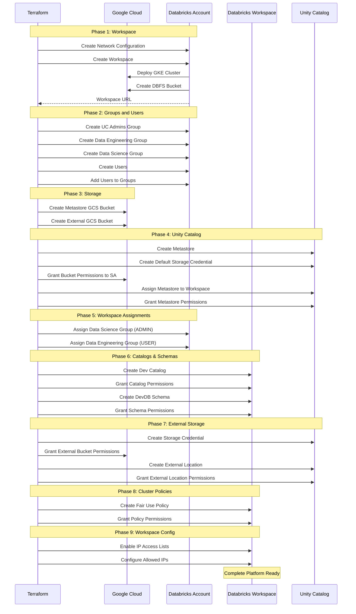

***REMOVED*** Databricks End-to-End Deployment with Unity Catalog

A comprehensive Terraform configuration for deploying a **production-ready Databricks workspace** on Google Cloud Platform (GCP) with Unity Catalog for data governance, external storage locations, cluster policies, and complete user/group management.

***REMOVED******REMOVED*** Table of Contents

- [Architecture Overview](***REMOVED***architecture-overview)
- [Prerequisites](***REMOVED***prerequisites)
- [What's Included](***REMOVED***whats-included)
- [Provider Configuration](***REMOVED***provider-configuration)
- [GCP Infrastructure Requirements](***REMOVED***gcp-infrastructure-requirements)
- [Databricks Resources](***REMOVED***databricks-resources)
- [Unity Catalog Configuration](***REMOVED***unity-catalog-configuration)
- [Deployment Flow](***REMOVED***deployment-flow)
- [Configuration](***REMOVED***configuration)
- [Deployment](***REMOVED***deployment)
- [Post-Deployment](***REMOVED***post-deployment)
- [Outputs](***REMOVED***outputs)
- [Troubleshooting](***REMOVED***troubleshooting)

---

***REMOVED******REMOVED*** Architecture Overview

This deployment creates a **complete, production-ready Databricks platform** with:

- ✅ **Databricks Workspace** with BYOVPC
- ✅ **Unity Catalog Metastore** for data governance
- ✅ **Managed Storage** (default metastore storage)
- ✅ **External Storage** locations with credentials
- ✅ **Catalogs and Schemas** with proper permissions
- ✅ **Account-Level Groups** with workspace assignments
- ✅ **Cluster Policies** with cost controls and tags
- ✅ **User and Group Permissions** across all layers
- ✅ **IP Access Lists** for security
- ✅ **Custom Tags** for cost attribution

> **Note**: This configuration assumes you already have VPC infrastructure. For infrastructure creation, see `../infra4db/`.

***REMOVED******REMOVED******REMOVED*** Architecture Diagram

```mermaid
graph TB
    subgraph "GCP Project - Host/Shared VPC"
        subgraph "Customer VPC"
            SUBNET[Node Subnet<br/>Databricks Clusters]
            NAT[Cloud NAT]
        end
    end
    
    subgraph "GCP Project - Service/Consumer"
        subgraph "Databricks Workspace"
            WS[Workspace<br/>Notebooks & Clusters]
            
            subgraph "Cluster Policies"
                CP1[Fair Use Policy<br/>Max 10 DBU/hr]
                CP2[Auto-termination<br/>20 minutes]
                TAGS[Custom Tags<br/>Team & CostCenter]
            end
        end
        
        subgraph "Unity Catalog"
            META[Metastore<br/>Data Governance]
            
            subgraph "Catalogs"
                MAIN[Main Catalog<br/>Default]
                DEV[Dev Catalog<br/>Development]
            end
            
            subgraph "Schemas"
                DEVDB[DevDB Schema<br/>Dev Database]
            end
        end
        
        subgraph "Storage Accounts"
            GCS_META[GCS Bucket<br/>Metastore Storage]
            GCS_EXT[GCS Bucket<br/>External Location]
        end
        
        subgraph "Storage Credentials"
            CRED1[Default Credentials<br/>Databricks SA]
            CRED2[External Credentials<br/>Databricks SA]
        end
    end
    
    subgraph "Databricks Account"
        subgraph "Groups"
            UC_ADMIN[UC Admins Group]
            GROUP1[Data Engineering Group]
            GROUP2[Data Science Group]
        end
        
        subgraph "Users"
            ADMIN1[Admin User 1]
            ADMIN2[Service Account]
            USER1[Dev User]
            USER2[Data Scientist]
        end
    end
    
    subgraph "Databricks Control Plane"
        CONTROL[Databricks Control Plane<br/>accounts.gcp.databricks.com]
    end
    
    META --> GCS_META
    CRED1 --> GCS_META
    CRED2 --> GCS_EXT
    DEV --> DEVDB
    
    META --> MAIN
    META --> DEV
    
    WS --> META
    WS --> CP1
    CP1 --> CP2
    CP2 --> TAGS
    
    UC_ADMIN --> ADMIN1
    UC_ADMIN --> ADMIN2
    GROUP1 --> USER1
    GROUP2 --> USER2
    
    WS --> GROUP1
    WS --> GROUP2
    
    SUBNET --> CONTROL
    CONTROL --> WS
    
    style META fill:***REMOVED***FF3621,color:***REMOVED***fff
    style UC_ADMIN fill:***REMOVED***FBBC04,color:***REMOVED***000
    style WS fill:***REMOVED***4285F4,color:***REMOVED***fff
    style CP1 fill:***REMOVED***34A853,color:***REMOVED***fff
```

***REMOVED******REMOVED******REMOVED*** What Makes This "End-to-End"?

This configuration provides a **complete Databricks deployment**, not just infrastructure:

| Layer | Components | Purpose |
|-------|------------|---------|
| **Infrastructure** | VPC, Subnets, Workspace | Foundation for compute and storage |
| **Data Governance** | Unity Catalog, Metastore | Centralized metadata and access control |
| **Storage** | Managed + External locations | Organized data storage with credentials |
| **Access Management** | Groups, Users, Permissions | RBAC across all resources |
| **Cost Control** | Cluster policies, Tags | Spend management and attribution |
| **Security** | IP access lists, Firewall | Network and access security |

---

***REMOVED******REMOVED*** Prerequisites

***REMOVED******REMOVED******REMOVED*** 1. Databricks Account Requirements

- **Databricks Account on GCP** (Enterprise Edition for Unity Catalog)
- **Account Console Access** at `https://accounts.gcp.databricks.com`
- **Google Service Account** with admin privileges:
  - Must be added to Databricks Account Console with **Account Admin** role
  - Service account email (e.g., `automation-sa@project.iam.gserviceaccount.com`)
- **Unity Catalog Enabled** for your account

***REMOVED******REMOVED******REMOVED*** 2. GCP Requirements

***REMOVED******REMOVED******REMOVED******REMOVED*** Existing VPC Infrastructure

This configuration requires a **pre-existing VPC**. Use `../infra4db/` to create:

**Required:**
- VPC network in host/shared VPC project
- Subnet for Databricks nodes (minimum `/24` CIDR)
- Internet connectivity via Cloud NAT
- Firewall rules for Databricks traffic

***REMOVED******REMOVED******REMOVED******REMOVED*** GCP Service Account Permissions

**On Service/Consumer Project**:
- `roles/compute.networkAdmin`
- `roles/iam.serviceAccountAdmin`
- `roles/resourcemanager.projectIamAdmin`
- `roles/storage.admin`

**On Host/Shared VPC Project** (if using Shared VPC):
- `roles/compute.networkUser`
- `roles/compute.securityAdmin`

***REMOVED******REMOVED******REMOVED******REMOVED*** GCP Projects

1. **Service/Consumer Project**: Where workspace will be created
2. **Host/Shared VPC Project**: Where VPC network exists

***REMOVED******REMOVED******REMOVED*** 3. Local Requirements

- **Terraform** >= 1.0
- **Google Cloud SDK** configured
- **Service Account Authentication** configured

***REMOVED******REMOVED******REMOVED*** 4. Users

- **Databricks Admin User**: Email for workspace admin
- Will be added to admin groups automatically
- Additional users will be created for demonstration

---

***REMOVED******REMOVED*** What's Included

***REMOVED******REMOVED******REMOVED*** Core Components

***REMOVED******REMOVED******REMOVED******REMOVED*** 1. Databricks Workspace
- Customer-managed VPC deployment
- IP access lists configured
- Workspace admin user assignment
- Public master, private nodes (configurable)

***REMOVED******REMOVED******REMOVED******REMOVED*** 2. Unity Catalog Setup
- **Metastore**: Central metadata repository
- **Default Storage**: GCS bucket for managed tables
- **Storage Credentials**: Databricks-managed service accounts
- **Metastore Assignment**: Links workspace to metastore

***REMOVED******REMOVED******REMOVED******REMOVED*** 3. Account-Level Groups
- **UC Admins Group**: Unity Catalog administrators
- **Data Engineering Group**: For engineering workloads
- **Data Science Group**: For data science workloads

***REMOVED******REMOVED******REMOVED******REMOVED*** 4. Users and Assignments
- **Admin Users**: Added to UC Admins group
- **Service Account**: Added as admin member
- **Demo Users**: Created for testing (auto-generated)
- **Group Memberships**: Automatic assignments

***REMOVED******REMOVED******REMOVED******REMOVED*** 5. Catalogs and Schemas
- **Main Catalog**: Default catalog (auto-created)
- **Dev Catalog**: Development catalog with permissions
- **DevDB Schema**: Development database in dev catalog

***REMOVED******REMOVED******REMOVED******REMOVED*** 6. External Storage
- **External GCS Bucket**: For external tables
- **Storage Credential**: With Databricks SA
- **External Location**: Registered with Unity Catalog
- **Permissions**: Granted to appropriate groups

***REMOVED******REMOVED******REMOVED******REMOVED*** 7. Cluster Policies
- **Fair Use Policy**: DBU limits (max 10 DBU/hour)
- **Auto-termination**: Mandatory 20-minute timeout
- **Custom Tags**: Team and CostCenter tags
- **Group Permissions**: Policy usage rights

***REMOVED******REMOVED******REMOVED******REMOVED*** 8. Workspace Permissions
- **Group-to-Workspace Assignment**: Via `mws_permission_assignment`
- **Admin Group**: Full admin access
- **User Group**: Standard user access
- **Catalog Permissions**: Fine-grained access control

---

***REMOVED******REMOVED*** Provider Configuration

This deployment uses three Terraform providers:

***REMOVED******REMOVED******REMOVED*** 1. Google Provider (Default)

```hcl
provider "google" {
  project = var.google_project_name
  region  = var.google_region
}
```

***REMOVED******REMOVED******REMOVED*** 2. Google Provider (VPC Project)

```hcl
provider "google" {
  alias   = "vpc_project"
  project = var.google_shared_vpc_project
  region  = var.google_region
}
```

***REMOVED******REMOVED******REMOVED*** 3. Databricks Account Provider

```hcl
provider "databricks" {
  alias                  = "accounts"
  host                   = "https://accounts.gcp.databricks.com"
  google_service_account = var.google_service_account_email
}
```

**Used for:**
- Creating workspace
- Creating Unity Catalog metastore
- Creating account-level groups
- Assigning groups to workspace

***REMOVED******REMOVED******REMOVED*** 4. Databricks Workspace Provider

```hcl
provider "databricks" {
  alias                  = "workspace"
  host                   = databricks_mws_workspaces.databricks_workspace.workspace_url
  google_service_account = var.google_service_account_email
}
```

**Used for:**
- Creating catalogs and schemas
- Creating external locations
- Setting up cluster policies
- Configuring workspace settings

---

***REMOVED******REMOVED*** GCP Infrastructure Requirements

***REMOVED******REMOVED******REMOVED*** VPC and Subnet Requirements

***REMOVED******REMOVED******REMOVED******REMOVED*** VPC Network
- Name: Referenced in `google_vpc_id` variable
- Project: Must exist in `google_shared_vpc_project`
- Type: Custom mode

***REMOVED******REMOVED******REMOVED******REMOVED*** Node Subnet
- Name: Referenced in `node_subnet` variable
- Purpose: Databricks cluster nodes
- CIDR: Minimum `/24` (251 IPs)
- Internet access: Via Cloud NAT

***REMOVED******REMOVED******REMOVED*** Network Connectivity

**Egress (Required):**
- `*.gcp.databricks.com` (control plane)
- `*.googleapis.com` (GCP APIs)
- `*.docker.io`, `*.maven.org`, `*.pypi.org` (packages)

---

***REMOVED******REMOVED*** Databricks Resources

***REMOVED******REMOVED******REMOVED*** 1. Workspace (`workspace.tf`)

```hcl
resource "databricks_mws_workspaces" "databricks_workspace"
```

**Creates:**
- Databricks workspace in your GCP project
- GKE cluster for compute
- GCS bucket for DBFS
- Network configuration

**Key Features:**
- BYOVPC deployment
- IP access lists enabled
- Admin user assignment
- Random suffix for uniqueness

***REMOVED******REMOVED******REMOVED*** 2. Unity Catalog Setup (`unity-setup.tf`)

***REMOVED******REMOVED******REMOVED******REMOVED*** Metastore

```hcl
resource "databricks_metastore" "this"
```

**Creates:**
- Central metadata repository
- Located in same region as workspace
- Owned by UC Admins group

**Configuration:**
- Storage root: GCS bucket for managed tables
- Force destroy: `true` (for testing)
- Owner: UC Admins group

***REMOVED******REMOVED******REMOVED******REMOVED*** Default Storage Credential

```hcl
resource "databricks_metastore_data_access" "first"
```

**Creates:**
- Databricks-managed Google service account
- Grants `storage.objectAdmin` on metastore bucket
- Grants `storage.legacyBucketReader` on metastore bucket
- Sets as default credential for metastore

***REMOVED******REMOVED******REMOVED******REMOVED*** Metastore Assignment

```hcl
resource "databricks_metastore_assignment" "this"
```

**Links:**
- Workspace to metastore
- Sets "main" as default catalog
- Enables Unity Catalog features in workspace

***REMOVED******REMOVED******REMOVED******REMOVED*** Metastore Grants

```hcl
resource "databricks_grants" "all_grants"
```

**Grants:**
- Service account: `CREATE_CATALOG`, `CREATE_EXTERNAL_LOCATION`, `CREATE_STORAGE_CREDENTIAL`
- Admin user: `USE_CONNECTION`, `CREATE_EXTERNAL_LOCATION`, `CREATE_STORAGE_CREDENTIAL`

***REMOVED******REMOVED******REMOVED*** 3. Groups and Users (`unity-setup.tf`)

***REMOVED******REMOVED******REMOVED******REMOVED*** Unity Catalog Admins Group

```hcl
resource "databricks_group" "uc_admins"
```

**Purpose:**
- Manages Unity Catalog
- Owns metastore
- Full admin privileges

**Members:**
- Auto-generated admin user
- Service account (from variable)

***REMOVED******REMOVED******REMOVED******REMOVED*** Workspace Groups

```hcl
resource "databricks_group" "data_eng"
resource "databricks_group" "data_science"
```

**Purpose:**
- Organize users by role
- Grant permissions at group level
- Simplify access management

**Workspace Assignment:**
```hcl
resource "databricks_mws_permission_assignment"
```

- `data_science` → ADMIN role
- `data_eng` → USER role

***REMOVED******REMOVED******REMOVED*** 4. Catalogs and Schemas (`unity-objects-management.tf`)

***REMOVED******REMOVED******REMOVED******REMOVED*** Dev Catalog

```hcl
resource "databricks_catalog" "dev"
```

**Configuration:**
- Name: `dev`
- Purpose: Development environment
- Permissions granted to both groups

**Grants:**
- Data Engineering: `USE_CATALOG`, `CREATE_SCHEMA`
- Data Science: `USE_CATALOG`, `CREATE_SCHEMA`
- Admin User: `USE_CATALOG`, `CREATE_SCHEMA`, `USE_SCHEMA`

***REMOVED******REMOVED******REMOVED******REMOVED*** DevDB Schema

```hcl
resource "databricks_schema" "dev_database"
```

**Configuration:**
- Parent: `dev` catalog
- Name: `devdb`
- Purpose: Development database

**Grants:**
- Data Science group: `USE_SCHEMA`
- Admin user: `USE_SCHEMA`

***REMOVED******REMOVED******REMOVED*** 5. External Storage (`unity-objects-management.tf`)

***REMOVED******REMOVED******REMOVED******REMOVED*** External GCS Bucket

```hcl
resource "google_storage_bucket" "ext_bucket"
```

**Purpose:**
- Store external tables
- Separate from managed storage
- Full control over data lifecycle

***REMOVED******REMOVED******REMOVED******REMOVED*** Storage Credential

```hcl
resource "databricks_storage_credential" "external_storage1_credential"
```

**Creates:**
- Databricks-managed service account
- Grants bucket access to service account
- Registers credential with Unity Catalog

**Permissions:**
- `roles/storage.objectAdmin` (read/write)
- `roles/storage.legacyBucketReader` (list)

**Grants:**
- Data Engineering: `CREATE_EXTERNAL_TABLE`, `READ_FILES`, `WRITE_FILES`
- Admin user: `ALL_PRIVILEGES`

***REMOVED******REMOVED******REMOVED******REMOVED*** External Location

```hcl
resource "databricks_external_location" "external_storage1"
```

**Configuration:**
- Name: `the-ext-location`
- URL: Points to external GCS bucket
- Credential: Uses storage credential above

**Purpose:**
- Define accessible storage paths
- Enforce access control via Unity Catalog
- Enable external table creation

***REMOVED******REMOVED******REMOVED*** 6. Cluster Policies (`cluster_policies.tf`)

```hcl
resource "databricks_cluster_policy" "fair_use"
```

**Policy Definition:**

| Setting | Type | Value | Purpose |
|---------|------|-------|---------|
| `dbus_per_hour` | range | max: 10 | Cost control |
| `autotermination_minutes` | fixed | 20 | Prevent runaway costs |
| `custom_tags.Team` | fixed | From variable | Cost attribution |
| `custom_tags.CostCenter` | fixed | From variable | Billing allocation |

**Permissions:**
- Data Engineering group: `CAN_USE`

**Benefits:**
- Automatic cost control
- Mandatory auto-termination
- Chargeback via custom tags
- Standardized cluster configuration

---

***REMOVED******REMOVED*** Deployment Flow

***REMOVED******REMOVED******REMOVED*** High-Level Sequence



***REMOVED******REMOVED******REMOVED*** Dependency Management

The configuration uses `depends_on` extensively to ensure proper ordering:

```
Workspace
  ↓
Groups & Users
  ↓
Metastore Creation
  ↓
Metastore Assignment
  ↓
Workspace Assignments (Groups)
  ↓
Catalogs, Schemas, External Locations, Cluster Policies
  ↓
Permissions and Grants
```

---

***REMOVED******REMOVED*** Configuration

***REMOVED******REMOVED******REMOVED*** 1. Update Provider Configuration

Edit `providers.auto.tfvars`:

```hcl
***REMOVED*** Service Account
google_service_account_email = "automation-sa@my-service-project.iam.gserviceaccount.com"

***REMOVED*** Projects
google_project_name = "my-service-project"
google_shared_vpc_project = "my-host-project"

***REMOVED*** Region
google_region = "us-central1"
```

***REMOVED******REMOVED******REMOVED*** 2. Update Workspace Configuration

Edit `workspace.auto.tfvars`:

```hcl
***REMOVED*** Databricks Account
databricks_account_id = "12345678-1234-1234-1234-123456789abc"
databricks_account_console_url = "https://accounts.gcp.databricks.com"
databricks_workspace_name = "my-production-workspace"
databricks_admin_user = "admin@mycompany.com"

***REMOVED*** Network Configuration
google_vpc_id = "my-vpc-network"
node_subnet = "databricks-node-subnet"
```

***REMOVED******REMOVED******REMOVED*** 3. Update Unity Catalog Configuration

Edit `unity-setup.auto.tfvars`:

```hcl
***REMOVED*** Unity Catalog Groups
uc_admin_group_name = "unity-catalog-admins"
group_name1 = "data-engineering"
group_name2 = "data-science"

***REMOVED*** Metastore Name
metastore_name = "production-metastore"

***REMOVED*** External Storage
external_storage = "external-data"
```

***REMOVED******REMOVED******REMOVED*** 4. Update Cluster Policy Configuration

Edit `cluster_policies.auto.tfvars`:

```hcl
***REMOVED*** Cluster Policy
cluster_policy1_name = "fair-use"

***REMOVED*** Custom Tags for Cost Attribution
custom_tag_team = "DataPlatform"
custom_tag_cost_center = "Engineering-12345"
```

***REMOVED******REMOVED******REMOVED*** 5. Variable Validation Checklist

Before deployment:

- [ ] Service account exists with required IAM roles
- [ ] Service account added to Databricks Account as Account Admin
- [ ] Unity Catalog enabled for account
- [ ] VPC and subnet exist
- [ ] Firewall rules configured
- [ ] Admin user email is valid
- [ ] Group names are appropriate for your organization
- [ ] Cost center tag values are correct
- [ ] All project IDs are correct

---

***REMOVED******REMOVED*** Deployment

***REMOVED******REMOVED******REMOVED*** Step 1: Authenticate with GCP

```bash
***REMOVED*** Option 1: Service Account Impersonation
gcloud config set auth/impersonate_service_account automation-sa@project.iam.gserviceaccount.com
export GOOGLE_OAUTH_ACCESS_TOKEN=$(gcloud auth print-access-token)

***REMOVED*** Option 2: Service Account Key
export GOOGLE_APPLICATION_CREDENTIALS=~/sa-key.json
```

***REMOVED******REMOVED******REMOVED*** Step 2: Navigate to Directory

```bash
cd gcp/gh-repo/gcp/terraform-scripts/end2end
```

***REMOVED******REMOVED******REMOVED*** Step 3: Initialize Terraform

```bash
terraform init
```

***REMOVED******REMOVED******REMOVED*** Step 4: Review Plan

```bash
terraform plan
```

**Expected Resources (~40-50 resources):**
- 1 Workspace
- 1 Network configuration
- 3 Account-level groups (UC Admins, Data Eng, Data Science)
- 4+ Users
- 1 Metastore
- 2 GCS buckets (metastore + external)
- 2 Storage credentials
- 1 Metastore assignment
- 1 Dev catalog
- 1 DevDB schema
- 1 External location
- 1 Cluster policy
- Multiple grants and permissions
- IP access list configuration

***REMOVED******REMOVED******REMOVED*** Step 5: Apply Configuration

```bash
terraform apply
```

**Deployment Time:** ~20-30 minutes

**Progress:**
1. Workspace creation (~10-12 min)
2. Groups and users (~2-3 min)
3. Storage buckets (~1 min)
4. Unity Catalog metastore (~2-3 min)
5. Metastore assignment (~1-2 min)
6. Workspace group assignments (~1-2 min)
7. Catalogs and schemas (~2-3 min)
8. External storage (~2-3 min)
9. Cluster policies (~1 min)
10. Permissions and grants (~2-3 min)

***REMOVED******REMOVED******REMOVED*** Step 6: Verify Deployment

```bash
terraform output
```

**Check outputs:**
```
workspace_url = "https://12345678901234.1.gcp.databricks.com"
metastore_id = "uuid"
uc_admins_group_id = "group-id"
...
```

---

***REMOVED******REMOVED*** Post-Deployment

***REMOVED******REMOVED******REMOVED*** Step 1: Access Workspace

1. Navigate to workspace URL
2. Log in with admin user email
3. Verify Unity Catalog is enabled

***REMOVED******REMOVED******REMOVED*** Step 2: Verify Unity Catalog

```sql
-- In Databricks SQL or Notebook
SHOW CATALOGS;
-- Should show: main, dev

SHOW SCHEMAS IN dev;
-- Should show: devdb, information_schema

USE CATALOG dev;
USE SCHEMA devdb;

-- Test table creation
CREATE TABLE test_table (id INT, name STRING);
INSERT INTO test_table VALUES (1, 'test');
SELECT * FROM test_table;
```

***REMOVED******REMOVED******REMOVED*** Step 3: Test External Location

```sql
-- Create external table
CREATE EXTERNAL TABLE dev.devdb.external_test
LOCATION 'gs://external-data-<region>-<suffix>/test_data';

-- Verify access
SELECT * FROM dev.devdb.external_test;
```

***REMOVED******REMOVED******REMOVED*** Step 4: Test Cluster Policy

1. Go to **Compute** → **Cluster Policies**
2. Verify "fair-use cluster policy" exists
3. Create cluster using policy
4. Verify:
   - Auto-termination set to 20 minutes
   - Custom tags applied
   - DBU limit enforced

***REMOVED******REMOVED******REMOVED*** Step 5: Verify Permissions

**As Data Engineering User:**
```sql
-- Should work
USE CATALOG dev;
CREATE SCHEMA test_schema;

-- Should fail (no access to main)
USE CATALOG main;
CREATE SCHEMA test_schema;
```

**As Data Science Admin:**
- Can access workspace as admin
- Can use dev catalog
- Can manage users and groups

---

***REMOVED******REMOVED*** Outputs

| Output | Description |
|--------|-------------|
| `workspace_url` | Databricks workspace URL |
| `workspace_id` | Workspace ID for metastore assignment |
| `metastore_id` | Unity Catalog metastore ID |
| `uc_admins_group_id` | UC Admins group ID |
| `data_eng_group_id` | Data Engineering group ID |
| `data_science_group_id` | Data Science group ID |
| `dev_catalog_name` | Development catalog name |
| `external_location_name` | External location name |
| `cluster_policy_id` | Fair use cluster policy ID |
| `ingress_firewall_enabled` | IP access list status |

View all outputs:

```bash
terraform output
terraform output -json | jq
```

---

***REMOVED******REMOVED*** Troubleshooting

***REMOVED******REMOVED******REMOVED*** Common Issues

***REMOVED******REMOVED******REMOVED******REMOVED*** 1. Metastore Assignment Fails

**Error:**
```
Error: cannot assign metastore to workspace
```

**Solution:**

1. Verify workspace is running:
   ```bash
   terraform state show databricks_mws_workspaces.databricks_workspace
   ```

2. Ensure workspace and metastore are in same region

3. Check Unity Catalog is enabled for account

4. Wait a few minutes and retry

---

***REMOVED******REMOVED******REMOVED******REMOVED*** 2. Group-to-Workspace Assignment Fails

**Error:**
```
Error: cannot create mws permission assignment: Permission assignment APIs are not available
```

**Solution:**

This API requires Unity Catalog to be assigned:

1. Verify metastore assignment completed:
   ```bash
   terraform state show databricks_metastore_assignment.this
   ```

2. Ensure `depends_on` includes metastore assignment

3. Check service account is account admin

---

***REMOVED******REMOVED******REMOVED******REMOVED*** 3. Storage Credential Creation Fails

**Error:**
```
Error: cannot create storage credential
```

**Solution:**

1. Verify metastore assignment completed

2. Check user has required metastore grants:
   ```bash
   terraform state show databricks_grants.all_grants
   ```

3. Ensure `depends_on` includes grants

4. Verify GCS bucket exists

---

***REMOVED******REMOVED******REMOVED******REMOVED*** 4. External Location Validation Fails

**Error:**
```
Error: external location validation failed: cannot access bucket
```

**Solution:**

1. Verify Databricks SA has bucket permissions:
   ```bash
   gcloud storage buckets get-iam-policy gs://external-data-bucket
   ```

2. Check both `storage.objectAdmin` and `storage.legacyBucketReader` granted

3. Wait 1-2 minutes for IAM propagation

4. Re-apply:
   ```bash
   terraform apply -target=databricks_external_location.external_storage1
   ```

---

***REMOVED******REMOVED******REMOVED******REMOVED*** 5. Cannot Create Catalog or Schema

**Error:**
```
Error: permission denied when creating catalog
```

**Solution:**

1. Verify workspace group assignment completed:
   ```bash
   terraform state show databricks_mws_permission_assignment.add_admin_group
   ```

2. Check metastore grants:
   ```bash
   terraform state show databricks_grants.all_grants
   ```

3. Ensure using workspace provider (not account provider)

---

***REMOVED******REMOVED******REMOVED******REMOVED*** 6. Cluster Policy Creation Fails

**Error:**
```
Error: cannot create cluster policy
```

**Solution:**

1. Verify groups are assigned to workspace:
   ```bash
   terraform state show databricks_mws_permission_assignment.add_non_admin_group
   ```

2. Check JSON policy is valid:
   ```bash
   terraform console
   > jsonencode(local.default_policy)
   ```

3. Ensure custom tag variables are defined

---

***REMOVED******REMOVED******REMOVED*** Debug Commands

```bash
***REMOVED*** Check workspace status
terraform state show databricks_mws_workspaces.databricks_workspace

***REMOVED*** Check metastore
terraform state show databricks_metastore.this

***REMOVED*** Check metastore assignment
terraform state show databricks_metastore_assignment.this

***REMOVED*** Check groups
terraform state show databricks_group.uc_admins
terraform state show databricks_group.data_eng
terraform state show databricks_group.data_science

***REMOVED*** Check workspace assignments
terraform state list | grep mws_permission_assignment

***REMOVED*** Check catalogs and schemas
terraform state show databricks_catalog.dev
terraform state show databricks_schema.dev_database

***REMOVED*** Check external storage
terraform state show google_storage_bucket.ext_bucket
terraform state show databricks_storage_credential.external_storage1_credential
terraform state show databricks_external_location.external_storage1

***REMOVED*** Check cluster policy
terraform state show databricks_cluster_policy.fair_use

***REMOVED*** View all outputs
terraform output -json | jq
```

---

***REMOVED******REMOVED*** Cleanup

***REMOVED******REMOVED******REMOVED*** Important Notes

⚠️ **Before destroying**:
1. Export all important notebooks and data
2. Terminate all running clusters
3. Remove metastore data access resource from state

***REMOVED******REMOVED******REMOVED*** Cleanup Steps

**Step 1: Remove metastore data access** (Terraform limitation):

```bash
***REMOVED*** This resource cannot be destroyed via Terraform
terraform state rm databricks_metastore_data_access.first
```

**Step 2: Destroy resources**:

```bash
terraform destroy
```

**Manual Cleanup**:

After `terraform destroy`, manually delete the metastore in Databricks Account Console if needed.

---

***REMOVED******REMOVED*** Additional Resources

- [Databricks Unity Catalog on GCP](https://docs.gcp.databricks.com/data-governance/unity-catalog/index.html)
- [Unity Catalog Best Practices](https://docs.gcp.databricks.com/data-governance/unity-catalog/best-practices.html)
- [Cluster Policies](https://docs.databricks.com/administration-guide/clusters/policies.html)
- [External Locations](https://docs.gcp.databricks.com/data-governance/unity-catalog/manage-external-locations-and-credentials.html)
- [Databricks Terraform Provider](https://registry.terraform.io/providers/databricks/databricks/latest/docs)

---

***REMOVED******REMOVED*** Next Steps

After deploying your complete platform:

1. **Customize Cluster Policies**:
   - Add more policies for different teams
   - Implement ML-specific policies
   - Configure spot instance policies

2. **Expand Unity Catalog**:
   - Create production catalog
   - Set up staging environments
   - Configure data classification

3. **Implement CI/CD**:
   - Automate notebook deployment
   - Set up environment promotion
   - Configure approval workflows

4. **Add Monitoring**:
   - Enable audit logging
   - Set up cost alerts
   - Monitor cluster usage

5. **Security Enhancements**:
   - Add Private Service Connect (see `../byovpc-psc-ws/`)
   - Enable CMEK (see `../byovpc-cmek-ws/`)
   - Configure IP access lists

6. **Data Organization**:
   - Define catalog structure
   - Set up data retention policies
   - Implement data quality checks

---

***REMOVED******REMOVED*** Best Practices Implemented

***REMOVED******REMOVED******REMOVED*** ✅ Infrastructure as Code
- All resources defined in Terraform
- Version controlled configuration
- Repeatable deployments

***REMOVED******REMOVED******REMOVED*** ✅ Data Governance
- Unity Catalog for centralized metadata
- Fine-grained access control
- Audit trail for all data access

***REMOVED******REMOVED******REMOVED*** ✅ Cost Management
- Cluster policies with DBU limits
- Auto-termination to prevent waste
- Custom tags for chargeback

***REMOVED******REMOVED******REMOVED*** ✅ Security
- RBAC at all levels
- Least privilege access
- IP access lists
- Separate groups for different roles

***REMOVED******REMOVED******REMOVED*** ✅ Organization
- Catalogs for environment separation
- Schemas for logical grouping
- External locations for data organization

***REMOVED******REMOVED******REMOVED*** ✅ Automation
- Automated group and user creation
- Automated permission grants
- Automated storage credential setup

---

***REMOVED******REMOVED*** License

This configuration is provided as a reference implementation for deploying complete, production-ready Databricks workspaces with Unity Catalog on GCP.

