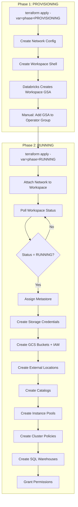

***REMOVED*** Databricks Workspace with Unity Catalog on GCP

> **⚠️ IMPORTANT - SPECIAL CONFIGURATION NOTICE**
>
> **Least Privilege Workspaces (LPW)** is a specialized Databricks deployment configuration with enhanced security controls. This configuration:
> - **Requires explicit allowlisting** by Databricks support team
> - **Is NOT available to all accounts** - requires Databricks approval and coordination
> - **Needs special setup** with VPC Service Controls and restrictive network policies
> - **Demands ongoing support engagement** for configuration and maintenance
>
> **Before using this module:**
> 1. Contact your Databricks Account Team or Databricks Support
> 2. Request approval for Least Privilege Workspace deployment
> 3. Review the VPC-SC policies in [`/templates/vpcsc-policy/least-privilege-workspaces/`](../../vpcsc-policy/least-privilege-workspaces/)
> 4. Coordinate with Databricks for your specific security requirements
>
> **For standard workspace deployments**, use one of the other configurations in `/templates/terraform-scripts/` (byovpc-ws, byovpc-psc-ws, byovpc-cmek-ws, byovpc-psc-cmek-ws, or end2end).
>
> This module is intended for **highly regulated environments** (financial services, healthcare, government) where maximum security posture and explicit access allowlisting are mandatory requirements.

---

A production-ready Terraform module for deploying Databricks workspaces on Google Cloud Platform (GCP) with complete Unity Catalog governance, compute policies, and SQL warehouses.

***REMOVED******REMOVED*** Overview

This module provides a comprehensive solution for creating enterprise-grade Databricks workspaces on GCP with:

- **2-Phase Deployment Model**: Safe, race-condition-free workspace provisioning
- **Unity Catalog**: Fully configured data governance with catalogs, storage credentials, and external locations
- **Compute Governance**: Pre-configured instance pools and cluster policies (Small, Medium, Large)
- **SQL Analytics**: Serverless SQL warehouses with permission management
- **Security**: BYOVPC, Private Service Connect (PSC), Customer-Managed Encryption Keys (CMEK) support
- **Production-Ready**: Comprehensive tagging, IAM permissions, and workspace status polling

***REMOVED******REMOVED*** Key Features

***REMOVED******REMOVED******REMOVED*** Workspace Provisioning
- Automated workspace creation with network configuration
- Workspace status polling to prevent race conditions
- Metastore assignment and configuration
- Comprehensive permission management (groups, users, service principals)

***REMOVED******REMOVED******REMOVED*** Unity Catalog Setup
- Storage credentials with GCP service account creation
- GCS bucket provisioning with IAM bindings
- External locations for data access
- Catalog creation with workspace bindings
- Granular permission grants (data_editor, data_reader, data_writer)

***REMOVED******REMOVED******REMOVED*** Compute Resources
- **Instance Pools**: Pre-warmed compute (Small, Medium, Large)
- **Cluster Policies**: Job and All-Purpose policies with/without pools
- **Personal/Shared Compute**: Override policies for flexibility
- **Governance**: DBU limits, auto-termination, node type restrictions

***REMOVED******REMOVED******REMOVED*** SQL Analytics
- Multiple SQL warehouse sizes (Small, Medium, Large, X-Large, 2X-Large, 3X-Large, 4X-Large)
- Serverless support
- Auto-scaling configuration
- Permission-based access control

***REMOVED******REMOVED*** Architecture



***REMOVED******REMOVED*** Prerequisites

⚠️ **IMPORTANT**: This module does NOT create the foundational infrastructure. The following resources must exist BEFORE deploying:

***REMOVED******REMOVED******REMOVED*** 1. Databricks Account Setup (Must Exist)

***REMOVED******REMOVED******REMOVED******REMOVED*** Account Access
- ✅ Databricks account on GCP with **account-level admin access**
- ✅ Access to account console: `https://accounts.gcp.databricks.com/`

***REMOVED******REMOVED******REMOVED******REMOVED*** Regional Unity Catalog Metastore (Must Be Created First)
- ✅ **Unity Catalog metastore** already created in your target region (e.g., `us-east4`)
  - Created by Databricks during account provisioning
  - One metastore per region
  - Obtain the metastore UUID from your Databricks account team

***REMOVED******REMOVED******REMOVED******REMOVED*** Databricks Groups (Must Exist Before Deployment)
- ✅ **Account-level groups** created in Databricks for permission management
  - Example: `databricks-admins`, `databricks-writers`, `databricks-readers`
  - Create at: https://accounts.gcp.databricks.com/ → User Management → Groups
  - Groups must exist BEFORE running Terraform

***REMOVED******REMOVED******REMOVED******REMOVED*** Regional Databricks Infrastructure IDs (Obtain from Databricks Account Team)
- ✅ **Private Access Settings ID** (UUID) - per region
- ✅ **Dataplane Relay VPC Endpoint ID** (UUID) - per region (ngrok endpoint)
- ✅ **REST API VPC Endpoint ID** (UUID) - per region (plproxy endpoint)

***REMOVED******REMOVED******REMOVED*** 2. GCP Infrastructure (Must Exist)

***REMOVED******REMOVED******REMOVED******REMOVED*** GCP Projects
- ✅ **Databricks workspace project** - where workspace resources will be created
- ✅ **Network project** (if using Shared VPC) - where VPC/subnets exist

***REMOVED******REMOVED******REMOVED******REMOVED*** Network Infrastructure
- ✅ **VPC network** configured and accessible
  - Can be Shared VPC or dedicated VPC
  - Must allow outbound internet access (for Databricks control plane)
- ✅ **Subnet** allocated for Databricks worker nodes
  - Minimum size: `/26` (64 IPs) - **Required**
  - Recommended: `/24` (256 IPs) for production workloads
  - Must have Private Google Access enabled
  - Region must match workspace region

***REMOVED******REMOVED******REMOVED******REMOVED*** Service Account with Permissions
- ✅ **Terraform service account** with the following roles:
  - `roles/iam.serviceAccountUser` - To use service accounts
  - `roles/compute.networkAdmin` - To configure networking
  - `roles/storage.admin` - To create GCS buckets
  - `roles/resourcemanager.projectIamAdmin` - To grant IAM permissions
  - **Databricks account admin role** - For workspace provisioning

***REMOVED******REMOVED******REMOVED*** 3. Terraform Environment

***REMOVED******REMOVED******REMOVED******REMOVED*** Required Tools
- ✅ Terraform >= 1.0
- ✅ gcloud CLI (for authentication)

***REMOVED******REMOVED******REMOVED******REMOVED*** Provider Versions
- Databricks provider ~> 1.95.0
- Google provider ~> 6.5.0
- Null provider ~> 3.0
- Random provider ~> 3.0

***REMOVED******REMOVED******REMOVED*** 4. Information Gathering Checklist

Before starting deployment, gather the following information:

***REMOVED******REMOVED******REMOVED******REMOVED*** From Databricks Account Team:
- [ ] Databricks account ID (UUID format)
- [ ] Regional private access settings ID
- [ ] Regional dataplane relay VPC endpoint ID
- [ ] Regional REST API VPC endpoint ID
- [ ] Regional Unity Catalog metastore ID

***REMOVED******REMOVED******REMOVED******REMOVED*** From GCP:
- [ ] GCP project ID for Databricks workspace
- [ ] GCP project ID for network (if using Shared VPC)
- [ ] VPC network name
- [ ] Subnet name (with adequate IP space)
- [ ] Service account email for Terraform
- [ ] Target region (e.g., `us-east4`)

***REMOVED******REMOVED******REMOVED******REMOVED*** From Your Organization:
- [ ] Databricks group names (must be created in account)
- [ ] Owner email address
- [ ] Team name
- [ ] Notification distribution list
- [ ] Optional: Billing tracking codes (cost center, APM ID, etc.)

***REMOVED******REMOVED******REMOVED*** What This Module Creates

This module creates the following resources (it does NOT create the prerequisites above):

**Phase 1:**
- Databricks workspace object
- Network configuration

**Phase 2:**
- Unity Catalog storage credentials
- GCS buckets for Unity Catalog
- External locations
- Catalogs
- Instance pools
- Cluster policies
- SQL warehouses
- Permission grants

***REMOVED******REMOVED******REMOVED*** What You Must Create Separately

The following are NOT created by this module and must exist beforehand:

❌ VPC network
❌ Subnets
❌ Unity Catalog metastore
❌ Databricks account
❌ Databricks groups
❌ GCP projects
❌ Regional Databricks endpoint infrastructure

***REMOVED******REMOVED*** Quick Start

***REMOVED******REMOVED******REMOVED*** 1. Navigate to Example Directory
```bash
cd example/
```

***REMOVED******REMOVED******REMOVED*** 2. Configure Variables
```bash
***REMOVED*** Copy the example file
cp terraform.tfvars.example terraform.tfvars

***REMOVED*** Edit with your values
vim terraform.tfvars
```

**Critical values to configure:**
- `databricks_account_id` - Your Databricks account UUID
- `databricks_google_service_account` - Service account email
- Regional endpoint IDs (private_access_settings_id, VPC endpoints, metastore_id)
- Network configuration (network_project_id, vpc_id, subnet_id)
- GCP project details
- Databricks groups (must exist before deployment)

***REMOVED******REMOVED******REMOVED*** 3. Phase 1: Provisioning
```bash
terraform init
terraform plan -var="phase=PROVISIONING"
terraform apply -var="phase=PROVISIONING"
```

**Outputs**: Note the `workspace_gsa_email` from outputs.

**Manual Step**: Add the workspace GSA (from outputs) to your operator group in Google Workspace or GCP IAM.

***REMOVED******REMOVED******REMOVED*** 4. Phase 2: Running
```bash
***REMOVED*** Wait for workspace to reach RUNNING status (check Databricks console)
terraform plan -var="phase=RUNNING"
terraform apply -var="phase=RUNNING"
```

This will create all workspace resources: pools, policies, Unity Catalog, SQL warehouses, and permissions.

***REMOVED******REMOVED*** What Gets Created

***REMOVED******REMOVED******REMOVED*** Phase 1: PROVISIONING
- Databricks workspace (shell, no resources)
- Network configuration object
- Workspace GSA (created by Databricks): `db-<workspace-id>@prod-gcp-<region>.iam.gserviceaccount.com`

***REMOVED******REMOVED******REMOVED*** Phase 2: RUNNING
- **Workspace Configuration**: Network attachment, metastore assignment
- **IAM & Permissions**: Account-level and workspace-level role assignments
- **Storage**:
  - Storage credentials (Databricks creates GCP service accounts)
  - GCS buckets for Unity Catalog
  - IAM bindings for bucket access
- **Unity Catalog**:
  - External locations
  - Catalogs with workspace bindings
  - Permission grants
- **Compute**:
  - 3 instance pools (Small, Medium, Large) - if configured
  - Multiple cluster policies per size (Job, Job Pool, All-Purpose, All-Purpose Pool)
  - Personal Compute and Shared Compute policies
- **SQL Analytics**:
  - SQL warehouses with serverless support
  - Warehouse permissions

***REMOVED******REMOVED*** 2-Phase Deployment Explained

***REMOVED******REMOVED******REMOVED*** Why 2 Phases?

Databricks workspace creation is **asynchronous**. The workspace must be fully initialized before resources can be provisioned. Attempting to create resources while the workspace is still initializing causes errors:

```
Error: cannot create resources: workspace not in RUNNING state
```

***REMOVED******REMOVED******REMOVED*** The Solution

**Phase 1: PROVISIONING** - Creates an empty workspace shell
- Creates the workspace object (returns workspace ID immediately)
- Creates network configuration object
- Databricks initializes the workspace in the background
- Databricks creates the workspace GSA: `db-<workspace-id>@prod-gcp-<region>.iam.gserviceaccount.com`
- Returns workspace details (ID, URL) but workspace is NOT yet functional

**Phase 2: RUNNING** - Turns the workspace into a functional, running state
- Attaches the network configuration to the workspace
- Polls workspace status every 10 seconds (max 10 minutes) until status = `RUNNING`
- Once `RUNNING`, safely provisions all resources:
  - Metastore assignment
  - Storage credentials & GCS buckets
  - Unity Catalog (external locations, catalogs)
  - Compute resources (instance pools, cluster policies)
  - SQL warehouses
  - All permission grants

***REMOVED******REMOVED******REMOVED*** Status Polling

The module includes a workspace status polling mechanism:
- Polls Databricks API every 10 seconds
- Maximum 60 attempts (10 minutes)
- Uses service account impersonation for authentication
- Blocks resource creation until workspace is confirmed RUNNING

***REMOVED******REMOVED******REMOVED*** Control Variable

The `phase` variable controls deployment:
```hcl
phase = "PROVISIONING"  ***REMOVED*** Phase 1: Workspace creation
phase = "RUNNING"       ***REMOVED*** Phase 2: Resource provisioning
```

Internally, this sets:
- `expected_workspace_status`: What status to wait for
- `provision_workspace_resources`: Boolean flag for resource creation

All workspace resources use this pattern:
```hcl
for_each = var.provision_workspace_resources ? local.resources_map : {}
```

***REMOVED******REMOVED*** Directory Structure

```
lpw/
├── README.md                          ***REMOVED*** This file
├── module/                            ***REMOVED*** Reusable Terraform module
│   ├── README.md                      ***REMOVED*** Module documentation
│   ├── versions.tf                    ***REMOVED*** Provider version requirements
│   ├── providers.tf                   ***REMOVED*** Provider configurations
│   ├── variables.tf                   ***REMOVED*** Input variables
│   ├── locals.tf                      ***REMOVED*** Local values and transformations
│   ├── data.tf                        ***REMOVED*** Data source lookups
│   ├── outputs.tf                     ***REMOVED*** Module outputs
│   ├── workspace.tf                   ***REMOVED*** Workspace creation + status polling
│   ├── catalog*.tf                    ***REMOVED*** Unity Catalog resources (4 files)
│   ├── gcs.tf                         ***REMOVED*** GCS bucket creation
│   ├── storage_permission.tf          ***REMOVED*** GCS IAM bindings
│   ├── workspace_computes.tf          ***REMOVED*** Instance pools + cluster policies
│   ├── workspace_*_permissions.tf     ***REMOVED*** Permission grants (3 files)
│   ├── sql_warehouse.tf               ***REMOVED*** SQL warehouse creation
│   ├── sql_permissions.tf             ***REMOVED*** SQL warehouse permissions
│   ├── foriegn_catalog_connections.tf ***REMOVED*** BigQuery connections
│   └── random.tf                      ***REMOVED*** Random string generation
└── example/                           ***REMOVED*** Full deployment example with 2-phase logic
    ├── README.md                      ***REMOVED*** Deployment guide
    ├── main.tf                        ***REMOVED*** Module invocation
    ├── variables.tf                   ***REMOVED*** Variable definitions
    ├── locals.tf                      ***REMOVED*** Phase configuration logic
    ├── outputs.tf                     ***REMOVED*** Output forwarding
    └── terraform.tfvars.example       ***REMOVED*** Configuration template
```

**Why Two Directories?**
- **`module/`** - The reusable Terraform module with all resource definitions
- **`example/`** - Shows how to use the module correctly with 2-phase deployment logic


***REMOVED******REMOVED*** Configuration Examples

***REMOVED******REMOVED******REMOVED*** Minimal Configuration
```hcl
***REMOVED*** Focus on required fields only
workspace_name = "my-databricks-workspace"
metastore_id   = "your-metastore-uuid"

***REMOVED*** Network
network_project_id = "my-network-project"
vpc_id             = "my-vpc"
subnet_id          = "my-subnet"

***REMOVED*** One catalog
unity_catalog_config = "[{\"name\": \"main\", \"external_bucket\": \"my-catalog-bucket\", \"shared\": \"false\"}]"
```

***REMOVED******REMOVED******REMOVED*** Production Configuration
```hcl
***REMOVED*** Complete setup with multiple catalogs, SQL warehouses, and granular permissions
unity_catalog_config = "[
  {\"name\": \"prod_data\", \"external_bucket\": \"prod-data-bucket\", \"shared\": \"false\"},
  {\"name\": \"dev_data\", \"external_bucket\": \"dev-data-bucket\", \"shared\": \"false\"}
]"

sqlwarehouse_cluster_config = "[
  {\"name\": \"small-sql\", \"config\": {\"type\": \"small\", \"max_instance\": 2, \"serverless\": \"true\"}, \"permission\": [...]},
  {\"name\": \"large-sql\", \"config\": {\"type\": \"large\", \"max_instance\": 4, \"serverless\": \"true\"}, \"permission\": [...]}
]"

***REMOVED*** Multiple groups with different roles
permissions_group_role_user = "data-analysts,data-engineers,data-scientists,admins"
```

***REMOVED******REMOVED*** Troubleshooting

***REMOVED******REMOVED******REMOVED*** Common Issues

***REMOVED******REMOVED******REMOVED******REMOVED*** 1. Workspace Stuck in PROVISIONING
**Symptoms**: Phase 2 hangs during workspace status polling
**Solution**:
- Check Databricks console for workspace status
- Verify network configuration is correct
- Check for quota issues in GCP project
- Contact Databricks support if stuck >20 minutes

***REMOVED******REMOVED******REMOVED******REMOVED*** 2. Permission Denied Errors
**Symptoms**: `Error: insufficient permissions to create resource`
**Solution**:
- Verify service account has required roles
- Check if groups exist in Databricks account before deployment
- Ensure workspace GSA was added to operator group

***REMOVED******REMOVED******REMOVED******REMOVED*** 3. Network Attachment Fails
**Symptoms**: `Error: cannot attach network to workspace`
**Solution**:
- Verify VPC exists and is accessible
- Check subnet has sufficient IP addresses (minimum /26)
- Ensure private access settings ID is correct for region

***REMOVED******REMOVED******REMOVED******REMOVED*** 4. Storage Credential Creation Fails
**Symptoms**: `Error creating storage credential`
**Solution**:
- Verify Databricks account has permissions to create GCP service accounts
- Check if storage credential name conflicts with existing one
- Ensure isolation mode is set correctly (ISOLATION_MODE_OPEN)

***REMOVED******REMOVED*** Advanced Topics

***REMOVED******REMOVED******REMOVED*** Custom Cluster Policies

The module creates policies for each compute size (Small, Medium, Large):
- **Job Policy**: For automated workloads (fixed cluster_type)
- **Job Pool Policy**: Job policy with instance pool reference
- **All-Purpose Policy**: For interactive workloads
- **All-Purpose Pool Policy**: All-purpose with instance pool
- **Personal Compute**: Override for individual users
- **Shared Compute**: Override for shared clusters

***REMOVED******REMOVED******REMOVED*** Unity Catalog Permissions Model

Permissions are granted at multiple levels:
- **Catalog Level**: `data_editor`, `data_reader`, `data_writer`
- **External Location Level**: `writer`, `reader`
- **Storage Credential Level**: `writer`, `reader`

***REMOVED******REMOVED******REMOVED*** External Project Support

To create GCS buckets in a different project:
```hcl
external_project  = true
bucket_project_id = "my-data-project"
```

***REMOVED******REMOVED******REMOVED*** Billing Tags

Optional billing/tracking codes for cost allocation:
```hcl
costcenter  = "CC12345"   ***REMOVED*** Cost center
apmid       = "APM000000" ***REMOVED*** Application Portfolio Management ID
ssp         = "SSP000000" ***REMOVED*** Service & Support Plan ID
trproductid = "0000"      ***REMOVED*** Product tracking ID
```

***REMOVED******REMOVED*** Security Considerations

1. **Sensitive Variables**: Account IDs, endpoint IDs, and metastore IDs are marked `sensitive = true`
2. **Authentication**: Use Application Default Credentials or service account impersonation (avoid key files)
3. **Network Isolation**: Deploy with BYOVPC and PSC for maximum security
4. **Encryption**: Enable CMEK for data at rest (configured at workspace level)
5. **Access Control**: Grant minimum necessary permissions to groups
6. **Audit**: All resources are tagged with owner, team, and environment

***REMOVED******REMOVED*** Migration and Updates

***REMOVED******REMOVED******REMOVED*** Updating Compute Policies
Cluster policies use JSON. To update:
1. Modify policy in Databricks UI
2. Export policy JSON
3. Update `cluster_policy_permissions` in terraform.tfvars
4. Run `terraform apply -var="phase=RUNNING"`

***REMOVED******REMOVED******REMOVED*** Adding New Catalogs
```hcl
***REMOVED*** Update unity_catalog_config with new catalog
unity_catalog_config = "[
  {\"name\": \"existing_catalog\", ...},
  {\"name\": \"new_catalog\", \"external_bucket\": \"new-bucket\", \"shared\": \"false\"}
]"

***REMOVED*** Update permissions
unity_catalog_permissions = "[
  {\"name\": \"existing_catalog\", ...},
  {\"name\": \"new_catalog\", \"permission\": [...]}
]"
```

***REMOVED******REMOVED******REMOVED*** Workspace Scaling
To add more compute capacity:
1. Increase instance pool `max_capacity` in `locals.tf`
2. Add larger compute types: `compute_types = "Small,Medium,Large,XLarge"`
3. Apply changes: `terraform apply -var="phase=RUNNING"`

***REMOVED******REMOVED*** Related Documentation

- [Databricks on GCP Documentation](https://docs.gcp.databricks.com/)
- [Unity Catalog Documentation](https://docs.databricks.com/data-governance/unity-catalog/index.html)
- [Terraform Databricks Provider](https://registry.terraform.io/providers/databricks/databricks/latest/docs)
- [GCP VPC Documentation](https://cloud.google.com/vpc/docs)

***REMOVED******REMOVED*** Support

For issues related to:
- **This Terraform module**: Open an issue in this repository
- **Databricks platform**: Contact your Databricks account team
- **GCP infrastructure**: Consult GCP support

***REMOVED******REMOVED*** License

This module is provided as-is for use with Databricks on GCP deployments.

***REMOVED******REMOVED*** Contributing

Contributions are welcome! Please:
1. Fork the repository
2. Create a feature branch
3. Make your changes
4. Test thoroughly
5. Submit a pull request with detailed description

---

**Note**: This module creates billable resources in both GCP (compute, storage, networking) and Databricks (DBUs). Review pricing before deployment.
