# Databricks on GCP - Terraform Deployment Configurations

Comprehensive Terraform configurations for deploying Databricks workspaces on Google Cloud Platform (GCP) with various security, networking, and governance configurations.

## Table of Contents

- [Overview](#overview)
- [Architecture Options](#architecture-options)
- [Quick Start Guide](#quick-start-guide)
- [Configuration Matrix](#configuration-matrix)
- [Authentication Setup](#authentication-setup)
- [Folder Structure](#folder-structure)
- [Deployment Scenarios](#deployment-scenarios)
- [Prerequisites](#prerequisites)
- [Common Variables](#common-variables)
- [Support and Documentation](#support-and-documentation)

---

## Overview

This repository provides **production-ready Terraform configurations** for deploying Databricks workspaces on GCP with different combinations of features:

- **Networking**: Customer-managed VPC (BYOVPC), Private Service Connect (PSC)
- **Security**: Customer-Managed Encryption Keys (CMEK), IP Access Lists
- **Governance**: Unity Catalog for data governance
- **Infrastructure**: VPC, subnets, firewall rules, DNS configuration
- **Access Management**: Groups, users, permissions, cluster policies

### Key Features

✅ **Modular Design**: Choose the configuration that matches your requirements  
✅ **Production Ready**: Battle-tested configurations with security best practices  
✅ **Well Documented**: Comprehensive README in each folder with architecture diagrams  
✅ **Mermaid Diagrams**: Visual architecture and deployment flow diagrams  
✅ **Troubleshooting**: Common issues and solutions included  
✅ **GCP Best Practices**: Follows Google Cloud Platform recommendations

### Repository Structure Overview

```mermaid
graph TB
    ROOT[Terraform Scripts Root]
    
    ROOT --> INFRA[infra4db/<br/>📦 Infrastructure Foundation<br/>VPC, Subnets, NAT, Firewall]
    
    ROOT --> WS_GROUP[Workspace Configurations]
    WS_GROUP --> BASIC[byovpc-ws/<br/>🟦 Basic Workspace]
    WS_GROUP --> CMEK[byovpc-cmek-ws/<br/>🟨 + Encryption]
    WS_GROUP --> PSC[byovpc-psc-ws/<br/>🟩 + Private Access]
    WS_GROUP --> SECURE[byovpc-psc-cmek-ws/<br/>🟥 Maximum Security]
    
    ROOT --> GOV_GROUP[Governance Configurations]
    GOV_GROUP --> E2E[end2end/<br/>🎯 Complete Platform]
    GOV_GROUP --> UC[uc/<br/>📊 Unity Catalog Only]
    
    ROOT --> DOCS[Documentation]
    DOCS --> SA_DOC[sa-impersonation.md<br/>📖 Auth Guide]
    DOCS --> README[README.md<br/>📖 This File]
    
    style ROOT fill:#4285F4
    style INFRA fill:#FBBC04
    style BASIC fill:#4285F4
    style CMEK fill:#FBBC04
    style PSC fill:#34A853
    style SECURE fill:#EA4335
    style E2E fill:#34A853
    style UC fill:#FF3621
```



---

## Architecture Options

### Deployment Configurations


---

## Quick Start Guide

### 1. Choose Your Configuration

| Configuration | Description | Use Case |
|--------------|-------------|----------|
| **[infra4db/](infra4db/)** | VPC, subnets, firewall rules | Don't have GCP infrastructure |
| **[byovpc-ws/](byovpc-ws/)** | Basic workspace with BYOVPC | Simple deployment, public access |
| **[byovpc-cmek-ws/](byovpc-cmek-ws/)** | Workspace + CMEK encryption | Need data encryption control |
| **[byovpc-psc-ws/](byovpc-psc-ws/)** | Workspace + Private Service Connect | Need private connectivity |
| **[byovpc-psc-cmek-ws/](byovpc-psc-cmek-ws/)** | Workspace + PSC + CMEK | Maximum security (private + encrypted) |
| **[end2end/](end2end/)** | Workspace + Unity Catalog + Policies | Complete production deployment |
| **[lpw/](lpw/)** | **2-Phase Workspace + Unity Catalog** | Advanced: Production workspace with 2-phase deployment, UC, compute policies, SQL warehouses |
| **[uc/](uc/)** | Unity Catalog only | Add UC to existing workspace |

### 2. Prerequisites

- **Terraform** >= 1.0
- **Google Cloud SDK** (`gcloud` CLI)
- **Databricks Account** on GCP (Enterprise Edition for Unity Catalog)
- **Google Service Account** with appropriate IAM roles
- **VPC Infrastructure** (or use `infra4db/` to create)

### 3. Authentication

See [Authentication Setup](#authentication-setup) section below.

### 4. Deploy

```bash
# Navigate to chosen configuration
cd <configuration-folder>

# Update configuration files
# - providers.auto.tfvars
# - workspace.auto.tfvars (or equivalent)

# Initialize Terraform
terraform init

# Review plan
terraform plan

# Deploy
terraform apply
```

---

## Deployment Architecture Diagrams

### 1. Infrastructure Foundation (`infra4db/`)

Creates the foundational GCP infrastructure required for Databricks workspaces.


**Use Case**: Starting from scratch, no existing GCP infrastructure  
**What It Creates**: VPC, subnets, NAT, firewall rules, optionally PSC endpoints and KMS keys  
**Next Step**: Deploy workspace using one of the `byovpc-*` configurations

---

### 2. Basic Workspace (`byovpc-ws/`)

Simple Databricks workspace with customer-managed VPC and public internet access.


**Security Level**: ⭐ Basic  
**Access**: Public internet  
**Encryption**: Google-managed keys  
**Best For**: Development, testing, proof-of-concept  
**Deployment Time**: ~12 minutes

---

### 3. Encrypted Workspace (`byovpc-cmek-ws/`)

Workspace with customer-managed encryption keys for enhanced data security.

```mermaid
graph TB
    subgraph "GCP - Host/Shared VPC"
        VPC[Customer VPC]
        SUBNET[Node Subnet]
        NAT[Cloud NAT]
        
        subgraph "Cloud KMS"
            KEYRING[Key Ring]
            KEY[Crypto Key<br/>Annual Rotation]
        end
    end
    
    subgraph "GCP - Service/Consumer Project"
        subgraph "Databricks Workspace - Encrypted"
            GKE[GKE Cluster<br/>🔒 Encrypted with CMEK]
            GCS[GCS Buckets<br/>🔒 Encrypted with CMEK]
            DISK[Persistent Disks<br/>🔒 Encrypted with CMEK]
        end
    end
    
    subgraph "Internet"
        USERS[Users<br/>Public Access]
        CONTROL[Databricks Control Plane]
    end
    
    KEYRING --> KEY
    KEY -.Encrypts.-> GCS
    KEY -.Encrypts.-> DISK
    KEY -.Encrypts.-> GKE
    
    USERS --> CONTROL
    CONTROL --> GKE
    SUBNET --> NAT
    NAT --> CONTROL
    GKE --> SUBNET
    
    style KEY fill:#FBBC04
    style GCS fill:#34A853
    style GKE fill:#4285F4
    style CONTROL fill:#FF3621
```



**Security Level**: ⭐⭐ Enhanced  
**Access**: Public internet  
**Encryption**: Customer-managed keys (you control the keys)  
**Best For**: Compliance requirements, sensitive data  
**Deployment Time**: ~15 minutes

---

### 4. Private Workspace (`byovpc-psc-ws/`)

Workspace with Private Service Connect for fully private connectivity.


**Security Level**: ⭐⭐⭐ High  
**Access**: Private only (requires VPN/Cloud Interconnect)  
**Encryption**: Google-managed keys  
**Best For**: Production workloads, regulated industries  
**Deployment Time**: ~20 minutes

---

### 5. Maximum Security Workspace (`byovpc-psc-cmek-ws/`)

The most secure configuration combining private connectivity and customer-managed encryption.


**Security Level**: ⭐⭐⭐⭐⭐ Maximum  
**Access**: Private only (VPN required)  
**Encryption**: Customer-managed keys  
**Best For**: Highly regulated environments (financial, healthcare, government)  
**Deployment Time**: ~25 minutes

---

### 6. Complete Data Platform (`end2end/`)

Full production platform with workspace, Unity Catalog, and governance.

```mermaid
graph TB
    subgraph "GCP Infrastructure"
        VPC[Customer VPC]
        
        subgraph "Storage"
            META_BUCKET[Metastore<br/>GCS Bucket]
            EXT_BUCKET[External Data<br/>GCS Bucket]
        end
    end
    
    subgraph "Databricks Workspace"
        WS[Workspace<br/>Notebooks & Compute]
        
        subgraph "Unity Catalog"
            META[Metastore<br/>Central Governance]
            
            subgraph "Catalogs"
                MAIN[Main Catalog]
                DEV[Dev Catalog]
            end
            
            subgraph "Schemas"
                SCHEMA[Schemas<br/>Databases]
            end
            
            subgraph "External Locations"
                EXT_LOC[External<br/>Locations]
                CREDS[Storage<br/>Credentials]
            end
        end
        
        subgraph "Cluster Policies"
            POLICY[Fair Use Policy<br/>💰 Cost Controls<br/>🏷️ Custom Tags]
        end
    end
    
    subgraph "Databricks Account"
        subgraph "Groups & Users"
            UC_ADMIN[UC Admins]
            DATA_ENG[Data Engineering]
            DATA_SCI[Data Science]
        end
    end
    
    META --> META_BUCKET
    META --> MAIN
    META --> DEV
    DEV --> SCHEMA
    EXT_LOC --> EXT_BUCKET
    CREDS --> EXT_BUCKET
    
    WS --> META
    WS --> POLICY
    
    UC_ADMIN -.Manages.-> META
    DATA_ENG -.User Access.-> WS
    DATA_SCI -.Admin Access.-> WS
    
    style META fill:#FF3621
    style UC_ADMIN fill:#FBBC04
    style POLICY fill:#34A853
    style WS fill:#4285F4
```



**What It Includes**:
- ✅ Databricks workspace with BYOVPC
- ✅ Unity Catalog metastore
- ✅ Catalogs, schemas, and external locations
- ✅ Account-level groups (UC Admins, Data Eng, Data Science)
- ✅ Cluster policies with cost controls
- ✅ Custom tags for cost attribution
- ✅ Fine-grained access control

**Best For**: Production data platform, complete governance  
**Deployment Time**: ~30 minutes

---

### 7. Unity Catalog Standalone (`uc/`)

Add Unity Catalog to an existing workspace (retrofitting data governance).


**Use Case**: Add Unity Catalog to workspace created without it  
**Prerequisites**: Existing workspace (any `byovpc-*` configuration)  
**What It Adds**:
- ✅ Unity Catalog metastore
- ✅ Default storage credentials
- ✅ Account-level groups
- ✅ Metastore assignment to workspace
- ✅ Workspace permission assignments

**Best For**: Legacy workspace migration, phased deployments  
**Deployment Time**: ~8 minutes

---

## Configuration Matrix

### Feature Comparison

| Feature | byovpc-ws | byovpc-cmek-ws | byovpc-psc-ws | byovpc-psc-cmek-ws | end2end | uc |
|---------|-----------|----------------|---------------|--------------------|---------|----|
| **Workspace Creation** | ✅ | ✅ | ✅ | ✅ | ✅ | ❌ |
| **BYOVPC** | ✅ | ✅ | ✅ | ✅ | ✅ | N/A |
| **CMEK Encryption** | ❌ | ✅ | ❌ | ✅ | ❌* | N/A |
| **Private Service Connect** | ❌ | ❌ | ✅ | ✅ | ❌* | N/A |
| **Private DNS** | ❌ | ❌ | ✅ | ✅ | ❌* | N/A |
| **Unity Catalog** | ❌ | ❌ | ❌ | ❌ | ✅ | ✅ |
| **External Locations** | ❌ | ❌ | ❌ | ❌ | ✅ | ❌** |
| **Cluster Policies** | ❌ | ❌ | ❌ | ❌ | ✅ | ❌ |
| **Groups & Users** | ✅ | ✅ | ✅ | ✅ | ✅ | ✅ |
| **IP Access Lists** | ❌ | ❌ | ✅ | ✅ | ✅ | N/A |
| **Complexity** | Low | Medium | Medium | High | High | Low |
| **Deployment Time** | ~12 min | ~15 min | ~20 min | ~25 min | ~30 min | ~8 min |

\* Can be combined with PSC/CMEK configurations  
\*\* Can be added (see end2end example)

### Security Level Comparison


### Feature Build-Up Visualization


---

## Authentication Setup

### Google Service Account Authentication

You need a Google Service Account with appropriate permissions to deploy Databricks resources.

#### Option 1: Service Account Impersonation (Recommended)

```bash
# Set service account for impersonation
gcloud config set auth/impersonate_service_account <GSA-NAME>@<PROJECT>.iam.gserviceaccount.com

# Generate access token
export GOOGLE_OAUTH_ACCESS_TOKEN=$(gcloud auth print-access-token)
```

**Benefits:**
- No key file management
- Better security
- Audit trail via GCP logs
- Temporary credentials

#### Option 2: Service Account Key File

```bash
# Download service account key
gcloud iam service-accounts keys create ~/sa-key.json \
  --iam-account=<GSA-NAME>@<PROJECT>.iam.gserviceaccount.com

# Set environment variable
export GOOGLE_APPLICATION_CREDENTIALS=~/sa-key.json
```

**For detailed instructions**: See [sa-impersonation.md](sa-impersonation.md)

### Required IAM Roles

#### On Service/Consumer Project (Where Workspace Deploys)

- `roles/compute.networkAdmin` - Manage VPC and network resources
- `roles/iam.serviceAccountAdmin` - Manage service accounts
- `roles/resourcemanager.projectIamAdmin` - Manage IAM policies
- `roles/storage.admin` - Manage GCS buckets

**For CMEK:**
- `roles/cloudkms.admin` - Manage KMS keys
- `roles/cloudkms.cryptoKeyEncrypterDecrypter` - Use keys for encryption

#### On Host/Shared VPC Project (If Using Shared VPC)

- `roles/compute.networkUser` - Use VPC network
- `roles/compute.securityAdmin` - Manage firewall rules

**For PSC:**
- `roles/dns.admin` - Manage private DNS zones

#### On Databricks Account

- **Account Admin** role for the service account in Databricks Account Console

**Reference**: [Databricks IAM Requirements](https://docs.gcp.databricks.com/administration-guide/cloud-configurations/gcp/customer-managed-vpc.html#role-requirements)

---

## Folder Structure

```
terraform-scripts/
├── README.md (this file)
├── sa-impersonation.md (authentication guide)
│
├── infra4db/ (Infrastructure Foundation)
│   ├── README.md
│   ├── vpc.tf (VPC creation)
│   ├── subnets.tf (Node and PSC subnets)
│   ├── firewall.tf (Firewall rules)
│   ├── nat.tf (Cloud NAT)
│   ├── dns.tf (Optional: Private DNS)
│   ├── psc.tf (Optional: PSC endpoints)
│   └── cmk.tf (Optional: KMS keys)
│
├── byovpc-ws/ (Basic Workspace)
│   ├── README.md
│   ├── providers.tf
│   ├── providers.auto.tfvars
│   ├── workspace.tf
│   └── workspace.auto.tfvars
│
├── byovpc-cmek-ws/ (Workspace + Encryption)
│   ├── README.md
│   ├── providers.tf
│   ├── providers.auto.tfvars
│   ├── workspace.tf (includes KMS key creation)
│   └── workspace.auto.tfvars
│
├── byovpc-psc-ws/ (Workspace + Private Access)
│   ├── README.md
│   ├── providers.tf
│   ├── providers.auto.tfvars
│   ├── workspace.tf
│   ├── psc.tf (PSC endpoints)
│   ├── dns.tf (Private DNS zones)
│   └── workspace.auto.tfvars
│
├── byovpc-psc-cmek-ws/ (Workspace + Private + Encrypted)
│   ├── README.md
│   ├── providers.tf
│   ├── providers.auto.tfvars
│   ├── workspace.tf
│   ├── psc.tf (PSC endpoints)
│   ├── dns.tf (Private DNS zones)
│   └── workspace.auto.tfvars
│
├── end2end/ (Complete Platform)
│   ├── README.md
│   ├── providers.tf
│   ├── providers.auto.tfvars
│   ├── workspace.tf
│   ├── workspace.auto.tfvars
│   ├── unity-setup.tf (UC metastore)
│   ├── unity-setup.auto.tfvars
│   ├── unity-objects-management.tf (catalogs, external storage)
│   ├── cluster_policies.tf
│   └── cluster_policies.auto.tfvars
│
└── uc/ (Unity Catalog Standalone)
    ├── README.md
    ├── providers.tf
    ├── providers.auto.tfvars
    ├── unity-setup.tf
    └── unity-setup.auto.tfvars
```

---

## Deployment Scenarios

### Typical Deployment Journey

```mermaid
graph TB
    START[Start Here]
    
    subgraph "Phase 1: Foundation"
        P1[Deploy Infrastructure<br/>infra4db/<br/>VPC + Subnets + Firewall]
    end
    
    subgraph "Phase 2: Basic Workspace"
        P2A[Option A: Simple<br/>byovpc-ws/<br/>Quick Start]
        P2B[Option B: Secure<br/>byovpc-psc-cmek-ws/<br/>Production Ready]
    end
    
    subgraph "Phase 3: Data Governance"
        P3[Add Unity Catalog<br/>uc/ or end2end/<br/>Metadata Management]
    end
    
    subgraph "Phase 4: Enhancement"
        P4A[Add Cluster Policies<br/>Cost Control]
        P4B[Add External Locations<br/>Data Integration]
        P4C[Configure Groups<br/>Access Management]
    end
    
    subgraph "Phase 5: Production"
        P5[Production Ready!<br/>✅ Secure<br/>✅ Governed<br/>✅ Cost Controlled]
    end
    
    START --> P1
    P1 --> P2A
    P1 --> P2B
    P2A --> P3
    P2B --> P3
    P3 --> P4A
    P3 --> P4B
    P3 --> P4C
    P4A --> P5
    P4B --> P5
    P4C --> P5
    
    style START fill:#4285F4
    style P1 fill:#FBBC04
    style P2B fill:#EA4335
    style P3 fill:#FF3621
    style P5 fill:#34A853
```



### Deployment Scenarios

### Scenario 1: New Simple Workspace

**Goal**: Deploy a basic workspace for development/testing

**Path**:
```bash
1. infra4db/ (if no VPC) → 2. byovpc-ws/
```

**Features**:
- Public internet access
- Customer-managed VPC
- Basic security

**Deployment Time**: ~15 minutes

---

### Scenario 2: Secure Production Workspace

**Goal**: Deploy highly secure workspace with encryption and private access

**Path**:
```bash
1. infra4db/ (create infrastructure)
2. Create KMS key (see byovpc-cmek-ws/ for reference)
3. byovpc-psc-cmek-ws/
```

**Features**:
- Private Service Connect (no public access)
- Customer-managed encryption keys
- Private DNS
- IP access lists

**Deployment Time**: ~30 minutes

---

### Scenario 3: Complete Data Platform

**Goal**: Deploy full Databricks platform with Unity Catalog

**Path**:
```bash
1. infra4db/ (if no VPC)
2. end2end/
```

**Features**:
- Workspace with BYOVPC
- Unity Catalog metastore
- Catalogs, schemas, external locations
- Group-based access control
- Cluster policies with cost controls
- Custom tags for chargeback

**Deployment Time**: ~30 minutes

---

### Scenario 4: Add Unity Catalog to Existing Workspace

**Goal**: Retrofit Unity Catalog onto an existing workspace

**Path**:
```bash
1. Deploy workspace (any byovpc-* config)
2. uc/ (add Unity Catalog)
```

**Requirements**:
- Existing workspace ID
- Workspace must not already have Unity Catalog

**Deployment Time**: ~10 minutes

---

### Scenario 5: Multi-Workspace with Shared Metastore

**Goal**: Multiple workspaces sharing a single Unity Catalog metastore

**Path**:
```bash
1. infra4db/ (create VPC)
2. end2end/ (first workspace + Unity Catalog)
3. byovpc-ws/ (additional workspaces)
4. Manually assign additional workspaces to same metastore
```

**Benefits**:
- Centralized data governance
- Shared catalogs across workspaces
- Consistent access control

---

## Prerequisites

### General Requirements

1. **Databricks Account**
   - Enterprise Edition (for Unity Catalog)
   - Account Console access
   - Service account with Account Admin role

2. **GCP Project(s)**
   - Service/consumer project for workspace
   - Host/shared VPC project (if using Shared VPC)
   - Billing enabled

3. **Local Tools**
   - Terraform >= 1.0
   - gcloud CLI
   - Access to service account credentials

### Feature-Specific Requirements

#### For PSC (Private Service Connect)

- PSC feature enabled for Databricks account (contact Databricks)
- PSC service attachment URIs for your region
- PSC subnet (minimum /28 CIDR)
- VPN or Cloud Interconnect for private access

**Resources**:
- [Databricks PSC Documentation](https://docs.gcp.databricks.com/administration-guide/cloud-configurations/gcp/private-service-connect.html)
- [Supported Regions - PSC](https://docs.gcp.databricks.com/resources/supported-regions.html#psc)

#### For CMEK (Customer-Managed Keys)

- Pre-created KMS key (or use byovpc-cmek-ws/ to create)
- Key in same region as workspace
- Service account with KMS decrypt/encrypt permissions

**Resources**:
- [Databricks CMEK Documentation](https://docs.gcp.databricks.com/security/keys/customer-managed-keys.html)

#### For Unity Catalog

- Unity Catalog enabled for account
- GCS bucket for metastore storage
- Service account for storage credentials

**Resources**:
- [Unity Catalog on GCP](https://docs.gcp.databricks.com/data-governance/unity-catalog/index.html)

---

## Common Variables

### Provider Variables (`providers.auto.tfvars`)

```hcl
# Service Account (for authentication)
google_service_account_email = "automation-sa@my-project.iam.gserviceaccount.com"

# Service/Consumer Project (where workspace deploys)
google_project_name = "my-service-project"

# Host/Shared VPC Project (where VPC exists)
google_shared_vpc_project = "my-host-project"

# Region (must match VPC region)
google_region = "us-central1"
```

### Workspace Variables (`workspace.auto.tfvars`)

```hcl
# Databricks Account
databricks_account_id = "12345678-1234-1234-1234-123456789abc"
databricks_account_console_url = "https://accounts.gcp.databricks.com"
databricks_workspace_name = "my-workspace"
databricks_admin_user = "admin@mycompany.com"

# Network Configuration
google_vpc_id = "my-vpc-network"
node_subnet = "databricks-node-subnet"
```

### PSC Variables (if applicable)

```hcl
# PSC Subnet
google_pe_subnet = "databricks-psc-subnet"

# PSC Endpoint Names
workspace_pe = "frontend-ep"
relay_pe = "backend-ep"

# PSC Service Attachments (region-specific)
workspace_service_attachment = "projects/prod-gcp-us-central1/regions/us-central1/serviceAttachments/plproxy-psc-endpoint-all-ports"
relay_service_attachment = "projects/prod-gcp-us-central1/regions/us-central1/serviceAttachments/ngrok-psc-endpoint"
```

### CMEK Variables (if applicable)

```hcl
# Pre-created KMS Key
cmek_resource_id = "projects/my-project/locations/us-central1/keyRings/databricks-keyring/cryptoKeys/databricks-key"
```

---

## Deployment Flow

### Typical End-to-End Deployment


---

## Support and Documentation

### Official Documentation

- **Databricks on GCP**: https://docs.gcp.databricks.com/
- **Unity Catalog**: https://docs.gcp.databricks.com/data-governance/unity-catalog/
- **Private Service Connect**: https://docs.gcp.databricks.com/administration-guide/cloud-configurations/gcp/private-service-connect.html
- **CMEK**: https://docs.gcp.databricks.com/security/keys/customer-managed-keys.html
- **Customer-Managed VPC**: https://docs.gcp.databricks.com/administration-guide/cloud-configurations/gcp/customer-managed-vpc.html

### Terraform Providers

- **Databricks Provider**: https://registry.terraform.io/providers/databricks/databricks/latest/docs
- **Google Provider**: https://registry.terraform.io/providers/hashicorp/google/latest/docs

### GCP Documentation

- **VPC Documentation**: https://cloud.google.com/vpc/docs
- **Private Service Connect**: https://cloud.google.com/vpc/docs/private-service-connect
- **Cloud KMS**: https://cloud.google.com/kms/docs
- **Cloud DNS**: https://cloud.google.com/dns/docs

### Getting Help

1. **Check folder README**: Each folder has comprehensive documentation
2. **Review troubleshooting sections**: Common issues and solutions included
3. **Databricks Support**: For account or workspace-specific issues
4. **GCP Support**: For infrastructure or IAM permission issues

---

## Best Practices

### Security

- ✅ Use service account impersonation (avoid key files)
- ✅ Enable CMEK for sensitive data
- ✅ Use Private Service Connect for production
- ✅ Implement least-privilege IAM roles
- ✅ Enable IP access lists
- ✅ Use separate projects for prod/dev
- ✅ Enable audit logging

### Infrastructure

- ✅ Use Shared VPC for multi-workspace deployments
- ✅ Size subnets appropriately (min /24 for nodes)
- ✅ Deploy across multiple availability zones
- ✅ Use Cloud NAT for egress
- ✅ Implement proper firewall rules
- ✅ Use private Google access

### Operations

- ✅ Use Terraform for all deployments
- ✅ Store state in GCS backend
- ✅ Version control all configurations
- ✅ Tag resources appropriately
- ✅ Document custom configurations
- ✅ Test in dev before prod
- ✅ Implement proper change management

### Cost Optimization

- ✅ Use cluster policies to limit DBU consumption
- ✅ Enable auto-termination
- ✅ Use custom tags for cost attribution
- ✅ Right-size node subnets
- ✅ Consider single NAT gateway for dev (not prod)
- ✅ Clean up unused resources

---

## Changelog

### Recent Updates

- ✅ Added comprehensive README to all folders
- ✅ Added Mermaid architecture diagrams
- ✅ Enhanced troubleshooting sections
- ✅ Added deployment flow diagrams
- ✅ Improved configuration examples
- ✅ Added security best practices
- ✅ Updated for latest Terraform provider versions

---

## Contributing

These configurations are provided as reference implementations. Feel free to:

- Fork and customize for your organization
- Submit issues for bugs or unclear documentation
- Suggest improvements
- Share your deployment experiences

---

## License

These Terraform configurations are provided as reference implementations for deploying Databricks workspaces on Google Cloud Platform.

---

## Visual Deployment Comparison

### All Configurations at a Glance

```mermaid
graph TB
    subgraph "Infrastructure Foundation"
        INFRA[infra4db<br/>📦 VPC, Subnets, NAT<br/>⏱️ ~5 min]
    end
    
    subgraph "Workspace Configurations"
        BASIC[byovpc-ws<br/>🟦 Basic Workspace<br/>⭐ Public Access<br/>⏱️ ~12 min]
        
        CMEK[byovpc-cmek-ws<br/>🟨 + CMEK<br/>⭐⭐ Encrypted<br/>🔑 Customer Keys<br/>⏱️ ~15 min]
        
        PSC[byovpc-psc-ws<br/>🟩 + PSC<br/>⭐⭐⭐ Private<br/>🔒 VPN Required<br/>⏱️ ~20 min]
        
        SECURE[byovpc-psc-cmek-ws<br/>🟥 + PSC + CMEK<br/>⭐⭐⭐⭐⭐ Maximum Security<br/>🔒 Private + Encrypted<br/>⏱️ ~25 min]
    end
    
    subgraph "Governance Layer"
        E2E[end2end<br/>🎯 Complete Platform<br/>✅ Workspace<br/>✅ Unity Catalog<br/>✅ Policies<br/>⏱️ ~30 min]
        
        UC_ONLY[uc<br/>📊 UC Only<br/>Add to Existing WS<br/>⏱️ ~8 min]
    end
    
    INFRA -.Optional.-> BASIC
    INFRA -.Optional.-> CMEK
    INFRA -.Optional.-> PSC
    INFRA -.Optional.-> SECURE
    
    BASIC -.Add UC.-> UC_ONLY
    CMEK -.Add UC.-> UC_ONLY
    PSC -.Add UC.-> UC_ONLY
    SECURE -.Add UC.-> UC_ONLY
    
    INFRA -.All-in-One.-> E2E
    
    style INFRA fill:#FBBC04
    style BASIC fill:#4285F4
    style CMEK fill:#FBBC04
    style PSC fill:#34A853
    style SECURE fill:#EA4335
    style E2E fill:#34A853
    style UC_ONLY fill:#FF3621
```



### Component Inclusion Matrix

```mermaid
graph TD
    subgraph "Components Included"
        direction TB
        
        C1[Workspace<br/>✅ ✅ ✅ ✅ ✅ ❌]
        C2[BYOVPC<br/>✅ ✅ ✅ ✅ ✅ N/A]
        C3[CMEK<br/>❌ ✅ ❌ ✅ ❌ N/A]
        C4[PSC<br/>❌ ❌ ✅ ✅ ❌ N/A]
        C5[Unity Catalog<br/>❌ ❌ ❌ ❌ ✅ ✅]
        C6[Policies<br/>❌ ❌ ❌ ❌ ✅ ❌]
        C7[External Storage<br/>❌ ❌ ❌ ❌ ✅ ❌]
    end
    
    subgraph "Legend"
        L1[byovpc-ws]
        L2[byovpc-cmek-ws]
        L3[byovpc-psc-ws]
        L4[byovpc-psc-cmek-ws]
        L5[end2end]
        L6[uc]
    end
    
    style L1 fill:#4285F4
    style L2 fill:#FBBC04
    style L3 fill:#34A853
    style L4 fill:#EA4335
    style L5 fill:#34A853
    style L6 fill:#FF3621
```



---

## Quick Links

| Configuration | Description | README Link |
|--------------|-------------|-------------|
| **Infrastructure** | Create VPC, subnets, firewall | [infra4db/README.md](infra4db/README.md) |
| **Basic Workspace** | BYOVPC workspace | [byovpc-ws/README.md](byovpc-ws/README.md) |
| **Encrypted Workspace** | BYOVPC + CMEK | [byovpc-cmek-ws/README.md](byovpc-cmek-ws/README.md) |
| **Private Workspace** | BYOVPC + PSC | [byovpc-psc-ws/README.md](byovpc-psc-ws/README.md) |
| **Secure Workspace** | BYOVPC + PSC + CMEK | [byovpc-psc-cmek-ws/README.md](byovpc-psc-cmek-ws/README.md) |
| **Complete Platform** | Workspace + Unity Catalog | [end2end/README.md](end2end/README.md) |
| **Unity Catalog Only** | Add UC to existing workspace | [uc/README.md](uc/README.md) |
| **Authentication** | Service account setup | [sa-impersonation.md](sa-impersonation.md) |
