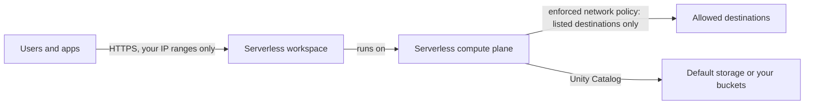

# Serverless workspace

A Databricks serverless workspace on Google Cloud: no VPC, no compute
service accounts, no workspace bucket. Compute runs in the Databricks
serverless compute plane; data lives in default storage, or in your own
buckets through Unity Catalog. A VPC of yours is needed only for a private
front-end (Private Service Connect).

> **Maturity: validated.** `terraform validate` and mock-provider tests pass
> in CI. Not yet applied end to end.



## Use

Apply this root, then [`workspace-guardrails`](../workspace-guardrails) for
the bare minimum: IP access lists (your known ranges), an NCC, an enforced
serverless network policy, and the Unity Catalog metastore assignment.

```bash
export GOOGLE_OAUTH_ACCESS_TOKEN=$(gcloud auth print-access-token)
export TF_VAR_databricks_account_id=<account-id>
terraform init
terraform apply \
  -var databricks_workspace_name=<workspace-name> \
  -var google_region=<region> \
  -var google_service_account_email=<automation-sa>

cd ../workspace-guardrails   # edit ip_access_list.yaml and network_policy.yaml first
terraform init
terraform apply \
  -var databricks_workspace_name=<workspace-name> \
  -var google_region=<region> \
  -var google_service_account_email=<automation-sa> \
  -var metastore_id=<metastore-id> \
  -var "workspace_url=$(terraform -chdir=../serverless-ws output -raw workspace_url)"
```

The Well-Architected Agent generates both steps for you
(`wa-agent new --cloud gcp --baseline serverless --set allowed_ip_ranges='[...]'`).

| Variable | Default | Meaning |
|---|---|---|
| `databricks_workspace_name` | | Name of the new workspace |
| `google_region` | | Region, e.g. `us-east4` |
| `google_service_account_email` | | Service account Terraform impersonates (an account admin) |
| `databricks_account_console_url` | `https://accounts.gcp.databricks.com` | Account console |

Changing the compute mode later means a new workspace: `compute_mode` can't
be updated in place.

## Tests

```bash
terraform init -backend=false && terraform test   # mock providers, no credentials
```

## References

- [Serverless workspaces](https://docs.databricks.com/gcp/en/admin/workspace/serverless-workspaces)
- [`databricks_mws_workspaces`](https://registry.terraform.io/providers/databricks/databricks/latest/docs/resources/mws_workspaces) (`compute_mode = "SERVERLESS"`)
- [Serverless network policies](https://docs.databricks.com/gcp/en/security/network/serverless-network-security/network-policies)
