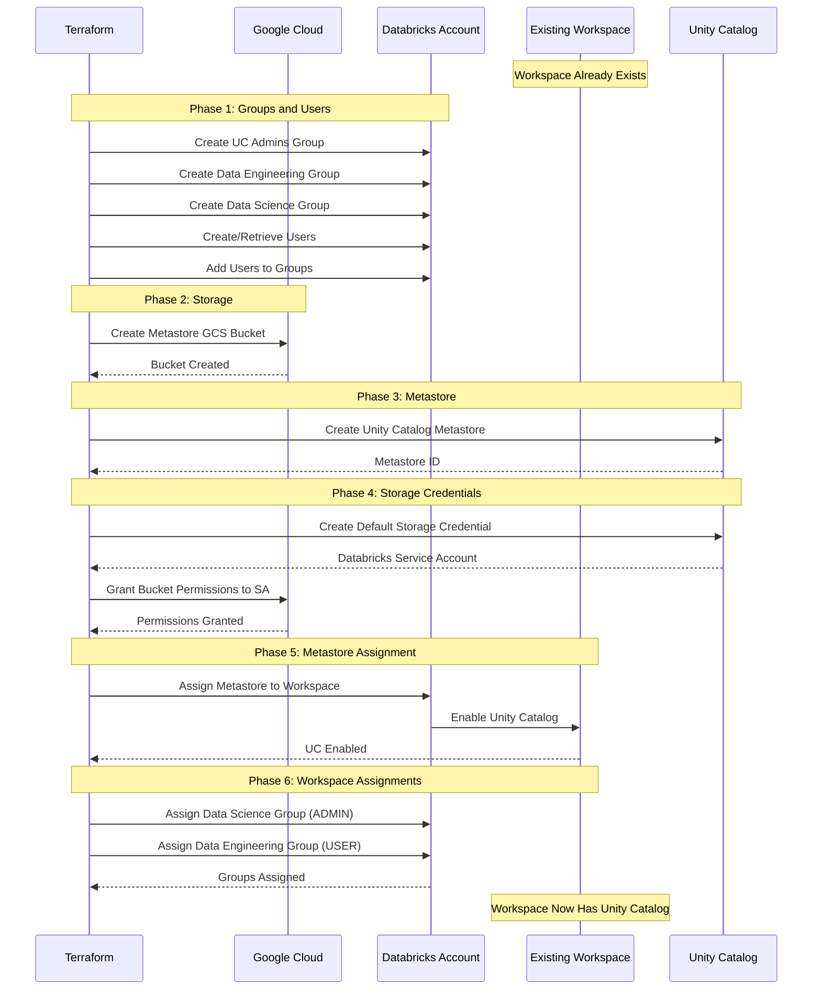

***REMOVED*** Unity Catalog Standalone Setup

A Terraform configuration for setting up Unity Catalog on an **existing Databricks workspace** on Google Cloud Platform (GCP). This configuration adds Unity Catalog with data governance, external storage, and user/group management to workspaces that were created without Unity Catalog.

***REMOVED******REMOVED*** Table of Contents

- [Overview](***REMOVED***overview)
- [Use Cases](***REMOVED***use-cases)
- [Prerequisites](***REMOVED***prerequisites)
- [What This Configuration Does](***REMOVED***what-this-configuration-does)
- [Provider Configuration](***REMOVED***provider-configuration)
- [Unity Catalog Components](***REMOVED***unity-catalog-components)
- [Deployment Flow](***REMOVED***deployment-flow)
- [Configuration](***REMOVED***configuration)
- [Deployment](***REMOVED***deployment)
- [Post-Deployment Validation](***REMOVED***post-deployment-validation)
- [Outputs](***REMOVED***outputs)
- [Troubleshooting](***REMOVED***troubleshooting)

---

***REMOVED******REMOVED*** Overview

This is a **standalone Unity Catalog** configuration that can be applied to **existing Databricks workspaces**. Unlike the end-to-end configuration (`../end2end/`), this does not create a workspace—it only sets up Unity Catalog and related data governance resources.

***REMOVED******REMOVED******REMOVED*** What Makes This "Standalone"?

| Aspect | Standalone UC (`uc/`) | End-to-End (`end2end/`) |
|--------|----------------------|------------------------|
| **Creates Workspace** | ❌ No | ✅ Yes |
| **Creates Unity Catalog** | ✅ Yes | ✅ Yes |
| **Workspace Required** | ✅ Must exist | ❌ Creates new |
| **Use Case** | Add UC to existing workspace | New workspace with UC |
| **Deployment** | On top of existing | Complete from scratch |

***REMOVED******REMOVED******REMOVED*** Architecture Diagram

```mermaid
graph TB
    subgraph "Existing Infrastructure"
        WS[Existing Databricks Workspace<br/>Already Deployed]
    end
    
    subgraph "Unity Catalog - Added by This Config"
        subgraph "Metastore"
            META[Unity Catalog Metastore<br/>Central Metadata Repository]
            META_BUCKET[GCS Bucket<br/>Metastore Storage]
        end
        
        subgraph "Groups"
            UC_ADMIN[UC Admins Group]
            GROUP1[Data Engineering Group]
            GROUP2[Data Science Group]
        end
        
        subgraph "Users"
            USER1[Admin User 1<br/>Auto-generated]
            USER2[Admin User 2<br/>From variable]
            USER3[Service Account<br/>From variable]
        end
        
        subgraph "Permissions"
            WS_ASSIGN1[Data Science → ADMIN]
            WS_ASSIGN2[Data Eng → USER]
        end
    end
    
    META --> META_BUCKET
    
    UC_ADMIN --> USER1
    UC_ADMIN --> USER2
    UC_ADMIN --> USER3
    
    META --> WS
    WS_ASSIGN1 --> WS
    WS_ASSIGN2 --> WS
    
    style WS fill:***REMOVED***4285F4,color:***REMOVED***fff
    style META fill:***REMOVED***FF3621,color:***REMOVED***fff
    style UC_ADMIN fill:***REMOVED***FBBC04,color:***REMOVED***000
    style META_BUCKET fill:***REMOVED***34A853,color:***REMOVED***fff
```

---

***REMOVED******REMOVED*** Use Cases

***REMOVED******REMOVED******REMOVED*** When to Use This Configuration

✅ **Perfect for:**
- You have an existing workspace without Unity Catalog
- You want to add data governance to an existing deployment
- You need to retrofit Unity Catalog onto legacy workspaces
- You're migrating from workspace-local metastore to Unity Catalog
- You want to test Unity Catalog features on existing workspace

❌ **Not suitable for:**
- Creating new workspaces (use `../end2end/` or workspace-specific configs)
- Workspaces that already have Unity Catalog enabled
- Testing workspace deployment (no workspace creation here)

***REMOVED******REMOVED******REMOVED*** Common Scenarios

**Scenario 1: Legacy Workspace Migration**
```
Problem: Workspace created before Unity Catalog
Solution: Apply this config to add UC retroactively
```

**Scenario 2: Phased Deployment**
```
Phase 1: Deploy basic workspace (../byovpc-ws/)
Phase 2: Add Unity Catalog (this config)
Phase 3: Add security features (PSC/CMEK)
```

**Scenario 3: Multiple Workspaces, Single Metastore**
```
Workspace 1: Create with UC (../end2end/)
Workspace 2: Create basic (../byovpc-ws/)
Workspace 3: Create basic (../byovpc-ws/)

Then: Use this config to assign Workspace 2 & 3 to same metastore
```

---

***REMOVED******REMOVED*** Prerequisites

***REMOVED******REMOVED******REMOVED*** 1. Existing Databricks Workspace

⚠️ **Critical**: You **must** have an existing, running Databricks workspace.

**Required Information:**
- Workspace ID (visible in Account Console or workspace URL)
- Workspace URL (e.g., `https://1234567890123456.1.gcp.databricks.com`)

**How to Find Workspace ID:**

**Option A: From URL**
```
URL: https://1234567890123456.1.gcp.databricks.com
Workspace ID: 1234567890123456
```

**Option B: Via Terraform**
```bash
***REMOVED*** If workspace was created with Terraform
terraform output workspace_id

***REMOVED*** Or from state
terraform state show databricks_mws_workspaces.databricks_workspace
```

**Option C: From Account Console**
1. Log in to `https://accounts.gcp.databricks.com`
2. Go to **Workspaces**
3. Click on your workspace
4. Copy workspace ID from URL or details

***REMOVED******REMOVED******REMOVED*** 2. Databricks Account Requirements

- **Databricks Account on GCP** (Enterprise Edition)
- **Unity Catalog Enabled** for your account
- **Account Console Access** at `https://accounts.gcp.databricks.com`
- **Google Service Account** with admin privileges:
  - Must be added to Databricks Account Console with **Account Admin** role
  - Service account email (e.g., `automation-sa@project.iam.gserviceaccount.com`)

***REMOVED******REMOVED******REMOVED*** 3. GCP Requirements

***REMOVED******REMOVED******REMOVED******REMOVED*** GCP Service Account Permissions

**On Service/Consumer Project**:
- `roles/storage.admin` (for GCS bucket creation)
- `roles/iam.serviceAccountUser`

**On Databricks Account**:
- Service account must be added as Account Admin

***REMOVED******REMOVED******REMOVED*** 4. Local Requirements

- **Terraform** >= 1.0
- **Google Cloud SDK** configured
- **Service Account Authentication** configured

---

***REMOVED******REMOVED*** What This Configuration Does

***REMOVED******REMOVED******REMOVED*** Resources Created

***REMOVED******REMOVED******REMOVED******REMOVED*** 1. Unity Catalog Metastore
- Central metadata repository
- Located in same region as workspace
- Managed by UC Admins group

***REMOVED******REMOVED******REMOVED******REMOVED*** 2. Metastore Storage
- **GCS Bucket**: For managed tables and metadata
- **Storage Credentials**: Databricks-managed service account
- **IAM Grants**: Bucket permissions for service account

***REMOVED******REMOVED******REMOVED******REMOVED*** 3. Metastore Assignment
- Links metastore to existing workspace
- Sets "main" as default catalog
- Enables Unity Catalog features

***REMOVED******REMOVED******REMOVED******REMOVED*** 4. Account-Level Groups
- **UC Admins Group**: Metastore owners and administrators
- **Data Engineering Group**: For engineering workloads  
- **Data Science Group**: For data science workloads

***REMOVED******REMOVED******REMOVED******REMOVED*** 5. Users
- **Auto-generated User**: Created with random email
- **Existing User**: From `databricks_admin_user` variable
- **Service Account**: From `google_service_account_email` variable

***REMOVED******REMOVED******REMOVED******REMOVED*** 6. Group Memberships
- Adds users to UC Admins group
- Adds users to workspace groups (optional)

***REMOVED******REMOVED******REMOVED******REMOVED*** 7. Workspace Assignments
- Assigns Data Science group as workspace ADMIN
- Assigns Data Engineering group as workspace USER

***REMOVED******REMOVED******REMOVED*** What This Does NOT Do

❌ **Does not create:**
- Databricks workspace (must already exist)
- VPC or networking resources
- Catalogs or schemas (only metastore and default "main" catalog)
- External locations (not included in this config)
- Cluster policies

For these features, see:
- **Complete deployment**: `../end2end/`
- **External locations example**: See `unity-objects-management.tf` in `../end2end/`

---

***REMOVED******REMOVED*** Provider Configuration

***REMOVED******REMOVED******REMOVED*** 1. Google Provider

```hcl
provider "google" {
  project = var.google_project_name
  region  = var.google_region
}
```

**Used for:**
- Creating GCS buckets
- Granting IAM permissions

***REMOVED******REMOVED******REMOVED*** 2. Databricks Account Provider

```hcl
provider "databricks" {
  alias                  = "accounts"
  host                   = "https://accounts.gcp.databricks.com"
  google_service_account = var.google_service_account_email
}
```

**Used for:**
- Creating metastore
- Creating account-level groups
- Assigning workspace to metastore
- Managing storage credentials

**Important**: All Unity Catalog operations at account level must use this provider.

---

***REMOVED******REMOVED*** Unity Catalog Components

***REMOVED******REMOVED******REMOVED*** 1. UC Admins Group

```hcl
resource "databricks_group" "uc_admins"
```

**Purpose:**
- Owns and manages Unity Catalog metastore
- Full administrative privileges
- Can create catalogs, schemas, external locations

**Members:**
- Auto-generated user (`admin_member0`)
- User from variable (`admin_member1`)
- Service account (`admin_member2`)

***REMOVED******REMOVED******REMOVED*** 2. Workspace Groups

```hcl
resource "databricks_group" "data_eng"
resource "databricks_group" "data_science"
```

**Purpose:**
- Organize users by role/team
- Simplify permission management
- Enable RBAC at group level

**Created at:** Account level (can be used across workspaces)

***REMOVED******REMOVED******REMOVED*** 3. Metastore

```hcl
resource "databricks_metastore" "this"
```

**Configuration:**
- Name: `primary-metastore-<region>-<random-suffix>`
- Storage root: GCS bucket created in this config
- Owner: UC Admins group
- Region: Same as workspace
- Force destroy: `true` (for testing environments)

**Purpose:**
- Central catalog of all data assets
- Unified governance across workspaces
- Single source of truth for metadata

***REMOVED******REMOVED******REMOVED*** 4. Storage Credentials

```hcl
resource "databricks_metastore_data_access" "first"
```

**Creates:**
- Databricks-managed Google service account
- Default storage credential for metastore
- Automatic credential for managed tables

**IAM Grants:**
- `roles/storage.objectAdmin` (read/write to metastore bucket)
- `roles/storage.legacyBucketReader` (list bucket contents)

> **Note**: Destroying this resource is not supported by Terraform. Use `terraform state rm` before `terraform destroy`.

***REMOVED******REMOVED******REMOVED*** 5. Metastore Assignment

```hcl
resource "databricks_metastore_assignment" "this"
```

**Links:**
- Workspace ID (from local variable) to metastore
- Sets "main" as default catalog
- Enables Unity Catalog UI in workspace

**Critical Configuration:**
```hcl
locals {
  workspace_id = "<workspace-id>"  ***REMOVED*** Must be hardcoded
}
```

***REMOVED******REMOVED******REMOVED*** 6. Workspace Assignments

```hcl
resource "databricks_mws_permission_assignment"
```

**Grants:**
- Data Science group → `["ADMIN"]` role
- Data Engineering group → `["USER"]` role

**Purpose:**
- Provides workspace access to groups
- Enables group members to log in
- Sets permissions level

---

***REMOVED******REMOVED*** Deployment Flow



---

***REMOVED******REMOVED*** Configuration

***REMOVED******REMOVED******REMOVED*** 1. Update Provider Configuration

Edit `providers.auto.tfvars`:

```hcl
***REMOVED*** Service Account
google_service_account_email = "automation-sa@my-service-project.iam.gserviceaccount.com"

***REMOVED*** Service/Consumer Project
google_project_name = "my-service-project"

***REMOVED*** Region (must match workspace region)
google_region = "us-central1"
```

***REMOVED******REMOVED******REMOVED*** 2. Update Unity Catalog Configuration

Edit `unity-setup.auto.tfvars`:

```hcl
***REMOVED*** Databricks Account ID
databricks_account_id = "12345678-1234-1234-1234-123456789abc"

***REMOVED*** UC Admin Group
uc_admin_group_name = "unity-catalog-admins"

***REMOVED*** Workspace Groups
group_name1 = "data-engineering"
group_name2 = "data-science"

***REMOVED*** Admin User (existing user in your organization)
databricks_admin_user = "admin@mycompany.com"
```

***REMOVED******REMOVED******REMOVED*** 3. Configure Workspace ID

**Edit `unity-setup.tf`** (line 51-54):

```hcl
***REMOVED*** CRITICAL: Update this with your existing workspace ID
locals {
  workspace_id = "1234567890123456"  ***REMOVED*** Replace with actual workspace ID
}
```

**How to find workspace ID:** See [Prerequisites](***REMOVED***1-existing-databricks-workspace)

***REMOVED******REMOVED******REMOVED*** 4. Variable Validation Checklist

Before deployment:

- [ ] Workspace exists and is running
- [ ] Workspace ID is correct in `locals`
- [ ] Workspace region matches `google_region` variable
- [ ] Service account is Databricks Account Admin
- [ ] Unity Catalog enabled for account
- [ ] Admin user email is valid
- [ ] Group names are appropriate
- [ ] Service account has storage.admin role

---

***REMOVED******REMOVED*** Deployment

***REMOVED******REMOVED******REMOVED*** Step 1: Authenticate with GCP

```bash
***REMOVED*** Option 1: Service Account Impersonation
gcloud config set auth/impersonate_service_account automation-sa@project.iam.gserviceaccount.com
export GOOGLE_OAUTH_ACCESS_TOKEN=$(gcloud auth print-access-token)

***REMOVED*** Option 2: Service Account Key
export GOOGLE_APPLICATION_CREDENTIALS=~/sa-key.json
```

***REMOVED******REMOVED******REMOVED*** Step 2: Navigate to Directory

```bash
cd gcp/gh-repo/gcp/terraform-scripts/uc
```

***REMOVED******REMOVED******REMOVED*** Step 3: Update Workspace ID

⚠️ **CRITICAL STEP**: Edit `unity-setup.tf` and update `workspace_id` in locals block.

```hcl
***REMOVED*** Line ~51-54 in unity-setup.tf
locals {
  workspace_id = "YOUR-WORKSPACE-ID-HERE"  ***REMOVED*** Update this!
}
```

***REMOVED******REMOVED******REMOVED*** Step 4: Initialize Terraform

```bash
terraform init
```

***REMOVED******REMOVED******REMOVED*** Step 5: Review Plan

```bash
terraform plan
```

**Expected Resources (~15-20 resources):**
- 1 Random suffix
- 3 Account-level groups
- 3+ Users (1 created, 2+ retrieved)
- 6 Group memberships
- 1 GCS bucket (metastore storage)
- 1 Unity Catalog metastore
- 1 Metastore data access (storage credential)
- 2 GCS bucket IAM members
- 1 Metastore assignment
- 2 Workspace permission assignments

***REMOVED******REMOVED******REMOVED*** Step 6: Apply Configuration

```bash
terraform apply
```

**Deployment Time:** ~5-10 minutes

**Progress:**
1. Groups and users creation (~1-2 min)
2. GCS bucket creation (~30 sec)
3. Metastore creation (~1-2 min)
4. Storage credential creation (~1-2 min)
5. IAM permissions (~30 sec)
6. Metastore assignment (~1-2 min)
7. Workspace assignments (~1-2 min)

***REMOVED******REMOVED******REMOVED*** Step 7: Verify Deployment

```bash
terraform output
```

**Expected outputs:**
```
metastore_id = "uuid-of-metastore"
uc_admins_group_id = "group-id"
data_eng_group_id = "group-id"
data_science_group_id = "group-id"
metastore_bucket_name = "unity-metastore-us-central1-xx"
```

---

***REMOVED******REMOVED*** Post-Deployment Validation

***REMOVED******REMOVED******REMOVED*** Step 1: Access Workspace

1. Navigate to your existing workspace URL
2. Log in with admin user credentials
3. Notice Unity Catalog is now available in left sidebar

***REMOVED******REMOVED******REMOVED*** Step 2: Verify Unity Catalog Enabled

**In Workspace UI:**
1. Click **Data** in left sidebar
2. Should see Unity Catalog interface
3. Verify "main" catalog exists

***REMOVED******REMOVED******REMOVED*** Step 3: Test Unity Catalog Functionality

Open a notebook or SQL editor:

```sql
-- Show catalogs (should include 'main')
SHOW CATALOGS;

-- Show schemas in main catalog
SHOW SCHEMAS IN main;

-- Create test schema
CREATE SCHEMA main.test_schema;

-- Create test table
CREATE TABLE main.test_schema.test_table (
  id INT,
  name STRING,
  created_at TIMESTAMP
);

-- Insert test data
INSERT INTO main.test_schema.test_table 
VALUES (1, 'test', current_timestamp());

-- Query test table
SELECT * FROM main.test_schema.test_table;

-- Verify table is managed by Unity Catalog
DESCRIBE EXTENDED main.test_schema.test_table;
```

***REMOVED******REMOVED******REMOVED*** Step 4: Verify Groups and Permissions

**Check Group Memberships:**

1. Go to **Workspace Settings** → **Identity and Access**
2. Click **Groups**
3. Verify groups exist:
   - `unity-catalog-admins`
   - `data-engineering`
   - `data-science`
4. Click each group to see members

**Test Group Permissions:**

- Log in as member of `data-engineering` group
- Verify user role (should be USER)
- Test creating schema in main catalog

- Log in as member of `data-science` group  
- Verify admin role (should be ADMIN)
- Test creating schemas and managing workspace

***REMOVED******REMOVED******REMOVED*** Step 5: Check Metastore Storage

```bash
***REMOVED*** List metastore bucket contents
gsutil ls gs://unity-metastore-us-central1-xx/

***REMOVED*** Verify bucket IAM policy
gcloud storage buckets get-iam-policy gs://unity-metastore-us-central1-xx
```

Should see Databricks service account with `storage.objectAdmin` and `storage.legacyBucketReader` roles.

---

***REMOVED******REMOVED*** Outputs

| Output | Description |
|--------|-------------|
| `metastore_id` | Unity Catalog metastore UUID |
| `uc_admins_group_id` | UC Admins group ID |
| `data_eng_group_id` | Data Engineering group ID |
| `data_science_group_id` | Data Science group ID |
| `metastore_bucket_name` | GCS bucket name for metastore storage |
| `metastore_storage_credential_id` | Default storage credential ID |

View outputs:

```bash
terraform output
terraform output -json | jq
terraform output metastore_id
```

---

***REMOVED******REMOVED*** Troubleshooting

***REMOVED******REMOVED******REMOVED*** Common Issues

***REMOVED******REMOVED******REMOVED******REMOVED*** 1. Workspace ID Not Found

**Error:**
```
Error: cannot assign metastore: workspace not found
```

**Solution:**

1. Verify workspace exists:
   ```bash
   ***REMOVED*** Via Account Console
   ***REMOVED*** Go to https://accounts.gcp.databricks.com → Workspaces
   ```

2. Check workspace ID format (should be numeric):
   ```hcl
   ***REMOVED*** Correct
   workspace_id = "1234567890123456"
   
   ***REMOVED*** Incorrect  
   workspace_id = "https://1234567890123456.1.gcp.databricks.com"
   workspace_id = "my-workspace"
   ```

3. Ensure workspace and metastore are in same region:
   ```bash
   ***REMOVED*** Workspace region must match google_region variable
   ```

---

***REMOVED******REMOVED******REMOVED******REMOVED*** 2. Metastore Already Assigned

**Error:**
```
Error: workspace already has metastore assigned
```

**Solution:**

This workspace already has Unity Catalog. You have two options:

**Option A: Use existing metastore** (skip this config)

**Option B: Reassign to new metastore** (manual step required):
1. Go to Databricks Account Console
2. Navigate to **Data** → **Metastores**
3. Find the workspace
4. Unassign current metastore
5. Re-run `terraform apply`

---

***REMOVED******REMOVED******REMOVED******REMOVED*** 3. Storage Credential Creation Fails

**Error:**
```
Error: cannot create storage credential
```

**Solution:**

1. Verify metastore created successfully:
   ```bash
   terraform state show databricks_metastore.this
   ```

2. Check service account is account admin:
   - Log in to Account Console
   - Verify service account is listed with Admin role

3. Ensure metastore assignment hasn't been attempted yet:
   ```bash
   ***REMOVED*** Check if metastore_assignment resource exists
   terraform state show databricks_metastore_assignment.this
   ```

4. Wait 1-2 minutes and retry

---

***REMOVED******REMOVED******REMOVED******REMOVED*** 4. Workspace Assignment Fails

**Error:**
```
Error: cannot create mws permission assignment: Permission assignment APIs are not available
```

**Solution:**

This API requires Unity Catalog to be assigned to workspace first.

1. Verify metastore assignment completed:
   ```bash
   terraform state show databricks_metastore_assignment.this
   ```

2. Check `depends_on` in workspace assignment resources:
   ```hcl
   resource "databricks_mws_permission_assignment" "add_admin_group" {
     depends_on = [databricks_metastore_assignment.this]  ***REMOVED*** Required!
     ...
   }
   ```

3. Re-apply if needed:
   ```bash
   terraform apply
   ```

---

***REMOVED******REMOVED******REMOVED******REMOVED*** 5. Group Already Exists

**Error:**
```
Error: group with name already exists
```

**Solution:**

Groups were created previously. Options:

**Option A: Import existing group:**
```bash
terraform import databricks_group.uc_admins \
  "<account-id>|<group-id>"
```

**Option B: Use different group name:**
```hcl
***REMOVED*** In unity-setup.auto.tfvars
uc_admin_group_name = "unity-catalog-admins-v2"
```

**Option C: Retrieve existing group:**
```hcl
***REMOVED*** Change from 'resource' to 'data'
data "databricks_group" "uc_admins" {
  provider     = databricks.accounts
  display_name = var.uc_admin_group_name
}
```

---

***REMOVED******REMOVED******REMOVED******REMOVED*** 6. Cannot Destroy Metastore Data Access

**Error:**
```
Error: destroying metastore data access is not supported
```

**Solution:**

This is a known Terraform limitation.

**Correct cleanup procedure:**

```bash
***REMOVED*** Step 1: Remove from Terraform state
terraform state rm databricks_metastore_data_access.first

***REMOVED*** Step 2: Destroy other resources
terraform destroy

***REMOVED*** Step 3: Manually delete metastore (if needed)
***REMOVED*** Go to Account Console → Data → Metastores → Delete
```

---

***REMOVED******REMOVED******REMOVED*** Debug Commands

```bash
***REMOVED*** Check workspace info
terraform output workspace_id

***REMOVED*** Check metastore
terraform state show databricks_metastore.this

***REMOVED*** Check metastore assignment
terraform state show databricks_metastore_assignment.this

***REMOVED*** Check storage credential
terraform state show databricks_metastore_data_access.first

***REMOVED*** Check groups
terraform state list | grep databricks_group

***REMOVED*** Check workspace assignments
terraform state list | grep mws_permission_assignment

***REMOVED*** View GCS bucket
gsutil ls gs://unity-metastore-*/

***REMOVED*** Check bucket IAM
gcloud storage buckets get-iam-policy gs://unity-metastore-us-central1-xx

***REMOVED*** View all outputs
terraform output -json | jq
```

---

***REMOVED******REMOVED*** Cleanup

***REMOVED******REMOVED******REMOVED*** Before Destroying

⚠️ **Important considerations:**

1. **Data Loss**: Destroying the metastore will make all Unity Catalog managed tables inaccessible
2. **Workspace Impact**: The workspace will lose Unity Catalog functionality
3. **External Tables**: External tables (if any) will lose metadata but data remains in GCS
4. **Groups**: Account-level groups will be deleted

***REMOVED******REMOVED******REMOVED*** Cleanup Steps

**Step 1: Remove metastore data access from state:**

```bash
***REMOVED*** Required due to Terraform limitation
terraform state rm databricks_metastore_data_access.first
```

**Step 2: Unassign metastore (optional, for reuse):**

If you want to keep the metastore but remove it from workspace:

1. Go to Databricks Account Console
2. Navigate to **Data** → **Metastores**
3. Click your metastore
4. Find the workspace and click **Unassign**

**Step 3: Destroy resources:**

```bash
terraform destroy
```

**What gets destroyed:**
- ✅ Workspace permission assignments
- ✅ Metastore assignment (workspace → metastore link)
- ✅ Groups and users
- ✅ GCS bucket (if `force_destroy = true`)
- ❌ Metastore data access (already removed from state)
- ❌ Workspace itself (not managed by this config)

**Step 4: Manual cleanup (if needed):**

Delete metastore in Account Console:
1. Go to `https://accounts.gcp.databricks.com`
2. Navigate to **Data** → **Metastores**
3. Find your metastore
4. Click **Delete**

---

***REMOVED******REMOVED*** Additional Resources

- [Unity Catalog on GCP Overview](https://docs.gcp.databricks.com/data-governance/unity-catalog/index.html)
- [Create Unity Catalog Metastore](https://docs.gcp.databricks.com/data-governance/unity-catalog/create-metastore.html)
- [Manage External Locations](https://docs.gcp.databricks.com/data-governance/unity-catalog/manage-external-locations-and-credentials.html)
- [Unity Catalog Best Practices](https://docs.gcp.databricks.com/data-governance/unity-catalog/best-practices.html)
- [Databricks Terraform Provider](https://registry.terraform.io/providers/databricks/databricks/latest/docs)

---

***REMOVED******REMOVED*** Next Steps

After successfully adding Unity Catalog to your workspace:

1. **Create Catalogs and Schemas**:
   - Create production catalog
   - Set up development catalog
   - Organize by team or project

2. **Add External Locations**:
   - Create storage credentials for external buckets
   - Register external locations
   - Grant permissions to groups
   - See `../end2end/unity-objects-management.tf` for examples

3. **Implement Data Governance**:
   - Define data classification
   - Set up row-level security
   - Configure column masking
   - Enable audit logging

4. **Migrate Existing Data**:
   - Convert workspace-local tables to Unity Catalog
   - Use `DEEP CLONE` for table migration
   - Update notebooks to use three-level namespace (`catalog.schema.table`)

5. **Configure Fine-Grained Access**:
   - Set up catalog-level permissions
   - Configure schema-level permissions
   - Grant table-level access
   - Implement least-privilege access

6. **Add Cluster Policies**:
   - See `../end2end/cluster_policies.tf` for examples
   - Control costs with DBU limits
   - Enforce security settings
   - Add custom tags for cost attribution

---

***REMOVED******REMOVED*** Best Practices

***REMOVED******REMOVED******REMOVED*** ✅ Planning

- Understand existing workspace architecture
- Document current metastore (if any)
- Plan catalog structure before deployment
- Identify user groups and access patterns

***REMOVED******REMOVED******REMOVED*** ✅ Security

- Use service account impersonation
- Follow least-privilege access
- Enable audit logging
- Regular permission audits

***REMOVED******REMOVED******REMOVED*** ✅ Organization

- Consistent naming conventions
- Group-based permissions (not user-based)
- Separate catalogs for environments (dev/prod)
- Clear ownership of catalogs and schemas

***REMOVED******REMOVED******REMOVED*** ✅ Operations

- Test in dev workspace first
- Document metastore ID and bucket names
- Monitor storage costs
- Regular cleanup of unused schemas

---

***REMOVED******REMOVED*** License

This configuration is provided as a reference implementation for adding Unity Catalog to existing Databricks workspaces on GCP.

