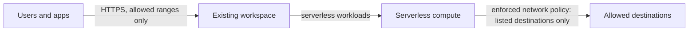

# Workspace guardrails

The bare-minimum controls every workspace needs, as a small root you apply
after any workspace deployment that doesn't include them (the `byovpc-*`
roots):

1. **Inbound:** IP access lists on the workspace front-end, so only your
   corporate and automation networks reach the UI and APIs.
2. **Serverless egress:** a network connectivity config (NCC) and an enforced
   network policy (`RESTRICTED_ACCESS`), so serverless compute can reach only
   the destinations you list.

`lpw` has the same controls built in (`enable_ip_access_list`,
`enable_network_policy`). This root uses the same model as `lpw`'s
`ip-access-list.tf` and `network-policy.tf`: entries live in
`ip_access_list.yaml` and `network_policy.yaml` next to this file.

> **Maturity: validated.** `terraform validate` and mock-provider tests pass
> in CI. Not yet applied end to end.



## Use

```bash
export GOOGLE_OAUTH_ACCESS_TOKEN=$(gcloud auth print-access-token)
export TF_VAR_databricks_account_id=<account-id>
terraform init
terraform apply \
  -var databricks_workspace_name=<workspace-name> \
  -var google_region=<region> \
  -var google_service_account_email=<automation-sa> \
  -var "workspace_url=$(terraform -chdir=../byovpc-ws output -raw workspace_url)"
```

The Well-Architected Agent generates this step for you (`new-vpc` and
`existing-vpc` builds) and wires `workspace_url` from the workspace root.

| Variable | Default | Meaning |
|---|---|---|
| `enable_ip_access_list` | `true` | Apply `ip_access_list.yaml` |
| `enable_ncc` | `true` | Create and bind an NCC |
| `enable_network_policy` | `true` | Create a `RESTRICTED_ACCESS` policy from `network_policy.yaml` |
| `network_policy_enforcement_mode` | `ENFORCED` | `DRY_RUN` only logs denials |
| `shared_network_policy_id` | `""` | Bind an existing shared policy instead of creating one |

## Before you apply

- **IP access lists:** include the IP you run Terraform from, or Terraform
  locks itself out of the workspace.
- **Restricted egress:** with an empty or short allowlist, serverless can't
  install packages from PyPI. Start with `DRY_RUN` to see what would be blocked.
- **Turning the policy off later:** the workspace's network option is
  update-only. Bind `default-policy` first (`shared_network_policy_id`), then
  remove the custom policy.
- **Skip what your workspace root already has:** `byovpc-psc-*` include IP
  access lists, so set `enable_ip_access_list = false` there.

## Tests

```bash
terraform init -backend=false && terraform test   # mock providers, no credentials
```

## References

- [IP access lists](https://docs.databricks.com/gcp/en/security/network/front-end/ip-access-list)
- [Serverless network policies](https://docs.databricks.com/gcp/en/security/network/serverless-network-security/network-policies)
