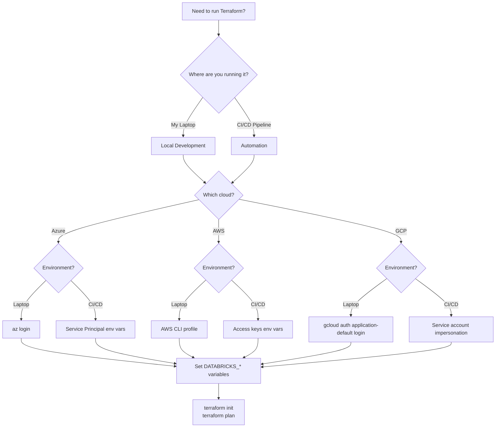

# Terraform Authentication Guide

**The Problem:** Terraform keeps saying "authentication failed" or "permission denied" and you don't know which credentials to set or where to set them.

**This Guide:** Shows you exactly how to set up authentication so Terraform can deploy Databricks on Azure, AWS, or GCP.

---

## Authentication Decision Flow

**Start here** - This diagram shows you which authentication method to use based on where you're running Terraform and which cloud you're using:



---

## Table of Contents

1. [Quick Start](#quick-start) - Get running fast
2. [Understanding Authentication](#understanding-authentication) - What's happening behind the scenes
3. [Azure Setup](#azure-authentication) - For Azure Databricks
4. [AWS Setup](#aws-authentication) - For AWS Databricks
5. [GCP Setup](#gcp-authentication) - For GCP Databricks
6. [Databricks Provider Setup](#databricks-provider-authentication) - Works on all clouds
7. [Troubleshooting](#troubleshooting) - Fix common errors
8. [Best Practices](#best-practices) - Do it right

---

## Quick Start

**Choose your cloud and follow these steps:**

### Azure Quick Start

```bash
# 1. Log in to Azure (for local testing)
az login

# 2. Set your subscription
az account set --subscription "your-subscription-id"

# 3. Create a service principal (for automation)
az ad sp create-for-rbac --name "terraform-databricks" --role Contributor \
  --scopes "/subscriptions/your-subscription-id"

# 4. Set environment variables (use values from step 3)
export ARM_CLIENT_ID="app-id-from-step-3"
export ARM_CLIENT_SECRET="password-from-step-3"
export ARM_TENANT_ID="tenant-from-step-3"
export ARM_SUBSCRIPTION_ID="your-subscription-id"

# 5. Set Databricks variables
export DATABRICKS_ACCOUNT_ID="your-databricks-account-id"
export DATABRICKS_CLIENT_ID="$ARM_CLIENT_ID"
export DATABRICKS_CLIENT_SECRET="$ARM_CLIENT_SECRET"
export DATABRICKS_AZURE_TENANT_ID="$ARM_TENANT_ID"

# 6. Run Terraform
terraform init
terraform plan
```

### AWS Quick Start

```bash
# 1. Configure AWS CLI (for local testing)
aws configure

# 2. Create a Databricks service principal at https://accounts.cloud.databricks.com
# Go to: User Management > Service Principals > Add Service Principal
# Generate an OAuth secret and save it

# 3. Set environment variables
export AWS_PROFILE="your-aws-profile"  # Or use AWS_ACCESS_KEY_ID/AWS_SECRET_ACCESS_KEY
export DATABRICKS_ACCOUNT_ID="your-account-id"
export DATABRICKS_CLIENT_ID="service-principal-client-id"
export DATABRICKS_CLIENT_SECRET="service-principal-secret"

# 4. Run Terraform
terraform init
terraform plan
```

### GCP Quick Start

```bash
# 1. Log in to GCP (for local testing)
gcloud auth application-default login

# 2. Create a service account
gcloud iam service-accounts create terraform-databricks \
  --display-name="Terraform Databricks"

# Get the email
export SA_EMAIL="terraform-databricks@your-project.iam.gserviceaccount.com"

# 3. Grant permissions
gcloud projects add-iam-policy-binding your-project \
  --member="serviceAccount:$SA_EMAIL" \
  --role="roles/editor"

# 4. Impersonate the service account
gcloud config set auth/impersonate_service_account $SA_EMAIL

# 5. Run Terraform
terraform init
terraform plan
```

---

## Understanding Authentication

### What Terraform Needs

Think of Terraform as a robot that needs keys to two doors:

1. **Cloud Door** - Access to Azure/AWS/GCP to create VPCs, storage, etc.
2. **Databricks Door** - Access to Databricks to create workspaces, clusters, etc.

You need to give Terraform both sets of keys.

### Two Ways to Give Terraform Keys

#### Option 1: Environment Variables (Recommended)

Set special variables in your terminal that Terraform automatically reads:

```bash
export ARM_CLIENT_ID="..."
export DATABRICKS_ACCOUNT_ID="..."
```

**Good for:**
- CI/CD pipelines
- Keeping secrets out of code
- Multiple environments

#### Option 2: Configuration Files

Put credentials in files like `~/.aws/credentials` or `~/.databrickscfg`.

**Good for:**
- Local development
- Switching between accounts
- Quick testing

### The Rule: Terraform Checks in This Order

1. First: Values in the provider block (in your `.tf` files)
2. Second: Environment variables
3. Third: Configuration files
4. Last: Default credentials (like AWS instance roles)

---

## Azure Authentication

### What You Need

Azure uses something called a **Service Principal** - think of it as a robot user account with its own username and password.

You need 4 pieces of information:
- `ARM_CLIENT_ID` - The robot's username
- `ARM_CLIENT_SECRET` - The robot's password
- `ARM_TENANT_ID` - Your Azure organization ID
- `ARM_SUBSCRIPTION_ID` - Which Azure subscription to use

### Local Development (Quick Testing)

For testing on your laptop:

```bash
# Log in with your user account
az login

# Terraform will use your Azure login automatically
terraform plan
```

This is the easiest but **NOT recommended for automation**.

### Production/CI-CD (Service Principal)

#### Step 1: Create Service Principal

```bash
# Replace with your subscription ID
az ad sp create-for-rbac --name "terraform-databricks" \
  --role Contributor \
  --scopes "/subscriptions/YOUR-SUBSCRIPTION-ID"
```

You'll get output like:

```json
{
  "appId": "00000000-0000-0000-0000-000000000000",
  "displayName": "terraform-databricks",
  "password": "your-secret-here",
  "tenant": "11111111-1111-1111-1111-111111111111"
}
```

#### Step 2: Set Environment Variables

Create a file called `azure-auth.sh`:

```bash
#!/bin/bash
# azure-auth.sh - Azure and Databricks authentication

# Azure Cloud Authentication
export ARM_CLIENT_ID="00000000-0000-0000-0000-000000000000"      # appId from step 1
export ARM_CLIENT_SECRET="your-secret-here"                      # password from step 1
export ARM_TENANT_ID="11111111-1111-1111-1111-111111111111"      # tenant from step 1
export ARM_SUBSCRIPTION_ID="22222222-2222-2222-2222-222222222222"

# Databricks Authentication (reuses Azure credentials)
export DATABRICKS_ACCOUNT_ID="your-databricks-account-id"
export DATABRICKS_CLIENT_ID="$ARM_CLIENT_ID"
export DATABRICKS_CLIENT_SECRET="$ARM_CLIENT_SECRET"
export DATABRICKS_AZURE_TENANT_ID="$ARM_TENANT_ID"

echo "✅ Azure and Databricks credentials loaded"
```

Load it:

```bash
source azure-auth.sh
```

#### Step 3: Configure Terraform Providers

In your `providers.tf`:

```hcl
# Azure Provider - manages Azure resources (VNets, storage, etc.)
provider "azurerm" {
  features {
    resource_group {
      prevent_deletion_if_contains_resources = false
    }
  }

  # Authentication happens automatically via ARM_* environment variables
  # No need to specify credentials here
}

# Databricks Account Provider - manages account-level stuff (metastore, Unity Catalog)
provider "databricks" {
  alias      = "account"
  host       = "https://accounts.azuredatabricks.net"
  account_id = var.databricks_account_id

  # Authentication happens automatically via DATABRICKS_* environment variables
}

# Databricks Workspace Provider - manages workspace stuff (clusters, jobs)
provider "databricks" {
  alias = "workspace"
  host  = try(module.workspace.workspace_url, "https://placeholder.azuredatabricks.net")

  # Authentication happens automatically via DATABRICKS_* environment variables
}
```

#### Step 4: Test It

```bash
# Load credentials
source azure-auth.sh

# Initialize Terraform
terraform init

# Test authentication
terraform plan
```

---

## AWS Authentication

### What You Need

AWS uses **IAM** for cloud access and **OAuth Service Principals** for Databricks.

For AWS:
- Access Key ID + Secret Access Key, OR
- AWS CLI profile, OR
- IAM role (if running on AWS)

For Databricks:
- Service Principal Client ID
- Service Principal Secret

### Local Development (AWS CLI Profile)

#### Step 1: Configure AWS CLI

```bash
aws configure --profile databricks-deploy
# Enter when prompted:
#   AWS Access Key ID: your-key
#   AWS Secret Access Key: your-secret
#   Default region: us-west-2
#   Default output format: json
```

#### Step 2: Use the Profile

In your `providers.tf`:

```hcl
provider "aws" {
  region  = "us-west-2"
  profile = "databricks-deploy"  # Uses the profile from Step 1
}
```

Or use environment variable:

```bash
export AWS_PROFILE="databricks-deploy"
terraform plan
```

### Production/CI-CD (Service Principal + Access Keys)

#### Step 1: Create Databricks Service Principal

1. Go to https://accounts.cloud.databricks.com
2. Click **User Management** > **Service Principals**
3. Click **Add Service Principal**
4. Give it a name like "terraform-automation"
5. Click **Generate Secret** - save the Client ID and Secret

#### Step 2: Create AWS IAM User (Optional)

If you don't have AWS access keys:

```bash
# Create IAM user
aws iam create-user --user-name terraform-databricks

# Attach policies
aws iam attach-user-policy --user-name terraform-databricks \
  --policy-arn arn:aws:iam::aws:policy/AdministratorAccess

# Create access keys
aws iam create-access-key --user-name terraform-databricks
```

Save the `AccessKeyId` and `SecretAccessKey`.

#### Step 3: Set Environment Variables

Create a file called `aws-auth.sh`:

```bash
#!/bin/bash
# aws-auth.sh - AWS and Databricks authentication

# AWS Authentication
export AWS_ACCESS_KEY_ID="AKIA..."
export AWS_SECRET_ACCESS_KEY="your-secret-key"
export AWS_DEFAULT_REGION="us-west-2"

# Databricks Authentication
export DATABRICKS_ACCOUNT_ID="your-databricks-account-id"
export DATABRICKS_CLIENT_ID="service-principal-client-id"
export DATABRICKS_CLIENT_SECRET="service-principal-secret"

echo "✅ AWS and Databricks credentials loaded"
```

Load it:

```bash
source aws-auth.sh
```

#### Step 4: Configure Terraform Providers

In your `providers.tf`:

```hcl
# AWS Provider - manages AWS resources (VPCs, S3, IAM, etc.)
provider "aws" {
  region = var.region

  # Authentication happens automatically via AWS_* environment variables
}

# Databricks Account Provider - manages account-level resources
provider "databricks" {
  alias         = "account"
  host          = "https://accounts.cloud.databricks.com"
  account_id    = var.databricks_account_id
  client_id     = var.databricks_client_id
  client_secret = var.databricks_client_secret
}

# Databricks Workspace Provider - manages workspace resources
provider "databricks" {
  alias         = "workspace"
  host          = module.databricks_workspace.workspace_url
  client_id     = var.databricks_client_id
  client_secret = var.databricks_client_secret
}
```

In your `variables.tf`:

```hcl
variable "databricks_account_id" {
  description = "Databricks account ID"
  type        = string
  sensitive   = true
}

variable "databricks_client_id" {
  description = "Databricks service principal client ID"
  type        = string
  sensitive   = true
}

variable "databricks_client_secret" {
  description = "Databricks service principal secret"
  type        = string
  sensitive   = true
}
```

#### Step 5: Test It

```bash
source aws-auth.sh
terraform init
terraform plan
```

### AWS SSO (Enterprise)

If your company uses AWS SSO:

```bash
# Configure SSO
aws configure sso
# Follow prompts...

# Login before running Terraform
aws sso login --profile your-sso-profile

# Use the profile
export AWS_PROFILE="your-sso-profile"
terraform plan
```

---

## GCP Authentication

### What You Need

GCP uses **Service Accounts** - similar to Azure Service Principals but simpler.

You need:
- A Service Account email (like `terraform@project.iam.gserviceaccount.com`)
- Permissions granted to that account
- A way to authenticate as that account

### Local Development (Application Default Credentials)

This is the easiest for testing:

```bash
# Log in with your Google account
gcloud auth application-default login

# Terraform will use your credentials automatically
terraform plan
```

### Production/CI-CD (Service Account Impersonation)

This is more secure than key files.

#### Step 1: Create Service Account

```bash
# Set your project
export PROJECT_ID="your-project-id"

# Create service account
gcloud iam service-accounts create terraform-databricks \
  --display-name="Terraform Databricks Automation" \
  --project=$PROJECT_ID

# Get the email
export SA_EMAIL="terraform-databricks@${PROJECT_ID}.iam.gserviceaccount.com"
```

#### Step 2: Grant Permissions

```bash
# Grant Editor role (adjust as needed)
gcloud projects add-iam-policy-binding $PROJECT_ID \
  --member="serviceAccount:$SA_EMAIL" \
  --role="roles/editor"

# If using shared VPC
gcloud projects add-iam-policy-binding $SHARED_VPC_PROJECT \
  --member="serviceAccount:$SA_EMAIL" \
  --role="roles/compute.networkUser"
```

#### Step 3: Impersonate Service Account

```bash
# Set impersonation
gcloud config set auth/impersonate_service_account $SA_EMAIL

# Generate access token
export GOOGLE_OAUTH_ACCESS_TOKEN=$(gcloud auth print-access-token)
```

#### Step 4: Configure Terraform Providers

In your `providers.tf`:

```hcl
# GCP Provider - manages GCP resources
provider "google" {
  project = var.google_project_name
  region  = var.google_region

  # Authentication via Application Default Credentials
  # or GOOGLE_OAUTH_ACCESS_TOKEN environment variable
}

# Databricks Account Provider
provider "databricks" {
  alias                  = "accounts"
  host                   = "https://accounts.gcp.databricks.com"
  account_id             = var.databricks_account_id
  google_service_account = var.google_service_account_email
}

# Databricks Workspace Provider
provider "databricks" {
  alias                  = "workspace"
  host                   = databricks_mws_workspaces.this.workspace_url
  google_service_account = var.google_service_account_email
}
```

In your `variables.tf`:

```hcl
variable "google_service_account_email" {
  description = "GCP service account email for Databricks"
  type        = string
}

variable "google_project_name" {
  description = "GCP project ID"
  type        = string
}
```

#### Step 5: Create Auth Script

Create `gcp-auth.sh`:

```bash
#!/bin/bash
# gcp-auth.sh - GCP and Databricks authentication

export PROJECT_ID="your-project-id"
export SA_EMAIL="terraform-databricks@${PROJECT_ID}.iam.gserviceaccount.com"

# Set impersonation
gcloud config set auth/impersonate_service_account $SA_EMAIL

# Generate and export access token
export GOOGLE_OAUTH_ACCESS_TOKEN=$(gcloud auth print-access-token)

# Databricks configuration
export DATABRICKS_ACCOUNT_ID="your-databricks-account-id"

echo "✅ GCP and Databricks credentials loaded"
```

#### Step 6: Test It

```bash
source gcp-auth.sh
terraform init
terraform plan
```

### Alternative: Service Account Key File (Not Recommended)

If you must use a key file:

```bash
# Create key
gcloud iam service-accounts keys create ~/sa-key.json \
  --iam-account=$SA_EMAIL

# Use it
export GOOGLE_APPLICATION_CREDENTIALS=~/sa-key.json
terraform plan
```

**Warning:** Key files are security risks. Anyone with the file has full access. Use impersonation instead.

---

## Databricks Provider Authentication

### Two Provider Types

Databricks Terraform configurations use **two provider aliases**:

```hcl
provider "databricks" {
  alias = "account"
  # For account-level stuff
}

provider "databricks" {
  alias = "workspace"
  # For workspace-level stuff
}
```

**Why two?**
- **Account provider** manages things that affect multiple workspaces (Unity Catalog metastore, network config)
- **Workspace provider** manages things inside one workspace (clusters, jobs, notebooks)

### Account-Level vs Workspace-Level

| Account-Level (alias = "account") | Workspace-Level (alias = "workspace") |
|-----------------------------------|--------------------------------------|
| Unity Catalog metastore | Clusters |
| Network Connectivity Config (NCC) | Jobs |
| Workspaces | Notebooks |
| Account users/groups | Workspace users/groups |
| Storage credentials | Workspace settings |

### Authentication by Cloud

#### Azure Databricks

Use the same Service Principal for both cloud and Databricks:

```bash
# These 4 variables authenticate both Azure AND Databricks
export ARM_CLIENT_ID="00000000-0000-0000-0000-000000000000"
export ARM_CLIENT_SECRET="your-secret"
export ARM_TENANT_ID="11111111-1111-1111-1111-111111111111"
export ARM_SUBSCRIPTION_ID="22222222-2222-2222-2222-222222222222"

# Databricks-specific variables
export DATABRICKS_ACCOUNT_ID="your-databricks-account-id"
export DATABRICKS_CLIENT_ID="$ARM_CLIENT_ID"          # Reuse Azure client ID
export DATABRICKS_CLIENT_SECRET="$ARM_CLIENT_SECRET"  # Reuse Azure secret
export DATABRICKS_AZURE_TENANT_ID="$ARM_TENANT_ID"    # Reuse Azure tenant ID
```

Provider configuration:

```hcl
provider "databricks" {
  alias      = "account"
  host       = "https://accounts.azuredatabricks.net"
  account_id = var.databricks_account_id
  # Reads DATABRICKS_CLIENT_ID, DATABRICKS_CLIENT_SECRET, DATABRICKS_AZURE_TENANT_ID automatically
}
```

#### AWS Databricks

Use OAuth credentials (separate from AWS IAM):

```bash
# AWS credentials (for AWS provider)
export AWS_ACCESS_KEY_ID="AKIA..."
export AWS_SECRET_ACCESS_KEY="your-secret"

# Databricks credentials (different from AWS)
export DATABRICKS_ACCOUNT_ID="your-databricks-account-id"
export DATABRICKS_CLIENT_ID="service-principal-client-id"
export DATABRICKS_CLIENT_SECRET="service-principal-secret"
```

Provider configuration:

```hcl
provider "databricks" {
  alias         = "account"
  host          = "https://accounts.cloud.databricks.com"
  account_id    = var.databricks_account_id
  client_id     = var.databricks_client_id
  client_secret = var.databricks_client_secret
}
```

#### GCP Databricks

Use GCP Service Account:

```bash
# GCP authentication
gcloud config set auth/impersonate_service_account $SA_EMAIL
export GOOGLE_OAUTH_ACCESS_TOKEN=$(gcloud auth print-access-token)

# Databricks uses the GCP service account
export DATABRICKS_ACCOUNT_ID="your-databricks-account-id"
export DATABRICKS_GOOGLE_SERVICE_ACCOUNT="terraform-databricks@project.iam.gserviceaccount.com"
```

Provider configuration:

```hcl
provider "databricks" {
  alias                  = "accounts"
  host                   = "https://accounts.gcp.databricks.com"
  account_id             = var.databricks_account_id
  google_service_account = var.google_service_account_email
}
```

---

## Troubleshooting

### Error: "authentication is not configured for provider"

**What it means:** Terraform can't find any credentials.

**Fix:**

1. Check if environment variables are set:

```bash
# Azure
echo $ARM_CLIENT_ID
echo $DATABRICKS_ACCOUNT_ID

# AWS
echo $AWS_ACCESS_KEY_ID
echo $DATABRICKS_CLIENT_ID

# GCP
echo $GOOGLE_OAUTH_ACCESS_TOKEN
echo $DATABRICKS_ACCOUNT_ID
```

If empty, your environment variables aren't set. Run your auth script:

```bash
source azure-auth.sh  # or aws-auth.sh or gcp-auth.sh
```

2. Make sure you're in the same terminal where you set the variables.

3. Check your provider block has the right configuration.

### Error: "Failed to retrieve tenant ID for given token" (Azure)

**What it means:** Databricks can't figure out your Azure tenant ID.

**Fix:**

Add this environment variable:

```bash
export DATABRICKS_AZURE_TENANT_ID="$ARM_TENANT_ID"
```

Or in your provider block:

```hcl
provider "databricks" {
  alias           = "account"
  host            = "https://accounts.azuredatabricks.net"
  account_id      = var.databricks_account_id
  azure_tenant_id = var.databricks_azure_tenant_id  # Add this
}
```

### Error: "AuthorizationFailed" or "403 Forbidden"

**What it means:** Your credentials work, but they don't have permission.

**Fix:**

Azure:
```bash
# Grant Contributor role to service principal
az role assignment create \
  --assignee $ARM_CLIENT_ID \
  --role Contributor \
  --scope "/subscriptions/$ARM_SUBSCRIPTION_ID"
```

AWS:
```bash
# Check your IAM permissions
aws iam get-user
aws iam list-attached-user-policies --user-name your-user
```

GCP:
```bash
# Grant permissions to service account
gcloud projects add-iam-policy-binding $PROJECT_ID \
  --member="serviceAccount:$SA_EMAIL" \
  --role="roles/editor"
```

### Error: "InvalidAuthenticationToken"

**What it means:** Your token is expired or wrong.

**Fix:**

Azure:
```bash
# Re-login
az login
# Or create new service principal
```

AWS:
```bash
# Re-login to SSO
aws sso login --profile your-profile
# Or verify credentials
aws sts get-caller-identity
```

GCP:
```bash
# Regenerate token
gcloud auth application-default login
# Or refresh access token
export GOOGLE_OAUTH_ACCESS_TOKEN=$(gcloud auth print-access-token)
```

### Error: "User is not authorized to perform action"

**What it means:** Your Databricks service principal doesn't have workspace/account admin rights.

**Fix:**

1. Go to your Databricks account console: https://accounts.cloud.databricks.com (or .azuredatabricks.net for Azure)
2. Click **User Management** > **Service Principals**
3. Find your service principal
4. Assign **Account Admin** role

### Debugging Commands

**Verify you can reach cloud:**

Azure:
```bash
az account show
az account list-locations --output table
```

AWS:
```bash
aws sts get-caller-identity
aws s3 ls  # Test basic access
```

GCP:
```bash
gcloud config list
gcloud projects list
```

**Test Terraform can authenticate:**

```bash
# See what Terraform will do without making changes
terraform plan

# Enable debug logging
export TF_LOG=DEBUG
terraform plan 2>&1 | grep -i auth
```

---

## Best Practices

### Security

#### Never Commit Credentials

Add to `.gitignore`:

```gitignore
# Authentication scripts with real credentials
*-auth.sh
*.env

# Terraform files that might contain secrets
*.tfvars
terraform.tfstate
terraform.tfstate.backup
.terraform/

# Cloud credentials
.aws/credentials
.azure/
.config/gcloud/
```

#### Use Environment Variables for Secrets

**Good:**
```bash
export ARM_CLIENT_SECRET="$SECRET_FROM_VAULT"
```

**Bad:**
```hcl
provider "azurerm" {
  client_secret = "actual-secret-here"  # DON'T DO THIS
}
```

#### Rotate Credentials Regularly

Set a calendar reminder to rotate:
- Service principal secrets (every 90 days)
- Access keys (every 90 days)
- Personal access tokens (every 30 days)

#### Use Least Privilege

Don't grant more permissions than needed:
- Development: Read-only where possible
- CI/CD: Only permissions needed to deploy
- Production: Separate service principals per environment

### Development Workflow

#### Local Development

Use your personal account:

```bash
# Azure
az login

# AWS
aws sso login --profile dev

# GCP
gcloud auth application-default login
```

#### CI/CD Pipelines

Use service principals with secrets from your secret manager:

```yaml
# GitHub Actions example
- name: Azure Login
  env:
    ARM_CLIENT_ID: ${{ secrets.AZURE_CLIENT_ID }}
    ARM_CLIENT_SECRET: ${{ secrets.AZURE_CLIENT_SECRET }}
    ARM_TENANT_ID: ${{ secrets.AZURE_TENANT_ID }}
```

#### Team Setup

Create a README in your repo:

```markdown
# Authentication Setup

## Prerequisites
- Azure CLI installed
- Access to Azure subscription: `12345-67890`
- Access to Databricks account

## Quick Start
1. Run `./setup-auth.sh`
2. Run `terraform plan`

## Getting Credentials
See [Terraform Authentication Guide](link-to-this-guide)
```

### Multi-Environment Management

#### Separate Service Principals

Create one per environment:

```
terraform-databricks-dev
terraform-databricks-staging
terraform-databricks-prod
```

#### Environment-Specific Variable Files

```
terraform.dev.tfvars
terraform.staging.tfvars
terraform.prod.tfvars
```

Never commit these files!

#### Use Terraform Workspaces

```bash
# Create workspaces
terraform workspace new dev
terraform workspace new prod

# Switch between them
terraform workspace select dev
terraform plan

terraform workspace select prod
terraform plan
```

---

## Quick Reference

### Environment Variables Cheat Sheet

#### Azure

| Variable | What It Is | Where to Get It |
|----------|-----------|-----------------|
| `ARM_CLIENT_ID` | Service principal app ID | Output from `az ad sp create-for-rbac` |
| `ARM_CLIENT_SECRET` | Service principal password | Output from `az ad sp create-for-rbac` |
| `ARM_TENANT_ID` | Your Azure org ID | Output from `az ad sp create-for-rbac` or `az account show` |
| `ARM_SUBSCRIPTION_ID` | Which Azure subscription to use | `az account show` |
| `DATABRICKS_ACCOUNT_ID` | Your Databricks account ID | https://accounts.azuredatabricks.net |
| `DATABRICKS_CLIENT_ID` | Same as `ARM_CLIENT_ID` | Reuse from Azure |
| `DATABRICKS_CLIENT_SECRET` | Same as `ARM_CLIENT_SECRET` | Reuse from Azure |
| `DATABRICKS_AZURE_TENANT_ID` | Same as `ARM_TENANT_ID` | Reuse from Azure |

#### AWS

| Variable | What It Is | Where to Get It |
|----------|-----------|-----------------|
| `AWS_ACCESS_KEY_ID` | AWS user access key | IAM console or `aws iam create-access-key` |
| `AWS_SECRET_ACCESS_KEY` | AWS user secret | IAM console or `aws iam create-access-key` |
| `AWS_SESSION_TOKEN` | Temporary session token | From STS or SSO login |
| `AWS_PROFILE` | Named profile from config | `~/.aws/credentials` or `aws configure` |
| `DATABRICKS_ACCOUNT_ID` | Your Databricks account ID | https://accounts.cloud.databricks.com |
| `DATABRICKS_CLIENT_ID` | Service principal client ID | Databricks console > Service Principals |
| `DATABRICKS_CLIENT_SECRET` | Service principal secret | Databricks console > Service Principals > Generate Secret |

#### GCP

| Variable | What It Is | Where to Get It |
|----------|-----------|-----------------|
| `GOOGLE_APPLICATION_CREDENTIALS` | Path to service account key | Download from IAM console |
| `GOOGLE_OAUTH_ACCESS_TOKEN` | Temporary access token | `gcloud auth print-access-token` |
| `DATABRICKS_ACCOUNT_ID` | Your Databricks account ID | https://accounts.gcp.databricks.com |
| `DATABRICKS_GOOGLE_SERVICE_ACCOUNT` | Service account email | IAM console or `gcloud iam service-accounts list` |

### Common Commands

#### Check What Credentials Are Set

```bash
# See all environment variables
env | grep -E "(ARM|AWS|GOOGLE|DATABRICKS)_"

# Check if specific variable is set
echo $ARM_CLIENT_ID
```

#### Test Cloud Authentication

```bash
# Azure
az account show

# AWS
aws sts get-caller-identity

# GCP
gcloud auth list
gcloud config list
```

#### Test Terraform Authentication

```bash
# See what Terraform would do
terraform plan

# Validate configuration
terraform validate

# Show provider configuration
terraform providers
```

#### Clear Credentials

```bash
# Unset environment variables
unset ARM_CLIENT_ID ARM_CLIENT_SECRET ARM_TENANT_ID ARM_SUBSCRIPTION_ID
unset AWS_ACCESS_KEY_ID AWS_SECRET_ACCESS_KEY AWS_SESSION_TOKEN
unset DATABRICKS_ACCOUNT_ID DATABRICKS_CLIENT_ID DATABRICKS_CLIENT_SECRET
```

---

## Additional Resources

### Official Documentation

- [Databricks Terraform Provider Docs](https://registry.terraform.io/providers/databricks/databricks/latest/docs)
- [Azure Provider Docs](https://registry.terraform.io/providers/hashicorp/azurerm/latest/docs)
- [AWS Provider Docs](https://registry.terraform.io/providers/hashicorp/aws/latest/docs)
- [Google Provider Docs](https://registry.terraform.io/providers/hashicorp/google/latest/docs)

### In This Repository

#### Azure Databricks

- [Azure Databricks Main Guide](../adb4u/README.md)
- [Azure Deployment Checklist](../adb4u/docs/02-DEPLOYMENT-CHECKLIST.md)
- [Azure Troubleshooting](../adb4u/docs/04-TROUBLESHOOTING.md)

#### AWS Databricks

- [AWS Databricks Main Guide](../awsdb4u/README.md)
- [AWS Prerequisites](../awsdb4u/aws-pl-ws/databricks-aws-production/docs/00-PREREQUISITES.md)
- [AWS IAM & Security](../awsdb4u/aws-pl-ws/databricks-aws-production/docs/02-IAM-SECURITY.md)

#### GCP Databricks

- [GCP Databricks Main Guide](../gcpdb4u/readme.md)
- [GCP Service Account Impersonation](../gcpdb4u/templates/terraform-scripts/sa-impersonation.md)
- [GCP Workspace Provisioning](../gcpdb4u/Workspace-Provisioning.md)

### Provider Configuration Examples

Real working examples from this repository:

- **Azure**: [adb4u/deployments/non-pl/providers.tf](../adb4u/deployments/non-pl/providers.tf)
- **AWS**: [awsdb4u/aws-pl-ws/databricks-aws-production/main.tf](../awsdb4u/aws-pl-ws/databricks-aws-production/main.tf)
- **GCP**: [gcpdb4u/templates/terraform-scripts/lpw/module/providers.tf](../gcpdb4u/templates/terraform-scripts/lpw/module/providers.tf)

---

## Still Stuck?

If this guide didn't solve your problem:

1. Check the [Troubleshooting](#troubleshooting) section again
2. Look at the cloud-specific documentation links above
3. Enable debug logging: `export TF_LOG=DEBUG`
4. Search for your error message in the Databricks community forums

**Remember:** 90% of authentication problems are:
- Environment variables not set
- Running in wrong terminal/session
- Service principal missing permissions
- Typo in credential values

Double-check these first!
