# How Databricks Accesses Your Cloud

**The Problem:** You're confused about how Databricks actually gets into your AWS/Azure/GCP account to create workspaces and access storage. Terms like "cross-account role," "first-party app," and "service account" are flying around and you just want to understand what's happening.

**This Guide:** Explains in simple terms how Databricks identities work across clouds, why each cloud is different, and how your data stays secure.

---

## Table of Contents

**Quick Navigation:**

- [The Big Picture](#the-big-picture) - Understand the core concept
- [Quick Visual Overview](#quick-visual-overview) - Decision flow diagram
- **Cloud-Specific Details:**
  - [AWS: The "Temporary Key" Model](#aws-the-temporary-key-model)
  - [Azure: The "First-Party App" Model](#azure-the-first-party-app-model)
  - [GCP: The "Service Account" Model](#gcp-the-service-account-model)
- [Unity Catalog: The Universal Data Governance Layer](#unity-catalog-the-universal-data-governance-layer)
- [Security: Why This Design Is Safe](#security-why-this-design-is-safe)
- [Common Questions](#common-questions)
- [Comparison: All Three Clouds](#comparison-all-three-clouds)
- [Visual Summary](#visual-summary)
- [Next Steps](#next-steps)

---

## The Big Picture

Think of Databricks as a **construction company** that needs to build a house (workspace) on your property (cloud account).

**The Question:** How do you give them access without handing over the keys to your entire property?

**The Answer:** Each cloud has a different way of handling this:
- **AWS**: Databricks "borrows" temporary credentials (AssumeRole)
- **Azure**: Databricks is a trusted neighbor with a master key (First-party app)
- **GCP**: Databricks creates a worker who you approve (Service Account)

Let's break down each one...

---

## Quick Visual Overview

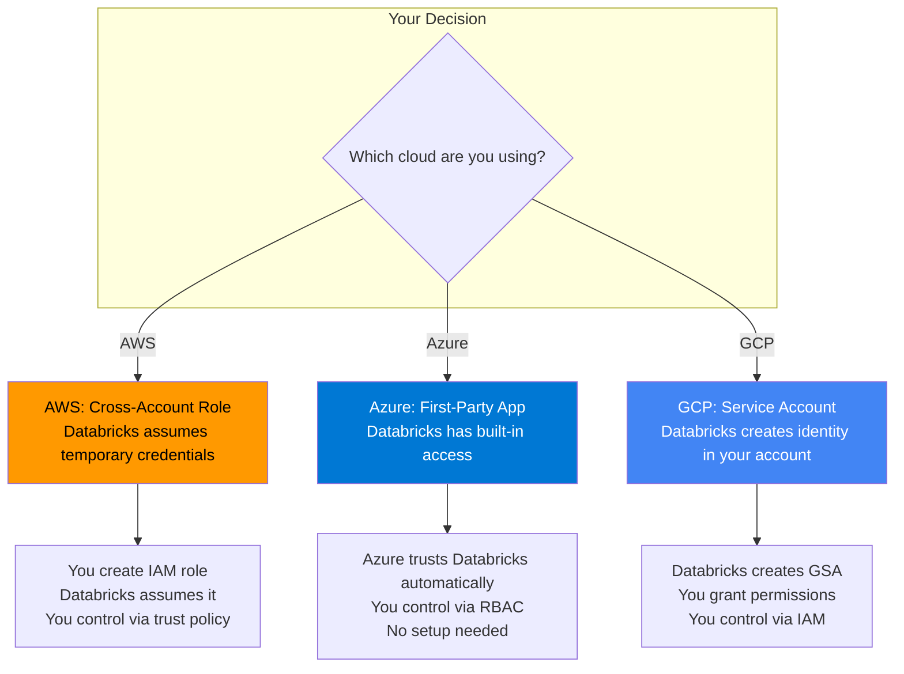

---

## AWS: The "Temporary Key" Model

### How It Works

Imagine you hire a contractor. Instead of giving them a permanent key, you:
1. Create a special lockbox (IAM role) that opens your door
2. Tell the lockbox "only the contractor can use this" (trust policy)
3. The contractor uses it when needed, but it expires (temporary credentials)

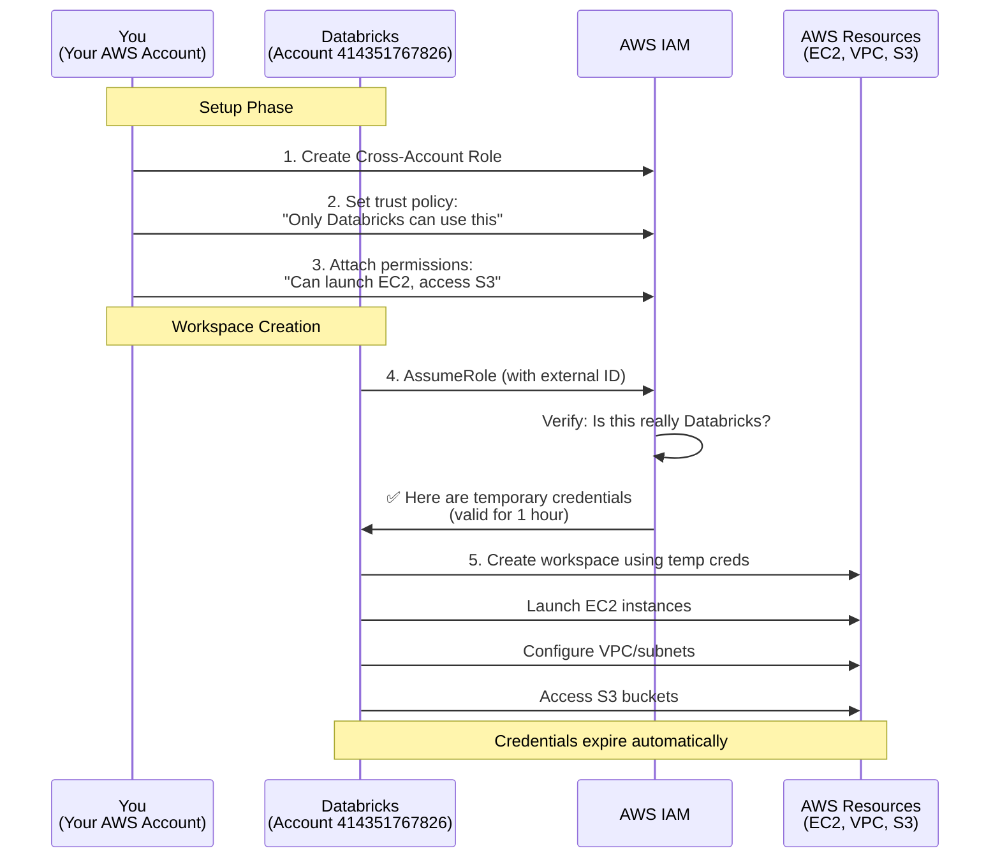

### The Roles You Create

You create **multiple roles** for different purposes:

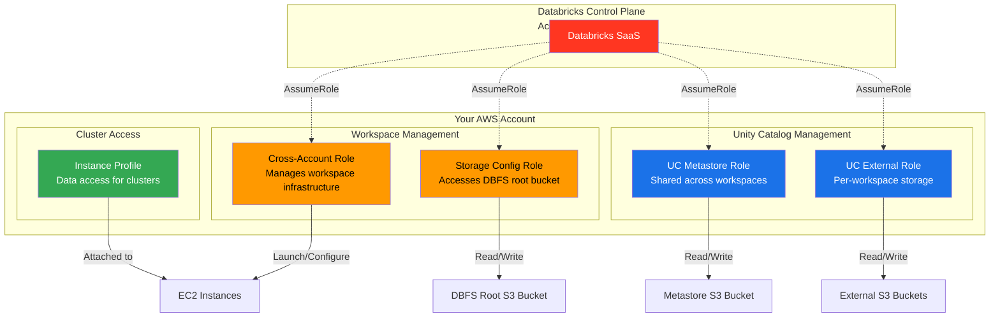

### What Each Role Does

| Role | Purpose | Who Uses It | When Created |
|------|---------|-------------|--------------|
| **Cross-Account Role** | Creates workspace, launches clusters, manages VPC | Databricks control plane | Before workspace |
| **Storage Config Role** | Accesses DBFS root bucket (workspace files) | Databricks control plane | Before workspace |
| **UC Metastore Role** | Accesses Unity Catalog shared storage | Databricks control plane | Before metastore |
| **UC External Role** | Accesses workspace-specific catalog storage | Databricks control plane | During UC setup |
| **Instance Profile** | Gives clusters access to your data | Cluster VMs | Before clusters run |

### Trust Policy: The Security Gate

Every role has a **trust policy** that says "who can use this role":

```json
{
  "Version": "2012-10-17",
  "Statement": [{
    "Effect": "Allow",
    "Principal": {
      "AWS": "arn:aws:iam::414351767826:root"
    },
    "Action": "sts:AssumeRole",
    "Condition": {
      "StringEquals": {
        "sts:ExternalId": "your-databricks-account-id"
      }
    }
  }]
}
```

**What this means in English:**
- "Let Databricks (account `414351767826`) use this role"
- "But ONLY if they prove they have the right external ID"
- "That external ID is YOUR Databricks account ID"

**Why it's secure:**
- Databricks can't use this role for other customers
- Only YOUR Databricks account can use it
- Credentials expire automatically (temporary)
- You can revoke access anytime by deleting the role

### Unity Catalog Storage Access

Unity Catalog uses a special pattern with an **external_id** for extra security:

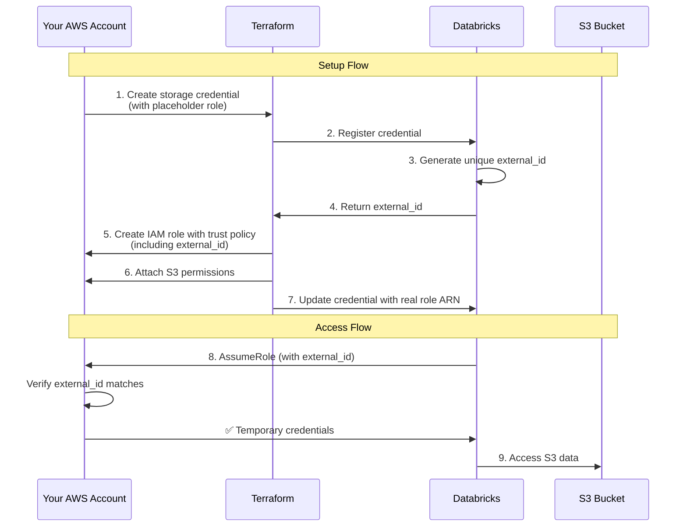

**Why the external_id?**
- **Prevents confused deputy attack**: Another Databricks customer can't trick Databricks into accessing YOUR data
- **Unique per credential**: Each storage credential gets its own external_id
- **Auto-generated**: You don't pick it, Databricks does

---

## Azure: The "First-Party App" Model

### How It Works

Azure Databricks is **built into Azure** - it's not a separate company accessing your account. Think of it like this:

Imagine Azure is an apartment building:
- You rent an apartment (subscription)
- Databricks is the building's official maintenance service
- The building owner (Microsoft) already gave Databricks a master key
- You control what Databricks can access using apartment rules (RBAC)

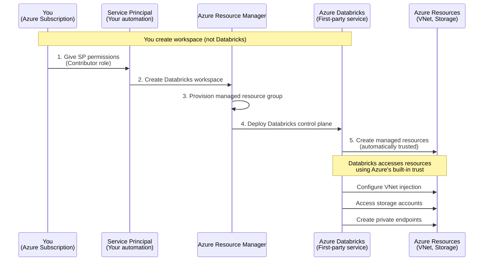

### Key Differences from AWS

| Aspect | AWS | Azure |
|--------|-----|-------|
| **Who creates workspace** | Databricks (via API) | You (via Azure Portal/Terraform) |
| **Identity setup** | You create cross-account role | Nothing - it's built-in |
| **Trust mechanism** | AssumeRole with external ID | First-party app (trusted by Azure) |
| **Resource management** | Databricks manages in its account | Resources in YOUR subscription |
| **Managed resource group** | Doesn't exist | Auto-created by Azure |

### What You Create

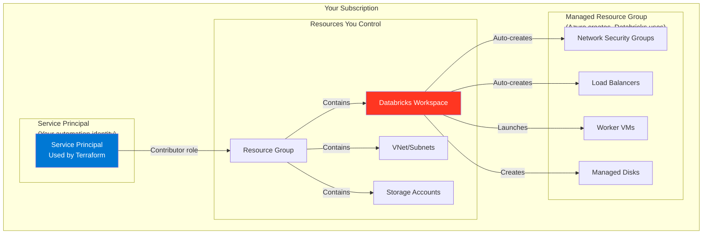

### Unity Catalog Storage Access

Azure uses **Managed Identities** instead of service principals for UC:

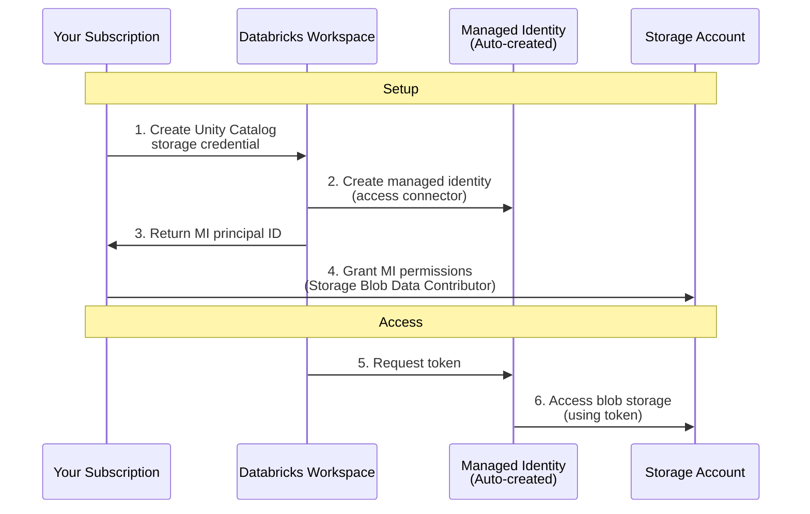

**Why Managed Identity?**
- **No secrets to manage**: No passwords or keys
- **Automatic rotation**: Azure handles credential lifecycle
- **Built-in audit trail**: All access logged in Azure AD

### What Access Connector Does

The **Access Connector** is a special Azure resource that holds the managed identity:

```
Access Connector = Managed Identity Wrapper
```

It lets Databricks:
- Access Azure Data Lake Storage (ADLS Gen2)
- Access storage accounts for Unity Catalog
- Use Azure Key Vault for secrets
- Connect to other Azure services

**You create it once**, reuse it across:
- Multiple workspaces
- Multiple storage credentials
- Multiple Unity Catalog metastores

---

## GCP: The "Service Account" Model

### How It Works

GCP has a unique model where Databricks creates a **service account IN YOUR PROJECT**:

Imagine hiring a new employee:
1. Databricks "hires" someone to work in your office (creates GSA in your project)
2. You decide what this employee can access (grant IAM permissions)
3. The employee works on Databricks' behalf but lives in your org

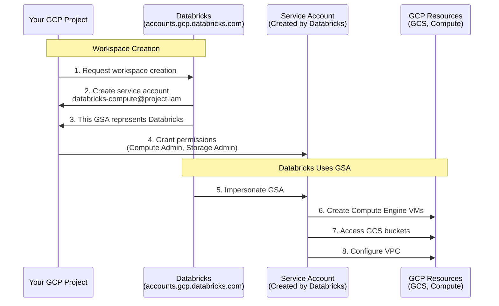

### The Service Account Pattern

GCP has **MULTIPLE service accounts** working together - some in YOUR project, some in Databricks' project:

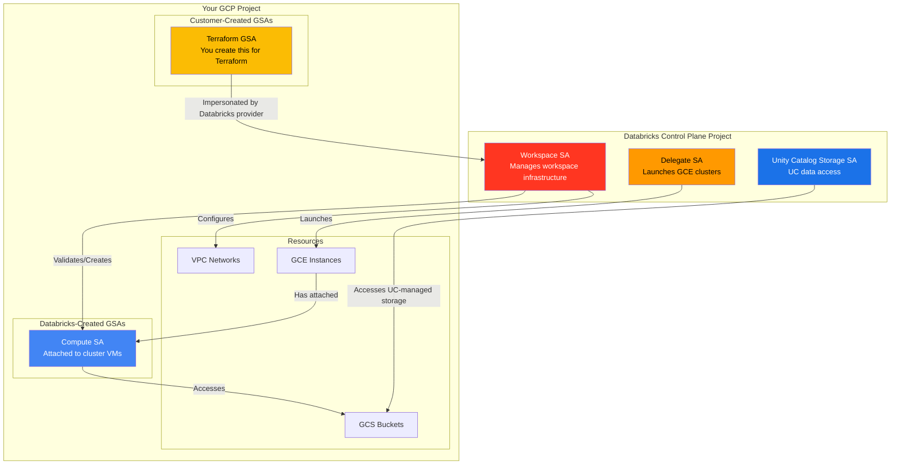

### Who Creates What and Why

The key to understanding GCP is knowing **which GSA lives where and who creates it**:

#### GSAs in Databricks' Control Plane (They Create & Own)

**1. Workspace SA** - `db-{workspaceid}@prod-gcp-{region}.iam.gserviceaccount.com`
- **Purpose**: Manages your workspace infrastructure
- **Created**: Automatically when workspace is created
- **Lives in**: Databricks' GCP project (not yours)
- **What it does**: Validates and creates the Compute SA in your project, configures VPC, manages workspace resources
- **Permissions**: Uses three custom roles auto-created by Databricks:
  - **Databricks Project Role v2**: Project-level permissions
  - **Databricks Resource Role v2**: Workspace-scoped with IAM condition
  - **Databricks Network Role v2**: VPC network permissions
  - [Full details](https://docs.databricks.com/gcp/en/admin/cloud-configurations/gcp/permissions#required-permissions-for-the-workspace-service-account)

**2. Delegate SA** - `delegate-sa@prod-gcp-{region}.iam.gserviceaccount.com`
- **Purpose**: Launches GCE cluster instances
- **Created**: Pre-existing (one per region)
- **Lives in**: Databricks' GCP project
- **What it does**: Creates and manages Compute Engine VMs for clusters

**3. Unity Catalog Storage SA** - `db-uc-storage-UUID@uc-{region}.iam.gserviceaccount.com`
- **Purpose**: Unity Catalog data access
- **Created**: When you set up Unity Catalog
- **Lives in**: Databricks' UC project
- **What it does**: Accesses GCS buckets for Unity Catalog with scoped, short-lived tokens

#### GSAs in Your Project (You Control Permissions)

**4. Compute SA** - `databricks-compute@{your-project}.iam.gserviceaccount.com`
- **Purpose**: Default identity attached to every cluster VM
- **Created**: Automatically by Databricks Workspace SA (or you can pre-create it)
- **Lives in**: YOUR GCP project
- **What it does**: Cluster VMs use this to access GCS, write logs, send metrics
- **Minimum permissions** (auto-granted): `roles/logging.logWriter` + `roles/monitoring.metricWriter`
- **Additional permissions**: You grant based on data access needs (e.g., Storage Object Viewer)

**5. Terraform/Automation SA** - `terraform-automation@{your-project}.iam.gserviceaccount.com`
- **Purpose**: Used by Terraform to create workspace
- **Created**: By you
- **Lives in**: YOUR GCP project
- **What it does**: Databricks Terraform provider impersonates this to call Databricks APIs
- **Permissions**: `roles/owner` on workspace and VPC projects (simplest), or custom role with [workspace creator permissions](https://docs.databricks.com/gcp/en/admin/cloud-configurations/gcp/permissions#required-permissions-for-the-workspace-creator)

### The Key Difference

Unlike AWS (where YOU create all IAM roles) or Azure (where it's built-in), GCP uses a **hybrid model**:
- Databricks **creates GSAs in THEIR projects** (Workspace SA, Delegate SA, UC SA)
- Databricks **creates GSAs in YOUR project** (Compute SA)
- You **grant permissions** to Databricks' GSAs to access your resources
- You **create your own GSA** for Terraform automation

### How Workspace Creation Works

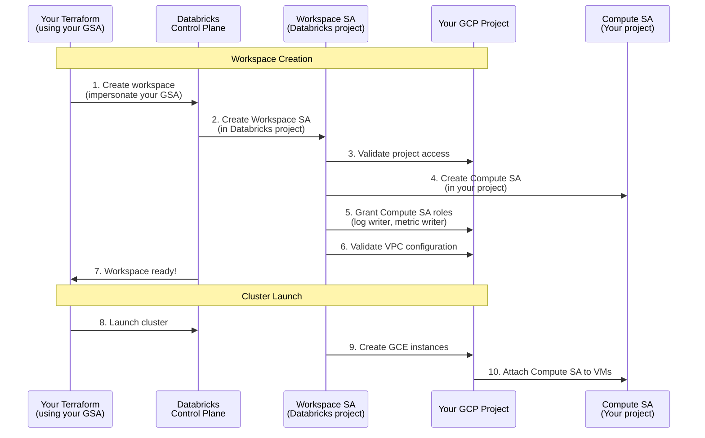

### What Each GSA Does

| Service Account | Lives In | Created By | Purpose | Permissions You Grant |
|-----------------|----------|------------|---------|----------------------|
| **Workspace SA**<br/>`db-{wsid}@prod-gcp-{region}.iam` | Databricks project | Databricks | Manage workspace infra | Custom roles (auto-created):<br/>- Databricks Project Role v2<br/>- Databricks Resource Role v2 |
| **Delegate SA**<br/>`delegate-sa@prod-gcp-{region}.iam` | Databricks project | Databricks (pre-existing) | Launch GCE clusters | Permissions granted via custom roles |
| **Compute SA**<br/>`databricks-compute@project.iam` | Your project | Databricks Workspace SA | Cluster VM identity | Roles you grant:<br/>- Logging Log Writer<br/>- Monitoring Metric Writer |
| **UC Storage SA**<br/>`db-uc-storage-UUID@uc-{region}.iam` | Databricks UC project | Databricks | Unity Catalog storage | Storage Object Admin on UC buckets |
| **Your Terraform SA**<br/>`terraform-automation@project.iam` | Your project | You | Terraform automation | Owner or custom role with workspace creation permissions |

### Unity Catalog Storage Access

GCP Unity Catalog uses a **Databricks-managed GSA** pattern:

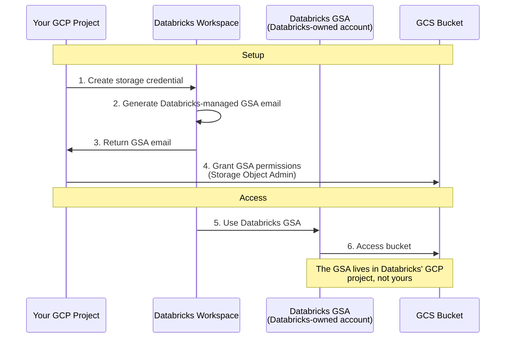

**Key Point:** For Unity Catalog, the service account is **created by Databricks in their GCP project**, but you **grant it permissions** in your project.

This is different from workspace compute, where the GSA lives in YOUR project.

### Shared VPC Scenario

If you use **Shared VPC** (common in enterprises), there's another layer:

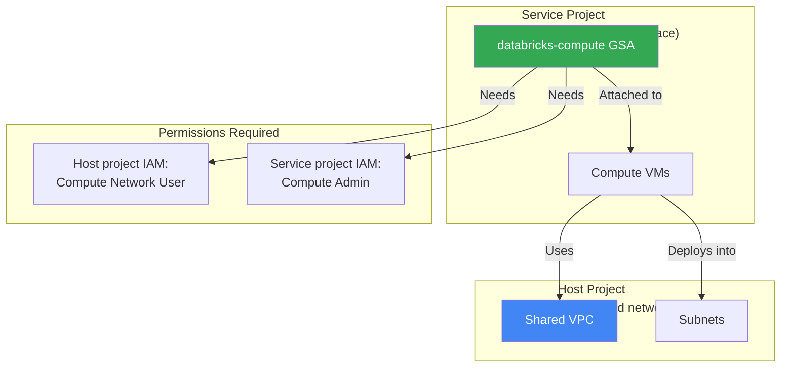

---

## Unity Catalog: The Universal Data Governance Layer

Unity Catalog works **the same across all clouds**, but accesses storage differently:

### The Three-Part Pattern

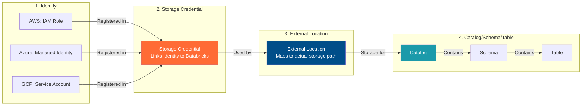

### How Each Cloud Handles UC Storage

#### AWS: IAM Role with External ID

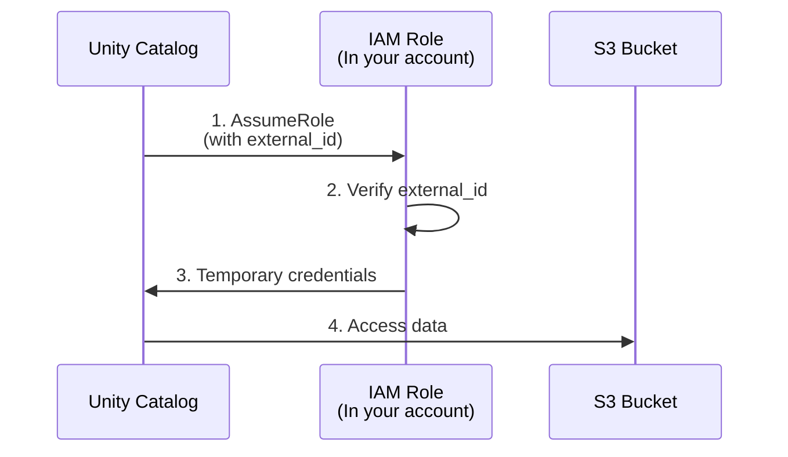

**Created by:** You (via Terraform)  
**Trust:** AssumeRole with external_id  
**Permissions:** S3 GetObject, PutObject, ListBucket

#### Azure: Managed Identity (Access Connector)

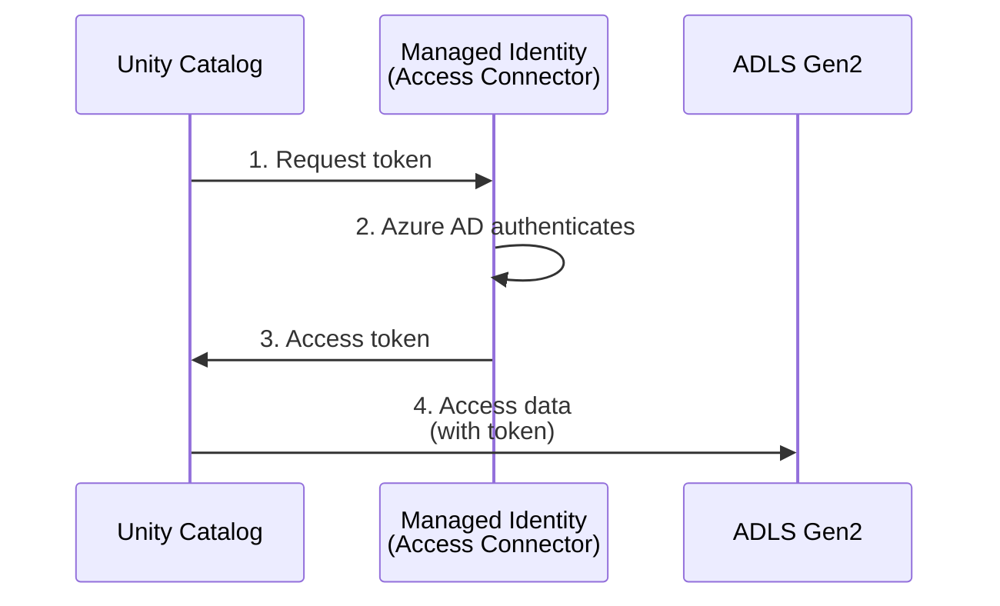

**Created by:** You (via Terraform/Portal)  
**Trust:** Azure AD (automatic)  
**Permissions:** Storage Blob Data Contributor

#### GCP: Databricks-Managed GSA

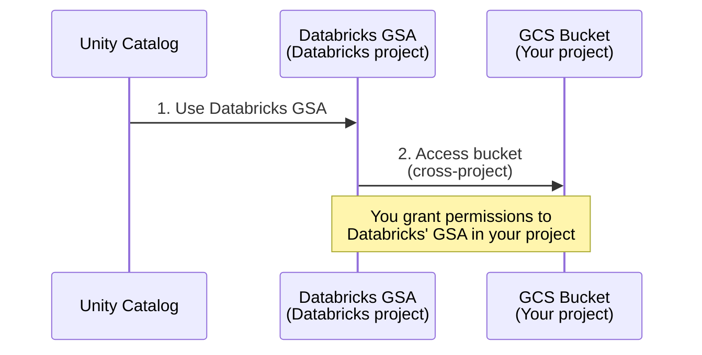

**Created by:** Databricks (in their project)  
**Trust:** GCP IAM (cross-project)  
**Permissions:** Storage Object Admin

---

## Security: Why This Design Is Safe

### Principle of Least Privilege

Each identity only gets permissions it needs:

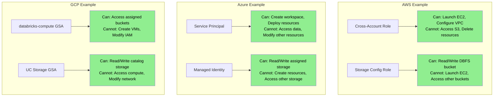

### Temporary Credentials (AWS)

AWS credentials **expire automatically**:

```
AssumeRole → Get temp creds → Use for 1 hour → Expired → Request new ones
```

You never give Databricks permanent access keys.

### External IDs Prevent Confused Deputy

**The Attack Without External ID:**
1. Attacker finds your role ARN (it's not secret)
2. Attacker tricks Databricks into using your role
3. Databricks accidentally accesses your S3 data

**How External ID Prevents This:**
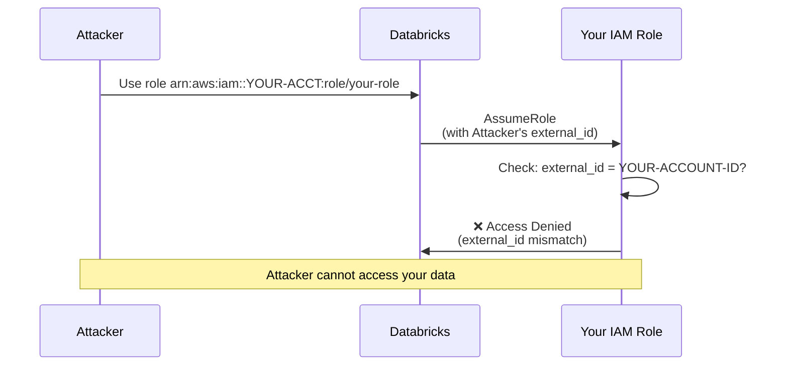

### Audit Trail

Every access is logged:

| Cloud | Log Service | What Gets Logged |
|-------|-------------|------------------|
| **AWS** | CloudTrail | Every AssumeRole call, API calls made with temp creds |
| **Azure** | Activity Log | Resource creation, managed identity token requests |
| **GCP** | Cloud Audit Logs | Service account usage, API calls, permission grants |

---

## Common Questions

### Q: Can Databricks access my data without permission?

**AWS**: No. The IAM role you create defines exact permissions. Databricks can only access what you explicitly allow in the role policy.

**Azure**: No. The managed identity has NO permissions until you grant them (e.g., Storage Blob Data Contributor).

**GCP**: No. The service account has NO permissions until you grant them via IAM bindings.

### Q: What happens if I delete the identity?

**AWS**: Workspace stops working immediately. Databricks can't AssumeRole, so it can't launch clusters or access storage.

**Azure**: Workspace may continue running (resources already created), but you can't create new resources or access storage.

**GCP**: Workspace stops working. Compute VMs can't be created, storage can't be accessed.

### Q: Can Databricks see my credentials?

**AWS**: No. Databricks uses AssumeRole to get temporary credentials from AWS directly. Your permanent credentials stay with you.

**Azure**: No. Databricks uses Azure's token service. Your service principal secret is only used by your Terraform, not shared with Databricks.

**GCP**: No. Databricks impersonates service accounts via GCP's APIs. No credential files are shared.

### Q: Why so many roles/identities?

Each identity serves a different purpose with different permissions:
- **Workspace management**: Create infrastructure
- **Storage access**: Read/write data buckets
- **Compute access**: Clusters accessing user data
- **Unity Catalog**: Centralized governance layer

This **separation** means:
- Smaller blast radius if one is compromised
- Easier to audit what accessed what
- Simpler to grant/revoke specific permissions

### Q: Can I use one identity for everything?

**Technically yes, but don't:**
- Violates least privilege principle
- Harder to audit
- One compromise affects everything
- Can't easily revoke specific access

---

## Comparison: All Three Clouds

| Aspect | AWS | Azure | GCP |
|--------|-----|-------|-----|
| **Who creates workspace identity?** | You (IAM role) | Azure (first-party trust) | Databricks (GSA in your project) |
| **Credential type** | Temporary (AssumeRole) | Token (Managed Identity) | Service Account |
| **Trust mechanism** | External ID | First-party app | Service account impersonation |
| **UC storage identity** | IAM role (you create) | Managed Identity (you create) | Databricks GSA (they create) |
| **Setup complexity** | Medium (multiple roles) | Low (mostly automatic) | Medium (permission grants) |
| **Number of identities** | 4-5 IAM roles | 1-2 managed identities | 2-3 service accounts |
| **Credential rotation** | Automatic (temp creds) | Automatic (Azure handles) | Automatic (GCP handles) |
| **Least privilege** | Via IAM policies | Via RBAC roles | Via IAM bindings |
| **Audit logs** | CloudTrail | Activity Log | Cloud Audit Logs |

---

## Visual Summary

### Identity Flow Comparison

```mermaid
flowchart TB
    subgraph AWS["AWS Model"]
        AWS1[You create IAM roles]
        AWS2[Databricks AssumeRole]
        AWS3[Temporary credentials]
        AWS4[Access resources]
        AWS1 --> AWS2 --> AWS3 --> AWS4
    end
    
    subgraph Azure["Azure Model"]
        AZ1[Azure trusts Databricks]
        AZ2[You deploy workspace]
        AZ3[Managed identity created]
        AZ4[You grant permissions]
        AZ5[Access resources]
        AZ1 --> AZ2 --> AZ3 --> AZ4 --> AZ5
    end
    
    subgraph GCP["GCP Model"]
        GCP1[Databricks creates GSA]
        GCP2[GSA added to your project]
        GCP3[You grant permissions]
        GCP4[Access resources]
        GCP1 --> GCP2 --> GCP3 --> GCP4
    end
    
    style AWS fill:#FF9900,color:#000
    style Azure fill:#0078D4,color:#fff
    style GCP fill:#4285F4,color:#fff
```

---

## Next Steps

Now that you understand how identities work, check out:

1. **[Authentication Guide](./authentication.md)** - Set up Terraform authentication
2. **Cloud-specific deployment guides**:
   - [Azure Databricks](../adb4u/README.md)
   - [AWS Databricks](../awsdb4u/README.md)
   - [GCP Databricks](../gcpdb4u/readme.md)

---

## Still Confused?

**Remember the analogy:**
- **AWS**: Temporary key that expires (safest, but more setup)
- **Azure**: Master key (Microsoft trusts Databricks built-in)
- **GCP**: New employee in your office (you control what they access)

All three are secure, just different approaches based on each cloud's design philosophy.
