# Databricks Networking Guide

_Understanding Databricks Network Architecture Across Clouds_

**Perfect for**: Platform engineers, cloud architects, security teams   


---

## 📖 Table of Contents

1. [Introduction](#introduction)
2. [Why Networking Matters](#why-networking-matters)
3. [Core Networking Concepts](#core-networking-concepts)
4. [AWS Networking Architecture](#aws-networking-architecture)
5. [Azure Networking Architecture](#azure-networking-architecture)
6. [GCP Networking Architecture](#gcp-networking-architecture)
7. [Cross-Cloud Comparison](#cross-cloud-comparison)
8. [Common Questions & Answers](#common-questions--answers)
9. [Key Takeaways](#key-takeaways)
   - [Essential Concepts](#essential-concepts)
   - [AWS Networking Essentials](#aws-networking-essentials)
   - [Azure Networking Essentials](#azure-networking-essentials)
   - [GCP Networking Essentials](#gcp-networking-essentials)
10. [Troubleshooting](#troubleshooting)
    - [AWS Troubleshooting](#aws-troubleshooting)
    - [Azure Troubleshooting](#azure-troubleshooting)
    - [GCP Troubleshooting](#gcp-troubleshooting)
11. [Best Practices](#best-practices)
12. [Additional Resources](#additional-resources)

---

## Introduction

Databricks provides flexible networking options to meet your organization's security, compliance, and operational requirements. This guide helps you understand how Databricks networking works and how to design networks that align with your cloud architecture.

> **Important**: Databricks has **two types of compute planes**:
> - **Classic compute plane** (customer VPC) - Covered in this guide
> - **Serverless compute plane** (Databricks-managed) - Separate guide coming soon
>
> This guide focuses on **classic compute plane networking** where you manage the VPC/VNet.

### Who Should Read This

- **Platform engineers** deploying Databricks infrastructure
- **Cloud architects** designing secure data platforms
- **Security teams** reviewing network controls
- **Operations teams** troubleshooting connectivity

### What You'll Learn

- How Databricks classic compute plane networking works
- When and why to use customer-managed networking
- Detailed AWS VPC configuration requirements
- Network traffic patterns and security controls
- Common pitfalls and how to avoid them

### Prerequisites

- Basic understanding of cloud networking (VPC/VNet concepts)
- Familiarity with security groups and route tables
- Access to cloud provider documentation

> **Note**: This guide focuses on **AWS classic compute** first. Azure and GCP sections will be added in future updates.

---

## Why Networking Matters

### The Business Case

Organizations choose customer-managed networking for several compelling reasons:

**🔒 Security & Compliance**
- Meet strict regulatory requirements (HIPAA, SOC 2, PCI-DSS, FedRAMP)
- Implement zero-trust network architectures
- Control data flow and prevent exfiltration
- Integrate with existing security tools (firewalls, proxies, IDS/IPS)

**🏢 Enterprise Integration**
- Connect to on-premises data centers via VPN or Direct Connect
- Integrate with existing network infrastructure
- Use centralized network management and monitoring
- Maintain consistent security policies across platforms

**💰 Operational Efficiency**
- Better IP address space utilization (smaller subnets possible)
- Consolidated networking across multiple workspaces
- Simplified billing and cost allocation
- Reduced complexity with VPC sharing

**🎯 Control & Governance**
- Lower privilege requirements for Databricks cross-account role
- Alignment with internal approval processes
- Network change management through existing workflows
- Clear separation of responsibilities

### Databricks Networking Flexibility

Databricks offers **multiple deployment options** to match your requirements:

| Deployment Model | Use Case | Setup Complexity |
|------------------|----------|------------------|
| **Databricks-Managed Network** | Quick starts, dev/test, low compliance | Simple (minutes) |
| **Customer-Managed Network** | Production, compliance, enterprise | Moderate (hours) |
| **Customer-Managed + PrivateLink** | Highest security, air-gapped, zero-trust | Complex (days) |

> **Recommended Approach**: For production workloads, **customer-managed networking** provides the control and flexibility enterprises need while maintaining deployment simplicity.

### Decision Framework

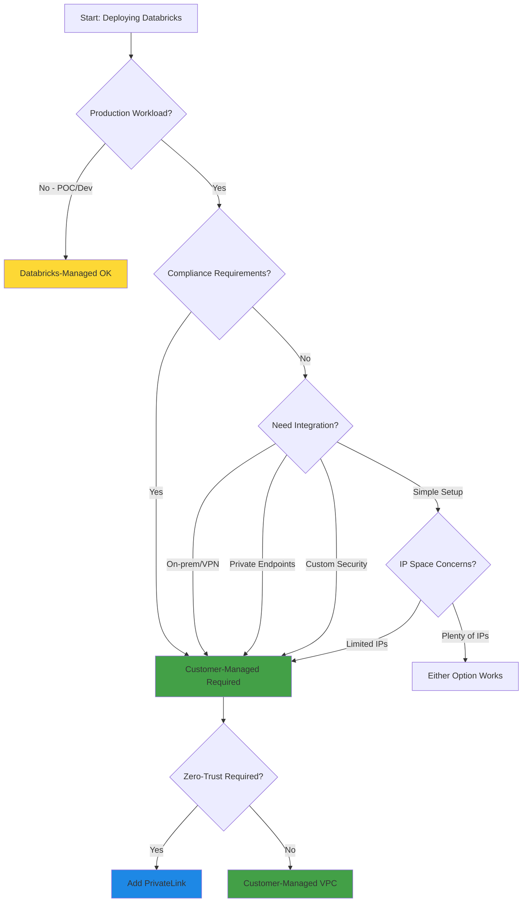

---

## Core Networking Concepts

Understanding these fundamentals will help you across all cloud providers.

### Control Plane vs Compute Plane

Databricks architecture separates responsibilities between two planes:

#### Compute Plane Types

Before diving into architecture, understand that Databricks offers **two types of compute planes**:

| Compute Type | Managed By | Network Location | This Guide Covers |
|--------------|------------|------------------|-------------------|
| **Classic Compute** | Customer | Your VPC/VNet | ✅ Yes (detailed) |
| **Serverless Compute** | Databricks | Databricks VPC | ❌ No (separate guide) |

**Classic compute plane**: Resources run in **your cloud account**, in **your VPC/VNet**. You control networking (subnets, security groups, routes). This guide covers classic compute networking.

**Serverless compute plane**: Resources run in **Databricks-managed cloud account**. Databricks manages networking. Connectivity to your resources uses [Network Connectivity Configuration (NCC)](https://docs.databricks.com/aws/en/security/network/serverless-network-security/).

> **Note**: This guide focuses exclusively on **classic compute plane networking**. Serverless networking will be covered in a separate guide.

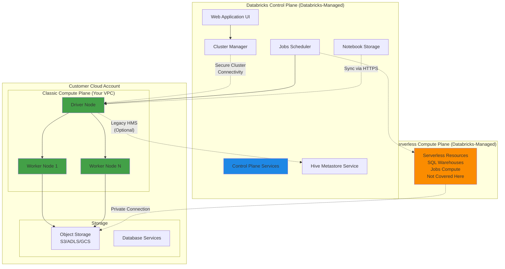

#### Control Plane (Databricks-Managed)

**What it does:**
- Hosts the Databricks web application and APIs
- Manages job scheduling and orchestration
- Stores notebooks and workspace configurations
- Provides Unity Catalog metastore service (recommended)
- Handles cluster lifecycle management
- Legacy Hive metastore service (optional, not recommended)

**Where it runs:** Databricks-managed cloud account (you never see or manage this)

**Security:** All data encrypted at rest, TLS 1.3 in transit

#### Classic Compute Plane (Your Cloud Account)

**What it does:**
- Runs cluster nodes (driver and workers) that process your data
- Executes Spark jobs and queries on all-purpose and job clusters
- Connects to your data sources (S3, databases, etc.)
- Generates logs and metrics

**Where it runs:** Your cloud account, in your VPC/VNet

**You control:** Network configuration, subnet placement, security rules, routing

> **Note**: This is different from **serverless compute plane**, which runs in Databricks-managed infrastructure with different networking patterns. See [Serverless Compute Networking](https://docs.databricks.com/aws/en/security/network/serverless-network-security/) for serverless details.

### Network Traffic Patterns

Understanding how traffic flows helps you design secure networks:

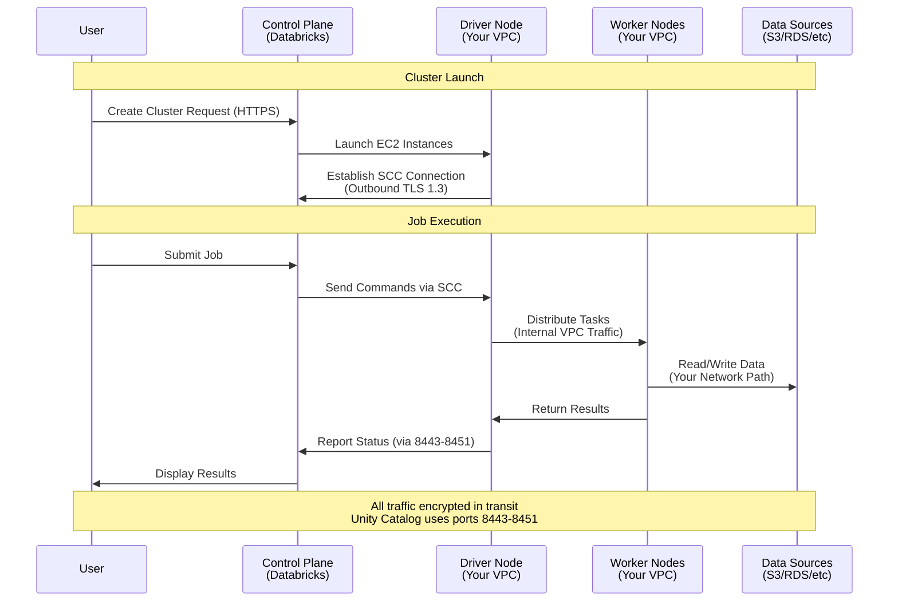

**Key Traffic Flows:**

1. **User → Control Plane**: HTTPS (443) - accessing workspace UI/APIs
2. **Control Plane → Compute Plane**: Secure Cluster Connectivity (initiated by compute plane)
3. **Compute Plane → Control Plane**: HTTPS (443, 8443-8451) - heartbeats, logs, Unity Catalog metadata
4. **Compute Plane ↔ Compute Plane**: All ports TCP/UDP - Spark shuffle, storage
5. **Compute Plane → Data Sources**: Various - S3 (443), databases, etc.
6. **Compute Plane → Internet**: Package repositories (PyPI, Maven, CRAN)

> **Important**: Compute plane **initiates** connections to control plane (outbound). No inbound connections from internet to compute plane are required.

> **Note**: Unity Catalog (recommended) uses ports 8443-8451 for metadata operations. Legacy Hive metastore (port 3306) is optional and can be disabled. See [Disable legacy Hive metastore](https://docs.databricks.com/aws/en/data-governance/unity-catalog/disable-hms).

### Networking Options Comparison

| Aspect | Databricks-Managed | Customer-Managed | Customer-Managed + PrivateLink |
|--------|-------------------|------------------|-------------------------------|
| **VPC/VNet Ownership** | Databricks creates | You provide | You provide |
| **Subnet Control** | Automatic (/16) | Full control (/17-/26) | Full control (/17-/26) |
| **Security Groups** | Managed by Databricks | You configure | You configure |
| **NAT Gateway** | Included | You provide | You provide |
| **IP Address Efficiency** | Lower (larger subnets) | Higher (right-sized) | Higher (right-sized) |
| **VPC Sharing** | No | Yes (multiple workspaces) | Yes (multiple workspaces) |
| **PrivateLink Support** | No | Optional | Yes |
| **Integration w/ Existing** | Limited | Full | Full |
| **Setup Time** | Minutes | Hours | Days |
| **AWS Permissions Needed** | More (VPC creation) | Fewer (reference only) | Fewer (reference only) |
| **Recommended For** | POCs, development | Production workloads | High security, compliance |

---

## AWS Networking Architecture

This section provides detailed guidance for deploying Databricks **classic compute plane** in a customer-managed AWS VPC.

### Overview

**Customer-managed VPC** enables you to deploy Databricks **classic compute plane** resources in your own AWS VPC. This gives you:

> **Scope**: This section covers **classic compute** (all-purpose clusters, job clusters). For **serverless compute** (SQL warehouses, serverless jobs), see [Serverless Compute Networking](https://docs.databricks.com/aws/en/security/network/serverless-network-security/).

- Full control over network topology and IP addressing
- Integration with existing AWS infrastructure
- Lower AWS permissions for Databricks cross-account role
- Support for AWS PrivateLink (requires customer-managed VPC)
- Ability to share VPCs across multiple workspaces

> **Reference**: [AWS Databricks Customer-Managed VPC Documentation](https://docs.databricks.com/aws/en/security/network/classic/customer-managed-vpc)

### Architecture Overview

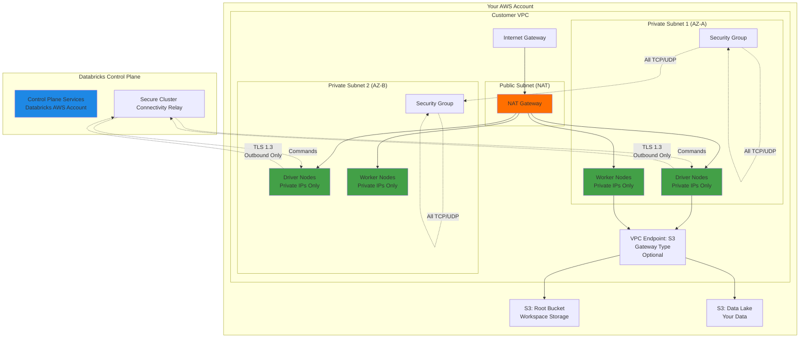

### VPC Requirements

#### Region Support

Customer-managed VPC is available in all AWS regions where Databricks operates. See [Databricks AWS Regions](https://docs.databricks.com/resources/supported-regions.html) for current list.

#### VPC Sizing

**Key Principle**: Plan for growth and multiple workspaces.

- **VPC CIDR**: No specific requirement, but must accommodate all subnets
- **Subnet CIDR**: Each workspace subnet must be between `/17` (32,768 IPs) and `/26` (64 IPs)
- **Multiple workspaces**: Can share one VPC with unique or shared subnets

**Example Sizing:**

| Workspace Size | Nodes Needed | IPs Required | Subnet Size | Usable Nodes |
|----------------|--------------|--------------|-------------|--------------|
| Small (dev/test) | 10-20 | 40 | `/26` (64 IPs) | 29 max |
| Medium (production) | 50-100 | 200 | `/24` (256 IPs) | 125 max |
| Large (enterprise) | 200-500 | 1000 | `/22` (1024 IPs) | 509 max |
| X-Large (multi-workspace) | 1000+ | 2000+ | `/21` or larger | 1021+ |

**IP Calculation Formula:**
```
Databricks uses 2 IPs per node (management + Spark application)
AWS reserves 5 IPs per subnet

Usable IPs = (2^(32-netmask)) - 5
Max Databricks Nodes = Usable IPs / 2

Example /26: (2^6 - 5) / 2 = 59 / 2 = 29 nodes
Example /24: (2^8 - 5) / 2 = 251 / 2 = 125 nodes
```

> **Recommendation**: Plan for 30-50% growth beyond immediate needs.

#### VPC IP Address Ranges

- VPC can use any netmask
- Each workspace subnet must be `/17` to `/26`
- If using secondary CIDR blocks, ensure subnets use **same CIDR block** as primary

⚠️ **Important**: All subnets for a Databricks workspace must come from the same VPC CIDR block, not from secondary CIDR blocks.

#### DNS Configuration

**Required VPC settings:**

```hcl
# Terraform example
resource "aws_vpc" "databricks" {
  cidr_block = "<cidr>"
  
  # Both required for Databricks
  enable_dns_hostnames = true  # Must be enabled
  enable_dns_resolution = true  # Must be enabled
  
  tags = {
    Name = "databricks-vpc"
  }
}
```

**Why DNS matters:**
- Clusters need to resolve AWS service endpoints
- Required for S3, EC2, STS, and other AWS services
- Databricks control plane hostnames must resolve

### Subnet Configuration

#### Requirements

**Minimum configuration:**
- **2 subnets** per workspace
- Each subnet in a **different Availability Zone**
- Both subnets must be **private** (no direct internet routing)
- One subnet per AZ in the network configuration API call

**Multi-workspace patterns:**

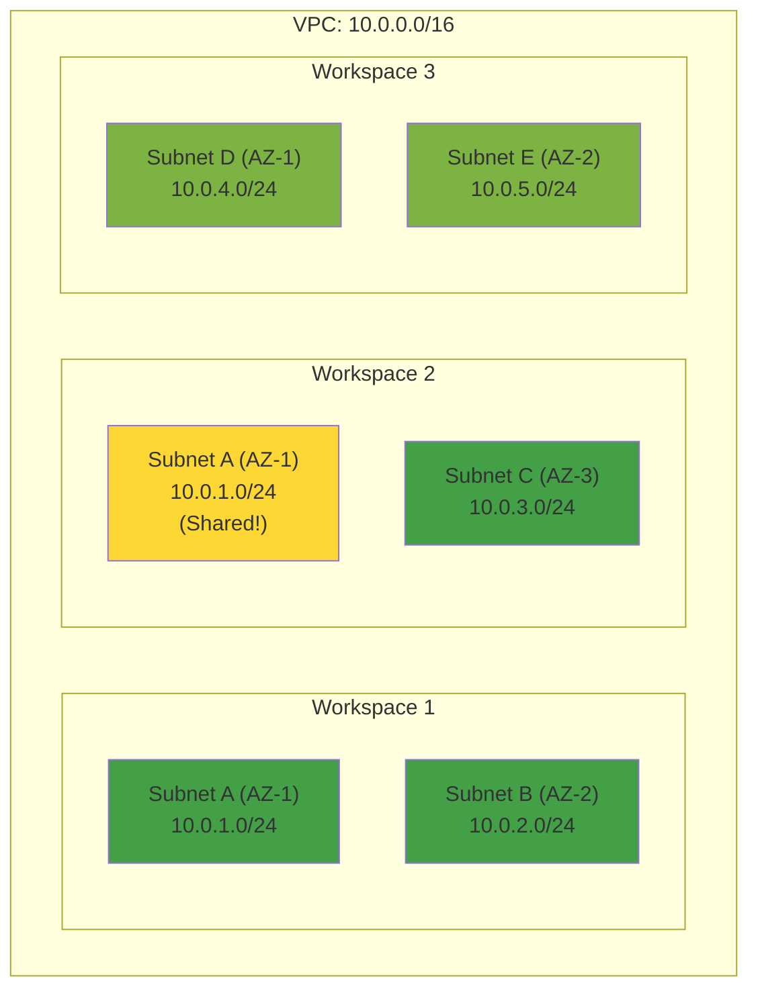

> **Note**: Workspace 1 and 2 share Subnet A. This is supported but requires careful capacity planning.

#### Subnet Netmask Requirements

```
Minimum: /17 (32,768 IPs → 16,381 usable nodes)
Maximum: /26 (64 IPs → 29 usable nodes)
```

**Common subnet sizes:**

| Netmask | Total IPs | Usable IPs | Max Databricks Nodes | Use Case |
|---------|-----------|------------|---------------------|----------|
| `/26` | 64 | 59 | 29 | Small dev/test |
| `/25` | 128 | 123 | 61 | Medium dev |
| `/24` | 256 | 251 | 125 | Production |
| `/23` | 512 | 507 | 253 | Large production |
| `/22` | 1024 | 1019 | 509 | Multi-workspace |
| `/21` | 2048 | 2043 | 1021 | Enterprise scale |

#### Route Table Configuration

**Required routing:**

```hcl
# Route table for Databricks subnets
resource "aws_route_table" "databricks_private" {
  vpc_id = aws_vpc.databricks.id
  
  # Critical: Quad-zero route to NAT Gateway
  route {
    cidr_block     = "0.0.0.0/0"
    nat_gateway_id = aws_nat_gateway.databricks.id
  }
  
  tags = {
    Name = "databricks-private-rt"
  }
}
```

⚠️ **Critical**: The `0.0.0.0/0` route to NAT Gateway is **required**. Databricks needs outbound internet access to reach the control plane.

**Route table for NAT Gateway subnet:**

```hcl
# Public subnet route table (for NAT Gateway)
resource "aws_route_table" "nat_gateway" {
  vpc_id = aws_vpc.databricks.id
  
  route {
    cidr_block = "0.0.0.0/0"
    gateway_id = aws_internet_gateway.databricks.id
  }
  
  tags = {
    Name = "databricks-nat-rt"
  }
}
```

### Security Groups

Security groups control traffic to and from Databricks cluster instances.

#### Requirements

- **Minimum**: 1 security group per workspace
- **Maximum**: 5 security groups per workspace
- **Recommendation**: Use unique security group per workspace for isolation

#### Required Rules

**Egress (Outbound Rules):**

| Type | Protocol | Port Range | Destination | Purpose |
|------|----------|------------|-------------|---------|
| All traffic | TCP | All | Same security group | Cluster internal communication |
| All traffic | UDP | All | Same security group | Cluster internal communication |
| HTTPS | TCP | `443` | `0.0.0.0/0` | Control plane, AWS services, repos |
| Custom TCP | TCP | `6666` | `0.0.0.0/0` | Secure cluster connectivity (PrivateLink) |
| Custom TCP | TCP | `2443` | `0.0.0.0/0` | FIPS-compliant encryption |
| Custom TCP | TCP | `8443` | `0.0.0.0/0` | Control plane API |
| Custom TCP | TCP | `8444` | `0.0.0.0/0` | Unity Catalog lineage/logging |
| Custom TCP | TCP | `8445-8451` | `0.0.0.0/0` | Future use (extendability) |
| DNS | TCP | `53` | `0.0.0.0/0` | DNS resolution (if custom DNS) |
| MySQL | TCP | `3306` | `0.0.0.0/0` | Legacy Hive metastore (optional, not needed with Unity Catalog) |

**Ingress (Inbound Rules):**

| Type | Protocol | Port Range | Source | Purpose |
|------|----------|------------|--------|---------|
| All traffic | TCP | All | Same security group | Cluster internal communication |
| All traffic | UDP | All | Same security group | Cluster internal communication |

> **Note**: Port 3306 (MySQL) was historically required for legacy Hive metastore access. With [Unity Catalog](https://docs.databricks.com/data-governance/unity-catalog/) (the recommended modern approach), this port is **no longer required**. Unity Catalog uses the control plane APIs (ports 8443-8451) for metadata management. See [Disable legacy Hive metastore](https://docs.databricks.com/aws/en/data-governance/unity-catalog/disable-hms) for migration guidance.

> **Why `0.0.0.0/0` in security groups?** This allows Databricks to reach its control plane and AWS services. Use **firewall or proxy appliances** for fine-grained egress filtering, not security groups.

### NAT Gateway Configuration

NAT Gateway provides outbound internet access for private subnets.

#### Setup Requirements

1. **Public subnet** for NAT Gateway (can be small, e.g., `/28`)
2. **Elastic IP** attached to NAT Gateway
3. **Internet Gateway** attached to VPC
4. **Route table** for public subnet pointing to Internet Gateway

#### High Availability

For production workloads, deploy NAT Gateways in multiple Availability Zones for redundancy. If a single NAT Gateway fails, clusters in other AZs would lose internet connectivity.

### Network ACLs

Subnet-level Network ACLs (NACLs) provide an additional security layer beyond security groups.

#### Understanding NACLs vs Security Groups

**Key difference**: NACLs are **stateless**, security groups are **stateful**.

- **Security Groups (stateful)**: Track connections. If you allow outbound traffic, the return traffic is automatically allowed. This is your primary security control.
- **Network ACLs (stateless)**: Don't track connections. You must explicitly allow both outbound requests AND inbound responses.

#### Why Databricks Requires Permissive NACLs

Databricks cluster nodes have **no public IP addresses**. All connectivity is outbound-initiated:
- Clusters connect OUT to control plane (via Secure Cluster Connectivity)
- Clusters connect OUT to S3, AWS services
- Nodes communicate with each other within the VPC

Since NACLs are **stateless**, they can't track these connections. When a cluster node makes an outbound HTTPS request to the control plane, the **response comes back** as inbound traffic on an ephemeral port. The NACL needs to allow this return traffic.

**The correct security model:**
1. **NACLs**: Keep permissive (allow `0.0.0.0/0` inbound) - required due to stateless nature
2. **Security Groups**: Use for access control (stateful, intelligent, connection-aware)
3. **No Public IPs**: Clusters cannot be reached from internet
4. **Egress firewall/proxy**: Use for fine-grained outbound filtering

> **Security Note**: Allowing `0.0.0.0/0` in NACLs is NOT a security risk because:
> - Cluster nodes have **no public IPs** (cannot be reached from internet)
> - It's required for return traffic due to stateless NACL behavior
> - Real security comes from Security Groups (stateful) and no public IPs
> - This is specifically for intra-cluster traffic and return traffic from outbound connections

#### Requirements

**AWS Default NACLs** allow all inbound and outbound traffic, which works perfectly for Databricks.

If you customize NACLs, you must follow these requirements:

**Inbound Rules:**

| Rule # | Type | Protocol | Port Range | Source | Action |
|--------|------|----------|------------|--------|--------|
| 100 | All traffic | All | All | `0.0.0.0/0` | ALLOW |

⚠️ **Critical**: This rule must be **prioritized first**. 

**Why this is required:**
- NACLs are **stateless** - they don't track connections or return traffic
- When clusters make outbound requests (to control plane, S3, etc.), responses come back as **inbound traffic** on ephemeral ports
- Cluster nodes have **no public IPs**, so this is NOT allowing internet access to your clusters
- This rule allows:
  - **Return traffic** from outbound connections (control plane, S3, AWS services)
  - **Intra-cluster communication** between driver and worker nodes
  - **Responses** on ephemeral ports 1024-65535

**Security is enforced by:**
- Security groups (stateful - your primary control)
- No public IPs on cluster nodes
- Secure Cluster Connectivity (outbound-only)
- Egress firewall/proxy (for fine-grained filtering)

**Outbound Rules:**

| Rule # | Type | Protocol | Port Range | Destination | Action |
|--------|------|----------|------------|-------------|--------|
| 100 | All traffic | All | All | VPC CIDR | ALLOW |
| 110 | HTTPS | TCP | 443 | `0.0.0.0/0` | ALLOW |
| 120 | Custom TCP | TCP | 6666 | `0.0.0.0/0` | ALLOW |
| 130 | Custom TCP | TCP | 2443 | `0.0.0.0/0` | ALLOW |
| 140 | Custom TCP | TCP | 8443-8451 | `0.0.0.0/0` | ALLOW |
| 150 | DNS | TCP/UDP | 53 | `0.0.0.0/0` | ALLOW |
| 160 | Ephemeral | TCP | 1024-65535 | `0.0.0.0/0` | ALLOW |
| * | All traffic | All | All | `0.0.0.0/0` | DENY |

> **Important**: NACLs are **stateless** and must allow `0.0.0.0/0` inbound for return traffic from outbound connections. Since cluster nodes have **no public IPs**, this is secure. Use **Security Groups** (stateful) as your primary security control, and use **egress firewall or proxy appliances** for fine-grained outbound filtering. See [Configure a firewall and outbound access](#firewall-and-egress-filtering).

> **Why not use NACLs for security filtering?** NACLs are stateless and operate at the subnet level. They require complex rules to allow return traffic and can break legitimate connections. Use Security Groups (stateful, instance-level) for access control instead.

> **Recommendation**: Start with **default NACLs** (allow all). Only customize if organizational security policy requires it. The combination of no public IPs + security groups + Secure Cluster Connectivity provides strong security without NACL complexity.

### Registering VPC with Databricks

After creating VPC, subnets, and security groups, register the configuration with Databricks.

#### Using Account Console

1. Log into [Databricks Account Console](https://accounts.cloud.databricks.com)
2. Navigate to **Cloud Resources** → **Networks**
3. Click **Add Network**
4. Provide:
   - **Network name**: `<workspace-prefix>-network`
   - **VPC ID**: `vpc-xxxxx`
   - **Subnet IDs**: Select 2+ subnets in different AZs
   - **Security group IDs**: Select 1-5 security groups
5. Click **Add**
6. Use this network when creating workspace

#### Using Account API

```bash
# Create network configuration
curl -X POST https://accounts.cloud.databricks.com/api/2.0/accounts/<account-id>/networks \
  -H "Authorization: Bearer <token>" \
  -H "Content-Type: application/json" \
  -d '{
    "network_name": "<workspace-prefix>-network",
    "vpc_id": "<vpc-id>",
    "subnet_ids": ["<subnet-id-az1>", "<subnet-id-az2>"],
    "security_group_ids": ["<security-group-id>"]
  }'
```

Response includes `network_id` - use this when creating workspace.

> **Implementation Note**: For complete working examples, see the Terraform modules in [`awsdb4u/`](../awsdb4u/) folder of this repository.

### VPC Endpoints (Optional but Recommended)

VPC endpoints provide private connectivity to AWS services without traversing NAT Gateway.

#### S3 Gateway Endpoint

**Benefits:**
- No NAT Gateway charges for S3 traffic
- Better performance (stays on AWS backbone)
- Enhanced security (private connectivity)
- **Free** (no hourly or data processing charges)

**Setup:**
- Create VPC Gateway Endpoint for S3 service
- Attach to route tables for Databricks subnets
- Optionally add endpoint policy to restrict S3 bucket access

**Endpoint Policy Example** (optional - restrict S3 access):

Allow access only to specific buckets:
- Workspace root S3 bucket
- Your data buckets
- Databricks artifacts bucket: `databricks-prod-artifacts-<region>`

See [VPC Endpoints documentation](https://docs.aws.amazon.com/vpc/latest/privatelink/vpc-endpoints.html) for implementation details.

#### Regional Endpoint Configuration

When using VPC endpoints, configure Spark to use regional endpoints:

**Option 1: In notebook** (per session):

```python
# Python
spark.conf.set("fs.s3a.endpoint", "https://s3.<region>.amazonaws.com")
spark.conf.set("fs.s3a.stsAssumeRole.stsEndpoint", "https://sts.<region>.amazonaws.com")
```

```scala
// Scala
spark.conf.set("fs.s3a.endpoint", "https://s3.<region>.amazonaws.com")
spark.conf.set("fs.s3a.stsAssumeRole.stsEndpoint", "https://sts.<region>.amazonaws.com")
```

**Option 2: Cluster configuration** (all jobs on cluster):

```
spark.hadoop.fs.s3a.endpoint https://s3.<region>.amazonaws.com
spark.hadoop.fs.s3a.stsAssumeRole.stsEndpoint https://sts.<region>.amazonaws.com
```

**Option 3: Cluster policy** (enforce across all clusters):

```json
{
  "spark_conf.fs.s3a.endpoint": {
    "type": "fixed",
    "value": "https://s3.<region>.amazonaws.com"
  },
  "spark_conf.fs.s3a.stsAssumeRole.stsEndpoint": {
    "type": "fixed",
    "value": "https://sts.<region>.amazonaws.com"
  }
}
```

⚠️ **Important**: Regional endpoint configuration **blocks cross-region S3 access**. Only apply if all S3 buckets are in the same region.

### S3 Bucket Policies

Restrict S3 bucket access to specific sources for enhanced security.

#### Requirements for Bucket Policies

Your bucket policy must allow access from:

1. **Control plane NAT IP** - Databricks control plane needs access for workspace operations
2. **Compute plane NAT IP or VPC Endpoint** - Cluster nodes need data access
3. **Your trusted IPs** - Corporate VPN, admin workstations (prevents lockout)

**Required buckets to allow:**
- Workspace root S3 bucket
- Databricks artifacts bucket for your region: `databricks-prod-artifacts-<region>`
- Databricks logging bucket (if applicable)
- System tables bucket (if Unity Catalog enabled)

> **Where to find IPs**: See [Databricks Control Plane IPs](https://docs.databricks.com/resources/supported-regions.html) for your region.

#### Example Bucket Policy

**Scenario**: Restrict access to control plane, compute plane VPC endpoint, and corporate VPN.

```json
{
  "Version": "2012-10-17",
  "Statement": [
    {
      "Sid": "AllowDatabricksAndTrustedAccess",
      "Effect": "Deny",
      "Principal": "*",
      "Action": "s3:*",
      "Resource": [
        "arn:aws:s3:::<bucket-name>",
        "arn:aws:s3:::<bucket-name>/*"
      ],
      "Condition": {
        "NotIpAddressIfExists": {
          "aws:SourceIp": [
            "<control-plane-nat-ip>",
            "<corporate-vpn-ip>"
          ]
        },
        "StringNotEqualsIfExists": {
          "aws:sourceVpce": "<vpc-endpoint-id>",
          "aws:SourceVpc": "<vpc-id>"
        }
      }
    }
  ]
}
```

**How it works:**
- Uses `Deny` with `NotIpAddressIfExists` - only listed sources can access
- Allows control plane NAT IP (Databricks operations)
- Allows VPC endpoint (cluster data access)
- Allows corporate VPN (admin access via console)
- Blocks all other sources

### Firewall and Egress Filtering

Control outbound traffic using firewall or proxy appliances.

#### Why Control Egress?

- **Compliance**: Many regulations require egress filtering (PCI-DSS, HIPAA)
- **Data exfiltration protection**: Prevent unauthorized data exports
- **Allow-list model**: Only permit traffic to known destinations
- **Visibility**: Audit and monitor all outbound connections

#### Implementation Options

**Option 1: AWS Network Firewall**
- Managed AWS service
- Stateful inspection
- Domain filtering
- TLS inspection (optional)

**Option 2: Third-party firewall appliances**
- Palo Alto Networks
- Fortinet FortiGate
- Cisco Firewall
- Check Point

**Option 3: Proxy appliances**
- Squid proxy
- AWS Systems Manager (for package repos)
- Artifact repositories (Artifactory, Nexus)

#### Required Destinations

Databricks clusters must reach these destinations. See [Databricks Firewall Documentation](https://docs.databricks.com/security/network/classic/firewall.html) for complete list:

**Databricks Control Plane:**
- `*.cloud.databricks.com` (port 443, 8443-8451)
- Control plane regional endpoints (varies by region)
- Port 8443-8451 for Unity Catalog metadata operations

**AWS Services:**
- `s3.<region>.amazonaws.com` (port 443)
- `sts.<region>.amazonaws.com` (port 443)
- `ec2.<region>.amazonaws.com` (port 443)
- `kinesis.<region>.amazonaws.com` (port 443)

**Package Repositories** (if downloading libraries):
- `pypi.org`, `files.pythonhosted.org` (Python/PyPI)
- `repo1.maven.org`, `maven.apache.org` (Java/Maven)
- `cran.r-project.org` (R/CRAN)

> **Note**: Legacy Hive metastore endpoints (port 3306) are no longer required when using Unity Catalog. See [Disable legacy Hive metastore](https://docs.databricks.com/aws/en/data-governance/unity-catalog/disable-hms) for migration guidance.

> **Alternative**: Host internal mirrors of package repositories to avoid internet access for library downloads.

### AWS PrivateLink

AWS PrivateLink provides private connectivity to Databricks control plane without internet traversal.

#### What is PrivateLink?

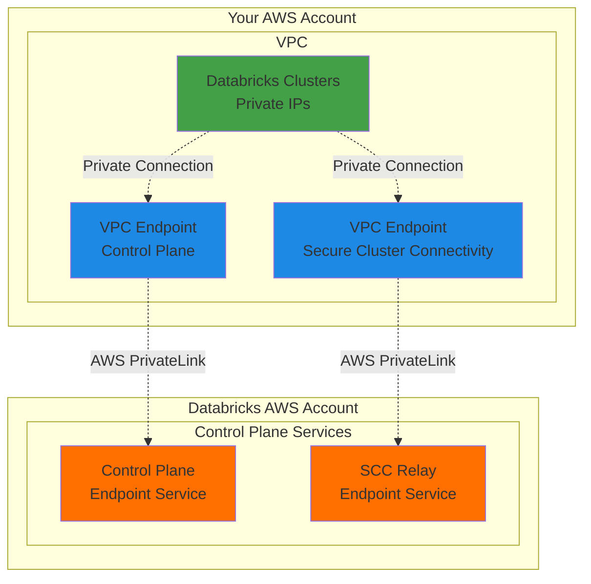

**Benefits:**
- No internet gateway or NAT gateway required for Databricks connectivity
- Traffic stays on AWS backbone (never traverses internet)
- Enhanced security posture
- Better network performance
- Simplified compliance

**Requirements:**
- Customer-managed VPC (cannot use with Databricks-managed)
- VPC Endpoint for control plane
- VPC Endpoint for Secure Cluster Connectivity
- Updated security group rules (port 6666 required)

**When to use:**
- Air-gapped environments
- Zero-trust architectures
- Strict compliance requirements
- Maximum security posture

> **Note**: PrivateLink setup is complex. See [AWS PrivateLink Documentation](https://docs.databricks.com/administration-guide/cloud-configurations/aws/privatelink.html) for detailed implementation guide.

### IP Address Planning Worksheet

Use this worksheet to plan your network:

#### Workspace Requirements

| Parameter | Your Value | Notes |
|-----------|------------|-------|
| Expected max nodes | _____  | Peak usage estimate |
| Growth factor | 1.5x | Recommend 50% buffer |
| Total nodes needed | _____ | Max nodes × growth factor |
| IPs required | _____ | Total nodes × 2 |
| Recommended netmask | _____ | Use table below |

#### Netmask Selection

| IPs Needed | Recommended Netmask | Usable IPs | Max Nodes |
|------------|-------------------|------------|-----------|
| < 60 | `/26` | 59 | 29 |
| 60-120 | `/25` | 123 | 61 |
| 121-250 | `/24` | 251 | 125 |
| 251-500 | `/23` | 507 | 253 |
| 501-1000 | `/22` | 1019 | 509 |
| 1001-2000 | `/21` | 2043 | 1021 |
| 2001+ | `/20` or larger | 4091+ | 2045+ |

#### VPC Design

```
VPC CIDR: ___________________ (e.g., 10.100.0.0/16)

Databricks Subnet 1 (AZ-A): ___________________ (e.g., 10.100.1.0/24)
Databricks Subnet 2 (AZ-B): ___________________ (e.g., 10.100.2.0/24)
NAT Gateway Subnet 1: ___________________ (e.g., 10.100.0.0/28)
NAT Gateway Subnet 2: ___________________ (e.g., 10.100.0.16/28)

Number of workspaces in VPC: _____
Shared or unique subnets: _____
```

### AWS Configuration Checklist

Before registering VPC with Databricks, verify:

**VPC Configuration:**
- [ ] VPC created in supported AWS region
- [ ] DNS hostnames enabled on VPC
- [ ] DNS resolution enabled on VPC
- [ ] VPC CIDR documented

**Subnet Configuration:**
- [ ] Minimum 2 subnets created
- [ ] Subnets in different Availability Zones
- [ ] Each subnet netmask between `/17` and `/26`
- [ ] Subnets are private (no direct internet route)
- [ ] Sufficient IP capacity (calculate max nodes)
- [ ] Subnets from same CIDR block (not secondary)

**Security Groups:**
- [ ] 1-5 security groups created
- [ ] Ingress: All TCP from same SG
- [ ] Ingress: All UDP from same SG
- [ ] Egress: All traffic to same SG
- [ ] Egress: TCP 443 to `0.0.0.0/0`
- [ ] Egress: TCP 53 to `0.0.0.0/0`
- [ ] Egress: TCP 6666 to `0.0.0.0/0`
- [ ] Egress: TCP 2443 to `0.0.0.0/0`
- [ ] Egress: TCP 8443-8451 to `0.0.0.0/0` (Unity Catalog)
- [ ] Egress: TCP 3306 to `0.0.0.0/0` (optional - only if using legacy Hive metastore)

**NAT Gateway:**
- [ ] Internet gateway attached to VPC
- [ ] Public subnet(s) for NAT gateway
- [ ] NAT gateway deployed (consider HA - multiple AZs)
- [ ] Elastic IP(s) assigned
- [ ] Route table for public subnet routes to IGW
- [ ] Route table for private subnets routes `0.0.0.0/0` to NAT

**Network ACLs:**
- [ ] Using default NACLs (recommended - allows all)
- [ ] OR custom NACLs configured:
  - [ ] Inbound: Allow ALL from `0.0.0.0/0` (priority rule 100)
  - [ ] Outbound: Allow VPC CIDR
  - [ ] Outbound: Allow required ports (443, 8443-8451, etc.)
  - [ ] Outbound: Allow ephemeral ports 1024-65535
  - [ ] Remember: Use firewall/proxy for egress filtering, not NACLs

**Optional Components:**
- [ ] S3 VPC Gateway Endpoint created (recommended)
- [ ] S3 VPC Endpoint attached to route tables
- [ ] VPC Endpoint policies configured (if restricting)
- [ ] Firewall/proxy deployed (if egress filtering)
- [ ] Firewall rules allow required destinations

**Databricks Registration:**
- [ ] VPC registered in Databricks Account Console
- [ ] Network configuration ID obtained
- [ ] Workspace created using network configuration

---

## Azure Networking Architecture

This section provides detailed guidance for deploying Databricks **classic compute plane** in a customer-managed Azure VNet.

### Overview

**VNet injection** (Azure's term for customer-managed networking) enables you to deploy Databricks **classic compute plane** resources in your own Azure Virtual Network (VNet). This gives you:

- Full control over network topology and IP addressing
- Integration with existing Azure infrastructure
- Lower Azure permissions for Databricks service principals
- Support for Azure Private Link (requires VNet injection)
- Ability to share VNets across multiple workspaces

> **Scope**: This section covers **classic compute** (all-purpose clusters, job clusters). For **serverless compute** (SQL warehouses, serverless jobs), networking is managed differently by Databricks.

> **Reference**: [Azure Databricks VNet Injection Documentation](https://learn.microsoft.com/en-us/azure/databricks/security/network/classic/vnet-inject)

### Architecture Overview

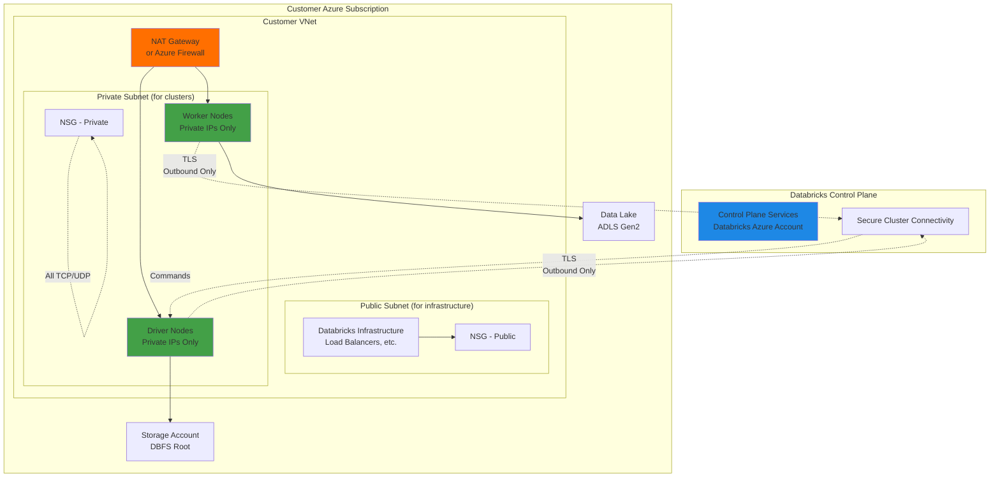

### VNet Requirements

#### Region Support

VNet injection is available in all Azure regions where Databricks operates. See [Databricks Azure Regions](https://learn.microsoft.com/en-us/azure/databricks/resources/supported-regions) for current list.

#### VNet Sizing

**Key Principle**: Plan for growth and multiple workspaces.

Azure Databricks requires **two subnets**:
1. **Public subnet** - For Databricks infrastructure (load balancers, etc.)
2. **Private subnet** - For cluster nodes (driver and workers)

**Subnet sizing:**

| Workspace Size | Nodes Needed | Recommended Subnet Size | Usable IPs | Max Nodes |
|----------------|--------------|------------------------|------------|-----------|
| Small (dev/test) | 10-20 | `/26` | 59 | 59 nodes |
| Medium (production) | 50-100 | `/24` | 251 | 251 nodes |
| Large (enterprise) | 200-500 | `/22` | 1019 | 1019 nodes |

**IP Calculation:**
```
Azure reserves 5 IPs per subnet
Databricks uses 1 IP per node (unlike AWS which uses 2)

Usable IPs = (2^(32-netmask)) - 5
Max Databricks Nodes = Usable IPs - 5 (Azure reserved)

Example /26: 64 - 5 = 59 usable IPs → 59 nodes
Example /24: 256 - 5 = 251 usable IPs → 251 nodes
```

> **Note**: Azure uses 1 IP per node (simpler than AWS). However, you still need TWO subnets (public and private).

#### Subnet Requirements

**Minimum configuration:**
- **2 subnets** per workspace (public and private)
- **Public subnet**: For Databricks infrastructure (load balancers, NAT gateway if using)
- **Private subnet**: For cluster compute nodes
- Both subnets in the **same VNet**
- Both subnets in the **same region**

**Subnet delegation:**
- Private subnet must be delegated to `Microsoft.Databricks/workspaces`
- Public subnet does not require delegation

**Address space:**
- Minimum subnet size: `/26` (59 usable IPs)
- Recommended production: `/24` or larger
- No maximum size constraint

**Multi-workspace patterns:**

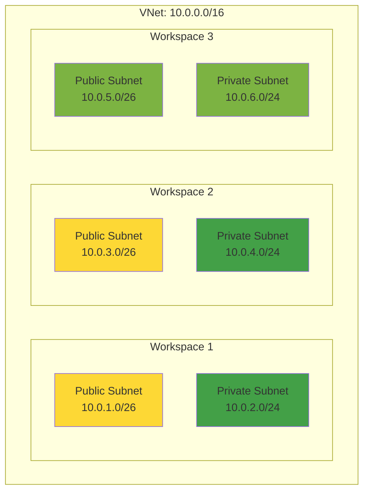

> **Recommendation**: Use unique subnets per workspace for isolation and easier troubleshooting.

### Network Security Groups (NSGs)

NSGs control traffic to and from Databricks cluster instances. Azure requires NSG rules on **both** public and private subnets.

#### Requirements

**Public Subnet NSG:**
- Controls infrastructure components
- Databricks manages these rules automatically
- Do not modify rules on public subnet NSG

**Private Subnet NSG:**
- Controls cluster node traffic
- You can add custom rules (but follow requirements)

#### Required Rules for Private Subnet NSG

**Inbound Rules:**

| Priority | Name | Source | Source Ports | Destination | Dest Ports | Protocol | Action |
|----------|------|--------|--------------|-------------|------------|----------|--------|
| 100 | AllowVnetInBound | VirtualNetwork | * | VirtualNetwork | * | Any | Allow |
| 65000 | AllowAzureLoadBalancerInBound | AzureLoadBalancer | * | * | * | Any | Allow |

**Outbound Rules:**

| Priority | Name | Source | Source Ports | Destination | Dest Ports | Protocol | Action |
|----------|------|--------|--------------|-------------|------------|----------|--------|
| 100 | AllowVnetOutBound | VirtualNetwork | * | VirtualNetwork | * | Any | Allow |
| 110 | AllowControlPlaneOutBound | VirtualNetwork | * | AzureDatabricks | 443 | TCP | Allow |
| 120 | AllowStorageOutBound | VirtualNetwork | * | Storage | 443 | TCP | Allow |
| 130 | AllowSqlOutBound | VirtualNetwork | * | Sql | 3306 | TCP | Allow |
| 140 | AllowEventHubOutBound | VirtualNetwork | * | EventHub | 9093 | TCP | Allow |

> **Note**: Azure uses **Service Tags** (`AzureDatabricks`, `Storage`, `Sql`, `EventHub`) which automatically resolve to the correct IP ranges for your region. This is simpler than AWS security groups which require `0.0.0.0/0`.

> **Important**: Port 3306 (Sql service tag) is for legacy Hive metastore. With Unity Catalog (recommended), this outbound rule is optional.

> **Why `VirtualNetwork` service tag?** This allows all traffic within the VNet, which includes intra-cluster communication between driver and worker nodes. It's secure because it's limited to your VNet only.

### Route Tables and Outbound Connectivity

Azure Databricks clusters need outbound internet connectivity to reach the control plane.

#### NAT Gateway (Recommended)

**Benefits:**
- Dedicated outbound public IPs
- High availability built-in
- Better scalability than VM-based NAT
- Lower operational overhead

**Setup:**
- Attach NAT Gateway to **private subnet**
- Public IPs automatically assigned
- Outbound connectivity enabled automatically

#### Azure Firewall

**When to use:**
- Need fine-grained egress filtering
- Compliance requirements for traffic inspection
- Centralized security logging
- URL/FQDN filtering required

**Setup:**
- Deploy Azure Firewall
- Create route table for private subnet
- Route `0.0.0.0/0` to Azure Firewall
- Configure firewall rules to allow required destinations

#### Required Outbound Destinations

If using Azure Firewall for egress filtering, allow these destinations:

**Databricks Control Plane:**
- `*.databricks.azure.net` (port 443)
- Control plane regional endpoints
- Service tag: `AzureDatabricks`

**Azure Services:**
- Storage accounts (ADLS Gen2, Blob): Service tag `Storage`
- Azure SQL (legacy metastore): Service tag `Sql`, port 3306
- Event Hubs (logging): Service tag `EventHub`, port 9093

**Package Repositories** (if downloading libraries):
- `pypi.org`, `files.pythonhosted.org` (Python/PyPI)
- `repo1.maven.org` (Java/Maven)
- `cran.r-project.org` (R/CRAN)

> **Note**: Service tags automatically include all required IPs for Azure services in your region. Much simpler than maintaining IP allow lists!

### Deployment Walkthrough

#### Step 1: Plan Your Network
- IP address space for VNet
- Two subnets per workspace (public and private)
- Outbound connectivity method (NAT Gateway or Azure Firewall)

#### Step 2: Create VNet and Subnets
- Create VNet with appropriate address space
- Create public subnet (minimum `/26`)
- Create private subnet (size based on node count)
- Delegate private subnet to `Microsoft.Databricks/workspaces`

#### Step 3: Configure NSGs
- Create NSG for public subnet (Databricks will manage rules)
- Create NSG for private subnet with required rules
- Associate NSGs with respective subnets

#### Step 4: Configure Outbound Connectivity
- Option A: Attach NAT Gateway to private subnet
- Option B: Deploy Azure Firewall and configure route table

#### Step 5: Create Databricks Workspace
- Use Azure Portal, Azure CLI, or ARM template
- Select VNet injection option
- Specify your VNet and subnets
- Databricks completes setup (5-10 minutes)

> **Implementation Note**: See the [`adb4u/`](../adb4u/) folder in this repository for production-ready Terraform templates that implement these patterns.

### Azure Private Link

Azure Private Link provides private connectivity to Databricks control plane without internet traversal.

#### What is Private Link?

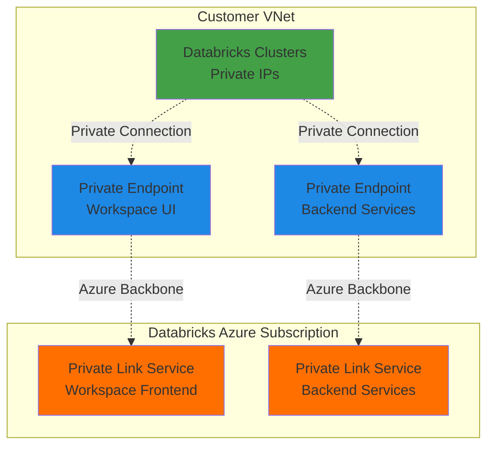

**Benefits:**
- No internet gateway or NAT gateway required for Databricks connectivity
- Traffic stays on Azure backbone (never traverses internet)
- Enhanced security posture
- Simplified compliance

**Requirements:**
- VNet injection (customer-managed VNet required)
- Two private endpoints per workspace
- Private DNS zones for name resolution
- Premium or trial pricing tier

**When to use:**
- Air-gapped environments
- Zero-trust architectures
- Strict compliance requirements
- Maximum security posture

> **Note**: Private Link setup is complex. See [Azure Databricks Private Link Documentation](https://learn.microsoft.com/en-us/azure/databricks/security/network/classic/private-link) for detailed implementation.

### Storage Account Access

#### Secure Access Patterns

**Option 1: Service Endpoints (Recommended for simplicity)**
- Enable service endpoint on private subnet
- Traffic stays on Azure backbone
- Free (no additional charges)
- Simpler than Private Link

**Option 2: Private Endpoints (Maximum security)**
- Deploy private endpoint for storage account
- Fully private connectivity
- Additional cost per endpoint
- More complex DNS configuration

**Option 3: Storage Firewall**
- Restrict storage account to specific VNets
- Add exception for Azure services
- Consider adding exception for Azure Databricks service

### IP Address Planning Worksheet

| Component | Address Space | Notes |
|-----------|--------------|-------|
| VNet CIDR | `<cidr>` | Must accommodate all subnets |
| Workspace 1 - Public | `<cidr>` | Min /26, typically /26 is sufficient |
| Workspace 1 - Private | `<cidr>` | Size based on node count |
| Workspace 2 - Public | `<cidr>` | If sharing VNet |
| Workspace 2 - Private | `<cidr>` | If sharing VNet |

**Capacity Calculation:**
```
Usable IPs = (2^(32-netmask)) - 5 (Azure reserved)
Max Databricks Nodes = Usable IPs

Example /26: 64 - 5 = 59 nodes
Example /24: 256 - 5 = 251 nodes
Example /22: 1024 - 5 = 1019 nodes
```

### Azure Configuration Checklist

**VNet Configuration:**
- [ ] VNet created in same region as workspace
- [ ] VNet address space documented
- [ ] DNS resolution configured

**Subnet Configuration:**
- [ ] Public subnet created (minimum /26)
- [ ] Private subnet created (sized for node count)
- [ ] Private subnet delegated to `Microsoft.Databricks/workspaces`
- [ ] Both subnets in same VNet and region

**Network Security Groups:**
- [ ] NSG created for public subnet
- [ ] NSG created for private subnet
- [ ] Private subnet NSG allows `VirtualNetwork` inbound
- [ ] Private subnet NSG allows `AzureLoadBalancer` inbound
- [ ] Private subnet NSG allows `VirtualNetwork` outbound
- [ ] Private subnet NSG allows `AzureDatabricks` outbound (443)
- [ ] Private subnet NSG allows `Storage` outbound (443)
- [ ] Private subnet NSG allows `EventHub` outbound (9093)
- [ ] Private subnet NSG allows `Sql` outbound (3306) - optional if using Unity Catalog
- [ ] NSGs associated with subnets

**Outbound Connectivity:**
- [ ] NAT Gateway deployed (recommended)
- [ ] OR Azure Firewall deployed with proper rules
- [ ] Route table configured if using Azure Firewall
- [ ] Outbound connectivity tested

**Optional Components:**
- [ ] Service endpoints enabled on private subnet (for Storage)
- [ ] Private endpoints deployed (for Storage, if needed)
- [ ] Private Link configured (for Databricks control plane)
- [ ] Azure Firewall rules configured (if using for egress)

**Databricks Workspace:**
- [ ] Workspace created with VNet injection
- [ ] VNet and subnets specified
- [ ] Workspace deployment successful

---

---

## GCP Networking Architecture

This section provides detailed guidance for deploying Databricks **classic compute plane** in a customer-managed GCP VPC.

### Overview

**Customer-managed VPC** enables you to deploy Databricks **classic compute plane** resources in your own Google Cloud VPC. This gives you:

- Enhanced control over network configurations
- Integration with existing GCP infrastructure
- Lower permissions for Databricks in your GCP account
- Support for Private Service Connect (requires customer-managed VPC)
- Ability to share VPCs across multiple workspaces

> **Scope**: This section covers **classic compute** (all-purpose clusters, job clusters). For **serverless compute** (SQL warehouses, serverless jobs), networking is managed differently by Databricks.

> **Reference**: [GCP Databricks Customer-Managed VPC Documentation](https://docs.databricks.com/gcp/en/security/network/classic/customer-managed-vpc)

### Architecture Overview

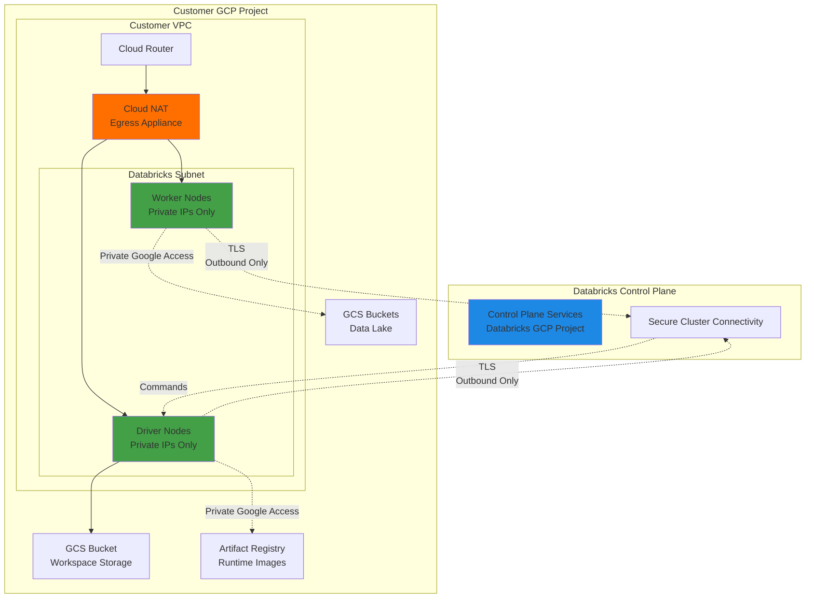

### VPC Requirements

#### Region Support

Customer-managed VPC is available in all GCP regions where Databricks operates. See [Databricks GCP Regions](https://docs.databricks.com/resources/supported-regions.html) for current list.

#### VPC and Subnet Sizing

**Key Principle**: GCP requires only **1 subnet** per workspace (simpler than AWS or Azure).

**Subnet sizing:**

| Workspace Size | Nodes Needed | Recommended Subnet Size | Usable IPs | Max Nodes |
|----------------|--------------|------------------------|------------|-----------|
| Small (dev/test) | 10-20 | `/28` | 12 | 12 nodes |
| Medium (production) | 50-100 | `/25` | 123 | 123 nodes |
| Large (enterprise) | 200-500 | `/23` | 507 | 507 nodes |

**IP Calculation:**
```
GCP reserves 4 IPs per subnet (network, gateway, broadcast, future)
Databricks uses 1 IP per node

Usable IPs = (2^(32-netmask)) - 4
Max Databricks Nodes = Usable IPs

Example /28: 16 - 4 = 12 usable IPs → 12 nodes
Example /26: 64 - 4 = 60 usable IPs → 60 nodes
Example /24: 256 - 4 = 252 usable IPs → 252 nodes
```

> **Note**: GCP uses 1 IP per node (same as Azure). Only **1 subnet** needed per workspace (simpler than AWS/Azure which need 2).

#### Subnet Requirements

**Minimum configuration:**
- **1 subnet** per workspace
- Subnet must be in the **same region** as workspace
- Subnet netmask: `/29` (smallest) to `/9` (largest)
- Recommended production: `/26` or `/25`

**Multi-workspace patterns:**

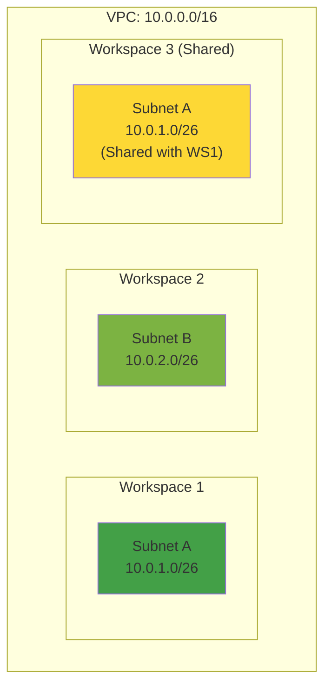

> **Note**: Workspaces can share a subnet (unlike Azure where each workspace needs unique subnets). Plan capacity if sharing.

#### VPC Project Options

**Option 1: Standalone VPC** (same project for VPC and workspace)
- VPC and workspace resources in same GCP project
- Simpler setup
- Single billing project

**Option 2: Shared VPC** (cross-project networking)
- **Host project**: Contains the VPC
- **Service project**: Where workspace resources are created
- Useful for centralized network management
- Separate billing per workspace
- More complex IAM requirements

> **Terminology**: Google calls this a "Shared VPC" or "Cross Project Network (XPN)". Don't confuse with whether multiple workspaces share a VPC - both standalone and Shared VPCs can host multiple workspaces.

### VPC Firewall Rules

GCP uses VPC-level firewall rules (unlike AWS Security Groups which are instance-level).

#### Default Behavior

GCP default VPC includes:
- Allow all egress (outbound)
- Allow SSH, RDP, ICMP ingress (inbound)
- Implied deny all other ingress

**For Databricks, default egress rules are sufficient.**

#### Required Firewall Rules

If you customize firewall rules, ensure these are allowed:

**Egress (Outbound):**

| Priority | Direction | Action | Source | Destination | Protocol | Ports | Purpose |
|----------|-----------|--------|--------|-------------|----------|-------|---------|
| 1000 | Egress | Allow | Subnet CIDR | `0.0.0.0/0` | TCP | 443 | Databricks control plane, GCS, GAR |
| 1000 | Egress | Allow | Subnet CIDR | `0.0.0.0/0` | TCP | 3306 | Legacy Hive metastore (optional) |
| 1000 | Egress | Allow | Subnet CIDR | `0.0.0.0/0` | TCP | 53 | DNS resolution |
| 1000 | Egress | Allow | Subnet CIDR | Subnet CIDR | All | All | Intra-cluster communication |

**Ingress (Inbound):**

| Priority | Direction | Action | Source | Destination | Protocol | Ports | Purpose |
|----------|-----------|--------|--------|-------------|----------|-------|---------|
| 1000 | Ingress | Allow | Subnet CIDR | Subnet CIDR | All | All | Intra-cluster communication |

> **Note**: Port 3306 (Hive metastore) is optional with Unity Catalog (recommended). Unity Catalog uses port 443 for metadata operations.

> **Why allow from subnet to itself?** This enables communication between driver and worker nodes within the cluster.

#### Firewall Rule Target Tags

You can use **network tags** to apply firewall rules to specific instances:
- Databricks automatically tags compute instances
- You can reference these tags in firewall rules
- More granular control than applying to entire subnet

### Cloud NAT and Egress

GCP Databricks clusters need outbound internet connectivity to reach the control plane.

#### Cloud NAT (Recommended)

**Benefits:**
- Provides outbound internet access for private IPs
- High availability built-in
- Automatic IP management
- Regional service (no zonal dependencies)
- Lower operational overhead

**Setup:**
- Create Cloud Router in same region as subnet
- Create Cloud NAT attached to Cloud Router
- Configure to use subnet or entire VPC
- NAT IPs automatically allocated

**Components:**
```
VPC → Subnet → Cloud Router → Cloud NAT → Internet
```

#### Private Google Access

**What it is:**
- Allows VMs with private IPs to reach Google services (GCS, GAR, BigQuery, etc.)
- Traffic stays on Google's network backbone
- No internet gateway or NAT required for Google services
- **Enable on subnet** for Databricks

**Benefits:**
- Better performance (stays on Google network)
- Enhanced security (no internet exposure)
- No NAT costs for Google service traffic
- Required for accessing Artifact Registry (runtime images)

**How it works:**
```
Cluster Nodes (Private IP) → Private Google Access → GCS/GAR/BigQuery
                                                      (No internet traversal)
```

> **Important**: Private Google Access is enabled **per subnet**. Ensure it's enabled for Databricks subnets.

#### Required Outbound Destinations

If using egress filtering (firewall appliance), allow these destinations:

**Databricks Control Plane:**
- `*.gcp.databricks.com` (port 443)
- Control plane regional endpoints
- Secure Cluster Connectivity endpoints

**Google Services:**
- `storage.googleapis.com` (GCS)
- `*.pkg.dev` (Artifact Registry)
- `bigquery.googleapis.com` (if using BigQuery)

**Package Repositories** (if downloading libraries):
- `pypi.org`, `files.pythonhosted.org` (Python/PyPI)
- `repo1.maven.org` (Java/Maven)
- `cran.r-project.org` (R/CRAN)

> **Alternative**: Use Private Google Access for Google services. Only need NAT for control plane and external repos.

### Deployment Walkthrough

#### Step 1: Plan Your Network
- VPC CIDR range (if creating new VPC)
- One subnet per workspace
- Subnet size based on node count
- Standalone vs Shared VPC decision

#### Step 2: Create or Configure VPC
- **New VPC**: Create with custom subnet mode
- **Existing VPC**: Verify subnet availability
- **Shared VPC**: Set up host/service project relationship

#### Step 3: Create Subnet
- Create subnet in same region as workspace
- Size appropriately (/29 to /9, recommend /26 or /25)
- **Enable Private Google Access** on subnet

#### Step 4: Configure Cloud NAT
- Create Cloud Router in same region
- Create Cloud NAT attached to router
- Configure to cover Databricks subnet

#### Step 5: Configure Firewall Rules
- Verify default egress allows 443, 3306, 53
- Allow all traffic within subnet CIDR
- Add custom rules if needed

#### Step 6: Register with Databricks
- Use Databricks Account Console
- Select VPC, subnet, and region
- Databricks creates network configuration object
- Use configuration when creating workspace

> **Implementation Note**: See the [`gcpdb4u/`](../gcpdb4u/) folder in this repository for production-ready Terraform templates that implement these patterns.

### Private Service Connect

Private Service Connect (PSC) provides private connectivity to Databricks control plane without internet.

#### What is Private Service Connect?

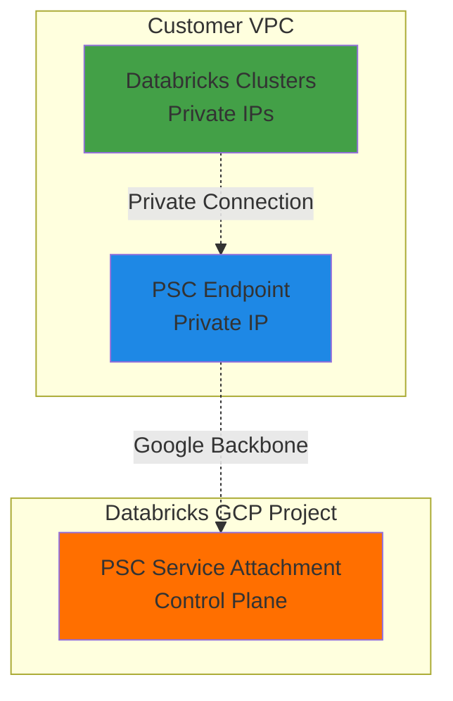

**Benefits:**
- No internet gateway or Cloud NAT required for Databricks connectivity
- Traffic stays on Google backbone
- Enhanced security posture
- Simplified compliance

**Requirements:**
- Customer-managed VPC (cannot use with Databricks-managed)
- PSC endpoint in your VPC
- DNS configuration for Databricks domains
- Premium pricing tier

**When to use:**
- Air-gapped environments
- Zero-trust architectures
- Strict compliance requirements
- Maximum security posture

### VPC Service Controls (VPC-SC)

VPC Service Controls provides an additional security perimeter around Google Cloud resources.

#### What is VPC-SC?

**Purpose**: Prevent data exfiltration by creating security perimeters around Google Cloud services.

**How it works:**
- Define a "service perimeter" around projects
- Control which resources can access services within perimeter
- Restrict data movement outside perimeter
- Complementary to VPC firewall rules

**Use cases:**
- Highly regulated industries (finance, healthcare, government)
- Data residency requirements
- Prevent accidental data exfiltration
- Defense-in-depth security

**Complexity**: VPC-SC is more complex to set up and manage than basic networking. See [VPC-SC documentation](https://cloud.google.com/vpc-service-controls/docs) for detailed guidance.

> **Note**: VPC-SC is a Google Cloud security feature that works with Databricks but requires careful planning and configuration.

### IP Address Planning Worksheet

| Component | Address Space | Notes |
|-----------|--------------|-------|
| VPC CIDR | `<cidr>` | Plan for multiple workspaces |
| Workspace 1 - Subnet | `<cidr>` | Min /29, recommend /26 or /25 |
| Workspace 2 - Subnet | `<cidr>` | Can share subnet with WS1 |
| Workspace 3 - Subnet | `<cidr>` | Or use unique subnet |

**Capacity Calculation:**
```
Usable IPs = (2^(32-netmask)) - 4 (GCP reserved)
Max Databricks Nodes = Usable IPs

Example /28: 16 - 4 = 12 nodes
Example /26: 64 - 4 = 60 nodes
Example /24: 256 - 4 = 252 nodes
```

### GCP Configuration Checklist

**VPC Configuration:**
- [ ] VPC created or selected
- [ ] VPC in same region as workspace
- [ ] VPC CIDR documented

**Subnet Configuration:**
- [ ] Subnet created in workspace region
- [ ] Subnet netmask between /29 and /9
- [ ] Subnet sized for expected node count
- [ ] **Private Google Access enabled on subnet** (critical!)

**Cloud NAT:**
- [ ] Cloud Router created in same region
- [ ] Cloud NAT created and attached to router
- [ ] NAT configured to cover Databricks subnet
- [ ] Automatic IP allocation enabled

**Firewall Rules:**
- [ ] Egress allows TCP 443 to 0.0.0.0/0
- [ ] Egress allows TCP 53 to 0.0.0.0/0 (DNS)
- [ ] Egress allows all traffic within subnet CIDR
- [ ] Ingress allows all traffic from subnet CIDR
- [ ] Optional: Egress TCP 3306 if using legacy Hive metastore

**IAM Permissions:**
- [ ] User/service account has required roles on project
- [ ] If Shared VPC: Permissions on both host and service projects
- [ ] Minimum: Viewer role on project
- [ ] For workspace creation: Owner or (Editor + Project IAM Admin)

**Databricks Registration:**
- [ ] Network configuration created in Databricks Account Console
- [ ] VPC, subnet, and region specified
- [ ] Configuration ID obtained
- [ ] Workspace created using network configuration

---

## Cross-Cloud Comparison

### Networking Components Comparison

| Feature | AWS | Azure | GCP |
|---------|-----|-------|-----|
| **Virtual Network** | VPC | VNet | VPC |
| **Customer-Managed Term** | Customer-Managed VPC | VNet Injection | Customer-Managed VPC |
| **Subnet Requirements** | 2+ (different AZs) | 2 (public + private, delegated) | 1 |
| **Network Security** | Security Groups | NSGs (Network Security Groups) | Firewall Rules |
| **Security Rules Model** | Stateful | Stateful | Stateful |
| **Service Tags/Labels** | No (use `0.0.0.0/0`) | Yes (AzureDatabricks, Storage, etc.) | Partial |
| **Private Connectivity** | PrivateLink | Private Link | VPC-SC/PSC |
| **NAT Solution** | NAT Gateway | NAT Gateway or Azure Firewall | Cloud NAT |
| **Outbound Required** | Yes (`0.0.0.0/0`) | Yes (service tags) | Yes |
| **IPs per Node** | 2 (management + Spark) | 1 | 1 |
| **Subnet Delegation** | No | Yes (private subnet) | No |

### Setup Complexity Comparison

| Aspect | AWS | Azure | GCP |
|--------|-----|-------|-----|
| **Minimum Subnets** | 2 | 2 (different purposes) | 1 |
| **Security Rule Complexity** | Medium (requires 0.0.0.0/0) | Lower (uses service tags) | Medium |
| **NAT Setup** | NAT Gateway + IGW | NAT Gateway or Azure Firewall | Cloud NAT |
| **DNS Configuration** | Must enable on VPC | Automatic | Automatic |
| **Private Link Setup** | Complex | Medium | VPC-SC (Complex) |
| **Multi-Workspace Sharing** | Yes | Yes | Yes |

### Key Architectural Differences

**AWS:**
- ✅ Uses 2 IPs per node (management + Spark)
- ✅ Requires `0.0.0.0/0` in security groups (no service tags)
- ⚠️ Stateless NACLs add complexity (must allow return traffic)
- ✅ PrivateLink available for fully private connectivity

**Azure:**
- ✅ Uses 1 IP per node (simpler than AWS)
- ✅ **Service tags** simplify NSG rules (`AzureDatabricks`, `Storage`, `Sql`)
- ✅ Two subnets serve different purposes (public for infra, private for compute)
- ✅ Requires subnet delegation for private subnet to `Microsoft.Databricks/workspaces`
- ✅ NSGs are stateful (simpler than AWS NACLs)

**GCP:**
- ✅ Uses 1 IP per node
- ✅ Single subnet sufficient (simplest architecture)
- ✅ Firewall rules at VPC level
- ✅ VPC-SC provides strong data exfiltration protection
- ✅ Private Google Access for Google services

---

## Common Questions & Answers

Have questions about Databricks networking? Check out our comprehensive **[Common Questions & Answers Guide](./common-questions.md)** which covers:

- **General Networking** - Comparing options, IP planning, multi-workspace setups
- **AWS Networking** - VPCs, security groups, NACLs, PrivateLink
- **Azure Networking** - VNets, NSGs, service tags, Private Link
- **GCP Networking** - VPCs, firewall rules, VPC-SC _(coming soon)_
- **Security & Compliance** - Encryption, access control, auditing
- **Troubleshooting** - Common issues and how to fix them

The Q&A guide is organized by topic and cloud provider for easy navigation.

---

## Key Takeaways

### Essential Concepts

✅ **Two compute types**: Classic (your VPC) and Serverless (Databricks-managed)  
✅ **This guide covers classic compute plane** networking only  
✅ **Control plane** (Databricks-managed) and **classic compute plane** are separate  
✅ Classic compute plane initiates outbound connections to control plane - no inbound required  
✅ Customer-managed networking is **recommended** for production classic compute  
✅ Databricks offers flexible deployment options to match your requirements  
✅ Networking choice is permanent - set during workspace creation  

### AWS Networking Essentials

✅ **Minimum**: 2 subnets in different Availability Zones  
✅ **IP allocation**: 2 IPs per Databricks node (management + Spark)  
✅ **Subnet sizing**: Between `/17` (large) and `/26` (small)  
✅ **Security groups**: Allow all TCP/UDP within same SG  
✅ **Outbound access**: `0.0.0.0/0` required in security groups (filter at firewall)  
✅ **NAT Gateway**: Required for internet access (or PrivateLink for Databricks-only)  
✅ **DNS**: Both DNS hostnames and DNS resolution must be enabled  
✅ **VPC Endpoints**: S3 Gateway Endpoint recommended (free, better performance)  

### Azure Networking Essentials

✅ **Minimum**: 2 subnets (host + container) delegated to Databricks  
✅ **IP allocation**: Host subnet (`/26` min), Container subnet (`/23` to `/26`)  
✅ **Subnet delegation**: Both subnets must be delegated to `Microsoft.Databricks/workspaces`  
✅ **NSG rules**: Inbound/outbound to AzureDatabricks Service Tag + internal communication  
✅ **Outbound access**: Internet or Azure NAT Gateway required (or Private Link)  
✅ **Service Tags**: Use `AzureDatabricks` Service Tag to simplify NSG rules  
✅ **Private Link**: Front-end (UI/REST API) and back-end (compute) connections  
✅ **Storage access**: Service Endpoints or Private Endpoints for Azure storage  

### GCP Networking Essentials

✅ **Minimum**: 1 subnet with 2 secondary IP ranges (pods + services)  
✅ **IP allocation**: Primary range for nodes, secondary for pods/services  
✅ **Subnet sizing**: `/23` for primary, `/17` pods, `/21` services (minimum)  
✅ **Firewall rules**: Allow internal communication (all TCP/UDP within subnet)  
✅ **Outbound access**: Cloud NAT required for internet access  
✅ **Private Google Access**: Enable for GCS and Google APIs access  
✅ **Private Service Connect**: Optional for private connectivity to control plane  
✅ **VPC-SC**: Optional perimeter for data exfiltration protection  

### Planning Essentials

✅ **Capacity formula**: (Usable IPs / 2) = Max Databricks nodes  
✅ **Growth buffer**: Add 30-50% extra IP capacity  
✅ **Multi-workspace**: Can share VPC, but plan capacity accordingly  
✅ **One SG per workspace**: Recommended for isolation  
✅ **Document CIDRs**: Avoid conflicts with existing networks  

### Security Essentials

✅ **Encryption**: All traffic encrypted with TLS 1.3  
✅ **Private connectivity**: Use AWS PrivateLink for highest security  
✅ **S3 bucket policies**: Restrict access to specific VPCs/IPs  
✅ **Egress filtering**: Use firewall/proxy for fine-grained control  
✅ **VPC Flow Logs**: Enable for traffic monitoring  
✅ **Required ports**: 443, 3306, 53, 6666, 2443, 8443-8451  

### Common Mistakes to Avoid

❌ **Don't**: Forget to enable DNS hostnames and DNS resolution  
❌ **Don't**: Use subnets outside `/17` to `/26` range  
❌ **Don't**: Block `0.0.0.0/0` in security groups (filter at firewall instead)  
❌ **Don't**: Block `0.0.0.0/0` in NACLs inbound rules (required by Databricks)  
❌ **Don't**: Use NACLs for egress filtering (use firewall/proxy instead)  
❌ **Don't**: Reuse same subnet across multiple Availability Zones  
❌ **Don't**: Skip high availability for NAT Gateway in production  
❌ **Don't**: Assume you can migrate from Databricks-managed to customer-managed later  
❌ **Don't**: Under-provision IP capacity (always add growth buffer)  
❌ **Don't**: Mix subnets from primary and secondary CIDR blocks  

### When to Use What

| Scenario | Recommended Approach |
|----------|---------------------|
| **Quick POC or demo** | Databricks-managed networking |
| **Production workloads** | Customer-managed VPC |
| **Compliance requirements** | Customer-managed VPC |
| **Need AWS PrivateLink** | Customer-managed VPC (required) |
| **Tight IP address space** | Customer-managed VPC (smaller subnets) |
| **On-premises integration** | Customer-managed VPC |
| **Multiple workspaces** | Customer-managed VPC (share VPC) |
| **Air-gapped environment** | Customer-managed VPC + PrivateLink |
| **Simple dev/test** | Databricks-managed networking |

### Quick Reference: Port Requirements

| Port | Protocol | Purpose | Required |
|------|----------|---------|----------|
| `443` | TCP | HTTPS - Control plane, AWS services, repos | ✅ Yes |
| `8443` | TCP | Control plane API | ✅ Yes |
| `8444` | TCP | Unity Catalog logging/lineage | ✅ Yes (recommended) |
| `8445-8451` | TCP | Future extendability | ✅ Yes |
| `53` | TCP | DNS resolution | ✅ Yes (if custom DNS) |
| `6666` | TCP | Secure Cluster Connectivity (PrivateLink) | ✅ Yes (if PrivateLink) |
| `2443` | TCP | FIPS-compliant encryption | ✅ Yes (if FIPS) |
| `3306` | TCP | Legacy Hive metastore | ⚠️ Optional (not needed with Unity Catalog) |
| All | TCP/UDP | Within same security group | ✅ Yes |

> **Modern Approach**: Unity Catalog (ports 8443-8451) is the recommended metadata management solution. Legacy Hive metastore (port 3306) is optional and can be [disabled](https://docs.databricks.com/aws/en/data-governance/unity-catalog/disable-hms).

---

## Troubleshooting

This section provides cloud-specific troubleshooting guidance:
- [AWS Troubleshooting](#aws-troubleshooting)
- [Azure Troubleshooting](#azure-troubleshooting)
- [GCP Troubleshooting](#gcp-troubleshooting)

---

### AWS Troubleshooting

#### Cluster Launch Failures

**Symptom: Cluster stuck in "Pending" or fails to start**

**Common causes:**

1. **Insufficient IP addresses**
   ```
   Error: "Subnet does not have available IP addresses"
   ```
   
   **Check**:
   ```bash
   aws ec2 describe-subnets --subnet-ids <subnet-id> \
     --query 'Subnets[0].AvailableIpAddressCount'
   ```
   
   **Fix**: Use larger subnet or add more subnets

2. **Security group misconfiguration**
   ```
   Error: "Security group rules do not allow required traffic"
   ```
   
   **Check**: Verify egress rules include 443, 3306, 6666, 8443-8451 to `0.0.0.0/0`
   
   **Fix**: Update security group rules per [requirements](#required-rules)

3. **NAT Gateway issues**
   ```
   Error: "Cannot reach Databricks control plane"
   ```
   
   **Check**:
   ```bash
   aws ec2 describe-nat-gateways --nat-gateway-ids <nat-gw-id>
   # Verify state = "available"
   
   aws ec2 describe-route-tables --filters "Name=association.subnet-id,Values=<subnet-id>"
   # Verify 0.0.0.0/0 route points to NAT Gateway
   ```
   
   **Fix**: Ensure NAT Gateway is running and route table correct

4. **DNS not enabled**
   ```
   Error: "DNS resolution failed"
   ```
   
   **Check**:
   ```bash
   aws ec2 describe-vpc-attribute --vpc-id <vpc-id> --attribute enableDnsHostnames
   aws ec2 describe-vpc-attribute --vpc-id <vpc-id> --attribute enableDnsSupport
   ```
   
   **Fix**: Enable both DNS settings on VPC

5. **Network ACL blocking traffic**
   ```
   Error: "Connection timeout" or "Network unreachable"
   ```
   
   **Check**:
   ```bash
   aws ec2 describe-network-acls --filters "Name=association.subnet-id,Values=<subnet-id>"
   # Look for inbound rule allowing 0.0.0.0/0
   ```
   
   **Fix**: 
   - Ensure inbound rule 100 allows ALL from `0.0.0.0/0` (required for return traffic)
   - Ensure outbound rules allow required ports (443, 8443-8451)
   - Ensure ephemeral ports 1024-65535 allowed outbound (for requests)
   - Remember: NACLs are stateless - must allow both directions
   - Consider using default NACL (recommended)

### Connectivity Problems

**Symptom: Cluster starts but can't reach services**

**Common causes:**

1. **S3 access denied**
   
   **Check**: IAM instance profile permissions
   ```bash
   aws iam get-role --role-name <instance-profile-role>
   aws iam list-attached-role-policies --role-name <instance-profile-role>
   ```
   
   **Fix**: Attach policy with S3 read/write permissions

2. **Bucket policy blocking access**
   
   **Check**: S3 bucket policy allows VPC endpoint or NAT IP
   ```bash
   aws s3api get-bucket-policy --bucket <bucket-name>
   ```
   
   **Fix**: Update bucket policy to allow `aws:sourceVpce` or `aws:SourceIp`

3. **VPC Endpoint misconfiguration**
   
   **Check**: Endpoint attached to route tables
   ```bash
   aws ec2 describe-vpc-endpoints --vpc-endpoint-ids <endpoint-id>
   ```
   
   **Fix**: Attach endpoint to correct route tables

4. **Regional endpoint issues**
   
   **Symptom**: Cross-region S3 access fails
   
   **Fix**: Remove regional endpoint Spark configuration or ensure all S3 buckets in same region

### Network ACL Issues

**Symptom: Intermittent connectivity or specific ports blocked**

Network ACLs are **stateless** and can cause connectivity issues if misconfigured. Understanding why Databricks requires permissive NACLs is key.

**Why NACLs must be permissive:**

Databricks cluster nodes have **no public IPs**. All connections are outbound-initiated (to control plane, S3, etc.). However, NACLs are **stateless** - they don't track connections. When a cluster makes an outbound HTTPS request:

1. **Request goes out** through outbound NACL rule (port 443)
2. **Response comes back** as inbound traffic (on ephemeral port 32768-65535)
3. NACL must allow this **return traffic** inbound from `0.0.0.0/0`

This is fundamentally different from Security Groups (stateful), which automatically allow return traffic.

**Check**: NACL rules allow required traffic
```bash
aws ec2 describe-network-acls --filters "Name=association.subnet-id,Values=<subnet-id>"
```

**Common NACL issues:**

1. **Inbound rule not allowing `0.0.0.0/0`**
   - Symptom: Outbound connections timeout or fail
   - Root cause: Return traffic blocked by NACL (stateless)
   - **NOT a security risk**: Nodes have no public IPs, cannot be reached from internet
   - This allows: Return traffic from control plane, S3, AWS services, intra-cluster communication
   - Security is enforced by: Security Groups (stateful) + no public IPs + Secure Cluster Connectivity

2. **Ephemeral ports blocked**
   - Return traffic uses ports 1024-65535
   - Must be allowed **outbound** for requests AND **inbound** for responses
   - Error symptoms: Connections start but fail mid-stream

3. **Outbound ports blocked**
   - Must allow ports 443, 8443-8451, 53, 6666, 2443
   - Error symptoms: Cannot reach control plane or AWS services

**Fix**: 

Option 1 (Strongly Recommended): Use default NACL
```bash
# Associate subnet with default NACL
aws ec2 replace-network-acl-association \
  --association-id <assoc-id> \
  --network-acl-id <default-nacl-id>
```

**Why default NACL is best:**
- Allows all inbound/outbound (works with stateless NACL model)
- Security is enforced by Security Groups (stateful, intelligent)
- No public IPs on nodes means no internet exposure
- Egress filtering done by firewall/proxy (proper layer)
- Eliminates NACL troubleshooting complexity

Option 2: Fix custom NACL rules (only if required by policy)
- **Inbound rule 100**: Allow ALL from `0.0.0.0/0` (for return traffic - not a security risk)
- **Outbound**: Allow VPC CIDR (all ports)
- **Outbound**: Allow ports 443, 8443-8451, 53, 6666, 2443 to `0.0.0.0/0`
- **Outbound**: Allow ephemeral ports 1024-65535 to `0.0.0.0/0`

> **Security Model**: The proper security model is:
> 1. **NACLs**: Permissive (stateless, allow return traffic)
> 2. **Security Groups**: Primary control (stateful, connection-aware)
> 3. **No Public IPs**: Nodes cannot be reached from internet
> 4. **Egress Firewall**: Fine-grained outbound filtering at proper layer
>
> This provides strong security without fighting against stateless NACL behavior.

### Diagnostic Commands (AWS)

**Test connectivity from within VPC:**

Launch EC2 instance in same subnet with same security group, then:

```bash
# Test control plane connectivity
curl -I https://accounts.cloud.databricks.com

# Test S3 regional endpoint
curl -I https://s3.<region>.amazonaws.com

# Test DNS resolution
nslookup accounts.cloud.databricks.com
nslookup s3.<region>.amazonaws.com

# Test routing
traceroute 8.8.8.8  # Should go through NAT Gateway

# Check instance metadata (validates IAM role)
curl http://169.254.169.254/latest/meta-data/iam/security-credentials/
```

**Analyze VPC Flow Logs:**

```bash
# Enable VPC Flow Logs
aws ec2 create-flow-logs \
  --resource-type Subnet \
  --resource-ids <subnet-id> \
  --traffic-type ALL \
  --log-destination-type cloud-watch-logs \
  --log-group-name /aws/vpc/flowlogs

# Query logs (requires CloudWatch Logs Insights)
# Look for REJECT entries indicating blocked traffic
```

---

### Azure Troubleshooting

#### Cluster Launch Failures

**Symptom: Cluster stuck in "Pending" or fails to start**

**Common causes:**

1. **Insufficient IP addresses in host or container subnet**
   ```
   Error: "No available IP addresses in subnet"
   ```
   
   **Check**:
   ```bash
   az network vnet subnet show \
     --resource-group <rg-name> \
     --vnet-name <vnet-name> \
     --name <subnet-name> \
     --query "addressPrefix"
   ```
   
   **Fix**: 
   - Ensure host subnet is at least `/26`
   - Ensure container subnet is between `/23` and `/26`
   - Consider using larger subnets for production

2. **NSG rules blocking required traffic**
   ```
   Error: "Network security group denies required traffic"
   ```
   
   **Check**: Verify NSG rules include AzureDatabricks Service Tag
   ```bash
   az network nsg rule list \
     --resource-group <rg-name> \
     --nsg-name <nsg-name> \
     --output table
   ```
   
   **Fix**: Add required NSG rules:
   - Inbound: Allow from `AzureDatabricks` Service Tag
   - Outbound: Allow to `AzureDatabricks` Service Tag
   - Internal: Allow all TCP/UDP between subnets

3. **Subnet delegation missing**
   ```
   Error: "Subnet must be delegated to Microsoft.Databricks/workspaces"
   ```
   
   **Check**:
   ```bash
   az network vnet subnet show \
     --resource-group <rg-name> \
     --vnet-name <vnet-name> \
     --name <subnet-name> \
     --query "delegations"
   ```
   
   **Fix**: Delegate both host and container subnets
   ```bash
   az network vnet subnet update \
     --resource-group <rg-name> \
     --vnet-name <vnet-name> \
     --name <subnet-name> \
     --delegations Microsoft.Databricks/workspaces
   ```

4. **NAT Gateway or outbound connectivity issues**
   ```
   Error: "Cannot reach Azure Databricks control plane"
   ```
   
   **Check**:
   ```bash
   az network nat gateway show \
     --resource-group <rg-name> \
     --name <nat-gateway-name>
   ```
   
   **Fix**: 
   - Ensure NAT Gateway is provisioned
   - Verify route table points 0.0.0.0/0 to NAT or Internet
   - Check that outbound Public IP is not blocked

#### Connectivity Problems

**Symptom: Cluster starts but can't reach storage or services**

**Common causes:**

1. **Storage account access denied**
   
   **Check**: Verify storage firewall and network rules
   ```bash
   az storage account show \
     --resource-group <rg-name> \
     --name <storage-account-name> \
     --query "networkRuleSet"
   ```
   
   **Fix**: 
   - Add VNet/subnet to storage account firewall
   - Or use Service Endpoint on subnet
   - Or use Private Endpoint for private connectivity

2. **Private Endpoint DNS resolution failing**
   
   **Symptom**: Storage FQDN resolves to public IP instead of private IP
   
   **Check**:
   ```bash
   nslookup <storage-account-name>.blob.core.windows.net
   # Should resolve to 10.x.x.x (private IP)
   ```
   
   **Fix**: 
   - Ensure Private DNS Zone is linked to VNet
   - Verify A record exists in `privatelink.blob.core.windows.net`
   - Check that VNet DNS settings point to Azure DNS (168.63.129.16)

3. **Service Tag not updated**
   
   **Symptom**: Connection fails after Databricks infrastructure update
   
   **Fix**: Service Tags are automatically updated by Azure, but NSG rules may need refresh
   ```bash
   # Download current Service Tag IP ranges
   az rest --method get \
     --url "https://www.microsoft.com/download/confirmation.aspx?id=56519"
   ```

#### NSG Troubleshooting

**Symptom: Intermittent connectivity or specific ports blocked**

**Check**: NSG flow logs
```bash
# Enable NSG flow logs
az network watcher flow-log create \
  --resource-group <rg-name> \
  --nsg <nsg-name> \
  --name <flow-log-name> \
  --location <region> \
  --storage-account <storage-account-id>

# View NSG effective rules
az network nic list-effective-nsg \
  --resource-group <rg-name> \
  --name <nic-name>
```

**Common NSG issues:**

1. **Missing AzureDatabricks Service Tag**
   - Symptom: Control plane communication fails
   - Root cause: NSG rules don't include Service Tag
   - **Fix**: Add inbound/outbound rules for `AzureDatabricks`

2. **Incorrect rule priority**
   - Lower number = higher priority (100 > 200)
   - Explicit deny rules take precedence
   - **Fix**: Ensure Databricks rules have priority < 1000

3. **Subnet NSG vs NIC NSG conflicts**
   - NSGs at subnet level apply first
   - Then NSGs at NIC level
   - Both must allow traffic
   - **Fix**: Check effective security rules

#### Diagnostic Commands (Azure)

**Test connectivity from within VNet:**

Launch VM in same subnet, then:

```bash
# Test control plane connectivity
curl -I https://<workspace-url>.azuredatabricks.net

# Test Azure storage
curl -I https://<storage-account>.blob.core.windows.net

# Test DNS resolution
nslookup <workspace-url>.azuredatabricks.net
nslookup <storage-account>.blob.core.windows.net

# Check effective routes
az network nic show-effective-route-table \
  --resource-group <rg-name> \
  --name <nic-name> \
  --output table
```

**Analyze NSG Flow Logs:**

```bash
# Query flow logs (Azure Monitor)
# Look for "Deny" action in NSG flow log events
# Filter by source/destination IP and port
```

---

### GCP Troubleshooting

#### Cluster Launch Failures

**Symptom: Cluster stuck in "Pending" or fails to start**

**Common causes:**

1. **Insufficient IP addresses in subnet or secondary ranges**
   ```
   Error: "Insufficient IP addresses in subnet secondary range"
   ```
   
   **Check**:
   ```bash
   gcloud compute networks subnets describe <subnet-name> \
     --region=<region> \
     --format="value(secondaryIpRanges)"
   ```
   
   **Fix**: 
   - Ensure primary range is at least `/23`
   - Ensure pods range is at least `/17`
   - Ensure services range is at least `/21`
   - Expand secondary ranges if needed

2. **Firewall rules blocking internal traffic**
   ```
   Error: "Firewall rules deny required traffic"
   ```
   
   **Check**: List firewall rules
   ```bash
   gcloud compute firewall-rules list \
     --filter="network:<vpc-name>" \
     --format="table(name,direction,allowed,sourceRanges)"
   ```
   
   **Fix**: Add required firewall rules
   ```bash
   # Allow internal communication
   gcloud compute firewall-rules create databricks-internal \
     --network=<vpc-name> \
     --direction=INGRESS \
     --action=ALLOW \
     --rules=tcp,udp,icmp \
     --source-ranges=<subnet-cidr>,<pods-cidr>,<services-cidr> \
     --target-tags=databricks
   ```

3. **Cloud NAT not configured**
   ```
   Error: "Cannot reach external services"
   ```
   
   **Check**:
   ```bash
   gcloud compute routers nats list \
     --router=<router-name> \
     --region=<region>
   ```
   
   **Fix**: Create Cloud NAT
   ```bash
   gcloud compute routers nats create databricks-nat \
     --router=<router-name> \
     --region=<region> \
     --nat-all-subnet-ip-ranges \
     --auto-allocate-nat-external-ips
   ```

4. **Private Google Access not enabled**
   ```
   Error: "Cannot reach GCS or Google APIs"
   ```
   
   **Check**:
   ```bash
   gcloud compute networks subnets describe <subnet-name> \
     --region=<region> \
     --format="value(privateIpGoogleAccess)"
   ```
   
   **Fix**: Enable Private Google Access
   ```bash
   gcloud compute networks subnets update <subnet-name> \
     --region=<region> \
     --enable-private-ip-google-access
   ```

#### Connectivity Problems

**Symptom: Cluster starts but can't reach GCS or services**

**Common causes:**

1. **GCS bucket IAM permissions missing**
   
   **Check**: Verify service account has GCS access
   ```bash
   gcloud storage buckets get-iam-policy gs://<bucket-name>
   ```
   
   **Fix**: Grant service account Storage Object Admin role
   ```bash
   gcloud storage buckets add-iam-policy-binding gs://<bucket-name> \
     --member="serviceAccount:<sa-email>" \
     --role="roles/storage.objectAdmin"
   ```

2. **VPC-SC perimeter blocking access**
   
   **Symptom**: Requests to GCS or other Google services are denied
   
   **Check**:
   ```bash
   gcloud access-context-manager perimeters list \
     --policy=<policy-id>
   ```
   
   **Fix**: 
   - Add Databricks project to VPC-SC perimeter
   - Or create access level for Databricks service account
   - Or use Private Service Connect to bypass VPC-SC

3. **Private Service Connect endpoint misconfigured**
   
   **Symptom**: Cannot reach Databricks control plane via PSC
   
   **Check**:
   ```bash
   gcloud compute forwarding-rules list \
     --filter="target:serviceAttachments"
   ```
   
   **Fix**: Verify PSC endpoint configuration and DNS

#### Firewall Troubleshooting

**Symptom: Specific ports or protocols blocked**

**Check**: Firewall logs
```bash
# Enable firewall logging
gcloud compute firewall-rules update <rule-name> \
  --enable-logging

# View logs
gcloud logging read "resource.type=gce_subnetwork AND logName=projects/<project-id>/logs/compute.googleapis.com%2Ffirewall" \
  --limit 50 \
  --format json
```

**Common firewall issues:**

1. **Missing internal communication rule**
   - Symptom: Nodes can't communicate with each other
   - Root cause: No firewall rule allowing internal traffic
   - **Fix**: Allow all TCP/UDP from subnet CIDR + secondary ranges

2. **Incorrect target tags**
   - Firewall rules only apply to instances with matching network tags
   - Databricks adds `databricks` tag automatically
   - **Fix**: Ensure firewall rules target correct tags

3. **Egress deny rule blocking outbound**
   - GCP has implied allow egress by default
   - Custom egress deny rules can break connectivity
   - **Fix**: Add explicit allow rules before deny rules (lower priority number)

#### Diagnostic Commands (GCP)

**Test connectivity from within VPC:**

Launch Compute Engine VM in same subnet, then:

```bash
# Test control plane connectivity
curl -I https://<workspace-id>.gcp.databricks.com

# Test GCS
curl -I https://storage.googleapis.com

# Test DNS resolution
nslookup <workspace-id>.gcp.databricks.com
nslookup storage.googleapis.com

# Check effective routes
gcloud compute instances describe <instance-name> \
  --zone=<zone> \
  --format="value(networkInterfaces[0].networkIP)"
```

**Analyze VPC Flow Logs:**

```bash
# Enable VPC Flow Logs
gcloud compute networks subnets update <subnet-name> \
  --region=<region> \
  --enable-flow-logs

# Query logs (Cloud Logging)
gcloud logging read "resource.type=gce_subnetwork AND logName=projects/<project-id>/logs/compute.googleapis.com%2Fflow" \
  --limit 50 \
  --format json
```

---

## Best Practices

### Design Principles

**Plan for growth**
- Add 30-50% IP capacity buffer beyond current needs
- Consider future workspace additions
- Document CIDR allocations to avoid conflicts

**Use Infrastructure as Code**
- Terraform or CloudFormation for reproducibility
- Version control all network configurations
- Automate deployment and testing

**Implement high availability**
- **AWS**: Deploy NAT Gateways in multiple AZs + subnets across AZs
- **Azure**: Zone-redundant NAT Gateway + availability zones for subnets
- **GCP**: Regional Cloud NAT (auto-HA) + multi-zone subnet design
- Consider multi-region for disaster recovery (all clouds)

**Separate environments**
- **AWS**: Unique VPCs per environment or unique subnets per workspace
- **Azure**: Unique VNets per environment or unique subnets per workspace
- **GCP**: Unique VPCs per environment or Shared VPC with project isolation
- Use tagging/labeling for organization and cost allocation (all clouds)

### Security Recommendations

**Use private connectivity**
- **AWS**: PrivateLink for highest security + S3 VPC Gateway Endpoints (free)
- **Azure**: Private Link (front-end + back-end) + Service Endpoints for storage
- **GCP**: Private Service Connect (PSC) + Private Google Access for GCS
- VPC/VNet peering for on-premises integration

**Implement defense in depth**
- **AWS**: Security groups (stateful) + NACLs (stateless, keep permissive) + firewall/proxy
- **Azure**: NSGs (stateful) with Service Tags + Azure Firewall for egress
- **GCP**: Firewall rules (stateful) with network tags + Cloud Armor
- Storage policies for data access control (S3 bucket policy, storage account firewall, GCS IAM)

**Enable logging and monitoring**
- **AWS**: VPC Flow Logs + CloudWatch + CloudTrail
- **Azure**: NSG Flow Logs + Azure Monitor + Activity Log
- **GCP**: VPC Flow Logs + Cloud Logging + Cloud Audit Logs
- Unity Catalog audit logs for data access (all clouds)

**Follow least privilege**
- **AWS**: Minimal IAM permissions for cross-account role + S3 bucket policies
- **Azure**: Managed Identity with minimum Azure RBAC roles + storage firewall
- **GCP**: Service Account with minimum IAM roles + GCS bucket IAM
- Use Unity Catalog for fine-grained data permissions (all clouds)

### Operational Excellence

**Document everything**
- Network diagrams with CIDR allocations
- Runbooks for common tasks
- Troubleshooting guides
- Change management procedures

**Implement monitoring**
- CloudWatch alarms for NAT Gateway metrics
- Subnet IP capacity alerts
- VPC Flow Log analysis for anomalies
- Cost monitoring for network resources

**Test before production**
- Validate networking in dev/staging first
- Use test EC2 instances to verify connectivity
- Load test to validate capacity
- Disaster recovery procedures

**Automate operations**
- Infrastructure as Code (Terraform recommended)
- Automated testing of network configurations
- CI/CD pipelines for infrastructure changes
- Automated compliance scanning

### Cost Optimization

**Right-size subnets**
- Don't over-allocate IP space
- Use `/24` or `/23` for most workspaces
- Reserve `/17` only for very large deployments

**Optimize data transfer**
- Use S3 Gateway Endpoints (free vs NAT charges)
- Keep S3 buckets in same region as workspace
- Consider VPC endpoints for frequently accessed AWS services

**NAT Gateway costs**
- Each NAT Gateway: ~$32/month + $0.045/GB processed
- Balance HA (multiple NAT Gateways) with cost
- S3 Gateway Endpoint avoids NAT Gateway charges for S3 traffic

**Share resources**
- Multiple workspaces in one VPC reduces networking costs
- Shared NAT Gateways across workspaces
- Shared VPC endpoints

**Monitor and optimize**
- Use AWS Cost Explorer to identify top costs
- VPC Flow Logs to identify traffic patterns
- Right-size based on actual usage

---

## Additional Resources

### Official Databricks Documentation

**Classic Compute Networking (This Guide):**
- **AWS Customer-Managed VPC**: [https://docs.databricks.com/aws/en/security/network/classic/customer-managed-vpc](https://docs.databricks.com/aws/en/security/network/classic/customer-managed-vpc)
- **AWS PrivateLink**: [https://docs.databricks.com/administration-guide/cloud-configurations/aws/privatelink.html](https://docs.databricks.com/administration-guide/cloud-configurations/aws/privatelink.html)
- **AWS Firewall Requirements**: [https://docs.databricks.com/security/network/classic/firewall.html](https://docs.databricks.com/security/network/classic/firewall.html)
- **Azure VNet Injection**: [https://learn.microsoft.com/en-us/azure/databricks/security/network/classic/vnet-inject](https://learn.microsoft.com/en-us/azure/databricks/security/network/classic/vnet-inject)
- **Azure Private Link**: [https://learn.microsoft.com/en-us/azure/databricks/security/network/classic/private-link](https://learn.microsoft.com/en-us/azure/databricks/security/network/classic/private-link)
- **GCP Customer-Managed VPC**: [https://docs.databricks.com/gcp/en/security/network/classic/customer-managed-vpc](https://docs.databricks.com/gcp/en/security/network/classic/customer-managed-vpc)
- **GCP Private Service Connect**: [https://docs.databricks.com/gcp/en/security/network/classic/private-service-connect](https://docs.databricks.com/gcp/en/security/network/classic/private-service-connect)

**Serverless Compute Networking (Separate Guide):**
- **AWS Serverless Networking**: [https://docs.databricks.com/aws/en/security/network/serverless-network-security/](https://docs.databricks.com/aws/en/security/network/serverless-network-security/)
- **Azure Serverless Networking**: [https://learn.microsoft.com/en-us/azure/databricks/security/network/serverless-network-security](https://learn.microsoft.com/en-us/azure/databricks/security/network/serverless-network-security)
- **GCP Serverless Networking**: [https://docs.databricks.com/gcp/en/security/network/serverless-network-security](https://docs.databricks.com/gcp/en/security/network/serverless-network-security)

**General:**
- **Databricks Architecture Overview**: [https://docs.databricks.com/getting-started/overview.html](https://docs.databricks.com/getting-started/overview.html)
- **Supported Regions**: [https://docs.databricks.com/resources/supported-regions.html](https://docs.databricks.com/resources/supported-regions.html)

### AWS Documentation

- **VPC User Guide**: [https://docs.aws.amazon.com/vpc/](https://docs.aws.amazon.com/vpc/)
- **Security Groups**: [https://docs.aws.amazon.com/vpc/latest/userguide/VPC_SecurityGroups.html](https://docs.aws.amazon.com/vpc/latest/userguide/VPC_SecurityGroups.html)
- **NAT Gateways**: [https://docs.aws.amazon.com/vpc/latest/userguide/vpc-nat-gateway.html](https://docs.aws.amazon.com/vpc/latest/userguide/vpc-nat-gateway.html)
- **VPC Endpoints**: [https://docs.aws.amazon.com/vpc/latest/privatelink/vpc-endpoints.html](https://docs.aws.amazon.com/vpc/latest/privatelink/vpc-endpoints.html)
- **AWS PrivateLink**: [https://aws.amazon.com/privatelink/](https://aws.amazon.com/privatelink/)

### Azure Documentation

- **Azure Virtual Networks**: [https://learn.microsoft.com/en-us/azure/virtual-network/](https://learn.microsoft.com/en-us/azure/virtual-network/)
- **Network Security Groups (NSGs)**: [https://learn.microsoft.com/en-us/azure/virtual-network/network-security-groups-overview](https://learn.microsoft.com/en-us/azure/virtual-network/network-security-groups-overview)
- **Azure NAT Gateway**: [https://learn.microsoft.com/en-us/azure/nat-gateway/](https://learn.microsoft.com/en-us/azure/nat-gateway/)
- **Azure Firewall**: [https://learn.microsoft.com/en-us/azure/firewall/](https://learn.microsoft.com/en-us/azure/firewall/)
- **Azure Private Link**: [https://learn.microsoft.com/en-us/azure/private-link/](https://learn.microsoft.com/en-us/azure/private-link/)
- **Service Endpoints**: [https://learn.microsoft.com/en-us/azure/virtual-network/virtual-network-service-endpoints-overview](https://learn.microsoft.com/en-us/azure/virtual-network/virtual-network-service-endpoints-overview)

### GCP Documentation

- **VPC Overview**: [https://cloud.google.com/vpc/docs](https://cloud.google.com/vpc/docs)
- **VPC Firewall Rules**: [https://cloud.google.com/firewall/docs/firewalls](https://cloud.google.com/firewall/docs/firewalls)
- **Cloud NAT**: [https://cloud.google.com/nat/docs/overview](https://cloud.google.com/nat/docs/overview)
- **Private Google Access**: [https://cloud.google.com/vpc/docs/configure-private-google-access](https://cloud.google.com/vpc/docs/configure-private-google-access)
- **Private Service Connect**: [https://cloud.google.com/vpc/docs/private-service-connect](https://cloud.google.com/vpc/docs/private-service-connect)
- **VPC Service Controls**: [https://cloud.google.com/vpc-service-controls/docs](https://cloud.google.com/vpc-service-controls/docs)
- **Shared VPC**: [https://cloud.google.com/vpc/docs/shared-vpc](https://cloud.google.com/vpc/docs/shared-vpc)

### Related Guides in This Repository

- **[Authentication Guide](./authentication.md)** - Set up Terraform authentication for AWS, Azure, and GCP
- **[Identities Guide](./identities.md)** - Understand how Databricks accesses your cloud account
- **[AWS Databricks Deployment](../awsdb4u/)** - Production-ready AWS Terraform templates
- **[Azure Databricks Deployment](../adb4u/)** - Modular Azure Terraform templates
- **[GCP Databricks Deployment](../gcpdb4u/)** - GCP VPC-SC templates

### Terraform Resources

**Official Providers:**
- **Databricks Provider**: [https://registry.terraform.io/providers/databricks/databricks/](https://registry.terraform.io/providers/databricks/databricks/)
- **AWS Provider**: [https://registry.terraform.io/providers/hashicorp/aws/](https://registry.terraform.io/providers/hashicorp/aws/)

**Example Modules:**
- Reference implementation in [`awsdb4u/`](../awsdb4u/) folder of this repository
- Modular design with VPC, security groups, NAT gateway, workspace creation

### Community Resources

- **Databricks Community**: [https://community.databricks.com/](https://community.databricks.com/)
- **Stack Overflow**: Tag `databricks` or `databricks-aws`

---

## Feedback

Found something confusing or have suggestions for improvement? We'd love to hear from you!
