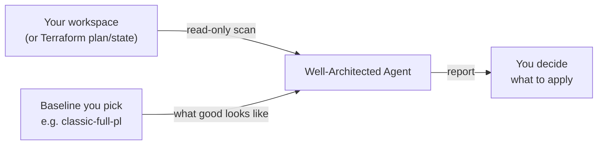
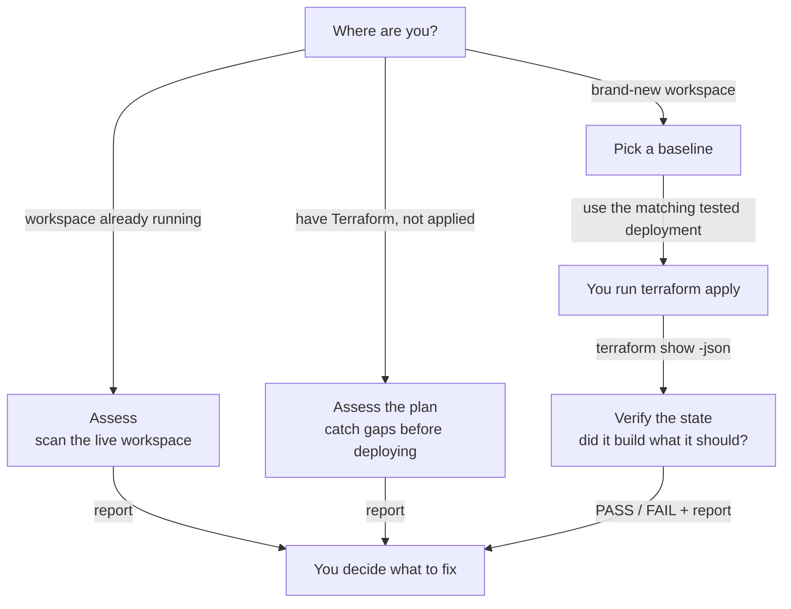
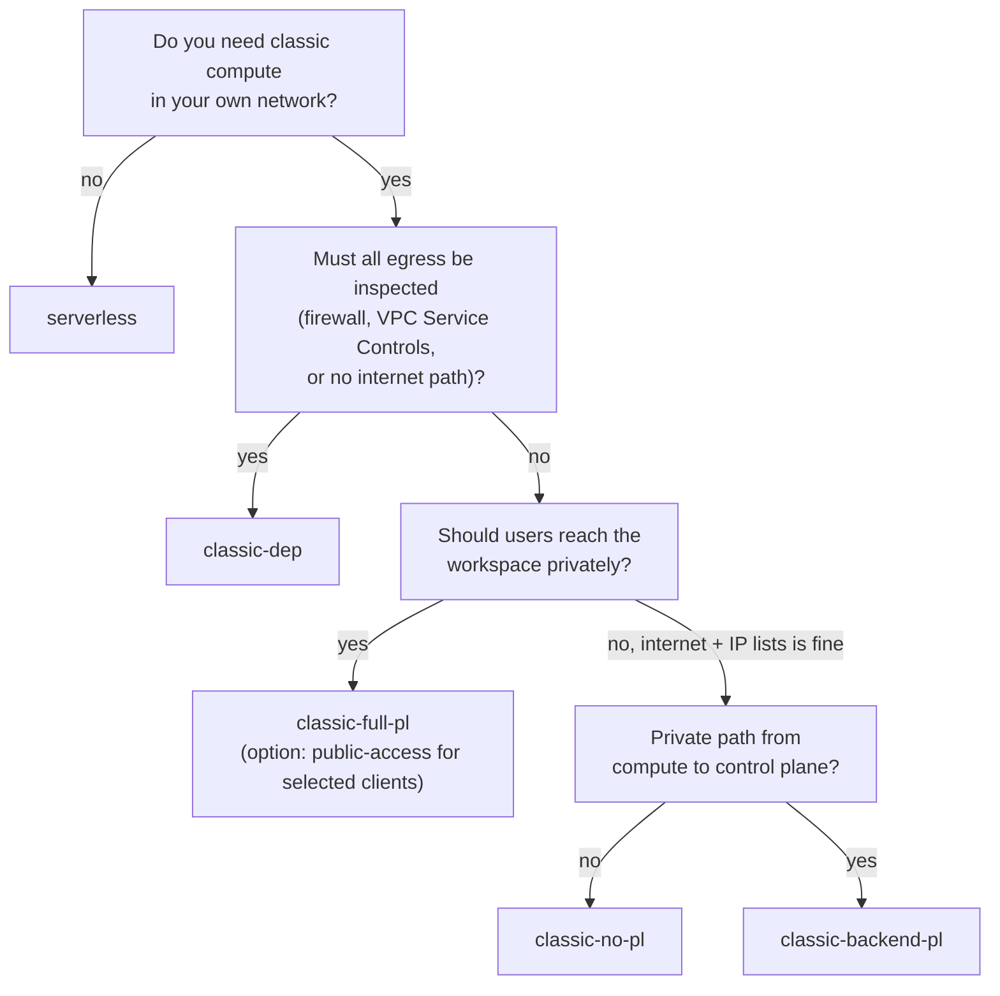
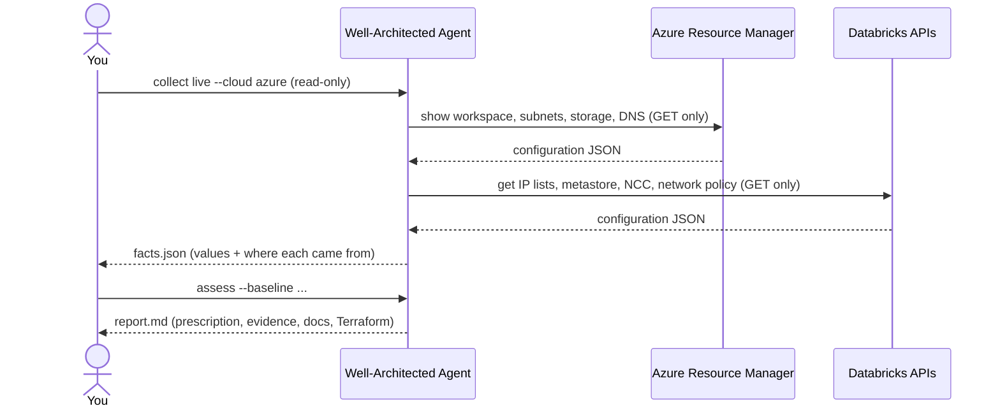
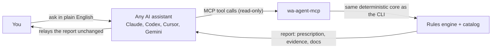
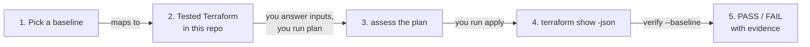

# The Well-Architected Agent — the simple guide

> **Disclaimer.** This is a community project, provided **"as is", without
> warranty of any kind**. It is **not** an official Databricks or Microsoft
> product, and it is not supported by either. Findings and Terraform
> suggestions are informational. You are responsible for reviewing, testing
> and approving anything you apply to your environment. The authors and
> contributors accept **no liability** for any damage, outage, data loss,
> security incident or cost arising from using it or acting on its output.
> Always check against the official documentation and your own security and
> compliance requirements.

Prefer slides? The [presentation](https://bhavink.github.io/databricks/presentations/well-architected-agent.html) covers the same ground.

---

## Start here (3 steps, any OS)

**1. Install `uv`** (it brings everything else the agent needs), then get the agent:

| OS | Install uv |
|---|---|
| macOS / Linux | `curl -LsSf https://astral.sh/uv/install.sh \| sh` (or `brew install uv`) |
| Windows (PowerShell) | `powershell -ExecutionPolicy ByPass -c "irm https://astral.sh/uv/install.ps1 \| iex"` (or `winget install --id=astral-sh.uv -e`) |

```bash
git clone https://github.com/bhavink/databricks.git
cd databricks/well-architected-agent
```

**2. See it work, no setup or cloud access needed:** a full report from a real, sanitized workspace.

```bash
uv run wa-agent demo
```

**3. Point it at your workspace:** check what it can see, then assess.

```bash
uv run wa-agent doctor                              # tools and logins (output is redacted, safe to share)
uv run wa-agent doctor --workspace <name-or-url>    # preflight: what is reachable, how to fix the rest
uv run wa-agent collect live --cloud azure --workspace <name-or-url> -o ws.facts.json
uv run wa-agent assess --facts ws.facts.json --baseline classic-no-pl -o report.md
```

**What you need**

| For | You need | Check / fix |
|---|---|---|
| Everything | `uv` | `uv --version` |
| Live Azure scan | Azure CLI, logged in, with the `databricks` extension; Reader on the workspace resource group (and the VNet / DNS zones if they live elsewhere) | `az login` · `az extension add --name databricks` |
| Workspace checks (IP access lists, Unity Catalog, workspace settings) | Databricks CLI profile for the workspace (workspace admin), from a network the workspace allows | `databricks auth login --host https://<workspace-url>` |
| Serverless checks (NCC, network policy) | Databricks account admin profile | `databricks auth login --host https://accounts.azuredatabricks.net --account-id <id>` |
| Plan / state review, new workspaces | Terraform 1.5+ | `terraform version` |

The workspace can be given as a name, URL, numeric id or Azure resource id;
matching Databricks CLI profiles are picked automatically. Anything the agent
can't see is reported as *not evaluable* with the exact fix.

## Self-contained · runs locally · secure

- **Runs on your machine.** No hosted service, no server to deploy, no account to create. Works the same on macOS, Windows and Linux.
- **No telemetry.** The only network calls are read-only API calls to *your* tenant, made through *your* `az`, `gcloud` and `databricks` CLIs (`doctor` also runs `aws sts get-caller-identity`) (plus a one-time dependency download by `uv`).
- **No credentials handled.** It never asks for, stores or prints keys or tokens; it reuses your existing CLI logins.
- **Read-only by construction.** Only allow-listed read commands can run, it never runs Terraform, and it never overwrites a file. Tests enforce all three.
- **Your data stays local.** Facts and reports are written only where you choose; generated files are git-ignored by default. Through an AI assistant (MCP), tool results go to that assistant's model provider under its terms, so choose your assistant accordingly.
- **Safe to share.** `doctor` output is redacted (IDs, AWS account IDs and ARNs, names, emails, tokens) so you can paste it into an issue.
- **Auditable.** Open source; the complete list of commands it may run is one table: `READ_ONLY_COMMANDS` in `wa_agent/clouds/azure/live.py`.

**Problem or question?** [Open an issue](https://github.com/bhavink/databricks/issues/new?template=wa-agent-problem.yml) and paste the output of `wa-agent doctor`.

## What is it?

A tool that looks at a Databricks workspace and tells you:

1. **what it is** — which proven architecture it matches,
2. **what's missing** — compared to the baseline you choose,
3. **how to fix it** — with evidence, official docs and tested Terraform.



## Why use it?

- **Same answer every time.** Rules, not guesses. Run it twice, get the same report.
- **Every finding has proof.** It shows the value it saw, the exact command or
  Terraform resource it came from, the official doc, and the tested
  implementation in [bhavink/databricks](https://github.com/bhavink/databricks).
- **It tells you what to do, in order.** A ranked prescription, not a wall of warnings.
- **It never changes anything.** Read-only, enforced in code.

## The three rules it always follows

| # | Rule | How it's enforced |
|---|---|---|
| 1 | **Never changes anything** — no edits to the workspace, cloud tenant, Terraform or any file you have | Only allow-listed read commands can run; it never runs Terraform; it refuses to overwrite files |
| 2 | **Grounded in truth, backed by evidence** | Every check must cite an official doc; every fact records where it came from |
| 3 | **You decide** | It only prescribes. Applying anything is up to you |

## When to use it



| Situation | Command |
|---|---|
| Health check of a running workspace | `collect live --cloud azure` then `assess` |
| Review Terraform before deploying | `collect tfplan --cloud azure` (or `gcp`, `aws`) then `assess` |
| Check a fresh deployment did what it should | `verify --tf-json state.json --baseline ...` |
| Gate a CI pipeline | `assess ... --fail-on-gaps` |

## Pick a baseline

A baseline is **what the workspace is supposed to be**. There are five, with
the same names on every cloud. Classic means compute runs in a VNet/VPC you
bring (new or existing); serverless means it runs in the Databricks
serverless compute plane.



| Baseline | In one line |
|---|---|
| `classic-no-pl` | Your VNet/VPC, no public IPs, NAT egress, IP-restricted front-end. |
| `classic-backend-pl` | Compute talks to Databricks privately; users come over the internet. Assess only. |
| `classic-full-pl` | Private Link for users and compute. Public access off, or on for selected clients. |
| `classic-dep` | Data exfiltration protection: every byte of egress inspected. Assess only. |
| `serverless` | No network to manage. A VNet/VPC only if you want a private front-end. |

**Always on, every baseline:** IP access lists with *your* known IP ranges,
an enforced serverless egress policy, and Unity Catalog.

**Options** you add on top with `--option`: `cmk` (customer-managed keys),
`data-leak` (export and download off), `public-access` (on `classic-full-pl`),
`storage-lockdown` / `storage-private` (Azure), and `context-ingress`
(rules on who, what and from where, on top of IP access lists).
`wa-agent show <baseline>` lists them.

List them any time: `uv run wa-agent baselines`.

## How to run it (5 minutes)

**1. Install**

```bash
cd well-architected-agent
```

**2. Log in (read access is enough)**

```bash
az login
databricks auth login --profile my-workspace     # workspace admin, for IP lists / Unity Catalog
databricks auth login --profile my-account \
  --host https://accounts.azuredatabricks.net --account-id <id>   # optional, for serverless checks
```

**3. Scan and assess**

```bash
uv run wa-agent collect live --cloud azure --workspace <name-or-url> -o out/ws.facts.json
# profiles are matched automatically; pass --profile / --account-profile to override

uv run wa-agent assess --facts out/ws.facts.json --baseline classic-full-pl -o out/ws.report.md
```

What happens under the hood:



## Use it from any AI assistant

The agent has no LLM inside, so it works the same under any provider. Your
assistant calls its tools over MCP and relays the deterministic report; every
tool is read-only and none of them write files.

```bash
uv run wa-agent doctor    # prints the exact registration line for your assistant
```

Register it once, start a new session, then just ask, e.g. *"What does
`classic-full-pl` require, and what does `cmk` add?"* or *"Preflight workspace
`<name>`, then assess it against `classic-full-pl` with `public-access`."*

Full steps are in the README: [register and check it's connected](README.md#use-it-from-your-ai-assistant),
[all 10 tools](README.md#use-it-from-your-ai-assistant), [more example prompts](README.md#use-it-from-your-ai-assistant),
and [everything it can do, MCP and CLI side by side](README.md#what-it-can-do).



## How to read the report

| Section | What it tells you |
|---|---|
| **Header** | Detected pattern, your baseline, score, conformant yes/no |
| **Prescription** | The fix list, in the order you should do it |
| **Gaps** | Per gap: why it matters, evidence (value + source), official docs, repo implementation, Terraform |
| **Not evaluable** | What it couldn't see and exactly how to let it see it — never guessed |
| **Passed / Not applicable** | What's already fine, and what doesn't apply to this design |
| **Upgrade path** | What stands between you and the next, more secure pattern |

Statuses, simply:

| Status | Meaning |
|---|---|
| `PASS` | Control in place, with evidence |
| `FAIL` | Control missing, with evidence |
| `UNKNOWN` | Couldn't read it (permissions, network, IP lists) — tells you how to fix the access |
| `NOT_APPLICABLE` | Doesn't apply to this design (e.g. VNet checks on serverless) |

## Brand-new workspace



```bash
wa-agent new --baseline classic-full-pl --out ./my-ws --set location=eastus2 \
  --set allowed_ip_ranges='["203.0.113.0/24"]'   # your known IP ranges, required
```

That creates `./my-ws/` with everything needed:

| File | What it is |
|---|---|
| `terraform/` | The tested Terraform, copied from this repo |
| `inputs.tfvars` | The required settings. Your `--set` answers; anything unanswered is a `REPLACE_ME_*`. Your IP ranges go into the stage files (or `ip_access_list.yaml`) |
| `stage-N-*.tfvars` | What the baseline turns on, one file per stage (for full private: *deploy*, then *lockdown* from inside your network) |
| `README.md` | Every command, in order |
| `baseline.json` | What was used: baseline, commit, and a checksum of every copied file |

After each `terraform plan`, the README also runs `wa-agent diagram` to draw what
that stage deploys (`stageN.architecture.md`), and once more on the final state
(`architecture.md`).

Each stage is: `terraform plan` → `wa-agent assess` on the plan →
`terraform apply` (you run it) → after the last stage, `wa-agent verify` on
the state. The final stage must verify as **PASS**; if the Terraform used
can't cover a check, the README names it up front.

Account and subscription IDs are set as `TF_VAR_*` environment variables and
are never written to the folder.

## FAQ

**Will it change my workspace?** No. It can only run allow-listed read
commands, never runs Terraform, and won't overwrite files. A test suite checks
that write commands are refused.

**Why "UNKNOWN" instead of a result?** Because guessing is worse than saying
"I couldn't see it". The report tells you what access is missing.

**I was blocked by an IP access list.** That's good news: it proves the lists are
enforced. Run from an allowed network to see their contents.

**Does an LLM decide the findings?** No. Findings come from rules in
`catalog/`. Same input, same output.

**Which clouds?** Azure, Google Cloud (`--cloud gcp`) and AWS (`--cloud aws`). On AWS the agent works from Terraform plans and states and builds new workspaces; to check a running AWS workspace, give it the workspace's Terraform state.

**On AWS, `awsdb4u` or `sra`?** Both build the same baselines. `awsdb4u` is this repo's Terraform, copied into your folder. `sra` is the Databricks Security Reference Architecture: the agent doesn't copy it, the run book tells you to clone it at a pinned commit, and it's the only build for `classic-dep`. Pick `sra` if your team already standardises on it. The SRA keeps the public front-end on, limited to your IP ranges, so its private builds list "public access off" as a known gap.

**On GCP, which build should I pick?** First: may Databricks create the IAM roles, role bindings and firewall rules in your project when it creates the workspace? Most teams say yes (standard creation, which Databricks recommends): pick `new-vpc` (`infra4db` for the network, then the workspace) or `existing-vpc` (your own VPC). If your security policy says no, use `lpw`, the least-privilege workspace: you create those yourself, separately, in two applies. `wa-agent new` asks you to choose with `--build`.

---

> **Disclaimer (again, because it matters).** Provided "as is", without
> warranty. Not an official Databricks or Microsoft product. You are
> responsible for anything you apply. The authors and contributors are not
> liable for any outcome of using this tool or its output.
