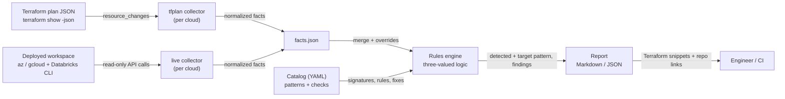
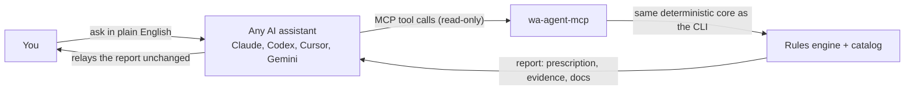

Databricks Well-Architected Agent
==============

Assesses a Databricks deployment on **Azure**, **Google Cloud** or **AWS**
against **proven reference patterns** and reports what is missing and exactly
how to fix it, with Terraform from this repo. Works **pre-deployment**
(Terraform plan) and **post-deployment** (live, read-only scan), and builds
new workspaces from the repo's tested Terraform.

Status: **Azure and GCP complete. AWS: plan and state review, diagrams and
new workspaces;** the live AWS scan is next.

New here? Read the **[simple guide](GUIDE.md)** (what / why / when / how).

> **Disclaimer.** Community project, provided "as is", without warranty of any
> kind. Not an official Databricks or Microsoft product. You are responsible
> for reviewing and testing anything you apply; the authors and contributors
> accept no liability for any outcome of using this tool or its output.

## Start here (3 steps, any OS)

**1. Install `uv`** (it brings everything else the agent needs), then get the agent:

| OS | Install uv |
|---|---|
| macOS / Linux | `curl -LsSf https://astral.sh/uv/install.sh \| sh` (or `brew install uv`) |
| Windows (PowerShell) | `powershell -ExecutionPolicy ByPass -c "irm https://astral.sh/uv/install.ps1 \| iex"` (or `winget install --id=astral-sh.uv -e`) |

```bash
git clone https://github.com/bhavink/databricks.git
cd databricks/well-architected-agent
```

**2. See it work, no setup or cloud access needed:** a full report from a real, sanitized workspace.

```bash
uv run wa-agent demo
```

**3. Point it at your workspace:** check what it can see, then assess.

```bash
uv run wa-agent doctor                              # tools and logins (output is redacted, safe to share)
uv run wa-agent doctor --workspace <name-or-url>    # preflight: what is reachable, how to fix the rest
uv run wa-agent collect live --cloud azure --workspace <name-or-url> -o ws.facts.json
uv run wa-agent assess --facts ws.facts.json --baseline classic-no-pl -o report.md
# Google Cloud: the same, with --cloud gcp (same baseline ids on every cloud)
uv run wa-agent collect live --cloud gcp --workspace <name-or-url> -o gcp.facts.json
uv run wa-agent assess --cloud gcp --facts gcp.facts.json --baseline classic-no-pl -o gcp-report.md
# AWS: from a Terraform plan or state for now (terraform show -json)
uv run wa-agent collect tfplan --cloud aws --plan plan.json -o aws.facts.json
uv run wa-agent assess --cloud aws --facts aws.facts.json --baseline classic-full-pl -o aws-report.md
```

**What you need**

| For | You need | Check / fix |
|---|---|---|
| Everything | `uv` | `uv --version` |
| Live Azure scan | Azure CLI, logged in, with the `databricks` extension; Reader on the workspace resource group (and the VNet / DNS zones if they live elsewhere) | `az login` · `az extension add --name databricks` |
| Workspace checks (IP access lists, Unity Catalog, workspace settings) | Databricks CLI profile for the workspace (workspace admin), from a network the workspace allows | `databricks auth login --host https://<workspace-url>` |
| Serverless checks (NCC, network policy) | Databricks account admin profile | `databricks auth login --host https://accounts.azuredatabricks.net --account-id <id>` |
| Live GCP scan | `gcloud` logged in (or impersonating a service account) with Viewer on the network (host) and workspace projects; for VPC Service Controls, Access Context Manager Reader on the organization | `gcloud auth login` |
| GCP account facts (network, PSC, keys, NCC, network policy, audit log delivery) | Databricks account admin profile for Google Cloud; GCP scans start here | `databricks auth login --host https://accounts.gcp.databricks.com --account-id <id>` |
| Plan / state review, new workspaces | Terraform 1.5+ | `terraform version` |
| New AWS workspaces (to apply) | AWS credentials Terraform can use, and a Databricks account admin (service principal via `DATABRICKS_CLIENT_ID` / `DATABRICKS_CLIENT_SECRET`, or `DATABRICKS_CONFIG_PROFILE`) | `aws sts get-caller-identity` |

The workspace can be given as a name, URL, numeric id or (Azure) resource id;
matching Databricks CLI profiles are picked automatically. Anything the agent
can't see is reported as *not evaluable* with the exact fix.

## Two ways to use it

Both run the same deterministic core on your machine and give the same answers.

| | In your AI assistant (MCP) | From the terminal (CLI) |
|---|---|---|
| **You** | Ask in plain English | Run `uv run wa-agent <command>` |
| **Good for** | Exploring, explaining findings, chaining steps ("preflight, then assess, then draw it") | Scripts, CI gates, exact repeatable runs |
| **Set up** | Register once: [Use it from your AI assistant](#use-it-from-your-ai-assistant) | Nothing beyond *Start here* |
| **Writes files** | Never; it returns results to the assistant | Only to the `-o` / `--out` paths you give |

## What it can do

| Task | MCP tool | CLI command |
|---|---|---|
| See a sample report, no setup or cloud access | — | `wa-agent demo` |
| Check tools and logins; get the MCP registration line | — | `wa-agent doctor` |
| List the use-case baselines | `list_baselines` | `wa-agent baselines` |
| See what a baseline requires, in plain language | `describe_baseline` | `wa-agent show <baseline>` |
| List the reference architecture patterns | `list_patterns` | `wa-agent patterns` |
| Before a scan: what is reachable and how to fix the rest | `preflight` | `wa-agent doctor --workspace <ws>` |
| Read a deployed workspace (read-only) | `collect_live` | `wa-agent collect live --workspace <ws>` |
| Read a Terraform plan or state | `collect_tfplan` | `wa-agent collect tfplan --plan <json>` |
| Score against a baseline: prescription, evidence, docs | `assess` | `wa-agent assess --facts <json> --baseline <id>` |
| Check a deployment does what its baseline requires | `verify` | `wa-agent verify --tf-json <json> --baseline <id>` |
| Draw the architecture and list every resource | `diagram` | `wa-agent diagram --tf-json <json>` |
| Get a ready-to-run folder for a new workspace | `new_workspace` (returns the files) | `wa-agent new --baseline <id> --out <dir>` (writes the folder) |

Every command has `--help`.

## Self-contained · runs locally · secure

- **Runs on your machine.** No hosted service, no server to deploy, no account to create. Works the same on macOS, Windows and Linux.
- **No telemetry.** The only network calls are read-only API calls to *your* tenant, made through *your* `az` and `databricks` CLIs (plus a one-time dependency download by `uv`).
- **No credentials handled.** It never asks for, stores or prints keys or tokens; it reuses your existing CLI logins.
- **Read-only by construction.** Only allow-listed read commands can run, it never runs Terraform, and it never overwrites a file. Tests enforce all three.
- **Your data stays local.** Facts and reports are written only where you choose; generated files are git-ignored by default. Through an AI assistant (MCP), tool results go to that assistant's model provider under its terms, so choose your assistant accordingly.
- **Safe to share.** `doctor` output is redacted (IDs, names, emails, tokens) so you can paste it into an issue.
- **Auditable.** Open source; the complete list of commands it may run is one table: `READ_ONLY_COMMANDS` in `wa_agent/clouds/azure/live.py`.

**Problem or question?** [Open an issue](https://github.com/bhavink/databricks/issues/new?template=wa-agent-problem.yml) and paste the output of `wa-agent doctor`.

## Operating rules (enforced in code)

1. **Never changes anything.** No create/update/delete against the workspace,
   cloud tenant, Terraform or any artifact. Only allow-listed read commands can
   run (`READ_ONLY_COMMANDS` in `wa_agent/clouds/<cloud>/live.py`), the agent
   never runs Terraform, and it refuses to overwrite files.
2. **Grounded in baseline truth, backed by evidence.** Every check must cite an
   official doc (enforced by the catalog loader) and, where it exists, the
   tested implementation in this repo. Every fact records the command or
   Terraform resource it came from. Findings are ranked into a prescription.
3. **You decide.** The agent prescribes; applying anything is yours to choose.

---

## Design principles

1. **Deterministic.** Findings come from rules, not from a model. Same facts +
   same catalog version → byte-identical report (stable sort, no timestamps,
   facts digest in the header). Safe for CI gating.
2. **Grounded.** Every check cites its sources — this repo's patterns
   (`adb4u/`, `gcpdb4u/`, `awsdb4u/`) and the Databricks data exfiltration
   protection blogs ([Azure](https://www.databricks.com/blog/data-exfiltration-protection-with-azure-databricks),
   [GCP](https://www.databricks.com/blog/databricks-gcp-practitioners-guide-data-exfiltration-protection),
   [AWS](https://www.databricks.com/blog/2021/02/02/data-exfiltration-protection-with-databricks-on-aws.html)).
   Every fix points at a module in this repo.
3. **Never guesses.** A fact that can't be collected yields `UNKNOWN` with the
   missing fact and how to collect it — never a false PASS or FAIL.
4. **Pattern-first.** A deployment is scored against an architecture (the
   same five on every cloud: no Private Link, back-end Private Link, full
   Private Link, data exfiltration protection, serverless), not a flat list
   of best practices.
   You get "what's missing for *this* pattern" plus an upgrade path to the next tier.
5. **Advisory first.** Read-only. Fixes are emitted as Terraform/CLI for a human
   to apply.

## Architecture



| Component | Path | Role |
|---|---|---|
| Controls | `catalog/controls.yaml` | Cloud-neutral controls, by production planning guide phase and pillar |
| Pattern catalog | `catalog/<cloud>/patterns.yaml` | Reference architectures, detection signatures, required/recommended checks, bare minimum |
| Check catalog | `catalog/<cloud>/checks.yaml` | Rules over facts, pillar, severity, rationale, sources, remediation |
| Baselines | `catalog/<cloud>/baselines.yaml` | Use cases, and the builds (tested Terraform) that create them |
| Collectors | `wa_agent/clouds/<cloud>/` | Turn a plan or a live workspace into normalized facts |
| Engine | `wa_agent/engine.py` | Pattern detection, check evaluation, conformance score |
| Report | `wa_agent/report.py` | Gaps → beyond target → not evaluable → passed → upgrade path |

Pillars follow the Databricks Well-Architected Lakehouse framework: data &
AI governance, interoperability & usability, operational excellence,
security, reliability, performance efficiency, cost optimization.

## Patterns: the same five on every cloud

There are two ways to run a workspace: **classic**, where compute runs in a
VNet/VPC you bring (new or existing), or **serverless**, where compute runs
in the Databricks serverless compute plane. A private front-end (Private
Link / Private Service Connect) needs a VNet/VPC and subnet of yours either
way.

| Pattern / baseline | What it is | Azure | Google Cloud | AWS |
|---|---|---|---|---|
| `classic-no-pl` | Your VNet/VPC, no Private Link; public front-end restricted to your IP ranges | [`non-pl`](../adb4u/deployments/non-pl) | [`infra4db`](../gcpdb4u/templates/terraform-scripts/infra4db) → [`byovpc-ws`](../gcpdb4u/templates/terraform-scripts/byovpc-ws), or [`lpw`](../gcpdb4u/templates/terraform-scripts/lpw) (least-privilege) | [`databricks-aws-production`](../awsdb4u/aws-pl-ws/databricks-aws-production) → [`workspace-guardrails`](../awsdb4u/workspace-guardrails) |
| `classic-backend-pl` | Back-end Private Link only (compute to control plane); public front-end restricted to your IP ranges | assess only | assess only | assess only |
| `classic-full-pl` | Front-end and back-end Private Link; public access off, or on for selected clients (`public-access` option) | [`full-private`](../adb4u/deployments/full-private) | [`byovpc-psc-cmek-ws`](../gcpdb4u/templates/terraform-scripts/byovpc-psc-cmek-ws) / [`byovpc-psc-ws`](../gcpdb4u/templates/terraform-scripts/byovpc-psc-ws), or [`lpw`](../gcpdb4u/templates/terraform-scripts/lpw) (least-privilege) | [`databricks-aws-production`](../awsdb4u/aws-pl-ws/databricks-aws-production) → [`workspace-guardrails`](../awsdb4u/workspace-guardrails), or the SRA on an existing VPC |
| `classic-dep` | Data exfiltration protection | hub-spoke egress firewall, assessed against the [Azure DEP blog](https://www.databricks.com/blog/data-exfiltration-protection-with-azure-databricks) | VPC Service Controls, `restricted.googleapis.com`, deny-by-default egress, assessed against the [GCP DEP guide](https://www.databricks.com/blog/databricks-gcp-practitioners-guide-data-exfiltration-protection) and [`vpcsc-policy`](../gcpdb4u/templates/vpcsc-policy) | no internet path (or a firewall), S3 endpoint policy, CMK, assessed against the [AWS DEP blog](https://www.databricks.com/blog/2021/02/02/data-exfiltration-protection-with-databricks-on-aws.html); built with the SRA (isolated network) |
| `serverless` | No customer network (a VNet/VPC only for a private front-end) | [`serverless`](../adb4u/deployments/serverless) | [`serverless-ws`](../gcpdb4u/templates/terraform-scripts/serverless-ws) → [`workspace-guardrails`](../gcpdb4u/templates/terraform-scripts/workspace-guardrails) | [`serverless-ws`](../awsdb4u/serverless-ws) → [`workspace-guardrails`](../awsdb4u/workspace-guardrails), or the SRA |

Back-end-only Private Link is assess-only because the repo's Private Link
Terraform always adds the front-end endpoints too; it builds `classic-full-pl`
(use `public-access` to keep a public front-end). A workspace without a
network of its own is scored against `classic-no-pl` and fails the
customer-managed network check: the network type is fixed at creation, so
the fix is a new workspace on your own VNet/VPC.

**Bare minimum in every baseline, on every cloud:** IP access lists on any
public front-end (on AWS, context-based ingress limited to your IP ranges
also counts: that is how the SRA does it), an enforced serverless egress policy (network policy in
`RESTRICTED_ACCESS`), and Unity Catalog. They are declared once per cloud
(`minimum_required` in `patterns.yaml`), can't be waived, and every `new`
build turns them on. IP access lists only work with **your** known IP ranges
(corporate egress, VPN, automation, and the IP you run Terraform from), so
`new` requires them as an answer and never invents a default:

```bash
--set allowed_ip_ranges='["203.0.113.0/24", "198.51.100.10/32"]'
```

The feature is enabled on the workspace first (`enableIpAccessLists`), then
the ALLOW list is applied; every root used here does it in that order.

### Options: hardening you choose on top

| Option | Adds | Azure | Google Cloud | AWS |
|---|---|---|---|---|
| `public-access` (`classic-full-pl`) | Keeps the public front-end on for selected clients, behind IP access lists; front-end Private Link stays | `full-private` with public access on | `lpw`, or `byovpc-psc-ws` (no CMK) | `databricks-aws-production` (`public_access_enabled`); the SRA always |
| `cmk` | Customer-managed keys | managed services, managed disks, DBFS root | managed services, workspace storage, disks (`lpw` always; `byovpc-cmek-ws` / `byovpc-psc-cmek-ws`) | managed services, workspace storage and EBS (`databricks-aws-production`; the SRA always); manual on `serverless-ws` |
| `storage-lockdown` (Azure `classic-full-pl`) | Workspace storage firewall and a service endpoint policy | `full-private` | — | — |
| `storage-private` (Azure `serverless`) | NCC private endpoints from serverless to your storage | `serverless` | — | — |
| `data-leak` | Notebook export, results download and table clipboard off | `serverless`; manual on classic | `workspace-guardrails` (`disable_data_leak_features`); manual on `lpw` | `workspace-guardrails` (`disable_data_leak_features`); manual after the SRA |
| `context-ingress` | Context-based ingress: allow and deny rules on identity, request type (UI, APIs by scope, Apps) and network source, on top of IP access lists (a request must pass both) | how-to (`AZ-ING-002`) | how-to (`GCP-ING-002`) | the SRA; how-to (`AWS-ING-002`) on `awsdb4u` |

A chosen option makes its controls required (`--option <id>` on `assess`,
`verify` and `new`); options you don't choose show as recommended. Where a
build has no Terraform setting for an option, the run book lists it as a
manual step. Context-based ingress lives on the same account network policy
as serverless egress (`ingress` / `ingress_dry_run` on
`databricks_account_network_policy`): start in dry run, watch
`system.access.inbound_network`, then enforce.

```bash
uv run wa-agent baselines                              # --cloud gcp for Google Cloud
uv run wa-agent show classic-full-pl                   # controls, options and builds in plain language
uv run wa-agent assess --facts out/ws.facts.json --baseline classic-full-pl --option public-access --option cmk
```

### Builds on Google Cloud

Classic baselines offer three builds; pick one with `--build`. They differ in
who creates the IAM roles, role bindings and VPC firewall rules the workspace
needs:

- **Standard creation (most teams):** your workspace-creator service account has
  the roles Databricks needs, and Databricks creates them when it creates the
  workspace. Databricks recommends this for most deployments.
- **Least-privilege workspace (LPW), a special case:** for security-conscious or
  regulated accounts where Databricks must not create IAM roles or firewall
  rules. You create them yourself, separately from workspace creation, which
  takes two applies. LPW is generally available
  ([docs](https://docs.databricks.com/gcp/en/admin/workspace/create-least-privilege-workspace)).

| Build | Creation | Terraform | For |
|---|---|---|---|
| `new-vpc` | Standard | [`infra4db`](../gcpdb4u/templates/terraform-scripts/infra4db) → `byovpc-*` → [`workspace-guardrails`](../gcpdb4u/templates/terraform-scripts/workspace-guardrails) | Teams that keep the network in its own Terraform root |
| `existing-vpc` | Standard | `byovpc-*` → [`workspace-guardrails`](../gcpdb4u/templates/terraform-scripts/workspace-guardrails) | Teams with an existing (or shared) VPC |
| `lpw` | Least-privilege | [`lpw`](../gcpdb4u/templates/terraform-scripts/lpw): one root, two applies (provisioning, then running) | Teams whose security policy keeps IAM and firewall changes away from Databricks; the root also creates the VPC, service accounts and CMK |

`serverless` has one build: [`serverless-ws`](../gcpdb4u/templates/terraform-scripts/serverless-ws) →
`workspace-guardrails`. `workspace-guardrails` adds the bare minimum (IP
access lists from your ranges, NCC, enforced serverless network policy,
metastore assignment) that the other roots don't include; `lpw` has them
built in. The `gcpdb4u` PSC roots fix public access and CMK together, so on
`new-vpc` / `existing-vpc` `public-access` and `cmk` can't be combined; choose
one, or `lpw` if least-privilege creation suits your security policy.

### Builds on AWS

Each baseline offers `awsdb4u` (this repo) and, where it fits, `sra`; pick
one with `--build`.

| Build | Terraform | For |
|---|---|---|
| `awsdb4u` | [`databricks-aws-production`](../awsdb4u/aws-pl-ws/databricks-aws-production) (new VPC; `enable_private_link` switches `classic-no-pl` and `classic-full-pl`) or [`serverless-ws`](../awsdb4u/serverless-ws), then [`workspace-guardrails`](../awsdb4u/workspace-guardrails) | Most teams |
| `sra` | The [Databricks Security Reference Architecture](https://github.com/databricks/terraform-databricks-sra/tree/bc5af72e46e9ddcf21b7eb246b4e4bad0e3d3be4/aws/tf) `aws/tf` root at a pinned commit: an isolated network for `classic-dep`, your existing VPC (custom network) for `classic-full-pl`, `compute_mode = SERVERLESS` for `serverless` | Teams standardising on the SRA; the only `classic-dep` build |

The SRA is the one build from outside this repo. `new` never copies it (it
has its own licence): the run book clones the pinned commit, and the folder
holds only the inputs and stage tfvars. The variables `new` checks your
answers against are recorded in `catalog/aws/baselines.yaml` (`external`),
and CI compares them with a clone of that commit. The SRA keeps the public
front-end on, limited to your IP ranges by context-based ingress, so its
`classic-full-pl` and `classic-dep` builds list the public-access-off check
(`AWS-PL-003`) as a known gap; `--option public-access` holds the workspace
to that design.

**Architecture diagram and manifest** of what any Terraform plan or state deploys
(this repo's deployments or your own): a Mermaid diagram drawn from the
same facts the assessment uses, plus every resource by area.

```bash
uv run wa-agent diagram --tf-json plan.json -o architecture.md
```

With no `--baseline`, the workspace is scored against the pattern it is
detected as. A baseline whose compute mode differs from the workspace
(e.g. `serverless` on a classic workspace) is flagged, because moving
between them means a new workspace. BYOR (`adb4u/deployments/byor`) is a
delivery model, not a posture, so it can sit under any classic baseline.
Add a baseline in `catalog/<cloud>/baselines.yaml`.

## Use it from your AI assistant

The agent has no LLM inside, so it works the same under any provider: your
assistant calls its tools over MCP and relays the deterministic report. Every
tool is marked `readOnlyHint: true`, `destructiveHint: false`, and none of
them write files.

**1. Register it** (once). `uv run wa-agent doctor` prints these lines with
your path filled in.

| Assistant | Register the MCP server |
|---|---|
| Claude Code | `claude mcp add --scope user databricks-wa -- uv run --quiet --frozen --project /abs/path/well-architected-agent wa-agent-mcp` (or open the repo: `.mcp.json` is included) |
| Codex CLI | `codex mcp add databricks-wa -- uv run --quiet --frozen --project /abs/path/well-architected-agent wa-agent-mcp` |
| Cursor | Open the repo (`.cursor/mcp.json` is included), or in `~/.cursor/mcp.json`: `{"mcpServers": {"databricks-wa": {"command": "uv", "args": ["run", "--quiet", "--frozen", "--project", "/abs/path/well-architected-agent", "wa-agent-mcp"]}}}` |
| Gemini CLI | `~/.gemini/settings.json`: the same `mcpServers` block as Cursor |
| VS Code (Copilot) | `.vscode/mcp.json`: `{"servers": {"databricks-wa": {"type": "stdio", "command": "uv", "args": ["run", "--quiet", "--frozen", "--project", "/abs/path/well-architected-agent", "wa-agent-mcp"]}}}` |

`/abs/path/well-architected-agent` is the full path to this folder in your clone
(on Windows, e.g. `C:/Users/you/databricks/well-architected-agent`). Keep
`--frozen`: it uses the committed lockfile as-is, so a machine configured for a
private package mirror doesn't rewrite `uv.lock` at every launch.

**2. Check it's connected**, and that it lists 10 tools.

| Assistant | Check |
|---|---|
| Claude Code | `claude mcp list` (shows Connected), then `/mcp` in a session |
| Codex CLI | `codex mcp list` |
| Cursor | Settings → MCP: `databricks-wa` is green |
| Gemini CLI | `/mcp` in a session |
| VS Code (Copilot) | Command palette → **MCP: List Servers** |

Start a new session after registering; tools load at session start.

**3. The tools**

| Tool | What it does |
|---|---|
| `list_baselines` | The five baselines (`classic-no-pl`, `classic-backend-pl`, `classic-full-pl`, `classic-dep`, `serverless`), their options and the Terraform that builds each |
| `describe_baseline` | What one baseline requires, in plain language: every control by area (Network, Storage, Unity Catalog, …), required or recommended |
| `list_patterns` | The reference architecture patterns and their controls |
| `preflight` | Before a live scan: resolves the workspace, matches your CLI logins, tries each data source read-only, and says how to fix what's missing |
| `collect_live` | Reads a deployed workspace with allow-listed read commands only |
| `collect_tfplan` | Reads a `terraform show -json` plan or state file |
| `assess` | Scores collected facts against a baseline: PASS/FAIL/UNKNOWN with evidence, official docs, and the fix from this repo |
| `verify` | After `terraform apply`: does the state do what the baseline requires? |
| `diagram` | Architecture diagram (Mermaid) and resource manifest of a plan or state |
| `new_workspace` | The files for a new workspace from a baseline's tested Terraform (inputs, staged settings, step-by-step README); needs your known IP ranges |

Assistants that read [`AGENTS.md`](AGENTS.md) (Codex, Cursor, and others;
`CLAUDE.md` points there) also get the three operating rules as instructions.

**4. Ask.** For example:

- *"Which Well-Architected baselines are there, and which options fit a regulated workload?"*
- *"What does `classic-full-pl` require, and what does the `cmk` option add?"*
- *"Preflight workspace `<name>`, then assess it against `classic-full-pl` with `public-access` and list the required gaps."*
- *"Assess `./tf.plan.json` against `serverless` before I apply, and draw what it deploys."*
- *"Verify `./state.json` against `classic-full-pl` with `cmk`."*
- *"Set up a new `serverless` workspace in `eastus2` with prefix `demo`; our office egress is 203.0.113.0/24."* (the assistant shows the files; `wa-agent new` writes the folder)
- *"Which GCP builds can create `classic-full-pl`, and what does each need from me?"*
- *"Compare the `awsdb4u` and `sra` builds of `classic-full-pl` on AWS."*
- *"How would I add context-based ingress to this workspace?"*



## Use it from the terminal

The full command list is in [What it can do](#what-it-can-do); worked examples below.

**New workspace (baseline → tested deployment → verify):**

```bash
uv run wa-agent new --baseline classic-full-pl --option cmk --out ./my-ws \
  --set location=eastus2 --set workspace_prefix=prodsec --set allowed_ip_ranges='["203.0.113.0/24"]'
uv run wa-agent new --cloud gcp --baseline classic-full-pl --build new-vpc --option public-access \
  --out ./my-gcp-ws --set google_region=us-central1 --set network_name=dbx-vpc \
  --set allowed_ip_ranges='["203.0.113.0/24"]'
uv run wa-agent new --cloud gcp --baseline serverless --out ./my-srv \
  --set google_region=us-east4 --set allowed_ip_ranges='["203.0.113.0/24"]'
uv run wa-agent new --cloud aws --baseline classic-dep --out ./my-aws-dep \
  --set region=us-west-2 --set resource_prefix=dep --set admin_user=admin@example.com \
  --set allowed_ip_ranges='["203.0.113.0/24"]'
# ./my-ws: the tested Terraform (terraform/), inputs, staged tfvars and a
# README: plan → assess → apply (you run it) → verify
```

`new` only uses tested Terraform from this repo (`build` in `baselines.yaml`),
never generated code. This repo is the definitive source; the one exception
is the AWS `sra` build, which points at the Databricks SRA at a pinned commit
for you to clone (see [Builds on AWS](#builds-on-aws)).

| Baselines | Terraform |
|---|---|
| Azure `classic-no-pl`, `classic-full-pl` | This repo's [`non-pl`](../adb4u/deployments/non-pl) / [`full-private`](../adb4u/deployments/full-private), copied into the folder |
| Azure `serverless` | [`adb4u/deployments/serverless`](../adb4u/deployments/serverless): the same ARM call as the official [SRA `serverless_workspace` module](https://github.com/databricks/terraform-databricks-sra/tree/main/azure/tf/modules/serverless_workspace), without its VNet; copied into the folder |
| GCP `classic-no-pl`, `classic-full-pl` | `gcpdb4u` as-is: `infra4db` → `byovpc-*`, or `byovpc-*` alone (standard creation), each followed by `workspace-guardrails`; or `lpw` (least-privilege) |
| GCP `serverless` | [`serverless-ws`](../gcpdb4u/templates/terraform-scripts/serverless-ws) → [`workspace-guardrails`](../gcpdb4u/templates/terraform-scripts/workspace-guardrails) |
| AWS `classic-no-pl`, `classic-full-pl`, `serverless` | `awsdb4u` as-is: `databricks-aws-production` or `serverless-ws`, then `workspace-guardrails`; or the SRA (`sra`, cloned at a pinned commit) |
| AWS `classic-dep` | The SRA on an isolated network (`sra`); `awsdb4u` has no data exfiltration protection root |
| `classic-backend-pl` | None: the repo's Private Link Terraform always adds the front-end endpoints, so it builds `classic-full-pl` |
| Azure and GCP `classic-dep` | None by design: assessed against the [Azure](https://www.databricks.com/blog/data-exfiltration-protection-with-azure-databricks) and [GCP](https://www.databricks.com/blog/databricks-gcp-practitioners-guide-data-exfiltration-protection) data exfiltration protection guides (and the `vpcsc-policy` samples), not deployed |

Your IP ranges (`allowed_ip_ranges`) go where each root reads them: a
variable, or the root's `ip_access_list.yaml`, written from your answer.
Required variables become `inputs.tfvars` (one inputs file per root in a
multi-root build): answer them with `--set name=value` (JSON for lists and
booleans); an answer goes to every root that declares the variable, and
anything unanswered is a `REPLACE_ME_*`. Roots are wired together without
copy-paste: names follow from your answers (e.g. `subnet-<region>` from
`infra4db`), and values like `workspace_url` are read from the previous
root's `terraform output` at plan time. The bundle holds what the repo
tracks, including each root's own example config; local tfvars, state and
keys are never copied.
Account and subscription IDs and Databricks client secrets stay in the
environment (`TF_VAR_*`, `DATABRICKS_*`) and are never written. In CI, every
emitted value is resolved through `terraform console` against the real
Terraform (`tools/check_new_tfvars.py`; for the SRA, a clone of the pinned
commit), and the generated folder is initialized and validated.

**Pre-deployment (Terraform plan):**

```bash
cd ../adb4u/deployments/non-pl
terraform plan -out tf.plan && terraform show -json tf.plan > /tmp/non-pl.plan.json
cd -

uv run wa-agent collect tfplan --cloud azure --plan /tmp/non-pl.plan.json -o out/non-pl.facts.json
uv run wa-agent assess --facts out/non-pl.facts.json                       # score vs detected pattern
uv run wa-agent assess --facts out/non-pl.facts.json --baseline classic-dep
uv run wa-agent assess --facts out/non-pl.facts.json --format json --fail-on-gaps   # CI gate
```

Network or account-level resources in another Terraform root? Collect each
plan and pass `--facts` several times; facts are merged order-independently.

**Post-deployment (live, read-only):**

```bash
az login
uv run wa-agent collect live --cloud azure \
  --workspace /subscriptions/<sub>/resourceGroups/<rg>/providers/Microsoft.Databricks/workspaces/<ws> \
  --profile <databricks-workspace-profile> \
  --account-profile <databricks-account-profile> \
  -o out/ws.facts.json
uv run wa-agent assess --facts out/ws.facts.json

# Google Cloud: starts from the Databricks account, then reads the VPC with gcloud
gcloud auth login
uv run wa-agent collect live --cloud gcp --workspace <name-url-or-id> \
  --account-profile <databricks-gcp-account-profile> --profile <workspace-profile> -o out/gcp.facts.json
uv run wa-agent assess --cloud gcp --facts out/gcp.facts.json --baseline classic-full-pl --option cmk
```

Classic and serverless are detected automatically: live scans read
`computeMode` from ARM, and plans or states read it from the workspace resource
(`azurerm_databricks_workspace`, or `azapi_resource` with `computeMode = "Serverless"`).
When a plan holds several workspaces, pick one with `--workspace <address-or-name>`.

Permissions: Reader on the workspace resource group, plus the VNet and the
private DNS zones if they live elsewhere; a workspace admin profile for IP
access lists and the metastore; an account admin profile for NCC. Missing
access shows up as `UNKNOWN`, not as failures.

`out/`, `*.facts.json` and `*.plan.json` are gitignored, because they describe real infrastructure.

## Adding a check

1. Add an entry to `catalog/<cloud>/checks.yaml` with `rule`, optional `when`,
   `sources` and `remediation` (point `module` at this repo).
2. Reference it from a pattern's `required` or `recommended` list.
3. Make sure a collector emits the facts it reads, and add a test.

`catalog.load()` validates pillars, severities, operators and cross-references
and fails on any inconsistency.

## Ground-truth maturity

Each fix states how proven its repo implementation is:

| Label | Meaning |
|---|---|
| `tested` | Deployed and verified by the repo owner (default) |
| `validated` | `terraform validate` + mock-provider `terraform test` only; not yet applied. Use for new Terraform until it has been deployed |

Everything in this repo today is `tested`, except the new GCP roots
[`workspace-guardrails`](../gcpdb4u/templates/terraform-scripts/workspace-guardrails) and
[`serverless-ws`](../gcpdb4u/templates/terraform-scripts/serverless-ws), the new AWS roots
[`workspace-guardrails`](../awsdb4u/workspace-guardrails) and [`serverless-ws`](../awsdb4u/serverless-ws),
and the context-based ingress how-to (`validated`). The SRA is labelled a
reference build: Databricks maintains it, this repo pins and checks it.

## Scope and design choices

The Terraform in `adb4u`, `gcpdb4u` and `awsdb4u` has been deployed and
validated, and the agent uses it as-is. This section describes what the agent assesses, what it
builds, and how it reads what it's given.

**All clouds**

- **Assessed, not built.** `new` builds from Terraform in this repo (and, on
  AWS, the pinned SRA). Back-end-only Private Link (every Private Link root
  here also creates the front-end endpoint) and `classic-dep` on Azure
  (hub-spoke, following the Azure data exfiltration protection blog) and GCP
  (VPC Service Controls, `restricted.googleapis.com` and the egress lockdown)
  are assessed.
- **Options a root has no setting for become run-book steps.** For example,
  `data-leak` on Azure classic and GCP `lpw`: the generated README lists it as a
  manual step.
- **Context-based ingress is a how-to.** The check passes on enforced `ingress`
  rules in the workspace's network policy (`ingress_dry_run` rules are for
  testing and don't count); the report gives the Terraform to add them.
- **Plans are matched by resource type and count.** Resource IDs are known only
  after apply, so some resources are matched by address name (for example,
  Azure DBFS private endpoints by `dbfs`). The live collector matches exactly.

**Azure**

- **Firewall rules are checked for presence.** For hub-spoke the agent follows
  the 0.0.0.0/0 route to the Azure Firewall and checks it has application rules
  and logs; it doesn't compare each FQDN with the published Azure Databricks
  list. With an NVA instead of Azure Firewall, those checks are not evaluable.
- **Collector coverage.** Live scans cover two back-end Private Link workspaces
  (sanitized replay fixtures in `tests/fixtures/azure/`) and a serverless
  workspace from `adb4u/deployments/serverless`; hub-spoke checks are covered by
  tests.

**Google Cloud**

- **Collector coverage.** The collectors are tested against plans of the
  `gcpdb4u` roots and a simulated account and `gcloud`; a live GCP scan is next.
- **The VPC Service Controls perimeter is read live.** It's rarely in a
  workspace plan, so from a plan that check is usually *not evaluable*; a live
  scan needs Access Context Manager Reader on the organization.
- **`infra4db` points `*.googleapis.com` at `private.googleapis.com`.** That
  passes Private Google Access; the exfiltration-protection check looks for
  `restricted.googleapis.com`.
- **PSC DNS records follow the workspace.** With `new-vpc` and PSC, `infra4db`
  creates the workspace's private DNS records on a re-apply once the workspace
  exists (see its README); the DNS check passes after that.
- **`public-access` and `cmk` go together differently per root.** The
  `gcpdb4u` PSC roots set both at once (`byovpc-psc-ws`: public on, no CMK;
  `byovpc-psc-cmek-ws`: public off, CMK), so on `new-vpc` / `existing-vpc` pick
  one; `lpw` supports both together.

**AWS**

- **Plans and states first.** The collector reads plans of the `awsdb4u`
  roots and the SRA; the live scan (account API plus read-only `aws` calls) is
  next. Until then, `collect live --cloud aws` says so and points at
  `collect tfplan`.
- **The SRA custom network is someone else's VPC.** With `classic-full-pl`
  on the SRA, the VPC, subnets and endpoints come from your network team's
  Terraform: add that plan with another `--facts`, or the VPC checks are
  *not evaluable*.
- **Egress is controlled when nothing reaches the internet, or a firewall
  does.** No NAT gateway and no internet gateway (the SRA isolated network),
  or an AWS Network Firewall in the plan; firewall rules are checked for
  presence, not compared with the Databricks list.
- **The S3 endpoint policy must restrict something.** A policy that allows
  every action on every resource counts as no policy.

## Roadmap

This repo stays the definitive source: every cloud's Terraform lands in its
`*db4u` folder; other repositories are cited as references, apart from the
pinned SRA build on AWS.

| | Scope |
|---|---|
| Consistency (done) | The same five patterns and baselines on every cloud (`classic-no-pl`, `classic-backend-pl`, `classic-full-pl`, `classic-dep`, `serverless`), hardening as options, the bare minimum (IP access lists from your ranges, enforced serverless egress, Unity Catalog) everywhere, context-based ingress check, GCP serverless (`serverless-ws`) |
| Azure (done) | Baselines, plan/state/live collectors with evidence, read-only guard, `assess`, `verify`, `diagram`, plain-language `show`, `new` folders from tested `adb4u` deployments (classic and serverless without a VNet), hub-spoke assessed against the Azure data exfiltration protection blog, MCP server, CI on Windows/macOS/Linux |
| GCP (done) | Baselines from `gcpdb4u` as-is, classic ones with `new-vpc` and `existing-vpc` (standard creation) and `lpw` (least-privilege) builds; customer-managed VPC, Private Service Connect, CMEK, Private Google Access, deny-by-default egress, serverless NCC and network policy; VPC Service Controls and `restricted.googleapis.com` assessed against the GCP data exfiltration protection guide; plan/state and live collectors; `workspace-guardrails` for the bare minimum |
| AWS (plans, builds) | The same five baselines; `awsdb4u` builds (`databricks-aws-production`, `serverless-ws`, new `workspace-guardrails`) and the SRA at a pinned commit (the only `classic-dep` build); customer-managed VPC, two AZs, S3 gateway endpoint and policy, controlled egress, back-end and front-end PrivateLink, KMS, serverless NCC and network policy, context-based ingress; plan/state collector and diagram |
| Next · AWS live | Live collector (account API, read-only `aws ec2` / `aws network-firewall` calls), replay fixtures |
