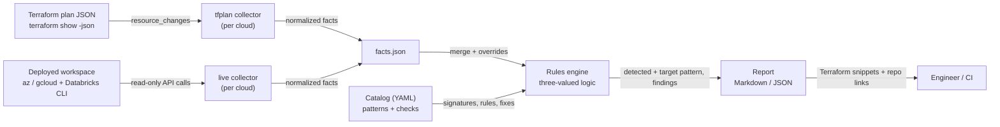
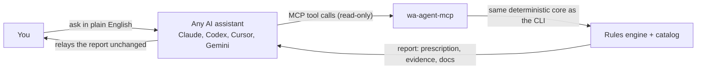

Databricks Well-Architected Agent
==============

Assesses a Databricks deployment on **Azure** or **Google Cloud** against
**proven reference patterns** and reports what is missing and exactly how to
fix it, with Terraform from this repo. Works **pre-deployment** (Terraform
plan) and **post-deployment** (live, read-only scan), and builds new
workspaces from the repo's tested Terraform.

Status: **Azure and GCP complete.** AWS is next.

New here? Read the **[simple guide](GUIDE.md)** (what / why / when / how).

> **Disclaimer.** Community project, provided "as is", without warranty of any
> kind. Not an official Databricks or Microsoft product. You are responsible
> for reviewing and testing anything you apply; the authors and contributors
> accept no liability for any outcome of using this tool or its output.

## Start here (3 steps, any OS)

**1. Install `uv`** (it brings everything else the agent needs), then get the agent:

| OS | Install uv |
|---|---|
| macOS / Linux | `curl -LsSf https://astral.sh/uv/install.sh \| sh` (or `brew install uv`) |
| Windows (PowerShell) | `powershell -ExecutionPolicy ByPass -c "irm https://astral.sh/uv/install.ps1 \| iex"` (or `winget install --id=astral-sh.uv -e`) |

```bash
git clone https://github.com/bhavink/databricks.git
cd databricks/well-architected-agent
```

**2. See it work, no setup or cloud access needed:** a full report from a real, sanitized workspace.

```bash
uv run wa-agent demo
```

**3. Point it at your workspace:** check what it can see, then assess.

```bash
uv run wa-agent doctor                              # tools and logins (output is redacted, safe to share)
uv run wa-agent doctor --workspace <name-or-url>    # preflight: what is reachable, how to fix the rest
uv run wa-agent collect live --cloud azure --workspace <name-or-url> -o ws.facts.json
uv run wa-agent assess --facts ws.facts.json --baseline classic-standard -o report.md
# Google Cloud: the same, with --cloud gcp
uv run wa-agent collect live --cloud gcp --workspace <name-or-url> -o gcp.facts.json
uv run wa-agent assess --cloud gcp --facts gcp.facts.json --baseline gcp-classic-standard -o gcp-report.md
```

**What you need**

| For | You need | Check / fix |
|---|---|---|
| Everything | `uv` | `uv --version` |
| Live Azure scan | Azure CLI, logged in, with the `databricks` extension; Reader on the workspace resource group (and the VNet / DNS zones if they live elsewhere) | `az login` · `az extension add --name databricks` |
| Workspace checks (IP access lists, Unity Catalog, workspace settings) | Databricks CLI profile for the workspace (workspace admin), from a network the workspace allows | `databricks auth login --host https://<workspace-url>` |
| Serverless checks (NCC, network policy) | Databricks account admin profile | `databricks auth login --host https://accounts.azuredatabricks.net --account-id <id>` |
| Live GCP scan | `gcloud` logged in (or impersonating a service account) with Viewer on the network (host) and workspace projects; for VPC Service Controls, Access Context Manager Reader on the organization | `gcloud auth login` |
| GCP account facts (network, PSC, keys, NCC, network policy, audit log delivery) | Databricks account admin profile for Google Cloud; GCP scans start here | `databricks auth login --host https://accounts.gcp.databricks.com --account-id <id>` |
| Plan / state review, new workspaces | Terraform 1.5+ | `terraform version` |

The workspace can be given as a name, URL, numeric id or (Azure) resource id;
matching Databricks CLI profiles are picked automatically. Anything the agent
can't see is reported as *not evaluable* with the exact fix.

## Two ways to use it

Both run the same deterministic core on your machine and give the same answers.

| | In your AI assistant (MCP) | From the terminal (CLI) |
|---|---|---|
| **You** | Ask in plain English | Run `uv run wa-agent <command>` |
| **Good for** | Exploring, explaining findings, chaining steps ("preflight, then assess, then draw it") | Scripts, CI gates, exact repeatable runs |
| **Set up** | Register once: [Use it from your AI assistant](#use-it-from-your-ai-assistant) | Nothing beyond *Start here* |
| **Writes files** | Never; it returns results to the assistant | Only to the `-o` / `--out` paths you give |

## What it can do

| Task | MCP tool | CLI command |
|---|---|---|
| See a sample report, no setup or cloud access | — | `wa-agent demo` |
| Check tools and logins; get the MCP registration line | — | `wa-agent doctor` |
| List the use-case baselines | `list_baselines` | `wa-agent baselines` |
| See what a baseline requires, in plain language | `describe_baseline` | `wa-agent show <baseline>` |
| List the reference architecture patterns | `list_patterns` | `wa-agent patterns` |
| Before a scan: what is reachable and how to fix the rest | `preflight` | `wa-agent doctor --workspace <ws>` |
| Read a deployed workspace (read-only) | `collect_live` | `wa-agent collect live --workspace <ws>` |
| Read a Terraform plan or state | `collect_tfplan` | `wa-agent collect tfplan --plan <json>` |
| Score against a baseline: prescription, evidence, docs | `assess` | `wa-agent assess --facts <json> --baseline <id>` |
| Check a deployment does what its baseline requires | `verify` | `wa-agent verify --tf-json <json> --baseline <id>` |
| Draw the architecture and list every resource | `diagram` | `wa-agent diagram --tf-json <json>` |
| Get a ready-to-run folder for a new workspace | `new_workspace` (returns the files) | `wa-agent new --baseline <id> --out <dir>` (writes the folder) |

Every command has `--help`.

## Self-contained · runs locally · secure

- **Runs on your machine.** No hosted service, no server to deploy, no account to create. Works the same on macOS, Windows and Linux.
- **No telemetry.** The only network calls are read-only API calls to *your* tenant, made through *your* `az` and `databricks` CLIs (plus a one-time dependency download by `uv`).
- **No credentials handled.** It never asks for, stores or prints keys or tokens; it reuses your existing CLI logins.
- **Read-only by construction.** Only allow-listed read commands can run, it never runs Terraform, and it never overwrites a file. Tests enforce all three.
- **Your data stays local.** Facts and reports are written only where you choose; generated files are git-ignored by default. Through an AI assistant (MCP), tool results go to that assistant's model provider under its terms, so choose your assistant accordingly.
- **Safe to share.** `doctor` output is redacted (IDs, names, emails, tokens) so you can paste it into an issue.
- **Auditable.** Open source; the complete list of commands it may run is one table: `READ_ONLY_COMMANDS` in `wa_agent/clouds/azure/live.py`.

**Problem or question?** [Open an issue](https://github.com/bhavink/databricks/issues/new?template=wa-agent-problem.yml) and paste the output of `wa-agent doctor`.

## Operating rules (enforced in code)

1. **Never changes anything.** No create/update/delete against the workspace,
   cloud tenant, Terraform or any artifact. Only allow-listed read commands can
   run (`READ_ONLY_COMMANDS` in `wa_agent/clouds/<cloud>/live.py`), the agent
   never runs Terraform, and it refuses to overwrite files.
2. **Grounded in baseline truth, backed by evidence.** Every check must cite an
   official doc (enforced by the catalog loader) and, where it exists, the
   tested implementation in this repo. Every fact records the command or
   Terraform resource it came from. Findings are ranked into a prescription.
3. **You decide.** The agent prescribes; applying anything is yours to choose.

---

## Design principles

1. **Deterministic.** Findings come from rules, not from a model. Same facts +
   same catalog version → byte-identical report (stable sort, no timestamps,
   facts digest in the header). Safe for CI gating.
2. **Grounded.** Every check cites its sources — this repo's patterns
   (`adb4u/`, `gcpdb4u/`, `awsdb4u/`) and the Databricks data exfiltration
   protection blogs ([Azure](https://www.databricks.com/blog/data-exfiltration-protection-with-azure-databricks),
   [GCP](https://www.databricks.com/blog/databricks-gcp-practitioners-guide-data-exfiltration-protection),
   [AWS](https://www.databricks.com/blog/2021/02/02/data-exfiltration-protection-with-databricks-on-aws.html)).
   Every fix points at a module in this repo.
3. **Never guesses.** A fact that can't be collected yields `UNKNOWN` with the
   missing fact and how to collect it — never a false PASS or FAIL.
4. **Pattern-first.** A deployment is scored against an architecture (Azure
   Non-PL, Full Private, DEP hub-spoke, Serverless; GCP customer-managed VPC,
   Private Service Connect, VPC Service Controls), not a flat list of best practices.
   You get "what's missing for *this* pattern" plus an upgrade path to the next tier.
5. **Advisory first.** Read-only. Fixes are emitted as Terraform/CLI for a human
   to apply.

## Architecture



| Component | Path | Role |
|---|---|---|
| Controls | `catalog/controls.yaml` | Cloud-neutral controls, by production planning guide phase and pillar |
| Pattern catalog | `catalog/<cloud>/patterns.yaml` | Reference architectures, detection signatures, required/recommended checks, bare minimum |
| Check catalog | `catalog/<cloud>/checks.yaml` | Rules over facts, pillar, severity, rationale, sources, remediation |
| Baselines | `catalog/<cloud>/baselines.yaml` | Use cases, and the builds (tested Terraform) that create them |
| Collectors | `wa_agent/clouds/<cloud>/` | Turn a plan or a live workspace into normalized facts |
| Engine | `wa_agent/engine.py` | Pattern detection, check evaluation, conformance score |
| Report | `wa_agent/report.py` | Gaps → beyond target → not evaluable → passed → upgrade path |

Pillars follow the Databricks Well-Architected Lakehouse framework: data &
AI governance, interoperability & usability, operational excellence,
security, reliability, performance efficiency, cost optimization.

## Classic vs serverless

| | Classic (BYO network) | Serverless workspace |
|---|---|---|
| Compute network | Your VNet: subnets, NSG, UDR, NAT/firewall, private endpoints | Databricks-managed |
| Egress control | Firewall / NAT + service endpoint policies | Serverless network policies |
| Private storage access | Private endpoints / service endpoints from your VNet | NCC private endpoint rules |
| Checks | `AZ-NET-*`, `AZ-PL-*`, `AZ-STO-*`, `AZ-ENC-002/003` + serverless checks | `AZ-SRV-*`, `AZ-ING-*`, `AZ-UC-*`, `AZ-OPS-*` |

Classic workspaces also run serverless SQL, notebooks and jobs, so the
`AZ-SRV-*` checks apply to them too. Classic-only checks are gated by
`workspace.compute_mode` and report `NOT_APPLICABLE` for serverless.

On Google Cloud the baselines are classic workspaces on a customer-managed
VPC; their serverless compute is governed the same way (`GCP-SRV-*`: NCC and
an enforced network policy).

## Azure patterns

| Pattern | Tier | Grounded in |
|---|---|---|
| `az-classic-managed-vnet` | 0 (anti-pattern) | — migrate |
| `az-classic-non-pl` | 1 | [`adb4u/deployments/non-pl`](../adb4u/deployments/non-pl), [01-NON-PL.md](../adb4u/docs/patterns/01-NON-PL.md) |
| `az-classic-backend-pl` | 2 | [Azure Private Link](https://learn.microsoft.com/en-us/azure/databricks/security/network/classic/private-link): back-end private endpoint, public front-end with IP access lists |
| `az-classic-full-private` | 3 | [`adb4u/deployments/full-private`](../adb4u/deployments/full-private), [02-FULL-PRIVATE.md](../adb4u/docs/patterns/02-FULL-PRIVATE.md) |
| `az-classic-dep-hub-spoke` | 3 | [Azure DEP blog](https://www.databricks.com/blog/data-exfiltration-protection-with-azure-databricks), [Databricks SRA](https://github.com/databricks/terraform-databricks-sra/tree/main/azure/tf) (reference) |
| `az-serverless` | 2 | [`adb4u/deployments/serverless`](../adb4u/deployments/serverless) (no VNet), [setup guide](../adb4u/docs/guides/01-SERVERLESS-SETUP.md) |

## GCP patterns

| Pattern | Tier | Grounded in |
|---|---|---|
| `gcp-classic-managed-vpc` | 0 (anti-pattern) | — migrate to a customer-managed VPC |
| `gcp-classic-byovpc` | 1 | [`byovpc-ws`](../gcpdb4u/templates/terraform-scripts/byovpc-ws), [`infra4db`](../gcpdb4u/templates/terraform-scripts/infra4db), [customer-managed VPC](https://docs.databricks.com/gcp/en/security/network/classic/customer-managed-vpc) |
| `gcp-classic-psc` | 2 | [`byovpc-psc-ws`](../gcpdb4u/templates/terraform-scripts/byovpc-psc-ws), [Private Service Connect](https://docs.databricks.com/gcp/en/security/network/classic/private-service-connect) |
| `gcp-classic-psc-private` | 3 | [`byovpc-psc-cmek-ws`](../gcpdb4u/templates/terraform-scripts/byovpc-psc-cmek-ws): PSC, public access disabled |
| `gcp-classic-dep` | 3 | [GCP data exfiltration protection guide](https://www.databricks.com/blog/databricks-gcp-practitioners-guide-data-exfiltration-protection), [`security/`](../gcpdb4u/security), [`vpcsc-policy`](../gcpdb4u/templates/vpcsc-policy) |

## Baselines — pick what the workspace is supposed to be

**Bare minimum in every baseline:** whatever else you choose, an IP access list
on any public front-end (inbound users and apps) and an enforced serverless
egress policy are required. They are declared once per cloud
(`minimum_required` in `patterns.yaml`), and every `new` build turns them on.

Like the deployments in `adb4u` and `gcpdb4u`, the agent has one baseline
per use case. A baseline chooses a reference pattern, can make extra
controls mandatory, and lists the tested Terraform that builds it.

**Azure** (`--cloud azure`, the default)

| Baseline | Use case | Pattern | Builds it |
|---|---|---|---|
| `serverless` | Serverless only, no customer network | `az-serverless` | [`serverless`](../adb4u/deployments/serverless) |
| `serverless-high-security` | + NCC private endpoints to storage, CMK, data-leak features off | `az-serverless` | [`serverless`](../adb4u/deployments/serverless) |
| `classic-standard` | VNet-injected, NAT egress, public IP-restricted front-end | `az-classic-non-pl` | [`non-pl`](../adb4u/deployments/non-pl) |
| `classic-private-link` | Back-end Private Link, public front-end | `az-classic-backend-pl` | [`full-private`](../adb4u/deployments/full-private) with public access on |
| `classic-full-private` | No public access, private storage, no internet egress | `az-classic-full-private` | [`full-private`](../adb4u/deployments/full-private) |
| `classic-high-security` | Full private + CMK everywhere, storage firewall, enforced serverless egress, SEP | `az-classic-full-private` | [`full-private`](../adb4u/deployments/full-private) |
| `classic-exfiltration-protection` | Hub-spoke, firewall-inspected egress, CMK | `az-classic-dep-hub-spoke` | Assess only for now; references: [DEP blog](https://www.databricks.com/blog/data-exfiltration-protection-with-azure-databricks), [Databricks SRA](https://github.com/databricks/terraform-databricks-sra/tree/main/azure/tf) |

**Google Cloud** (`--cloud gcp`). Each baseline offers three builds, as peers;
pick one with `--build`:

| Baseline | Use case | Pattern |
|---|---|---|
| `gcp-classic-standard` | Customer-managed VPC, Private Google Access, Cloud NAT, public front-end with IP access lists | `gcp-classic-byovpc` |
| `gcp-classic-cmek` | Standard + customer-managed keys (managed services, storage, disks) | `gcp-classic-byovpc` |
| `gcp-classic-psc` | Front-end and back-end Private Service Connect, public front-end with IP access lists | `gcp-classic-psc` |
| `gcp-classic-high-security` | PSC with public access disabled, CMK, private DNS, data-leak features off | `gcp-classic-psc-private` |
| `gcp-classic-exfiltration-protection` | High security + VPC Service Controls, `restricted.googleapis.com`, deny-by-default egress | `gcp-classic-dep` (assess only) |

| Build | Terraform | For |
|---|---|---|
| `lpw` | [`lpw`](../gcpdb4u/templates/terraform-scripts/lpw): one root, two applies (provisioning, then running) | One root that creates the VPC, least-privilege service accounts and CMK (LPW is generally available) |
| `new-vpc` | [`infra4db`](../gcpdb4u/templates/terraform-scripts/infra4db) → `byovpc-*` → [`workspace-guardrails`](../gcpdb4u/templates/terraform-scripts/workspace-guardrails) | Teams that keep the network in its own Terraform root |
| `existing-vpc` | `byovpc-*` → [`workspace-guardrails`](../gcpdb4u/templates/terraform-scripts/workspace-guardrails) | Teams with an existing (or shared) VPC |

`workspace-guardrails` adds the bare minimum (IP access lists, NCC, enforced
serverless network policy) that the `byovpc-*` roots don't include; `lpw`
has them built in.

```bash
uv run wa-agent baselines                          # --cloud gcp for Google Cloud
uv run wa-agent show classic-high-security        # its controls in plain language, by area
uv run wa-agent show gcp-classic-high-security --cloud gcp
uv run wa-agent assess --facts out/ws.facts.json --baseline classic-high-security
```

**Architecture diagram and manifest** of what any Terraform plan or state deploys
(this repo's deployments or your own): a Mermaid diagram drawn from the
same facts the assessment uses, plus every resource by area.

```bash
uv run wa-agent diagram --tf-json plan.json -o architecture.md
```

With no `--baseline`, the workspace is scored against the pattern it is
detected as. A baseline whose compute mode differs from the workspace
(e.g. `serverless` on a classic workspace) is flagged, because moving
between them means a new workspace. BYOR (`adb4u/deployments/byor`) is a
delivery model, not a posture, so it can sit under any classic baseline.
Add a baseline in `catalog/<cloud>/baselines.yaml`.

## Use it from your AI assistant

The agent has no LLM inside, so it works the same under any provider: your
assistant calls its tools over MCP and relays the deterministic report. Every
tool is marked `readOnlyHint: true`, `destructiveHint: false`, and none of
them write files.

**1. Register it** (once). `uv run wa-agent doctor` prints these lines with
your path filled in.

| Assistant | Register the MCP server |
|---|---|
| Claude Code | `claude mcp add --scope user databricks-wa -- uv run --quiet --frozen --project /abs/path/well-architected-agent wa-agent-mcp` (or open the repo: `.mcp.json` is included) |
| Codex CLI | `codex mcp add databricks-wa -- uv run --quiet --frozen --project /abs/path/well-architected-agent wa-agent-mcp` |
| Cursor | Open the repo (`.cursor/mcp.json` is included), or in `~/.cursor/mcp.json`: `{"mcpServers": {"databricks-wa": {"command": "uv", "args": ["run", "--quiet", "--frozen", "--project", "/abs/path/well-architected-agent", "wa-agent-mcp"]}}}` |
| Gemini CLI | `~/.gemini/settings.json`: the same `mcpServers` block as Cursor |
| VS Code (Copilot) | `.vscode/mcp.json`: `{"servers": {"databricks-wa": {"type": "stdio", "command": "uv", "args": ["run", "--quiet", "--frozen", "--project", "/abs/path/well-architected-agent", "wa-agent-mcp"]}}}` |

`/abs/path/well-architected-agent` is the full path to this folder in your clone
(on Windows, e.g. `C:/Users/you/databricks/well-architected-agent`). Keep
`--frozen`: it uses the committed lockfile as-is, so a machine configured for a
private package mirror doesn't rewrite `uv.lock` at every launch.

**2. Check it's connected**, and that it lists 10 tools.

| Assistant | Check |
|---|---|
| Claude Code | `claude mcp list` (shows Connected), then `/mcp` in a session |
| Codex CLI | `codex mcp list` |
| Cursor | Settings → MCP: `databricks-wa` is green |
| Gemini CLI | `/mcp` in a session |
| VS Code (Copilot) | Command palette → **MCP: List Servers** |

Start a new session after registering; tools load at session start.

**3. The tools**

| Tool | What it does |
|---|---|
| `list_baselines` | The use-case baselines (serverless, classic standard, private link, full private, high security, …) and the Terraform that builds each |
| `describe_baseline` | What one baseline requires, in plain language: every control by area (Network, Storage, Unity Catalog, …), required or recommended |
| `list_patterns` | The reference architecture patterns and their controls |
| `preflight` | Before a live scan: resolves the workspace, matches your CLI logins, tries each data source read-only, and says how to fix what's missing |
| `collect_live` | Reads a deployed workspace with allow-listed read commands only |
| `collect_tfplan` | Reads a `terraform show -json` plan or state file |
| `assess` | Scores collected facts against a baseline: PASS/FAIL/UNKNOWN with evidence, official docs, and the fix from this repo |
| `verify` | After `terraform apply`: does the state do what the baseline requires? |
| `diagram` | Architecture diagram (Mermaid) and resource manifest of a plan or state |
| `new_workspace` | The files for a new workspace from a baseline's tested Terraform (inputs, staged settings, step-by-step README) |

Assistants that read [`AGENTS.md`](AGENTS.md) (Codex, Cursor, and others;
`CLAUDE.md` points there) also get the three operating rules as instructions.

**4. Ask.** For example:

- *"Which Well-Architected baselines are there, and which fits a regulated workload?"*
- *"What does `classic-high-security` require?"*
- *"Preflight workspace `<name>`, then assess it against `classic-private-link` and list the required gaps."*
- *"Assess `./tf.plan.json` against `serverless` before I apply, and draw what it deploys."*
- *"Verify `./state.json` against `classic-full-private`."*
- *"Set up a new `serverless` workspace in `eastus2` with prefix `demo`."* (the assistant shows the files; `wa-agent new` writes the folder)
- *"Which GCP builds can create `gcp-classic-psc`, and what does each need from me?"*
- *"Assess GCP workspace `<name>` against `gcp-classic-exfiltration-protection`."*



## Use it from the terminal

The full command list is in [What it can do](#what-it-can-do); worked examples below.

**New workspace (baseline → tested deployment → verify):**

```bash
uv run wa-agent new --baseline classic-high-security --out ./my-ws \
  --set location=eastus2 --set workspace_prefix=prodsec
uv run wa-agent new --cloud gcp --baseline gcp-classic-psc --build new-vpc --out ./my-gcp-ws \
  --set google_region=us-central1 --set network_name=dbx-vpc
# ./my-ws: the tested Terraform (terraform/), inputs, staged tfvars and a
# README: plan → assess → apply (you run it) → verify
```

`new` only uses tested Terraform from this repo (`build` in `baselines.yaml`),
never generated code. This repo is the definitive source; other repositories
such as the Databricks SRA are cited as references only.

| Baselines | Terraform |
|---|---|
| `classic-*` | This repo's [`non-pl`](../adb4u/deployments/non-pl) / [`full-private`](../adb4u/deployments/full-private), copied into the folder |
| `serverless`, `serverless-high-security` | [`adb4u/deployments/serverless`](../adb4u/deployments/serverless): the same ARM call as the official [SRA `serverless_workspace` module](https://github.com/databricks/terraform-databricks-sra/tree/main/azure/tf/modules/serverless_workspace), without its VNet; copied into the folder |
| `classic-exfiltration-protection` | None by design: hub-spoke is assessed against the [Azure data exfiltration protection blog](https://www.databricks.com/blog/data-exfiltration-protection-with-azure-databricks), not deployed |
| `gcp-classic-*` | `gcpdb4u` as-is: `lpw`, or `infra4db` → `byovpc-*`, or `byovpc-*` alone, each followed by `workspace-guardrails` where needed |
| `gcp-classic-exfiltration-protection` | None by design: assessed against the [GCP data exfiltration protection guide](https://www.databricks.com/blog/databricks-gcp-practitioners-guide-data-exfiltration-protection) and the `vpcsc-policy` samples |

Required variables become `inputs.tfvars` (one inputs file per root in a
multi-root build): answer them with `--set name=value` (JSON for lists and
booleans); an answer goes to every root that declares the variable, and
anything unanswered is a `REPLACE_ME_*`. Roots are wired together without
copy-paste: names follow from your answers (e.g. `subnet-<region>` from
`infra4db`), and values like `workspace_url` are read from the previous
root's `terraform output` at plan time. The bundle holds what the repo
tracks, including each root's own example config; local tfvars, state and
keys are never copied.
Account and subscription IDs stay in `TF_VAR_*` and are never written. In CI,
every emitted value is resolved through `terraform console` against the real
Terraform (`tools/check_new_tfvars.py`), and the generated folder is
initialized and validated.

**Pre-deployment (Terraform plan):**

```bash
cd ../adb4u/deployments/non-pl
terraform plan -out tf.plan && terraform show -json tf.plan > /tmp/non-pl.plan.json
cd -

uv run wa-agent collect tfplan --cloud azure --plan /tmp/non-pl.plan.json -o out/non-pl.facts.json
uv run wa-agent assess --facts out/non-pl.facts.json                       # score vs detected pattern
uv run wa-agent assess --facts out/non-pl.facts.json --baseline classic-exfiltration-protection
uv run wa-agent assess --facts out/non-pl.facts.json --format json --fail-on-gaps   # CI gate
```

Network or account-level resources in another Terraform root? Collect each
plan and pass `--facts` several times; facts are merged order-independently.

**Post-deployment (live, read-only):**

```bash
az login
uv run wa-agent collect live --cloud azure \
  --workspace /subscriptions/<sub>/resourceGroups/<rg>/providers/Microsoft.Databricks/workspaces/<ws> \
  --profile <databricks-workspace-profile> \
  --account-profile <databricks-account-profile> \
  -o out/ws.facts.json
uv run wa-agent assess --facts out/ws.facts.json

# Google Cloud: starts from the Databricks account, then reads the VPC with gcloud
gcloud auth login
uv run wa-agent collect live --cloud gcp --workspace <name-url-or-id> \
  --account-profile <databricks-gcp-account-profile> --profile <workspace-profile> -o out/gcp.facts.json
uv run wa-agent assess --cloud gcp --facts out/gcp.facts.json --baseline gcp-classic-high-security
```

Classic and serverless are detected automatically: live scans read
`computeMode` from ARM, and plans or states read it from the workspace resource
(`azurerm_databricks_workspace`, or `azapi_resource` with `computeMode = "Serverless"`).
When a plan holds several workspaces, pick one with `--workspace <address-or-name>`.

Permissions: Reader on the workspace resource group, plus the VNet and the
private DNS zones if they live elsewhere; a workspace admin profile for IP
access lists and the metastore; an account admin profile for NCC. Missing
access shows up as `UNKNOWN`, not as failures.

`out/`, `*.facts.json` and `*.plan.json` are gitignored, because they describe real infrastructure.

## Adding a check

1. Add an entry to `catalog/<cloud>/checks.yaml` with `rule`, optional `when`,
   `sources` and `remediation` (point `module` at this repo).
2. Reference it from a pattern's `required` or `recommended` list.
3. Make sure a collector emits the facts it reads, and add a test.

`catalog.load()` validates pillars, severities, operators and cross-references
and fails on any inconsistency.

## Ground-truth maturity

Each fix states how proven its repo implementation is:

| Label | Meaning |
|---|---|
| `tested` | Deployed and verified by the repo owner (default) |
| `validated` | `terraform validate` + mock-provider `terraform test` only; not yet applied. Use for new Terraform until it has been deployed |

Everything in this repo today is `tested`, except
[`workspace-guardrails`](../gcpdb4u/templates/terraform-scripts/workspace-guardrails) (new, `validated`).

## Known limits

- **Plan correlation is by type and count.** Resource IDs are unknown before
  apply, so DBFS private endpoints are recognized by address name (`dbfs`). Use
  the live collector for exact correlation.
- **Firewall rules are checked for presence, not content.** For hub-spoke the
  agent follows the 0.0.0.0/0 route to the Azure Firewall and checks it has
  application rules and logs; it doesn't compare each FQDN with the published
  Azure Databricks list. With an NVA instead of Azure Firewall, those checks
  report not evaluable.
- **Live scans have been run against real workspaces:** two back-end Private
  Link workspaces (their sanitized responses are replay fixtures in
  `tests/fixtures/azure/`) and a serverless workspace deployed from
  `adb4u/deployments/serverless` (plan, state and live scan agree). Hub-spoke
  checks are covered by tests, not yet by a live hub-spoke scan.
- **Hub-spoke is assess-only by design.** The Azure data exfiltration
  protection blog is the definitive guide for `classic-exfiltration-protection`;
  there is no hub-spoke deployment, so `new` doesn't generate it.
- **GCP has not been scanned live yet.** The GCP collectors are covered by
  tests shaped like the `gcpdb4u` roots and a simulated account and `gcloud`,
  not yet by a real GCP workspace.
- **GCP data exfiltration protection is assess-only.** VPC Service Controls,
  `restricted.googleapis.com` and the egress lockdown are checked, not
  deployed. A Terraform plan rarely contains the perimeter, so that check is
  usually *not evaluable* from a plan; a live scan needs Access Context Manager
  Reader on the organization.
- **`infra4db` points `*.googleapis.com` at `private.googleapis.com`.** That
  passes Private Google Access but fails the exfiltration-protection check,
  which needs `restricted.googleapis.com`.
- **GCP PSC DNS records come after the workspace.** With `new-vpc` and PSC,
  `infra4db` creates the workspace's private DNS records on a re-apply once
  the workspace exists (its README); until then the DNS check fails.
- **No serverless-only GCP baseline yet.** GCP baselines are classic
  workspaces; their serverless compute is still checked.

## Roadmap

This repo stays the definitive source: every cloud's Terraform lands in its
`*db4u` folder; other repositories (such as the Databricks SRA) are cited as
references.

| | Scope |
|---|---|
| Azure (done) | 7 baselines, plan/state/live collectors with evidence, read-only guard, `assess`, `verify`, `diagram`, plain-language `show`, `new` folders from tested `adb4u` deployments (classic and serverless without a VNet), hub-spoke assessed against the Azure data exfiltration protection blog, MCP server, CI on Windows/macOS/Linux |
| GCP (done) | 5 baselines from `gcpdb4u` as-is, each with `lpw`, `new-vpc` and `existing-vpc` builds; customer-managed VPC, Private Service Connect, CMEK, Private Google Access, deny-by-default egress, serverless NCC and network policy; VPC Service Controls and `restricted.googleapis.com` assessed against the GCP data exfiltration protection guide; plan/state and live collectors; `workspace-guardrails` for the bare minimum |
| Next · AWS | `awsdb4u` patterns (back-end PrivateLink, customer-managed VPC), VPC endpoints, Network Firewall, KMS, serverless; SRA as reference |
