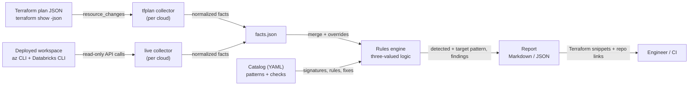
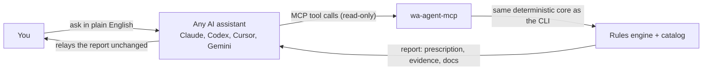

Databricks Well-Architected Agent
==============

Assesses a Databricks deployment against **proven reference patterns** and
reports what is missing and exactly how to fix it, with Terraform from this
repo. Works **pre-deployment** (Terraform plan) and **post-deployment**
(live, read-only scan).

Status: **Phase 0 — Azure, deterministic core.** GCP and AWS follow.

New here? Read the **[simple guide](GUIDE.md)** (what / why / when / how).

> **Disclaimer.** Community project, provided "as is", without warranty of any
> kind. Not an official Databricks or Microsoft product. You are responsible
> for reviewing and testing anything you apply; the authors and contributors
> accept no liability for any outcome of using this tool or its output.

## Start here (3 steps, any OS)

**1. Install `uv`** (it brings everything else the agent needs), then get the agent:

| OS | Install uv |
|---|---|
| macOS / Linux | `curl -LsSf https://astral.sh/uv/install.sh \| sh` (or `brew install uv`) |
| Windows (PowerShell) | `powershell -ExecutionPolicy ByPass -c "irm https://astral.sh/uv/install.ps1 \| iex"` (or `winget install --id=astral-sh.uv -e`) |

```bash
git clone https://github.com/bhavink/databricks.git
cd databricks/well-architected-agent
```

**2. See it work, no setup or cloud access needed:** a full report from a real, sanitized workspace.

```bash
uv run wa-agent demo
```

**3. Point it at your workspace:** check what it can see, then assess.

```bash
uv run wa-agent doctor                              # tools and logins (output is redacted, safe to share)
uv run wa-agent doctor --workspace <name-or-url>    # preflight: what is reachable, how to fix the rest
uv run wa-agent collect live --cloud azure --workspace <name-or-url> -o ws.facts.json
uv run wa-agent assess --facts ws.facts.json --baseline classic-standard -o report.md
```

**What you need**

| For | You need | Check / fix |
|---|---|---|
| Everything | `uv` | `uv --version` |
| Live Azure scan | Azure CLI, logged in, with the `databricks` extension; Reader on the workspace resource group (and the VNet / DNS zones if they live elsewhere) | `az login` · `az extension add --name databricks` |
| Workspace checks (IP access lists, Unity Catalog, workspace settings) | Databricks CLI profile for the workspace (workspace admin), from a network the workspace allows | `databricks auth login --host https://<workspace-url>` |
| Serverless checks (NCC, network policy) | Databricks account admin profile | `databricks auth login --host https://accounts.azuredatabricks.net --account-id <id>` |
| Plan / state review, new workspaces | Terraform 1.5+ | `terraform version` |

The workspace can be given as a name, URL, numeric id or Azure resource id;
matching Databricks CLI profiles are picked automatically. Anything the agent
can't see is reported as *not evaluable* with the exact fix.

## Self-contained · runs locally · secure

- **Runs on your machine.** No hosted service, no server to deploy, no account to create. Works the same on macOS, Windows and Linux.
- **No telemetry.** The only network calls are read-only API calls to *your* tenant, made through *your* `az` and `databricks` CLIs (plus a one-time dependency download by `uv`).
- **No credentials handled.** It never asks for, stores or prints keys or tokens; it reuses your existing CLI logins.
- **Read-only by construction.** Only allow-listed read commands can run, it never runs Terraform, and it never overwrites a file. Tests enforce all three.
- **Your data stays local.** Facts and reports are written only where you choose; generated files are git-ignored by default. Through an AI assistant (MCP), tool results go to that assistant's model provider under its terms, so choose your assistant accordingly.
- **Safe to share.** `doctor` output is redacted (IDs, names, emails, tokens) so you can paste it into an issue.
- **Auditable.** Open source; the complete list of commands it may run is one table: `READ_ONLY_COMMANDS` in `wa_agent/clouds/azure/live.py`.

**Problem or question?** [Open an issue](https://github.com/bhavink/databricks/issues/new?template=wa-agent-problem.yml) and paste the output of `wa-agent doctor`.

## Operating rules (enforced in code)

1. **Never changes anything.** No create/update/delete against the workspace,
   cloud tenant, Terraform or any artifact. Only allow-listed read commands can
   run (`READ_ONLY_COMMANDS` in `wa_agent/clouds/azure/live.py`), the agent
   never runs Terraform, and it refuses to overwrite files.
2. **Grounded in baseline truth, backed by evidence.** Every check must cite an
   official doc (enforced by the catalog loader) and, where it exists, the
   tested implementation in this repo. Every fact records the command or
   Terraform resource it came from. Findings are ranked into a prescription.
3. **You decide.** The agent prescribes; applying anything is yours to choose.

---

## Design principles

1. **Deterministic.** Findings come from rules, not from a model. Same facts +
   same catalog version → byte-identical report (stable sort, no timestamps,
   facts digest in the header). Safe for CI gating.
2. **Grounded.** Every check cites its sources — this repo's patterns
   (`adb4u/`, `gcpdb4u/`, `awsdb4u/`) and the Databricks data exfiltration
   protection blogs ([Azure](https://www.databricks.com/blog/data-exfiltration-protection-with-azure-databricks),
   [GCP](https://www.databricks.com/blog/databricks-gcp-practitioners-guide-data-exfiltration-protection),
   [AWS](https://www.databricks.com/blog/2021/02/02/data-exfiltration-protection-with-databricks-on-aws.html)).
   Every fix points at a module in this repo.
3. **Never guesses.** A fact that can't be collected yields `UNKNOWN` with the
   missing fact and how to collect it — never a false PASS or FAIL.
4. **Pattern-first.** A deployment is scored against an architecture (Non-PL,
   Full Private, DEP hub-spoke, Serverless), not a flat list of best practices.
   You get "what's missing for *this* pattern" plus an upgrade path to the next tier.
5. **Advisory first.** Read-only. Fixes are emitted as Terraform/CLI for a human
   to apply.

## Architecture



| Component | Path | Role |
|---|---|---|
| Pattern catalog | `catalog/azure/patterns.yaml` | Reference architectures, detection signatures, required/recommended checks |
| Check catalog | `catalog/azure/checks.yaml` | Rules over facts, pillar, severity, rationale, sources, remediation |
| Collectors | `wa_agent/clouds/<cloud>/` | Turn a plan or a live workspace into normalized facts |
| Engine | `wa_agent/engine.py` | Pattern detection, check evaluation, conformance score |
| Report | `wa_agent/report.py` | Gaps → beyond target → not evaluable → passed → upgrade path |

Pillars follow the Databricks Well-Architected Lakehouse framework: data &
AI governance, interoperability & usability, operational excellence,
security, reliability, performance efficiency, cost optimization.

## Classic vs serverless

| | Classic (BYO network) | Serverless workspace |
|---|---|---|
| Compute network | Your VNet: subnets, NSG, UDR, NAT/firewall, private endpoints | Databricks-managed |
| Egress control | Firewall / NAT + service endpoint policies | Serverless network policies |
| Private storage access | Private endpoints / service endpoints from your VNet | NCC private endpoint rules |
| Checks | `AZ-NET-*`, `AZ-PL-*`, `AZ-STO-*`, `AZ-ENC-002/003` + serverless checks | `AZ-SRV-*`, `AZ-ING-*`, `AZ-UC-*`, `AZ-OPS-*` |

Classic workspaces also run serverless SQL, notebooks and jobs, so the
`AZ-SRV-*` checks apply to them too. Classic-only checks are gated by
`workspace.compute_mode` and report `NOT_APPLICABLE` for serverless.

## Azure patterns

| Pattern | Tier | Grounded in |
|---|---|---|
| `az-classic-managed-vnet` | 0 (anti-pattern) | — migrate |
| `az-classic-non-pl` | 1 | [`adb4u/deployments/non-pl`](../adb4u/deployments/non-pl), [01-NON-PL.md](../adb4u/docs/patterns/01-NON-PL.md) |
| `az-classic-backend-pl` | 2 | [Azure Private Link](https://learn.microsoft.com/en-us/azure/databricks/security/network/classic/private-link): back-end private endpoint, public front-end with IP access lists |
| `az-classic-full-private` | 3 | [`adb4u/deployments/full-private`](../adb4u/deployments/full-private), [02-FULL-PRIVATE.md](../adb4u/docs/patterns/02-FULL-PRIVATE.md) |
| `az-classic-dep-hub-spoke` | 3 | [Azure DEP blog](https://www.databricks.com/blog/data-exfiltration-protection-with-azure-databricks), [Databricks SRA](https://github.com/databricks/terraform-databricks-sra/tree/bc5af72e46e9ddcf21b7eb246b4e4bad0e3d3be4/azure/tf) |
| `az-serverless` | 2 | [`adb4u/deployments/serverless`](../adb4u/deployments/serverless) (official SRA module), [setup guide](../adb4u/docs/guides/01-SERVERLESS-SETUP.md) |

## Baselines — pick what the workspace is supposed to be

Like the deployments in `adb4u/deployments/`, the agent has one baseline
per use case. A baseline chooses a reference pattern, can make extra
controls mandatory, and links to the deployment that builds it.

| Baseline | Use case | Pattern | Builds it |
|---|---|---|---|
| `serverless` | Serverless only, no customer network | `az-serverless` | [`serverless`](../adb4u/deployments/serverless) |
| `serverless-high-security` | + NCC private endpoints to storage, CMK, data-leak features off | `az-serverless` | [`serverless`](../adb4u/deployments/serverless) |
| `classic-standard` | VNet-injected, NAT egress, public IP-restricted front-end | `az-classic-non-pl` | [`non-pl`](../adb4u/deployments/non-pl) |
| `classic-private-link` | Back-end Private Link, public front-end | `az-classic-backend-pl` | [`full-private`](../adb4u/deployments/full-private) with public access on |
| `classic-full-private` | No public access, private storage, no internet egress | `az-classic-full-private` | [`full-private`](../adb4u/deployments/full-private) |
| `classic-high-security` | Full private + CMK everywhere, storage firewall, enforced serverless egress, SEP | `az-classic-full-private` | [`full-private`](../adb4u/deployments/full-private) |
| `classic-exfiltration-protection` | Hub-spoke, firewall-inspected egress, CMK | `az-classic-dep-hub-spoke` | [Databricks SRA](https://github.com/databricks/terraform-databricks-sra/tree/bc5af72e46e9ddcf21b7eb246b4e4bad0e3d3be4/azure/tf) (official, pinned) |

```bash
uv run wa-agent baselines
uv run wa-agent assess --facts out/ws.facts.json --baseline classic-high-security
```

With no `--baseline`, the workspace is scored against the pattern it is
detected as. A baseline whose compute mode differs from the workspace
(e.g. `serverless` on a classic workspace) is flagged, because moving
between them means a new workspace. BYOR (`adb4u/deployments/byor`) is a
delivery model, not a posture, so it can sit under any classic baseline.
Add a baseline in `catalog/azure/baselines.yaml`.

## Use it from any AI assistant

The agent has no LLM inside, so it works the same under any provider. Your
assistant calls its tools over MCP (or runs the CLI) and relays the
deterministic report. Every MCP tool is marked `readOnlyHint: true`,
`destructiveHint: false`, and none of them write files.

```bash
uv run wa-agent doctor    # prints the exact registration command for each assistant
```

| Assistant | Register the MCP server |
|---|---|
| Claude Code | `claude mcp add databricks-wa -- uv run --quiet --project /abs/path/well-architected-agent wa-agent-mcp` |
| Codex CLI | `~/.codex/config.toml`: `[mcp_servers.databricks-wa]` then `command = "uv run --quiet --project /abs/path/well-architected-agent wa-agent-mcp"` |
| Cursor | `.cursor/mcp.json`: `{"mcpServers": {"databricks-wa": {"command": "uv run --quiet --project /abs/path/well-architected-agent wa-agent-mcp"}}}` |
| Gemini CLI | `~/.gemini/settings.json`: same `mcpServers` block as Cursor |
| VS Code (Copilot) | `.vscode/mcp.json`: `{"servers": {"databricks-wa": {"type": "stdio", "command": "uv run --quiet --project /abs/path/well-architected-agent wa-agent-mcp"}}}` |

Tools: `list_baselines`, `list_patterns`, `collect_tfplan`,
`collect_live`, `assess`, `verify`, `new_workspace`. Assistants that read
[`AGENTS.md`](AGENTS.md) (Codex, Cursor, and others; `CLAUDE.md` points
there) also get the three rules as instructions.

Then just ask: *"Assess workspace `<arm-id>` against `classic-high-security`."*



## Usage

```bash
cd well-architected-agent

uv run wa-agent patterns
```

**New workspace (baseline → tested deployment → verify):**

```bash
uv run wa-agent new --baseline classic-high-security --out ./my-ws \
  --set location=eastus2 --set workspace_prefix=prodsec
# ./my-ws: the tested Terraform (terraform/), inputs.tfvars, staged tfvars and a
# README: plan → assess → apply (you run it) → verify
```

`new` only uses tested Terraform (`build` in `baselines.yaml`), never
generated code:

| Baselines | Terraform |
|---|---|
| `classic-*` | This repo's [`non-pl`](../adb4u/deployments/non-pl) / [`full-private`](../adb4u/deployments/full-private), copied into the folder |
| `serverless`, `serverless-high-security` | [`adb4u/deployments/serverless`](../adb4u/deployments/serverless), built on the official [SRA `serverless_workspace` module](https://github.com/databricks/terraform-databricks-sra/tree/bc5af72e46e9ddcf21b7eb246b4e4bad0e3d3be4/azure/tf/modules/serverless_workspace), copied into the folder |
| `classic-exfiltration-protection` | The official [Databricks SRA](https://github.com/databricks/terraform-databricks-sra/tree/bc5af72e46e9ddcf21b7eb246b4e4bad0e3d3be4/azure/tf), cloned at a reviewed commit |

Required variables become `inputs.tfvars`: answer them with `--set name=value`
(JSON for lists and booleans); anything unanswered is a `REPLACE_ME_*`.
Account and subscription IDs stay in `TF_VAR_*` and are never written. In CI,
every emitted value is resolved through `terraform console` against the real
Terraform (`tools/check_new_tfvars.py`), the generated folder is initialized
and validated, and the catalog's copy of the SRA's variables must match the
pinned commit.

**Pre-deployment (Terraform plan):**

```bash
cd ../adb4u/deployments/non-pl
terraform plan -out tf.plan && terraform show -json tf.plan > /tmp/non-pl.plan.json
cd -

uv run wa-agent collect tfplan --cloud azure --plan /tmp/non-pl.plan.json -o out/non-pl.facts.json
uv run wa-agent assess --facts out/non-pl.facts.json                       # score vs detected pattern
uv run wa-agent assess --facts out/non-pl.facts.json --baseline classic-exfiltration-protection
uv run wa-agent assess --facts out/non-pl.facts.json --format json --fail-on-gaps   # CI gate
```

Network or account-level resources in another Terraform root? Collect each
plan and pass `--facts` several times; facts are merged order-independently.

**Post-deployment (live, read-only):**

```bash
az login
uv run wa-agent collect live --cloud azure \
  --workspace /subscriptions/<sub>/resourceGroups/<rg>/providers/Microsoft.Databricks/workspaces/<ws> \
  --profile <databricks-workspace-profile> \
  --account-profile <databricks-account-profile> \
  -o out/ws.facts.json
uv run wa-agent assess --facts out/ws.facts.json
```

The live collector reads `computeMode` from ARM (`Hybrid` → classic,
`Serverless` → serverless). For a Terraform plan of a serverless workspace,
add `--set workspace.compute_mode=serverless`.

Permissions: Reader on the workspace resource group, plus the VNet and the
private DNS zones if they live elsewhere; a workspace admin profile for IP
access lists and the metastore; an account admin profile for NCC. Missing
access shows up as `UNKNOWN`, not as failures.

`out/`, `*.facts.json` and `*.plan.json` are gitignored, because they describe real infrastructure.

## Adding a check

1. Add an entry to `catalog/<cloud>/checks.yaml` with `rule`, optional `when`,
   `sources` and `remediation` (point `module` at this repo).
2. Reference it from a pattern's `required` or `recommended` list.
3. Make sure a collector emits the facts it reads, and add a test.

`catalog.load()` validates pillars, severities, operators and cross-references
and fails on any inconsistency.

## Ground-truth maturity

Each fix states how proven its repo implementation is:

| Label | Meaning |
|---|---|
| `tested` | Deployed and verified by the repo owner (default) |
| `validated` | `terraform validate` + mock-provider `terraform test` only; not yet applied. Today: diagnostic logs (`AZ-OPS-001`), storage firewall (`AZ-STO-002`), serverless network policy (`AZ-SRV-002`) |

Promote a fix to `tested` (drop `maturity: validated`) after a real apply
and a passing `verify`.

## Known limits (Phase 0)

- **Plan correlation is by type and count.** Resource IDs are unknown before
  apply, so DBFS private endpoints are recognized by address name (`dbfs`). Use
  the live collector for exact correlation.
- **Firewall allowlist content is not validated.** Only the 0.0.0.0/0 →
  appliance route is checked, not the FQDN/IP rules (planned, see roadmap).
- **The live collector has been validated against two real back-end Private
  Link workspaces** (Azure CLI 2.70, Databricks CLI 1.17). Their
  sanitized responses are replay fixtures in `tests/fixtures/azure/`. Other
  topologies (hub-spoke, VNets in a different subscription) have not been run
  live yet.

## Roadmap

| Phase | Scope |
|---|---|
| 0 ✅ | Azure: patterns, checks, baselines, plan/state/live collectors, evidence provenance, read-only guard, `verify`, MCP server, CI gate |
| A ✅ | Azure complete: `adb4u` opt-in diagnostic logs, workspace storage firewall, enforced serverless network policy (mock-tested); `new` run books; caveats + maturity in reports; CI with weekly doc-drift check |
| 1 | Azure depth: firewall rule validation against published Databricks IP/FQDN ranges ([databricksIPranges](https://github.com/bhavink/databricksIPranges)), cluster policies, cost checks from `system.billing`, audit coverage from `system.access` |
| 2 | GCP: `gcpdb4u` patterns (`byovpc-ws` → `byovpc-psc-cmek-ws`, `lpw`), PSC, VPC-SC, CMEK, PGA, serverless |
| 3 | AWS: `awsdb4u` patterns (back-end PrivateLink, SRA), VPC endpoints, Network Firewall, KMS, serverless |
| 5 | Databricks App front-end over the same read-only core |
